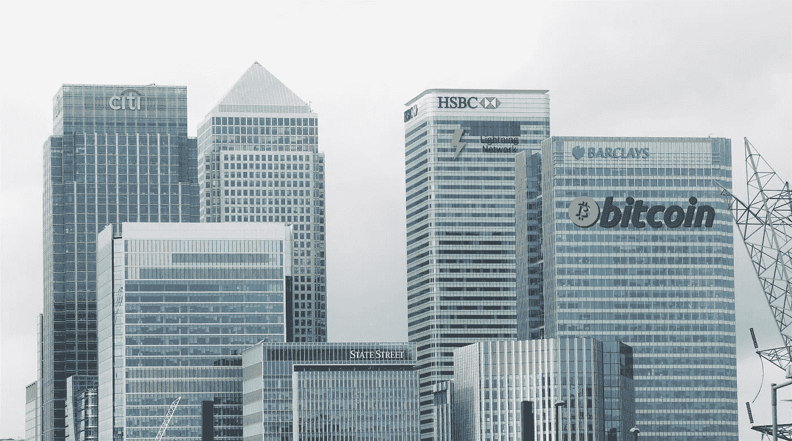
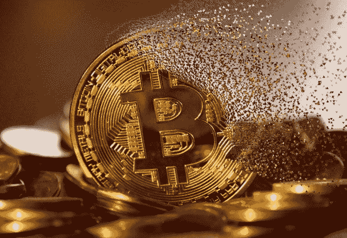
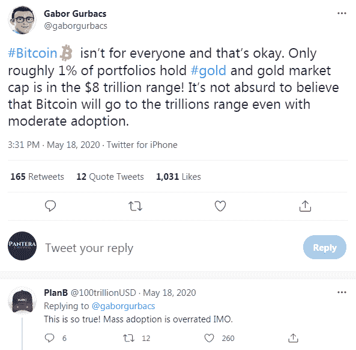
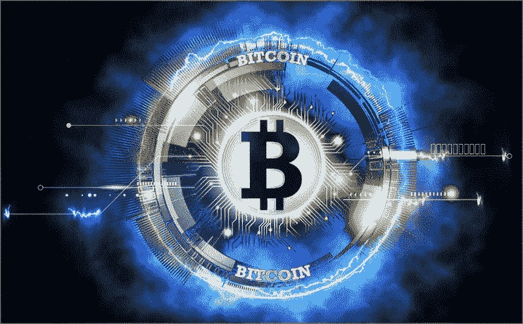

# 比特币是新的中间人吗？

> 原文：<https://medium.com/coinmonks/btc-becomes-the-middleman-we-wanted-to-cut-out-1b9aa51b8c63?source=collection_archive---------1----------------------->

> 纯粹点对点版本的电子现金将允许在线支付直接从一方发送到另一方，而不通过金融机构。
> 
> 【Bitcoin.com】——白皮书，(**)**

*我们最近注意到，关于比特币的发展道路，人们的兴趣和叙述发生了转变，通常的怀疑是，比特币(BTC)的影响者正在走向反面。它始于杰克·多西，他将自己定位为比特币的倡导者。*

*BTC 最大化主义者再一次让他们的叙述来了个 180 度大转弯，试图再次推动比特币(BTC)作为一种支付方式。*

*这种策略是错误的，因为 BTC 作为一种支付方式永远不会成功，除此之外，它还会对核心投资者造成根本性的困惑。*

*也许 BTC 最大化主义者现在明白了，这个世界并不在乎一项含糊其辞要接管黄金的资产。*

*我们对数字货币的要求是在一个不变的环境中进行即时和无感觉的交易。*

*虽然，BTC 目前正在开发的支付方式(闪电网络)似乎完全反对比特币所要对抗的一切。*

*比特币是一场革命，将银行和政府排除在支付等式之外。这场革命今天依然存在，但与 BTC 所走的道路不同。*

**

# *BTC 只带来了停滞*

**

**Image from* [*Pixabay*](https://pixabay.com/photos/blockchain-technology-smart-bitcoin-3446557/)*

*这是 BTC 马克思主义者实现的两件事:*

*   ***延迟采用**并通过误导公众来阻碍创新*
*   *通过增加审查和**减少金融自由**来支持金融机构**。***

*未经许可？不见了。*

*未经审查？不见了。*

*有了 BTC，你就不能在任何时候给世界上任何人寄钱，因为:*

*I)区块链费用不允许您*

*ii)为了避免费用，你必须使用第二层网络*

*iii)您将不得不再次使用运行在二层 BTC 网络(LN、Liquid 等)之上的**保管**和**集中钱包**，以避免打开和关闭二层通道的费用。*

*这样比特币就不是切割中间人，而是自己变成一个。*

*任何稍有金融知识的消费者都会更喜欢银行支付网络的便利，而不是必须处理复杂、不灵活和同样集中的网络。*

## *从“大众采用被高估”，回到“大众的比特币”！*

*这曾经是 BTC 方面的中心论点。自 2013 年以来，缩放辩论以区块流一方赢得争论并有效劫持比特币品牌名称而开始和结束。*

*自那以后，人们开始认为比特币将成为“数字黄金”，并聚焦于华尔街的财富。*

**

*BTC 没有在链上扩展，而比特币现金今天提供了一个极其高效的网络，在这个过程中没有牺牲任何东西。比特币现金刚刚发展起来，而 BTC 却停滞不前。*

**

# *闪电网络不是 BTC 失败的补救措施*

**

**Source of image:* [*Pinterest*](https://www.pinterest.ie/pin/766667536561100282/)*

*BTC 的叙述可以迅速改变，我们最近观察到 BTC 的秘密媒体中的某种促销活动(再次)成为一种支付方式。*

*BTC 将尝试与第三方一起使用闪电网络来实现这一目标，第一个是 Strike。这是使用比特币闪电网络的托管支付选项。LN 钱包的其余部分似乎也不能作为一种支付方式来帮助 BTC 的事业。*

*区块链费用将一直困扰着 BTC，因为打开或关闭 LN 通道需要链上交易。*

*如果有人想在网络拥堵时使用闪电网络，BTC 用户的建议是等待矿工费用降低。可能需要几个月的时间，费用才能恢复到可接受的水平，这也意味着没有人在网上交易。*

*你如何使用 BTC 的闪电网络，而不必在拥挤的时候支付昂贵的费用？如何在不支付 50-100 美元费用的情况下为 LN 钱包充值？*

> *你可以使用保管闪电钱包或罢工。*

**来源:* [*Reddit*](https://www.reddit.com/r/lightningnetwork/comments/l2v2se/with_increasing_bitcoin_fees_will_lightning_still/)*

> ***人们倾向于认为他们必须全程非托管，但正如你所说，支付 10 美元的费用来创建 50 美元的支付渠道有什么意义。***

**来源:* [*Reddit*](https://www.reddit.com/r/lightningnetwork/comments/l2v2se/with_increasing_bitcoin_fees_will_lightning_still/)*

*这是 BTC·马克西对支付网络和金融自由的看法。他们不打算用更好的东西取代传统的银行系统，而是用更复杂、更低效的流程。*

*这也是为什么 BTC 将完全失败的支付方式与第二层和保管服务。*

*众所周知，去掉第三方，去掉中间商，可以提高效率，降低成本。他们完全搞错了，并试图说服我们，我们需要 KYC 和监管，我们需要银行和金融集中化。迈克尔·塞勒(Michael Saylor)正在开展一项活动，让所有人相信在加密货币中应用 KYC 和保管机制的好处。*

*比特币核心在叙述中出现这样的反转，已经完全失去了目的。*

*没有人真的相信 BTC 会成为数字黄金，一旦这个故事对投资者的吸引力开始下降，他们就会再次回到支付和闪电网络的故事上来。*

## *使用保管 LN 服务:*

*你可以使用信用卡通过保管钱包购买 BTC，这可能也需要 KYC，然后使用这个保管钱包在闪电网络内与 BTC 交易。*

*这个选项需要多少额外的步骤，为什么没有人使用信用卡/借记卡，而使用 BTC 闪电？*

***用银行卡购物:***

*1)打电话给你的银行或使用电子银行索要一份。过两天，它会送货上门。甚至银行卡今天也是一个过时的系统，因为所有银行现在都提供集成了非接触式技术的移动钱包。*

*2)使用您的卡或手机银行钱包进行支付。*

*   *对于消费者来说，99%的交易银行手续费为零。*
*   *交易是即时的。*
*   *付款不是直接的；银行通常在下一个工作日存钱。*
*   *商户支付 Visa/Mastercard/AMEX 费用*

*使用闪电网络，而不必打开和关闭频道，并等待一段时间的低区块链费用这样做，你将需要所有上述步骤第一。*

*因为保管服务是基于用户将使用他们的借记卡/信用卡购买比特币 LN 的选择的**。***

*拥有闪电网络的比特币(BTC)成为了它本应剔除的中间人。*

**

# *结论*

*比特币闪电网络是一个不在比特币区块链之上，而是在银行网络内部的第三方。*

*拥有闪电网络的 BTC 除了成为毫无意义的第三方，交易等式中的另一个中间人之外，什么也不是。它需要保管钱包才能正常工作(既便宜又快速)，并在支付过程中增加了一个没有人会选择使用的步骤，因为它甚至不提供任何独特的比特币功能。*

*使用闪电网络并不意味着独立于银行。它只是用其他中央集权的金融实体取代了银行。*

*第二层对进一步的金融发展很重要，但只有当主链正常运转时。*

*在有问题的第一层上创建第二层并不能解决根本的缩放问题。*

**

****跟我上:****

**●*[***read cash***](https://read.cash/@Pantera)*●*[***noise cash***](https://noise.cash/u/Pantera99)*●*[***Medium***](/@panterabch)*●*[***Hive***](https://hive.blog/@pantera1)*●*[***Steemit【t】***](https://steemit.com/@pantera1)*

**●* [***推特***](https://twitter.com/Panterabch)*●*[***LinkedIn***](https://www.linkedin.com/in/panterabch/)**●*[*Reddit*](https://www.reddit.com/user/PanteraBCH)**

***原发布于*[*https://read . cash*](https://read.cash/@Pantera/btc-becomes-the-middleman-we-wanted-to-cut-out-db780498)*。***

> **加入 [Coinmonks 电报频道](https://t.me/coincodecap)，了解加密交易和投资**

## **另外，阅读**

*   **[币安期货交易](https://blog.coincodecap.com/binance-futures-trading)|[3 commas vs Mudrex vs eToro](https://blog.coincodecap.com/mudrex-3commas-etoro)**
*   **[如何购买 Monero](https://blog.coincodecap.com/buy-monero) | [IDEX 评论](https://blog.coincodecap.com/idex-review) | [BitKan 交易机器人](https://blog.coincodecap.com/bitkan-trading-bot)**
*   **[币安 vs 比特邮票](https://blog.coincodecap.com/binance-vs-bitstamp) | [比特熊猫 vs 比特币基地 vs Coinsbit](https://blog.coincodecap.com/bitpanda-coinbase-coinsbit)**
*   **[如何购买 Ripple (XRP)](https://blog.coincodecap.com/buy-ripple-india) | [非洲最好的加密交易所](https://blog.coincodecap.com/crypto-exchange-africa)**
*   **[非洲最佳加密交易所](https://blog.coincodecap.com/crypto-exchange-africa) | [胡交易所评论](https://blog.coincodecap.com/hoo-exchange-review)**
*   **[eToro vs robin hood](https://blog.coincodecap.com/etoro-robinhood)|[MoonXBT vs Bybit vs Bityard](https://blog.coincodecap.com/bybit-bityard-moonxbt)**
*   **[Stormgain 回顾](https://blog.coincodecap.com/stormgain-review) | [Bexplus 回顾](https://blog.coincodecap.com/bexplus-review) | [币安 vs Bittrex](https://blog.coincodecap.com/binance-vs-bittrex)**