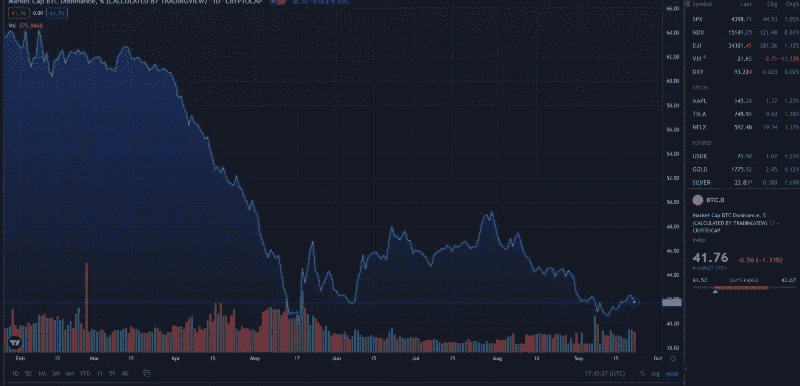
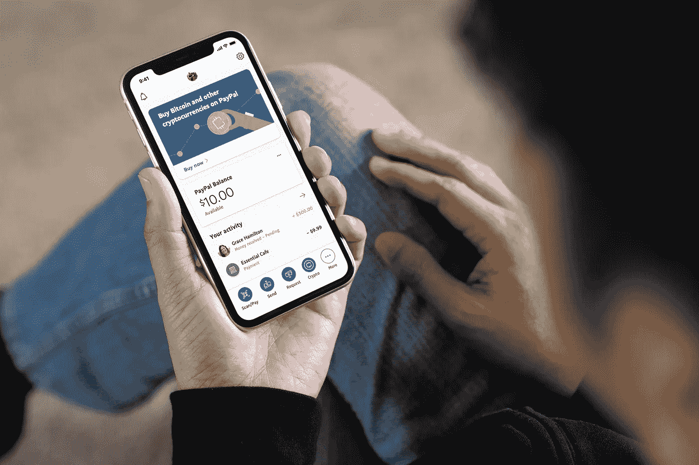
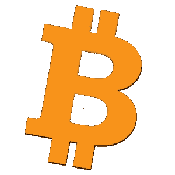

# BTC 一家独大，有关系吗？

> 原文：<https://medium.com/coinmonks/btc-dominance-does-it-matter-96c8b2113bfc?source=collection_archive---------10----------------------->

2016 年 9 月，比特币在市场中的主导地位为 80%。到 2021 年 9 月，仅仅五年后，这一优势就下降到了仅仅 42%(误差很小)。为什么这很重要，为什么说到底它其实并不重要？

BTC 的主导地位是 BTC 市场资本占整个加密市场资本的百分比。在撰写本文时，加密行业的总市值为 2 万亿美元，比特币贡献了 8400 亿美元。回到 2016 年，它的总市值是 120 亿美元。五年来，密码行业发展迅速。

让我们来看看，除了市场规模之外，还有什么因素导致了这种下降，以及为什么应该庆祝这一点。

## **创新和市场创造**

回到 2016 年，大多数加密货币纯粹是投机性的。他们没有提供服务，只是勉强证明了概念、ico 和一些大型投资。Litecoin 和 Monero，你们一直在做什么…？

以下统计数据显示了 2016 年至 2021 年间启动的项目数量(Stastica 2021):

2016–644
2017–1335
2018–1658
2019–2817
2020–4400
2021–5800

项目在 5 年内增长了 9 倍，随之而来的是创新、DeFi、第 2 层技术和现实世界的解决方案。加密已经从猜测走向全面部署，尽管推广才刚刚开始。

## **领养**

2016 年的比特币钱包？与今天的 7700 万相比，略低于 1000 万。这很难量化，但人们可以说，在这段时间里，密码持有者的数量可能从 1000 万飙升至 1 亿多。Paypal、Revolut、特斯拉等家喻户晓的名字都将“加密货币”和“比特币”这两个术语带入了主流媒体。我们不会盖的一枚硬币是 Dogecoin，不，不会发生。

除了这些家喻户晓的名字，其他公司如 gray Trust(2016 年处于起步阶段)、Microstrategy(以及比特币冠军迈克尔·塞勒)和数字资产集团(Digital Asset Group)也一直在买入比特币和其他资产，如 Solana、Ethereum 和 Cardano。

## **易于接近**

2016 年，你有能力从交易所、比特币基地和一群相当可疑的经纪人那里购买比特币，这些经纪人会用比特币换取亚马逊代金券和其他令人讨厌的方法。

今天，你可以打开众多应用程序中的一个，如 Robinhood、Revolut、Paypal、FTX，并购买各种加密货币。“FOMO”，或者说对错失良机的恐惧，导致新的项目在几秒钟内被心血来潮的人买走。这在五年前根本不存在。

## **所以，统治力无所谓？**

一句话，没有。简单地说，采用，容易进入和整个行业的大规模增长导致了更多的竞争。有人认为，到 2026 年，市场规模可能从 2 万亿美元扩大到 20 万亿美元，其中比特币可能达到 4 万亿美元，这并不愚蠢。这将使比特币的价值增加 500%，但其主导地位将从今天的 42%下降到 2026 年的 20%。

比特币越来越被视为价值储存手段。迈克尔·塞勒称之为“数字房地产”,用它你可以胜过传统货币，如美元、英镑和欧元，它们会随着时间的推移而贬值。

在股市波动、宏观经济问题或全球冲突期间，比特币可能成为避风港。目前，它的规模太小，受到的打击更大，因为它被视为投机。

## 什么能在市值上超越比特币？

在现有的加密货币中，它们是三个突出的项目，有可能达到比比特币更大的市值。

**以太坊** 2022/2023 年升级到以太坊 2.0 将带来网络费用的降低，并引入通货紧缩系统，最终将增加其价值。它有最多的开发者，最多的 Dapps，NFT。它是排名第二的密码，也是我最喜欢的捕捉比特币的方法。

查尔斯有一个计划，那就是走向全球。他毕竟是以太坊的创始人之一。阿隆佐的升级带来了智能合同(至少是名义上的),这将允许它与以太坊竞争项目。我个人不认为 Cardano 能超越比特币，它的目标应该是在以太坊上玩追赶。

XRP/涟漪
这可能看起来是一个奇怪的选择，但局外人是 XRP。与美国证券交易委员会的斗争消耗了大量资源，并压低了 XRP 的价格。没有这些，XRP 会在哪里？$3?$5?谁知道呢，但这将使其市值达到 1300 亿美元，是以太坊的 2.5 倍，比特币的 6 倍。如果他们带着有利的结果离开 SEC，并用自己的系统取代全球流动性和银行系统，他们可能会成为世界上头号加密货币。

## **比特币作为事实上的价值储存手段会被取代吗？**

无论你认为比特币是数字黄金还是数字房地产，它都是世界上有史以来最安全、最强大的网络。

加密货币的始祖真的没有挑战者。比特币可能会失去市值第一的位置，但它将永远是开启这场革命的硬币。

# 最后…

要了解来自 Gib Crypto News 的最新文章，请关注此页面，并确保您在 Twitter 上关注:[https://twitter.com/GibCryptoNews](https://twitter.com/GibCryptoNews)。

> 加入 Coinmonks [电报频道](https://t.me/coincodecap)和 [Youtube 频道](https://www.youtube.com/channel/UCbyDhTbOiKh2iUMKBi4-4Zg)了解加密交易和投资

## 另外，阅读

*   [Coinswitch 俱吠罗评论](/coinmonks/coinswitch-kuber-review-1a8dc5c7a739) | [电网交易机器人](https://blog.coincodecap.com/grid-trading) | [比特币基地收费](/coinmonks/coinbase-fees-831e77d4f2c5)
*   [Bitget 回顾](https://blog.coincodecap.com/bitget-review)|[Gemini vs block fi](https://blog.coincodecap.com/gemini-vs-blockfi)|[OKEx 期货交易](https://blog.coincodecap.com/okex-futures-trading)
*   [OKEx vs KuCoin](https://blog.coincodecap.com/okex-kucoin) | [摄氏替代品](https://blog.coincodecap.com/celsius-alternatives) | [如何购买 VeChain](https://blog.coincodecap.com/buy-vechain)
*   [币安期货交易](https://blog.coincodecap.com/binance-futures-trading)|[3 commas vs Mudrex vs eToro](https://blog.coincodecap.com/mudrex-3commas-etoro)
*   [在印度利用加密套利赚取被动收入](https://blog.coincodecap.com/crypto-arbitrage-in-india)
*   [德国最佳加密交易所](https://blog.coincodecap.com/crypto-exchanges-in-germany) | [WazirX P2P](https://blog.coincodecap.com/wazirx-p2p)
*   [如何购买 Monero](https://blog.coincodecap.com/buy-monero) | [IDEX 评论](https://blog.coincodecap.com/idex-review) | [BitKan 交易机器人](https://blog.coincodecap.com/bitkan-trading-bot)
*   [币安 vs 比特邮票](https://blog.coincodecap.com/binance-vs-bitstamp) | [比特熊猫 vs 比特币基地 vs Coinsbit](https://blog.coincodecap.com/bitpanda-coinbase-coinsbit)
*   [如何购买 Ripple (XRP)](https://blog.coincodecap.com/buy-ripple-india) | [非洲最好的加密交易所](https://blog.coincodecap.com/crypto-exchange-africa)
*   [非洲最佳密码交易所](https://blog.coincodecap.com/crypto-exchange-africa) | [胡交易所评论](https://blog.coincodecap.com/hoo-exchange-review)
*   [eToro vs robin hood](https://blog.coincodecap.com/etoro-robinhood)|[MoonXBT vs Bybit vs Bityard](https://blog.coincodecap.com/bybit-bityard-moonxbt)
*   [Stormgain 回顾](https://blog.coincodecap.com/stormgain-review) | [Bexplus 回顾](https://blog.coincodecap.com/bexplus-review) | [币安 vs Bittrex](https://blog.coincodecap.com/binance-vs-bittrex)
*   [Bookmap 评论](https://blog.coincodecap.com/bookmap-review-2021-best-trading-software) | [美国 5 大最佳加密交易所](https://blog.coincodecap.com/crypto-exchange-usa)
*   [如何在 FTX 交易所交易期货](https://blog.coincodecap.com/ftx-futures-trading) | [OKEx vs 币安](https://blog.coincodecap.com/okex-vs-binance)
*   [如何在势不可挡的域名上购买域名？](https://blog.coincodecap.com/buy-domain-on-unstoppable-domains)
*   [印度的秘密税](https://blog.coincodecap.com/crypto-tax-india) | [altFINS 审查](https://blog.coincodecap.com/altfins-review) | [Prokey 审查](/coinmonks/prokey-review-26611173c13c)
*   [布洛克菲 vs 比特币基地](https://blog.coincodecap.com/blockfi-vs-coinbase) | [比特坎评论](https://blog.coincodecap.com/bitkan-review) | [币安评论](/coinmonks/binance-review-ee10d3bf3b6e)
*   [Coldcard 评论](https://blog.coincodecap.com/coldcard-review) | [BOXtradEX 评论](https://blog.coincodecap.com/boxtradex-review)|[uni swap 指南](https://blog.coincodecap.com/uniswap)
*   [阿联酋 5 大最佳加密交易所](https://blog.coincodecap.com/best-crypto-exchanges-in-uae) | [SimpleSwap 评论](https://blog.coincodecap.com/simpleswap-review)
*   [购买 Dogecoin 的 7 种最佳方式](https://blog.coincodecap.com/ways-to-buy-dogecoin) | [ZebPay 评论](https://blog.coincodecap.com/zebpay-review)
*   [美国最佳加密交易机器人](https://blog.coincodecap.com/crypto-trading-bots-in-the-us) | [经常性回顾](https://blog.coincodecap.com/changelly-review)
*   [huo bi 的加密交易信号](https://blog.coincodecap.com/huobi-crypto-trading-signals) | [BitMEX 评论](https://blog.coincodecap.com/bitmex-review)