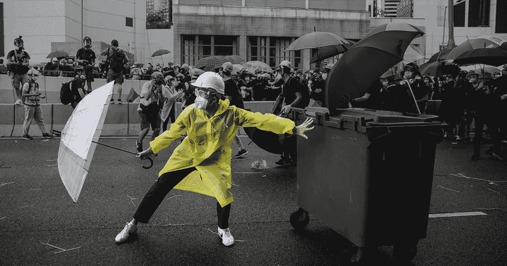
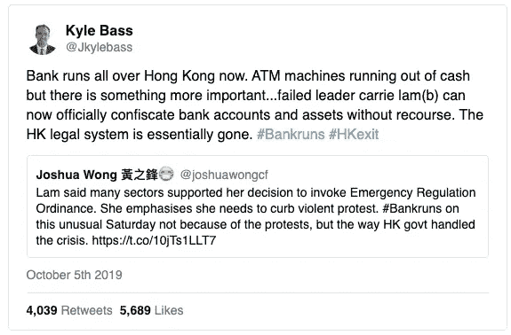
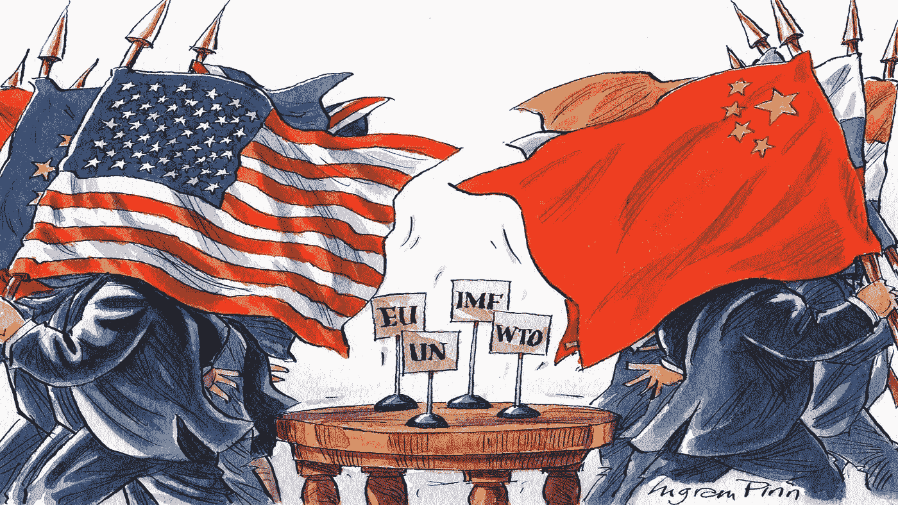
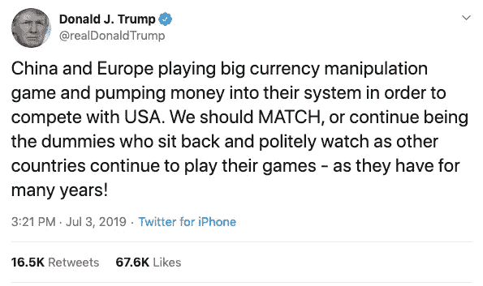
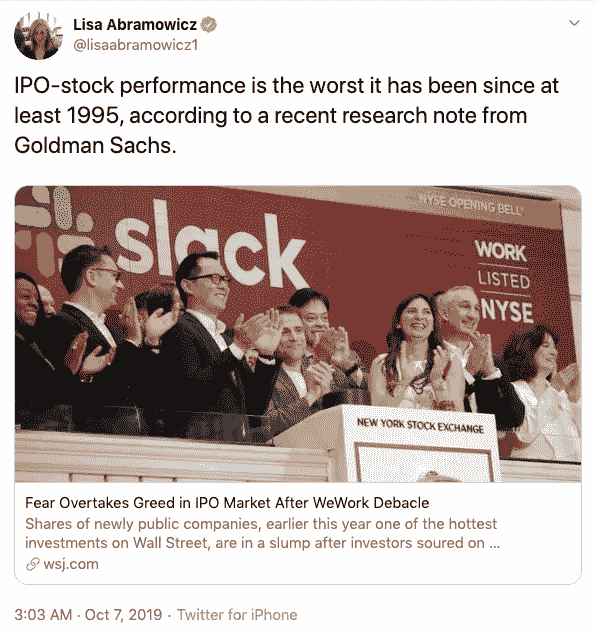
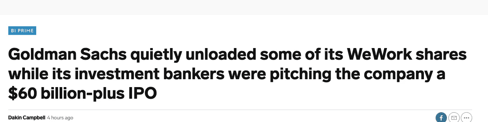
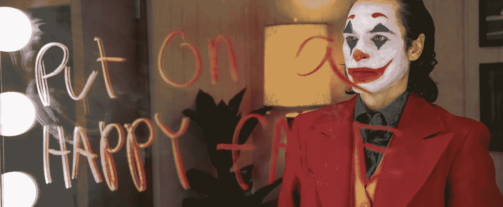

# 比特币:一场风暴正在酝酿

> 原文：<https://medium.com/coinmonks/btc-macro-do-not-fear-the-perfect-storm-is-brewing-d34cdc1392dd?source=collection_archive---------0----------------------->

2019 年 10 月 16 日唐纳德·特朗普仍然是自由世界的领袖，我们都非常沮丧。左翼和右翼之间的距离比以往任何时候都要大。民粹主义正在崛起，精英们正在玩他们的最后一手牌，不考虑后果。

但是，时代在变。

**随着不平等差距的扩大，民粹主义正在抬头。**——低利率为富人提供了一种廉价而简单的积累财富的方式，而对底层的人来说，成本却在上升。印钞和购买资产(量化宽松)的过程正在创造一个人为的反馈循环，推高资产价格，让其他人变得更富——这一循环正在造成财富差距。另一方面，生活成本在上升，而不是与大众购买力同步上升——因此出现了**民粹主义**。

**货币制裁** —香港的资本管制。让人想起 2013 年塞浦路斯的资本管制。加剧了国家和人民之间的紧张关系。

**中国建立新的世界秩序**——中国正在与美国进行一场贸易战，这场贸易战可能会削弱全球脆弱的股票市场。在更广泛的背景下，这为美元霸权受到威胁提供了合适的背景。

**世界经济放缓速度快于预期** —美国对中国的贸易战、英国退出欧盟和企业利润恶化已将世界 GDP 增长前景削减了 27%。[(从 4%到 2.9%)](https://www.cbsnews.com/news/oecd-economic-forecast-2020-the-global-economy-may-weaken-to-its-worst-pace-since-the-financial-crisis/)

**【4 万亿美元即将消失** —随着公司利润放缓，偿债能力变得越来越困难。一旦股价暴跌，T2 价值 4 万亿美元的 BBB 债券即将被降级为垃圾债券。所有这些公司都归养老金系统所有，一旦这些 BBB 债券被降级为垃圾债券，它们将不得不在市场上抛售，因为养老金受托人**不能持有**垃圾债券。价值 1 万亿美元的“垃圾”市场将无法处理价值 4 万亿美元的抛售股票。这就是为什么许多人把即将到来的崩盘称为一场诱人的流动性危机。*(听一听拉乌尔·帕尔在最近一个解释这一点的播客上的讲话**)*

**银行正在耗尽现金，确切地说是**——因此，自 08 年金融危机以来，美联储(美国央行)首次向银行提供紧急资金来源，因为许多银行在偿还其他银行的短期债务时资金短缺。9 月下旬，美国各银行申请了超过 920 亿美元的“回购”资金。有一句名言是这么说的:当*小鸡回到家休息*？

法定货币战争——中国被指责让人民币贬值以使其出口更具竞争力。美国领导人建议美国也这样做。弱势美元将提振美国出口，从而在短期内推高许多美国公司的股价。唐纳德特朗普(Donald Trump)的短视做法鼓励美元贬值，以推动股市飙升。这对他再次当选是个好兆头。相反，这对你口袋里的美元来说不是好兆头。

**英国退出欧盟对欧盟的致命一击**——英国正处于*以*主权*的名义在战略上*削弱其国内生产总值增长的边缘。不确定性普遍存在，虽然我们(英国人)担心最坏的情况，但随着欧洲民族主义的兴起，越来越明显的是，欧盟的日子屈指可数了。*€欧元怎么说？*

**我们为华尔街工作**——多年来，华尔街一直在以首次公开募股的形式向公众兜售估值过高的狗屎。随着最近发生的灾难性的 WeWork IPO，这种认识终于实现了。华尔街一直是有意识的杜平投资者，故意出售极度高估的 IPO。不相信我？**阅读下面的标题**。

Y’hate to see it :)

**投机者正在搞清楚** —黄金突破 [***7 年盘整***](https://www.kitco.com/news/2019-07-19/Gold-Prices-Power-To-6-Yr-High-On-Easy-Fed.html) 区间成多头格局。由于许多投机者担心最坏的情况，上述事件已被计入价格。

— — — — — — — — — — — — — — — — — — — — — — — — — — — — — —

**总结一下:**

*   当前的全球经济政策正在使富人更富，穷人更穷。— **政府和人民之间的信任逐渐消失。**
*   人们现在已经受够了，世界各地都在暴乱。——**人们都在寻求改变。**
*   资本管制正在实施。— **将探索规避法定货币制裁的方法。**
*   世界经济放缓——这是纸牌屋即将倒塌的迹象。经济衰退即将来临。
*   流动性危机来临——股票和其他风险市场正在走向严重的通货紧缩。
*   美元和欧元面临威胁——中国正在争夺美元，而欧盟正在内爆。法定货币的实验看起来很脆弱。
*   股票市场被高估了。似乎有更多明显的迹象表明，人们正在远离股票。有待开发的替代资产？
*   风险规避— **金价走势表明，恐惧开始慢慢被消化。**

随着时间的不确定性，机会和变化也随之而来。人民正在向世界精英发动战争，不仅仅是以游行的形式，而是用他们的钱来抗议。在数字时代，第一次出现了一种不受审查的货币，由于以下特点，许多人认为它是有价值的:

*   **权力下放**
*   **摆脱货币操纵**
*   **稀缺**
*   **与国家(主权)分离**
*   **一种可编程的通胀机制，随着时间的推移会变成通缩。**
*   **与传统市场无关**

如果我们认为我们正在经历一个民粹主义正在崛起的时期，人民和政府之间的关系严重疲惫，各国以货币战争的名义贬值货币，央行印钞，使其更加不值钱，有史以来最大的股市泡沫，以及全球经济增长放缓。比特币可能是“安全赌注”投资的概念似乎更有意义。

让我们把*后见之明*的顿悟留给那些没有足够好奇心去质疑——如果——的人。

*这不是投资建议。*

更多简洁的新闻，请关注我的 [***推特***](https://twitter.com/TwitmeSerifi) 。

***如果你喜欢这个博客，请随意鼓掌/关注***

> [直接在您的收件箱中获得最佳软件交易](https://coincodecap.com/?utm_source=coinmonks)

