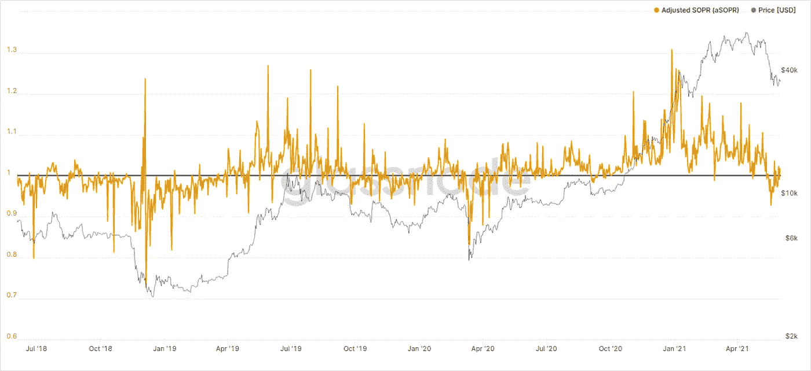

# BTC 价格分析:使用指标识别顶部和底部

> 原文：<https://medium.com/coinmonks/btc-price-analysis-using-sth-metrics-to-identification-tops-and-dips-150b191b2d29?source=collection_archive---------2----------------------->

## 理解短期持有人的活动产生的看涨和看跌因素。

aSOPR. Source: Glassnode

2021 年 11 月 15 日，BTC 以最古老的加密交易所 Bitstamp 的价格创下了 66，387 美元的本地高点，此后开始连续下跌，顺便说一下，这种情况仍在发生。短期内…