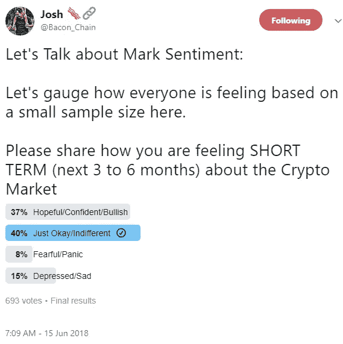
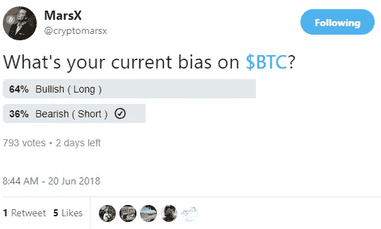
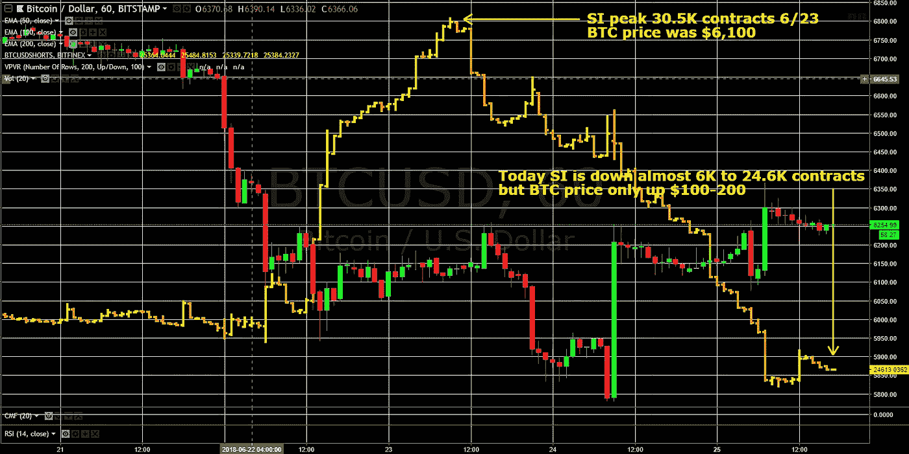
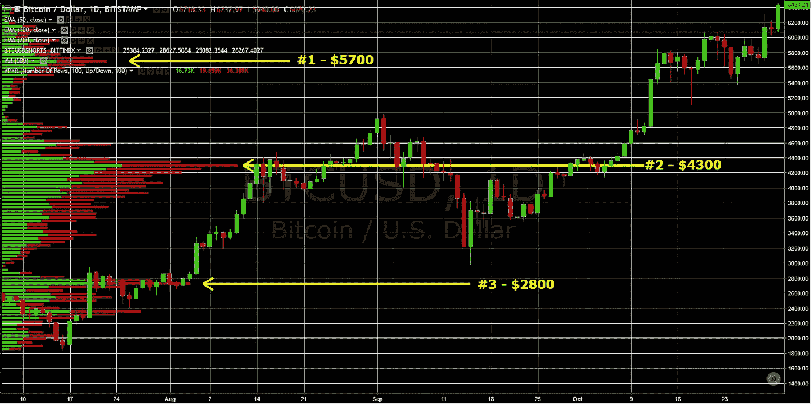
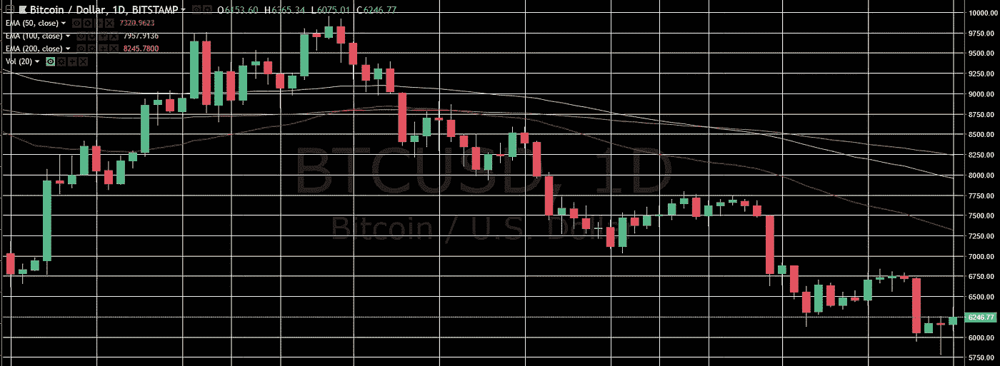
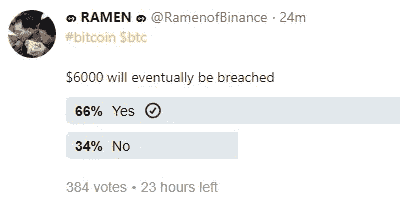
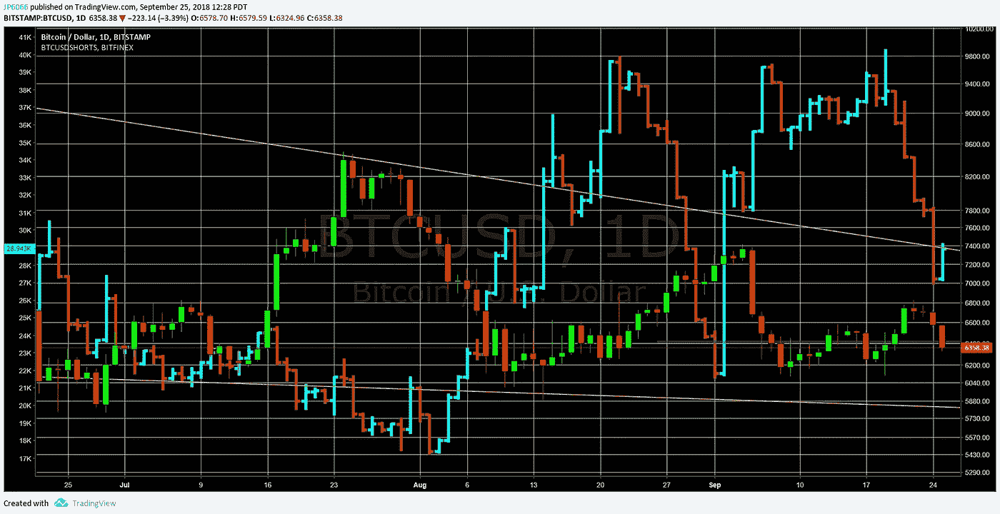

# BTC——市场情绪仍然过于乐观，我们正在跌破 6K 美元，以下是如何发现底部的方法

> 原文：<https://medium.com/coinmonks/btc-sentiment-is-still-too-bullish-were-going-below-6k-and-here-s-how-to-spot-the-bottom-e14ca0b0dfd3?source=collection_archive---------4----------------------->

随着我们进入更低的低点，情绪已经转变，变得更加看跌，但在我们找到底部之前还有很长的路要走。BTC(和所有加密)的问题在于，它们是零估值支持的工具——因此，一旦我们坚定地突破 6K 美元，从 2017 年开始会有一些微弱的技术支持水平(2800 美元和 4300 美元)，但预计会看到非常大和剧烈的下行。我们不排除在短期内再次反弹至 7500-8000 美元，这只会延长触底过程。

**在我们的上一篇文章中，我们注意到了相对于每日交易量的空头兴趣的增加，以及这如何可能导致大规模的空头挤压。我们确实看到几次短暂的挤压推动 200-500 美元的价格上涨，但很快就消失了，SI 现在回到 25K 的范围，减少了更大挤压的可能性。**

**我们不会给你一个底部的具体时间或价格点估计，因为 BTC 会告诉你我们何时到达底部——你只需要知道要寻找什么。寻找底部将是时间和情绪的函数。不要急着去抓住一把掉下来的刀，因为还有足够的时间——首先，我们需要看到情绪从温和看跌变成“恐惧和厌恶”，伴随着剧烈的恐慌性抛售，然后是厌恶。接下来将是一个持续数月的长期低量盘整。最后，我们将看到一个缓慢而稳定的上升，其标志是稳步增加的交易量，一个新的牛市将出现。**

**在底部添加了 2018 年 9 月 25 日的更新段落。**

Sentiment survey -need to see more fearful/panic & depressed/sad

**市场情绪变得更加悲观，然而，我们还远未达到在筑底之前需要看到的“恐惧和厌恶”。在我们 5 月 26 日[的更新中，我们谈到了“恐惧和厌恶”或极度消极的情绪是筑底的先决条件。这一点非常重要，因为扼杀每一次反弹的是那些持有比特币的弱者，他们认为我们随时都会回到通往 2 万美元(或月球)的道路上。当然，这些新的 BTC 所有者会恐慌，只要有一点点迹象表明 BTC 会低于他们的购买价格或其他水平，他们就会抛售。](/@J_P_H/btc-still-bearish-our-view-is-unchanged-since-3-31-with-robust-pipeline-of-negative-data-coming-5cff319caba9)**

Sentiment survey -we would like to see these results flipped

每次 BTC 在空头挤压中突破 200-300 美元时，所有的技术人员都看涨，直到底部再次下跌。我们预计不会出现 V 型底部，我们认为在这一点上大多数人已经承认，我们正处于熊市(投降)。这是一个进步，然而，大多数人仍然乐观地认为，6K 左右是底部，我们将很快反弹。在我们的 [4 月 1 日](/@J_P_H/btc-not-calling-a-bottom-after-a-very-ugly-1q18-incrementally-more-negative-on-price-219b264e41dc)更新中，当我们第一次开始抛出 3-6 千美元的底部反弹目标时，我们得到了非常强烈的推动，即我们不会跌破 6 千美元。现在，我们终于看到了 5000 美元范围内的一些目标，有些甚至更低。我贴了一些我在 Twitter 上看到的情绪调查，正如你所看到的，这些调查中反映的情绪远远没有达到我们在底部寻找的“恐惧和厌恶”。

Bitfinex BTC outstanding short contracts between 6/20–25 in yellow and orange bars

**正如你在上面的图表中看到的，Bitfinex 的空头兴趣在几天前迅速增加到 30K 以上，但现在又回落到 25K，减少了大规模空头挤压的机会。**我们在 [6/10](/@J_P_H/btc-still-bearish-but-likely-to-see-a-bounce-in-the-short-term-42f3fda6d7b5) 的最后一篇笔记中，我们花了一些时间讨论了空头利息作为投资者如何定位和投资者情绪的良好指标。由于相对较高的空头兴趣与日交易量，我们讨论了下一步可能是从空头挤压上升。从那以后，我们在 200-500 美元的范围内经历了 5 次挤压，但没有一次是持续的，下跌在 600-1000 美元的范围内——当然，这是非常悲观的行为。我们还想指出的是，在过去两天里覆盖近 6K 合约对提升比特币的价格没有什么作用，这告诉我们抛售压力很大(见上图)。

Volume by Price histogram (left) on top of BTC price chart July to Nov 2017

BTC 会在什么价位触底？在这一点上，我们最好的猜测是在 2800 美元和 4300 美元之间，但我们在 6K 美元以下没有太多的支持，基本面消息流当然可以修改价格行为。我们确实从 2017 年开始看到 5700 美元、4300 美元和 2800 美元的小支撑位(见上图)。我们通过查看量价图表来确定这些支撑位，该图表在左侧的柱状图中显示了图表范围内每个价格水平的交易量。支撑位和阻力位来自股票的交易位置。如果有人在上涨 6K 美元时买了 BTC，涨到 7K 美元，但又跌回 6K 美元(这称为“往返”)，他们很可能会在那里卖出。这是因为人们讨厌赔钱。当股票在特定水平附近交易量很大时——无论它们是被 10K 美元这样的整数吸引还是被某种移动平均线吸引——这些水平从上方成为支撑，从下方成为阻力。值得注意的是，目前 BTC 上方的阻力位比下方的支撑位多得多。这是因为我们现在低于所有长期移动平均线，这将成为阻力。50、100 和 200 日均线是下图右边 7400 美元&8300 美元之间的黄色、橙色和红色细线。

BTC 1 Day Price Chart — Red, yellow, and orange lines are the 50, 100, and 200 day Exponential Moving Averages that will become resistance on way up

**消息流方面，已经和 6 月 20 日韩国的另一个黑客混在一起了。许多人将 BTC 6 月 21 日的大跌归因于这次黑客攻击，然而，我对此表示怀疑。我认为，BTC 投资者对这种规模较小的黑客攻击(3100 万美元被盗)越来越免疫了，此外，黑客攻击的时间与 BTC 的抛售并不完全匹配。Litecoin 创始人查理·李对此做了一个很好的类比，他将外汇黑客行为比作银行抢劫——问一家银行被抢走 4000 万美元是否会导致人们对美元失去信心？当然不是。除了亚洲监管环境的解冻之外，就什么可能是一个强有力的积极催化剂而言，我们认为 BTC ETF 获得批准将是一个非常积极的催化剂意义重大，因为 ETF 将购买实际的比特币。我们认为，BTC ETF 将很快吸引数亿美元，这将为 BTC 价格提供实质性的推动，并成为一个自我强化的循环。BTC 交易所交易基金将消除很多障碍和担忧，人们将资金转移到没有 SIPC 或联邦存款保险公司保险的新兴交易所，甚至使人们能够对退休账户中的比特币进行征税。基于基础 BTC 的 ETF 对 BTC 价格的影响要比基于期货合约的 ETF 大得多，期货合约本质上是一种单边押注，或者像 Bitmex 这样也是衍生品单边押注的交易所。**

我们听到“BTC 不可能低于采矿成本？”然后抛出一个采矿成本的数字，比如 5000 美元或 6000 美元。我们把这个分成两部分来解释一下为什么没有意义。首先，开采比特币并不只有一个成本——每个比特币矿工都有一个平均成本，但这取决于他们的投入成本——主要是他们的电力成本，该成本因地区而异，但设备/折旧、冷却和劳动力也有很大差异。此外，hash 的难度不断增加，也推高了成本。大多数 BTC 矿商都在成本相对较低的中国。然而，即使 BTC 低于一个矿工的满载成本，他们也不会停止开采。他们会考虑他们的边际成本。只要他们能够支付可变成本，如电力、冷却和维护，他们就会继续开采。此外，资金雄厚的矿商甚至可能在一段时间内亏本开采，让其他矿商破产。

**当黄金价格下降到生产成本时，这是否为价格提供了支撑？当然不是。**至少在中短期内，这是我们所关心的。投机者和投资者其实并不在乎黄金或比特币是否低于生产成本。然而，从长远来看，如果价格低于成本，黄金开采能力将离线(从最低效率/最高成本开始)，最终这种供应不足将导致稀缺和价格反弹。在 BTC，我们看到了类似的动态，但令人担忧的是，如果价格太低，就会有更少的矿工受到激励去开采，区块就会停止验证。有一个内置的机制来处理这个问题，并平滑作为奖励给矿工的比特币的输出。这种机制是解决哈希问题的困难程度，这将降低挖掘成本，因此对矿工来说，验证区块又是有利可图的。半导体等资本密集型行业的账面价值确实存在下行支撑。这是因为他们拥有的资本设备和营运资本使他们能够生产产品并出售获利。比特币没有这种动力。

**总之，寻找底部是情绪和时间的函数，如果没有一些改变游戏规则的基本面消息，我们认为底部不会是 V 形。以下是要寻找的迹象，特别要注意音量:**

1.  **随着我们接近底部，情绪需要变得更加悲观(“恐惧和厌恶”)，伴随着剧烈的恐慌性抛售。**
2.  **接下来是一段时间(可能是几个月)沉闷而稳定的低量盘整，伴随着一些令人沮丧的头部假反弹，这将导致大多数投资者失去兴趣。**
3.  最后，当没有人注意时，随着价格开始缓慢而稳定地上涨，交易量会悄悄增加，下一个牛市将会诞生。

在写这篇文章的时候，BTC 的价格在 6200 美元到 6300 美元之间。

**2018 年 9 月 25 日更新**正如预期的那样，我们认为已经发生变化的是市场情绪变得更加悲观。我们仍处于投降阶段，但还没有达到标志底部的剧烈恐慌性抛售。我们说情绪更加看跌有两个原因，首先，我们在 twitter 调查中看到情绪下降(以及一般的加密 Twitter 活动水平)，现在超过一半的受访者普遍看跌(参见左侧的调查，并与以上段落中的调查进行比较)。第二，在写这篇文章的时候(6 月下旬)，Bitfinex SI 在 25K 范围内(见下图——蓝色和棕色条是 SI)。你可以看到，自那以后，SI 一直呈上升趋势，并在 40K 的历史高点附近徘徊，这当然表明市场情绪更加悲观。因此，我们正朝着底部前进，但市场情绪需要变得更糟。每当一枚硬币反弹时，似乎仍然有一群人，像最近的迈克·诺沃格拉茨，决定预测底部，结果很糟糕。在交易量方面，我们仍然在底部震荡，每次反弹都会有少量的交易量增加，最终会消失。因此，我们得到的结论是，我们正朝着触底反弹的方向取得进展，但除非我们看到基本面出现“改变游戏规则的因素”，否则可能仍需要数月时间。

BTC 1D chart with Bitfinex short interest (blue and brown bars)