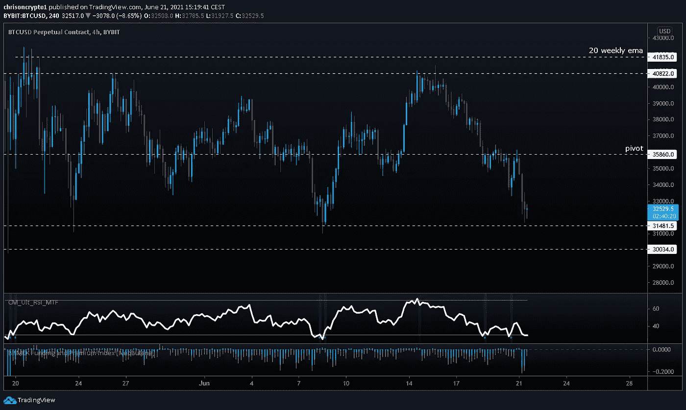
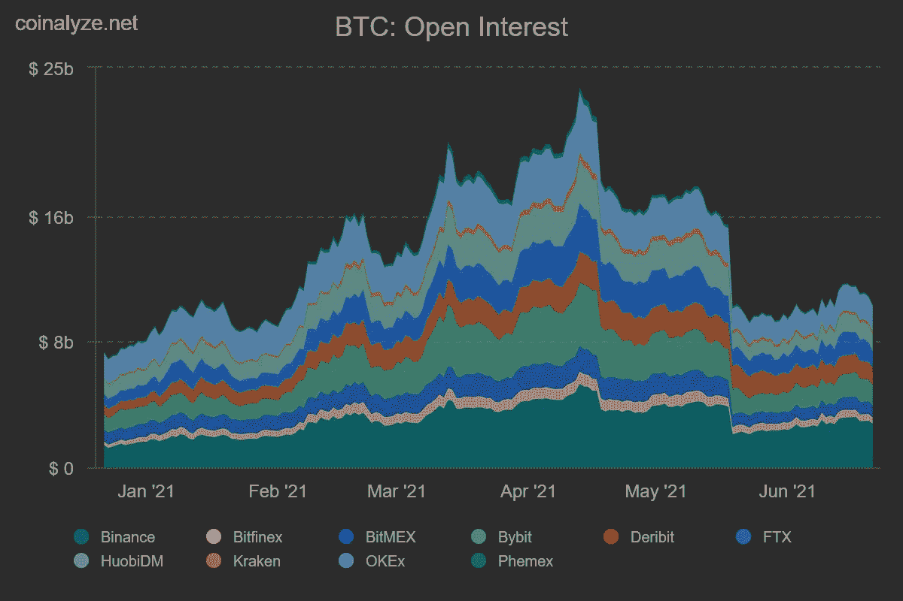
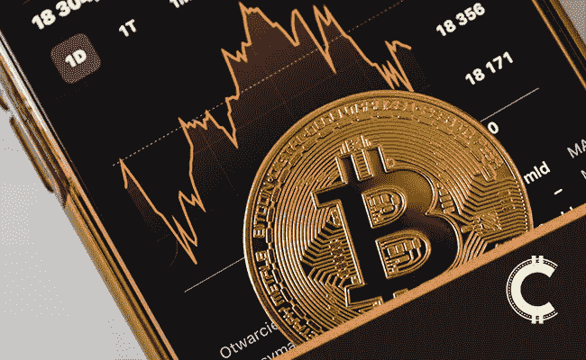

# BTC 在中国 FUD 的无尽浪潮中测试区间低点

> 原文：<https://medium.com/coinmonks/btc-tests-range-lows-amid-endless-waves-of-china-fud-43bfa98ea187?source=collection_archive---------5----------------------->

随着比特币交易所在又一次抛售中略高于 30，000 美元，恐惧、不确定性和怀疑正在形成，这可能因来自中国的一波又一波看跌消息而加剧。

我们来挖一下。

## 随着矿工离开中国，BTC 失业率创下年度新低

由于中国政权的镇压，四川的矿工拔掉了他们的钻机，比特币的 hashrate 平均下降到 105 EH/s。这是自 2020 年 11 月初以来的最低水平。

比特币的网络哈希速率(衡量其计算能力的指标)自 5 月中旬的峰值水平以来下降了约 46%。根据来自 [Bitinfocharts](https://bitinfocharts.com/comparison/bitcoin-hashrate.html#1y) 的数据，目前比特币的平均日哈希数为 105 EH/s(每秒千万亿次哈希)，比大约六周前公布的 171.4 的峰值大幅下降。

**查看** [全篇点击这里](https://chrisoncrypto.com/blog/f/btc-hashrate-hits-yearly-low-as-miners-migrate-out-of-china) **！**

# 技术上来说

## 比特币跌至区间底部

在撰写本文时，比特币达到了 31，700 美元的区间低点，可以说它正在与负面叙事和头条新闻作斗争，这些似乎都是在最糟糕的时刻出现的。然而，技术图片是否说明了这种看似可怕的情况？

到目前为止，BTC/美元已经在这个范围内交易了一个多月，今天的下跌将是价格在大约 41，300 美元被拒绝后对该范围低点的第四次官方测试。

碰巧的是，永久期货融资利率全线转为负值(低于-0.2%)，表明期货市场在技术区间低点看跌。

4 小时时间框架(MTF)的相对强度指数在整个下跌趋势中闪现了几个买入信号，但没有一个令人信服地创造了向上的缓解反弹或看涨背离。

目前，BTC/美元正处于关键时刻，除了价格处于区间低点之外，没有明显的反转迹象。

也就是说，如果该区间得到尊重，那么人们可以预计未来几天将再次测试 35，800 美元的支点，如果不是对 40，000 美元以上的区间进行全面测试的话。另一方面，持续走低可能会为另一场流动性事件打开大门——尽管未平仓合约数据显示，这场事件的灾难性将远低于 5 月份的那场。

事实上，除非主要参与者(如迈克尔·塞勒)出售他们持有的比特币，否则抛售压力不太可能像 5 月份那样得到缓解，这主要是因为大部分投机性流动性已经退出了市场。

**观看级别**

*   从 31，700 美元到 30，000 美元区间低点的强劲反弹表明将再次测试 35，800 美元。
*   支点 35，800 美元的拒绝表明疲软和低于 30，000 美元的分解(可能到 25，000 美元)。
*   支点的回收表明突破 40，000 美元。

总而言之，BTC/美元已经波动了几个月，但随着价格结构的成熟，这种情况不太可能持续太久。在我看来，比特币在更长的时间范围内仍处于严重超卖状态，与比特币交易价格超过 6 万美元时相比，下行波动的威胁较小。此外，市场情绪一直保持看跌，达到自 2020 年 3 月以来的最低点，当时硬币交易价格低于 4000 美元。

历史上，在别人恐惧的时候买入，对那些期待美元平均成本成为有史以来最佳储蓄技术的人来说是有益的。

下次再见。

**加入** [电报](https://t.me/chrisoncryptochannel) **频道，实时更新&设置！
关注我** [推特](https://twitter.com/ChrisOnCrypto1) **&** [多嘴多舌](https://gab.com/chrisoncrypto) **下面还有我的社交门户。**

[https://www.paypal.com/donate?hosted_button_id=C9VRLGTBHQX2N](https://www.paypal.com/donate?hosted_button_id=C9VRLGTBHQX2N)

# 阅读更多内容:随着矿工离开中国，BTC 失业率创下年度新低

[https://chrisoncrypto.com/blog/f/btc-hashrate-hits-yearly-low-as-miners-migrate-out-of-china](https://chrisoncrypto.com/blog/f/btc-hashrate-hits-yearly-low-as-miners-migrate-out-of-china)

[http://www.chrisoncrypto.com/](http://www.chrisoncrypto.com/)

你也可以用比特币支持我！
**BTC** 地址:**3 eydseypjhn 68 axkncuqbb 7 ebqcxrejamr**

最诚挚的问候，
T21 克里斯托
克里斯托
上的加密创始人[www.cityam.com](https://www.cityam.com)上的
直接接通:[电报](https://t.me/chrisoncrypto)

*最初发布于*[*https://mailchi . MP*](https://mailchi.mp/7fbeef1d9128/btc-tests-range-lows-amid-waves-upon-waves-of-china-fud?e=[UNIQID])*。*

> 加入 [Coinmonks 电报频道](https://t.me/coincodecap)，了解加密交易和投资

## 另外，阅读

*   [网格交易机器人](https://blog.coincodecap.com/grid-trading) | [加密交易机器人](/coinmonks/cryptohopper-review-a388ff5bae88) | [加密交易机器人](https://blog.coincodecap.com/best-crypto-trading-bots)
*   [加密复制交易平台](/coinmonks/top-10-crypto-copy-trading-platforms-for-beginners-d0c37c7d698c) | [如何在 WazirX 上购买比特币](/coinmonks/buy-bitcoin-on-wazirx-2d12b7989af1)
*   【Crypto.com 评论】|[|](/coinmonks/crypto-com-review-f143dca1f74c)|[信用交易](/coinmonks/huobi-margin-trading-b3b06cdc1519)
*   [尤霍德勒 vs 科恩洛 vs 霍德诺特](/coinmonks/youhodler-vs-coinloan-vs-hodlnaut-b1050acde55a) | [Cryptohopper vs 哈斯博特](https://blog.coincodecap.com/cryptohopper-vs-haasbot)
*   [顶级付费加密货币和区块链课程](https://blog.coincodecap.com/blockchain-courses) | [币安评论](/coinmonks/binance-review-ee10d3bf3b6e)
*   [MXC 交易所评论](/coinmonks/mxc-exchange-review-3af0ec1cba8c) | [Pionex vs 币安](https://blog.coincodecap.com/pionex-vs-binance) | [Pionex 套利机器人](https://blog.coincodecap.com/pionex-arbitrage-bot)
*   [如何在印度购买比特币？](/coinmonks/buy-bitcoin-in-india-feb50ddfef94) | [WazirX 评论](/coinmonks/wazirx-review-5c811b074f5b) | [BitMEX 评论](https://blog.coincodecap.com/bitmex-review)
*   [印度比特币交易所](/coinmonks/bitcoin-exchange-in-india-7f1fe79715c9) | [比特币储蓄账户](/coinmonks/bitcoin-savings-account-e65b13f92451) | [HitBTC 审核](/coinmonks/hitbtc-review-c5143c5d53c2)
*   [币安收费](/coinmonks/binance-fees-8588ec17965) | [Botcrypto 审查](/coinmonks/botcrypto-review-2021-build-your-own-trading-bot-coincodecap-6b8332d736c7) | [Hotbit 审查](/coinmonks/hotbit-review-cd5bec41dafb) | [KuCoin 审查](https://blog.coincodecap.com/kucoin-review)
*   [我的密码交易经验](/coinmonks/my-experience-with-crypto-copy-trading-d6feb2ce3ac5) | [AAX 交易所评论](/coinmonks/aax-exchange-review-2021-67c5ea09330c)
*   [Bybit 融资融券交易](/coinmonks/bybit-margin-trading-e5071676244e) | [币安融资融券交易](/coinmonks/binance-margin-trading-c9eb5e9d2116) | [Overbit 审核](/coinmonks/overbit-review-9446ed4f2188)
*   [加密货币储蓄账户](/coinmonks/cryptocurrency-savings-accounts-be3bc0feffbf) | [YoBit 审查](/coinmonks/yobit-review-175464162c62) | [Bitbns 审查](/coinmonks/bitbns-review-38256a07e161)
*   [Botsfolio vs nap bots vs Mudrex](/coinmonks/botsfolio-vs-napbots-vs-mudrex-c81344970c02)|[gate . io 交流回顾](/coinmonks/gate-io-exchange-review-61bf87b7078f)
*   [Godex.io 审核](/coinmonks/godex-io-review-7366086519fb) | [邀请审核](/coinmonks/invity-review-70f3030c0502) | [BitForex 审核](/coinmonks/bitforex-review-c4bb28d9e271)
*   [最佳比特币保证金交易](/coinmonks/bitcoin-margin-trading-exchange-bcbfcbf7b8e3) | [萝莉点评](/coinmonks/lolli-review-e6ddc7895ad8) | [比特币保证金交易](https://blog.coincodecap.com/bityard-margin-trading)
*   [创造并出售你的第一个 NFT](https://blog.coincodecap.com/create-nft) | [本地比特币评论](/coinmonks/localbitcoins-review-6cc001c6ed56) | [Prokey 评论](/coinmonks/prokey-review-26611173c13c)
*   [加密保证金交易交易所](/coinmonks/crypto-margin-trading-exchanges-428b1f7ad108) | [赚取比特币](/coinmonks/earn-bitcoin-6e8bd3c592d9) | [Mudrex 投资](https://blog.coincodecap.com/mudrex-invest-review-the-best-way-to-invest-in-crypto)
*   [WazirX vs coin dcx vs bit bns](/coinmonks/wazirx-vs-coindcx-vs-bitbns-149f4f19a2f1)|[block fi vs coin loan vs Nexo](/coinmonks/blockfi-vs-coinloan-vs-nexo-cb624635230d)
*   [杠杆代币](/coinmonks/leveraged-token-3f5257808b22) | [最佳密码交易所](/coinmonks/crypto-exchange-dd2f9d6f3769) | [Paxful 点评](/coinmonks/paxful-review-4daf2354ab70)
*   [加密套利](/coinmonks/crypto-arbitrage-guide-how-to-make-money-as-a-beginner-62bfe5c868f6)指南| [如何做空比特币](/coinmonks/how-to-short-bitcoin-568a2d0b4ae5) | [1xBit 回顾](https://blog.coincodecap.com/1xbit-review)
*   [如何在印度购买以太坊？](https://blog.coincodecap.com/buy-ethereum-in-india) | [如何在币安购买比特币](https://blog.coincodecap.com/buy-bitcoin-binance)
*   [在美国如何使用 BitMEX？](https://blog.coincodecap.com/use-bitmex-in-usa) | [BitMEX 评论](https://blog.coincodecap.com/bitmex-review) | [期货交易机器人](/coinmonks/futures-trading-bots-5a282ccee3f5)
*   [最佳加密交易信号电报](/coinmonks/best-crypto-signals-telegram-5785cdbc4b2b) | [MoonXBT 评论](/coinmonks/moonxbt-review-6e4ab26d037) | [OKEx 评论](/coinmonks/okex-review-6b369304110f)