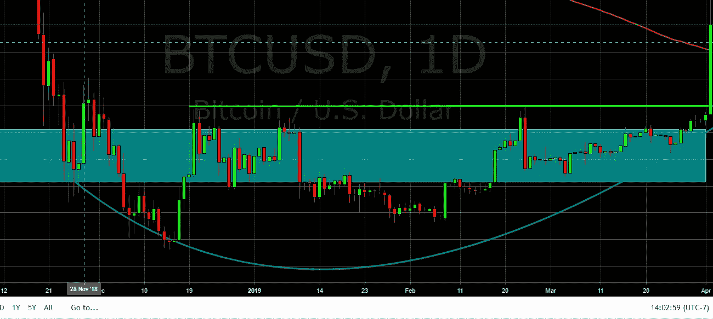
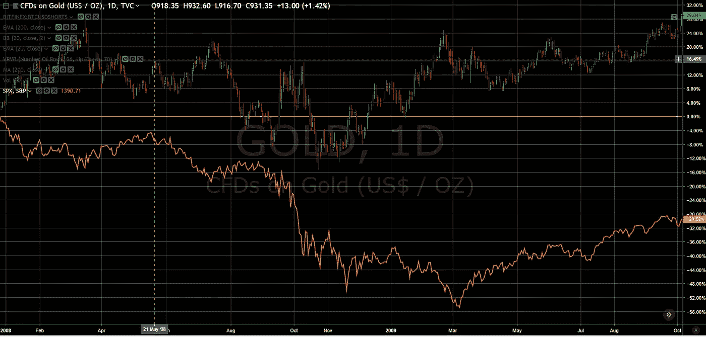

# BTC——底部已经到来，根本驱动力是新一轮的全球银行宽松政策！

> 原文：<https://medium.com/coinmonks/btc-the-bottom-is-in-and-fundamentals-are-looking-up-2ad04e9265c3?source=collection_archive---------1----------------------->

很难相信我们的最后一枚比特币[已经是比特币的底部了？可能不会，但我们终于接近了！](/coinmonks/is-the-bottom-in-for-bitcoin-probably-not-but-were-finally-getting-close-250d385e2d2)发表于四个多月前。我们在这篇文章中指出，2014 年的低迷意味着当前的熊市还剩下大约 3 个月:

*“2015 年 9 月，BTC 摆脱了 2014 年的熊市，重新开始了上升轨迹，这意味着当前的熊市还剩下 3 个月。*

技术上，我们现在处于一个好位置，下方有支撑，上方有一个清晰的低阻力路径。一段时间以来，我们一直在变得更具建设性，正如我们在 2019 年 2 月 25 日所说的那样(请参见 Twitter 帖子)，突破 4100 美元是关键。因为我们在 3000 美元到 4000 美元的低区间交易了四个月，所以整个 3000 美元的高区间(下图中的蓝绿色)现在是很好的支撑。因此，我们至少在近期将止损点设在 4000 美元附近/以下，然后我们会将止损点设得更高。我不知道 BTC 是否会在最近的一次上涨中守住目前的 5000 美元水平，但是，我们也有 200 天移动平均线(图表中的橙色线)和 4600 美元作为支撑。上行方面，我们将在 6000 美元附近遭遇下一个大阻力。最后，最近几个月的空头兴趣非常低，所以空头回补不是这次行动的主要因素。

Bitcoin 1D Chart — Bitstamp

让我们回顾一下我们在 BTC 中列出的发现底部的所有迹象或要素- [情绪仍然过于乐观，我们将跌破 6K 美元，下面是如何发现底部的](/coinmonks/btc-sentiment-is-still-too-bullish-were-going-below-6k-and-here-s-how-to-spot-the-bottom-e14ca0b0dfd3)部分:

“总之，寻找底部是情绪和时间的函数，我们认为如果没有一些改变游戏规则的基本面消息，底部不会是 V 型的。” **检查+** 由于我们已经在这个熊市中度过了超过 15 个月，还没有出现急剧的 v 形反弹。相反，比特币已经形成了一个非常漂亮的圆形底部，如下图所示。

Bitcoin’s 1D chart highlighting rounded bottom

*‘1。随着我们接近底部，市场情绪需要变得更加悲观(“恐惧和厌恶”)，伴随着剧烈的恐慌性抛售。*

crypto twitter (CT)是我最好的情绪指示器，它非常安静，许多在 CT 上的全职技术分析师刚刚离开。我认为，剩下的 CT 人这些天在推特上更多地谈论替代硬币。回想起来，现在很容易将 2018 年 11 月从 6K 美元到 4K 美元的暴跌视为“恐慌下行”投降(见左侧图表)。

*’2。“接下来是一段时间(可能是几个月)沉闷而稳定的低量盘整，以及一些令人沮丧的头部假反弹，这将导致大多数投资者失去兴趣。”*

**Check ++** 几个月非常令人沮丧的横盘“讨价还价”、头部假反弹和普遍的冷漠导致许多人(包括我自己)至少部分脱离。臭名昭著的反向投资指标美国消费者新闻与商业频道最近也很少报道比特币，但这种情况肯定会改变。

*3。最后，当没有人关注时，随着价格开始缓慢而稳定地上涨，交易量将悄悄增加，下一轮牛市将会诞生。*

**检查++++**我们在 2018 年 10 月看到了成交量的底部，然后在秋季建立，然后在 1 月再次上升。就比特币总量而言，正如你在下图中看到的那样，目前每天近 250 万枚，几乎是 2018 年 10 月底部 50 万枚的 5 倍。

**而且，我最兴奋的是，从根本上来说，美联储的最新行动和信息非常看好比特币。在 2008 年大衰退后，当华尔街银行以纳税人的代价获得救助时，比特币是出于对金融系统的厌恶而产生的硬通货。美联储不仅提高了通胀目标，还彻底逆转了量化紧缩政策。众所周知，美联储一直在购买 MBS 和其他固定收益资产，作为其第三次量化宽松计划(QE3)的一部分，该计划于 2014 年结束。正如你在下图中看到的，美联储的资产在 2014 年至 2017 年间达到约 4.5 万亿美元的峰值，此时美联储开始让这些证券在 2018 年到期时滚动。美联储将继续加息，并让证券在“自动驾驶”下到期时滚出资产负债表，直到 2018 年 12 月股市抛售，此后美联储逆转了方向。**

Federal Reserve Balance Sheet

**政治家和政策制定者知道，你只是没有得到“报酬”来阻止经济低迷。**我的意思是，这是一个双输的局面——如果你试图阻止经济下滑，但它发生了，你就失败了；反之，如果经济下滑没有发生，你也不能因阻止经济下滑而居功。出于这个原因，美联储现在被困在了一条持续刺激的道路上，以牺牲储户和穷人的利益为代价来支持银行和股票投资者。**2018 年 12 月股市非常疲软，加上全球经济数据不断恶化，导致美联储在可预见的未来迅速改变立场，从加息转向保持利率稳定，甚至有人呼吁降息，尽管主要来自共和党专家。不仅仅是美国美联储董事会，这是全球一致的宽松政策。**

**从 5 月份开始，美联储将再次“悄悄”购买证券。此外，美联储将于 5 月份结束固定收益证券从其资产负债表中的转出。这意味着美联储虽然没有扩大其资产负债表，但回到了购买足够多固定收益证券的市场，以保持资产负债表持平。我相信，随着美国赤字扩大，外国投资者的需求减弱，他们将购买美国国债。美联储最近还暗示，他们愿意在下一次经济低迷中使用负利率作为政策工具。这大概是因为利率如此之低，而且 2019 年赤字将达到 1 万亿美元，因此在下一轮低迷中，他们没有多少杠杆可以使用。虽然美国 M2 货币供应量最近以合理的 3-4%的年化率增长，但我们预计这将在短期内略有增加，然后加速。我预计美联储将继续加速印钞，以消除/货币化我们沉重的债务负担。此外，如果现代货币理论(MMT)在 2020 年美国选举中获得牵引力，那将为比特币等可靠货币提供更好的背景！**

****我们正接近长期债务周期的顶峰，因为美国的总债务已经超过了 GDP 的 250%,一些国家甚至更高！**问题是，一旦你走上这条路，就很难改变方向。正如我提到的，你不会因为阻止了经济下滑而得到任何赞扬，尤其是如果它导致了一些痛苦，比如经济衰退或萧条。我们将继续沿着这条路走下去，增加债务，增加冒险行为，直到最终我们的债权人对我们的信用质量失去信心。经济将受到某种冲击，导致利率飙升，这将导致流动性紧缩。一旦利率上升，我们将会看到大范围的破产，既有大量廉价债务的公司，也有只在低利率环境下运作的资本消耗型商业模式(WeWork？).偿债成本将会飙升，政府赤字将会膨胀，而此时正是他们需要财政刺激的最不合适的时候，我们将会陷入严重的衰退或萧条。雷伊·达里奥在他的新书[“大债务危机”](https://www.bridgewater.com/big-debt-crises/)中做了出色的工作，详细描述了我们面临的债务危机以及历史事例，这本书可以在 Bridgewater 网站上免费下载。**

**然而，需要注意的是，在流动性紧缩的情况下，比特币的价格也会下跌。在流动性紧缩的情况下，即使是比特币也不能幸免，因为人们会收到追加保证金通知，并努力寻找现金来弥补损失。我认为 2008 年的黄金图表(见下文)很好地代表了比特币对流动性紧缩的反应。进入 2008 年，随着股市走弱(橙色线代表 S & P，红色/绿色条代表黄金),黄金价格上涨，但当夏末和秋季流动性紧缩来袭时，金价甚至下跌了 40%。黄金的表现确实好于股票，而且恢复得更快，我预计比特币也会如此。**

****

**Gold vs S&P during the Great Recession**

****2018 年反复出现的牛市行情是，机构投资者将会出现并开始购买比特币，将其从熊市的魔掌中拯救出来，我对此持否定态度。**作为一名前专业投资者，我知道他们经历的过程，也知道专业投资者会做功课，看看基本面、估值和技术，然后像我一样确定比特币处于熊市，没有必要去尝试抓住一把落下的刀。也就是说，我假设他们和我今天做着同样的工作，并且最终会变得积极并开始购买。今天，我们有更多的基础设施来迎合机构投资者(如芝加哥商品交易所期货)，还有更多像富达(Fidelity)和巴克特(Bakkt)这样的网站。此外，我们现在已经得到了一些中央银行和大型蓝筹股银行的默许，它们正在开发自己的加密项目。因此，尽管去年我不看好机构投资者拯救比特币，但我认为只要图表保持建设性，他们就会开始把钱投入比特币。而且，就新增美元的数量而言，推动比特币的价格并不需要太多。为了结束这个话题，我认为比特币交易所交易基金获得批准的可能性，我去年在这篇[文章](/@J_P_H/will-an-etf-approval-save-bitcoin-in-2018-we-dont-think-so-here-s-why-d2a883e2a910)中提到过，今年比去年高得多，但我认为今天有太多的入口和工具可以购买 crypto，这对价格升值没有太大意义。**

****有一个非常大的密码初创公司生态系统，除了钱包和交易所，它还没有生产出任何获得大量采用的东西。**不要误解我的意思，虽然我认为比特币的基本面正在改善，但更广泛的加密领域仍然缺乏基本面。我们还没有接近“杀手级应用”，加密猫，可能已经达到了顶峰。一种新的趋势似乎是免费向用户提供密码来建立用户群，我们认为这种趋势是不可持续的。我们已经看到围绕加密的支持基础设施有所改善，比如监管和上下坡道。然而，像思科、所有大银行和富达这样的公司一直在投资建设他们的加密基础设施，我认为这是一个很大的积极因素。**

****什么会让我们现在的看涨观点失效？**如前所述，体积非常重要。我可以在比特币继续上涨的同时减少，但不能大幅减少。价格水平再次跌破 4K 美元也没问题，但如果这种情况发生，我们将非常仔细地观察成交量，一些止损将被触发。当然，跌破 3100 美元的新低将是灾难性的，很可能表明我们正在走低。**

****

> **[直接在您的收件箱中获取最佳软件交易](https://coincodecap.com/?utm_source=coinmonks)**

****