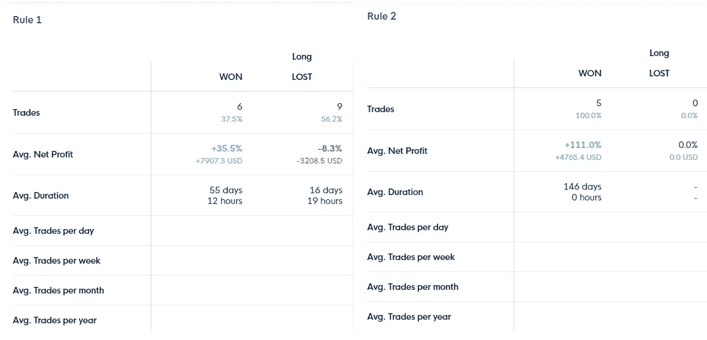

# 不确定时期的 BTC 交易策略——具有安全性的加密机器人

> 原文：<https://medium.com/coinmonks/btc-trading-strategy-in-times-of-uncertainty-crypto-bot-with-safeties-5d0deb5aaaaf?source=collection_archive---------1----------------------->

比特币一直是抛物线，但正在进入一个不确定的时期。很明显，交易机会就在那里，加密机器人可能比以往任何时候都更有用。

冠状病毒正在对所有市场造成严重破坏。然而，加密市场是全天候开放的。没有安全措施，也不能暂停交易。这就是为什么使用自动化并保护自己免受损失是明智的。把你的资金带离险境，但仍有很大的获利空间。

我们希望帮助您导航建立这样一个战略的过程。遵循指南后，您将能够部署一个您有信心的加密机器人，并以最少的努力进行交易。

# 不确定时期的加密交易策略

我们坐下来，试图创造一个策略，这是霍德勒友好，并可以提供保护，免受不可取的价格下跌运动。当作为一个加密机器人部署时，它应该打开机会，同时给你一些想法。

# 不确定时期的加密交易策略目标:

标准是:

1.  大多数时候，我们希望有一个**未平仓头寸**
2.  这个策略必须**平仓到高于开仓的位置**——因此保护我们免受不必要的资本损失
3.  策略应该是**少开仓**，而不是积极交易
4.  该策略应该有**相对较小的缩减**
5.  该策略应具有大于 2 的排序比(越高越好)

在制定成功的战略时，我们应该:

*   创建一个足够普通的开仓条件，这样我们大部分时间都处于开仓状态，但又足够具体，这样我们就不会在不必要的市场事件中开仓
*   创造一个成交条件，这是我们闪烁的红灯，是对一些潜在的意外市场情况的警告。
*   我们必须愿意在我们的封闭条件下损失一点血。我们希望成功定位闪烁的红灯，避免交易错误信号。
*   如果我们专注于保护我们所有的 BTC，我们应该用“100%余额”来填充卷列。这样，每个头寸都会将我们所有的[比特币](https://blog.coincodecap.com/a-candid-explanation-of-bitcoin)转移到安全的稳定币或法币，然后再为我们在稳定币/法币中的所有资产建立头寸。

# 在不确定时期创建加密交易策略的全过程

你可以遵循这个指南，在任何平台上创建一个策略来进行回溯测试和自动化，或者在你的手动交易中使用它。如果使用 [CLEO.one](https://cleo.one/crypto/) 点击侧面菜单中的“创建新策略”按钮:

# 步骤 1:回溯测试参数

我们关注的是霍德林战略的一个版本。因此，我们选择关注比特币与法币或稳定的比特币对——任何 BTC/美元、BTC/USDT 或 BTC/BUSD 都可以。

我们希望专注于更高的时间框架，以尽量减少噪音，所以机器人将在日线图(D1)交易。由于我们想测试该策略在更长的时间内是否表现良好，我们将测试更长的时间范围，而不仅仅是几年。

因此，我们将在已经存在一段时间的交易对和交易所上投入我们的回溯测试工作。在 Bitfinex 或比特币基地 PRO 数据上对策略进行回溯测试是最好的方法。

💡提示:如果你想在不同的交易所部署[交易机器人](https://blog.coincodecap.com/a-guide-to-cryptocurrency-trading-bots)，你可以！只需在该交易所的历史数据上创建相同的策略。我们只是使用这两个交易所，因为它们的 BTC/美元对有着悠久的历史。

# 第二步。开放条件

目标:

*   创建一个足够普通的开仓条件，这样我们大部分时间都处于开仓状态，但又足够具体，这样我们就不会在不必要的市场事件中开仓

CLEO.one 提供了各种各样的技术指标，烛台和烛台模式，价格走势和基本面。每个人都应该能够找到成功实现这样一个开放条件所需要的东西。

在我们的策略中，我们将创建两条规则——一条基于指数移动平均线(EMA ),另一条结合了 EMA 和烛台模式。

💡**提示:**您可以在您的 CLEO 中的每个策略中使用最多三个规则。一个免费帐户，最多 10 个规则用于初始帐户，任何其他高级帐户的规则数量不限！查看[订阅](https://app.cleo.one/subscription)了解更多信息。

## 规则 1:当价格高于 3000 点，高于均线(20)时

该规则将在比特币价格高于 3000 美元的任何时候以及价格同时高于均线 20 时开始交易。

❗ **重要提示:**注意，策略上说的是“价格在上方”，而不是“价格正在交叉”——我们并没有试图通过找到情绪(这里用 EMA20 表示)变积极的确切时刻来判断市场时机。我们只是想确保价格高于指数移动平均线。

## 规则 2:当价格高于均线(20)，蜡烛线看涨时

这条规则结合了价格高于均线时市场的一般“积极性”。此外，它要求 BTC/美元的日线被吞没。

💡**提示:**随意尝试任何其他看涨蜡烛类型或烛台模式。在 CLEO.one 中，您可以找到总共 9 种看涨烛台类型和图案。

# 第三步:关闭状态

目标:

*   创造成交条件，这是我们闪烁的红灯，是一些潜在的意外市场情况的警告。

从 CLEO.one 提供的各种选项中，我们更喜欢将比特币市场的总体状况与一些技术指标结合起来。如果你还没有注意到，我们非常喜欢使用至少两个同时发生的事件来支持我们的论点。

在我们的两个规则中，我们使用相同的封闭条件，即使用比特币市值变化和周期为 20 的滚动 VWAP 的 2 个标准差的较低波段。

ℹ️ **信息:**阅读更多关于 VWAP(交易量加权平均价格)如何在 [Investopedia](https://www.investopedia.com/terms/v/vwap.asp) 上发挥作用的信息。

如果比特币的市值在一天内下跌 5%，这对我们来说是一个闪烁的红灯。价格低于第二代。VWAP 的下跌可能意味着区间市场的买入机会。加上市值下降，我们知道有些不好的事情正在发生，我们想尽快退出 BTC 的立场。

# 第四步:资产和管理

我们正在霍德林 BTC，所以这是我们唯一想交易的资产。我们正在使用 100%的可用余额来确保加密机器人退出整个位置。

资产管理:100%的平衡和总体获利

❗ **重要提示:**使用多条规则用相同的资产交易 100%的可用余额意味着无论哪条规则先发生，都先执行。

这正是我们想要的——我们希望一旦有积极的事情发生，我们就重返市场——无论是哪种迹象引发的，都不是那么重要。

我们没有使用止损，因为我们使用的是平仓条件。止盈几乎是象征性的——我们在努力——我们是长期的。因此，1 BTC 的总获利 100，000 美元似乎是一个不错的目标。

在我们设置好一切之后，这就是我们将要测试的策略的样子:

# 步骤 5:策略结果+迭代

我们已经用比特币基地专业数据测试了我们过去 5 年的策略，从 1000 美元开始。

如你所见，我们的战略每年盈利 115%，总回报率为 4，240%。作为对比，BTC 在我们战略开始时(2015 年 4 月中旬)的定价为 235 美元。如果我们简单地持有，我们的回报将是:2810%。因此，我们的安全策略成功击败了赤裸裸的 BTC 市场。

从这个意义上说，我们的目标已经实现。

仔细看看统计数据——我们进行了 20 笔交易——我们赢了 11 笔，输了 9 笔。

现在对我们来说最重要的是——它会把我们从最近发生的大屠杀中拯救出来:

该策略将使我们在 3 月 9 日退出 BTC 市场，在 3 月 12 日将我们从这一困境中解救出来:

有趣的是，规则 2 只放置了 5 个位置，赢得了所有的位置。

ℹ️ **信息:**这些关于回溯测试、纸上交易和现场交易的统计数据可以在[Cleo . one](https://app.cleo.one/)的免费和付费账户上获得

因为我们的规则是用 100%的余额交易的，这意味着，规则 1 比规则 2 更早建仓。这是有道理的，因为两个条件都是基于均线，但是规则 2 有蜡烛被吞没的额外条件。

让我们去掉规则 1，只保留规则 2，看看我们是否能提高我们的(已经相当不错的)结果。

这种策略的迭代产生了“仅仅”4020%的总回报(年化回报 112%)，同时只进行了 12 次交易，赢了和输了其中的 6 次。这个版本有更好的分拣率和利润因素和更低的下降。

在两个版本之间进行选择取决于我们对自动化程度的满意程度。有两个规则的交易机器人版本有一个更高的峰值。

如果你认为你能比策略更快地平仓，这可能是你的一个选择。因为我们是在日线图上交易，在 24 小时内你可能已经平仓了。更不用说你可以人工观察到的市值下降 4.9%的坏信号。然而，它不会触发我们策略的关闭条件，我们将继续我们策略的第一个版本——保持两个规则。

> **亦读:** [**CLEO.one 回顾—交易自动化变得简单**](https://blog.coincodecap.com/cleo-one-review-trading-automation-made-simple)

# 步骤 6:目标完成情况总结

现在，让我们来看看这个安全策略的最初目标:

1.  大多数时候，我们希望有一个**未平仓** ✔️

头寸让我们每次在 BTC 呆上几个月，在测试的五年中，我们大约有一年半的时间都有美元资金。

2.该策略必须将我们的头寸平仓到高于新头寸的位置，从而保护我们免受不必要的资本〰损失

没有一个策略是完美的，因此在我们输入的 20 个头寸中，只有 7 个符合这个条件。在某些情况下，它确实使我们免于大规模跌落，但这可能是我们未来战略迭代的目标。

3.策略应该是少开仓，而不是积极交易✔️

该策略 5 年只建仓 20 个。

4.该战略应该有一个相对较小的削减✔️

我们的策略使 cca 减少了 30%。相比之下，BTC 在这 5 年里经历了 80%的提款，我们认为 30%的提款是好的。

5.该策略应具有高于 2 的✔️(越高越好)

Sortino 比率类似于更广为人知的 Sharpe 比率，其关键区别在于不“惩罚”上行波动性— [阅读更多关于两者之间差异的信息](https://www.investopedia.com/ask/answers/010815/what-difference-between-sharpe-ratio-and-sortino-ratio.asp)。我们的 Sortino 比率超过了 10，这真的很好。

如果不对加密市场进行进一步测试，我们无法确定加密市场/购买和持有策略中这种排序比率的出现有多普遍。从外汇市场的经验来看，这样的比例是闻所未闻的。

# 潜在的缺点

## 交易费用

目前，CLEO.one 回溯测试引擎不考虑进出头寸的交易费用。这些费用会显著影响策略的执行。这也是为什么在那 5 年里只进入 20 个职位是可取的另一个原因。

## 卷

巨大的交易量可能会导致额外的滑点，因为无法在期望的水平完全履行订单。可以用限价单代替市价单来固定。我们试图比其他市场参与者更早退出市场。因此，我们预计即使是相当大的限价单也不会有任何问题。

## 过度拟合和后见之明偏差

因为我们确切地知道发生了什么，所以创建一个从中受益的策略是非常简单的。当你查看你的回溯测试策略结果时，这应该是你头脑中一直存在的想法。

那么，主要的理性问题应该是:该战略是否超越了基准(在我们的案例中是 BTC)？后续问题应该是:该策略是否将我的风险降至最低？在我们的案例中，两个问题的答案都是肯定的。

# 步骤 7:将策略作为加密机器人实时部署

在我们实施任何安全策略之前(可能是此处介绍的策略，也可能是您自己创建的任何策略)，我们需要将我们当前的持有量转换为美元(USDT/BUSD/欧元，或者您用 BTC 交易的任何菲亚特/稳定币)。这样我们的策略就可以建立一个新的头寸(为了 100%的平衡——意味着将我们所有的 USDT 转移到 BTC)。这是唯一的方法，CLEO.one 可以监控你的密切状况，并保护你免受负面影响。

1.  前往 [CLEO.one](https://app.cleo.one/) 创建一个账户，如果你还没有的话
2.  如上所述，点击左侧的“创建新策略”并选择加密:

3.选择您的回溯测试设置。在我们的案例中，我们测试了比特币基地专业数据，D1 时间框架和 5 年的测试。**最重要的是将市场货币设定为 USD** 。这是你唯一不能改变的事情。

4.插入您的打开和关闭规则，并添加资产管理:

5.选择右上角的“构建策略”,您的测试将开始:

6.然后如果你对结果满意，选择右上角的“交易”。

7.为了实时交易策略，您需要将您的交易账户与相同的市场货币关联，在本例中为美元。

我们的[帮助中心提供了如何连接您的比特币基地或其他 exchange 帐户的详细信息。](https://intercom.help/cleoone/en/articles/3438905-how-do-i-connect-to-coinbase-pro-getting-api-keys)

8.选择您的关联账户并点击“交易”。就是这样，你的加密机器人正在为你交易，并确保你的风险最小。

你也可以观看 [DataDash 本人从他最近的现场直播](https://www.youtube.com/watch?v=uhus6PihHwk&feature=youtu.be&t=1135)中对策略的解释。

你可以在 [CLEO.one](https://cleo.one/crypto/) 上免费设置、测试和交易这个策略。复制它，更改它，并在我们支持的任何交易所进行交易。

如果你还没有准备好让你的策略自动化，看看[如何通过纸上交易创造市场信号。](https://static.blog.cleo.one/2020/02/18/trading-signals-straight-from-the-market-create-your-own-winning-alerts/)

注意安全，交易大厅见！

## 另外，阅读

*   最好的[密码交易机器人](/coinmonks/crypto-trading-bot-c2ffce8acb2a)
*   [密码本交易平台](/coinmonks/top-10-crypto-copy-trading-platforms-for-beginners-d0c37c7d698c)
*   最好的[加密税务软件](/coinmonks/best-crypto-tax-tool-for-my-money-72d4b430816b)
*   [最佳加密交易平台](/coinmonks/the-best-crypto-trading-platforms-in-2020-the-definitive-guide-updated-c72f8b874555)
*   最佳[加密借贷平台](/coinmonks/top-5-crypto-lending-platforms-in-2020-that-you-need-to-know-a1b675cec3fa)
*   [最佳区块链分析工具](https://bitquery.io/blog/best-blockchain-analysis-tools-and-software)
*   加密套利指南:新手如何赚钱
*   最佳[加密制图工具](/coinmonks/what-are-the-best-charting-platforms-for-cryptocurrency-trading-85aade584d80)
*   [莱杰 vs 特雷佐](/coinmonks/ledger-vs-trezor-best-hardware-wallet-to-secure-cryptocurrency-22c7a3fd391e)
*   了解比特币的[最佳书籍有哪些？](/coinmonks/what-are-the-best-books-to-learn-bitcoin-409aeb9aff4b)
*   [3 商业评论](/coinmonks/3commas-review-an-excellent-crypto-trading-bot-2020-1313a58bec92)
*   [AAX 交易所审核](/coinmonks/aax-exchange-review-2021-67c5ea09330c) |推荐代码、交易费用、利弊
*   [德里比特评论](/coinmonks/deribit-review-options-fees-apis-and-testnet-2ca16c4bbdb2) |选项、费用、API 和 Testnet
*   [FTX 密码交易所评论](/coinmonks/ftx-crypto-exchange-review-53664ac1198f)
*   [n 零审核](/coinmonks/ngrave-zero-review-c465cf8307fc)
*   [Bybit 交换审查](/coinmonks/bybit-exchange-review-dbd570019b71)
*   [3Commas vs Cryptohopper](/coinmonks/cryptohopper-vs-3commas-vs-shrimpy-a2c16095b8fe)
*   最好的比特币[硬件钱包](/coinmonks/the-best-cryptocurrency-hardware-wallets-of-2020-e28b1c124069?source=friends_link&sk=324dd9ff8556ab578d71e7ad7658ad7c)
*   最佳 [monero 钱包](https://blog.coincodecap.com/best-monero-wallets)
*   [莱杰 nano s vs x](https://blog.coincodecap.com/ledger-nano-s-vs-x)
*   [Bitsgap vs 3 commas vs quad ency](https://blog.coincodecap.com/bitsgap-3commas-quadency)
*   [莱杰纳米 S vs 特雷佐 one vs 特雷佐 T vs 莱杰纳米 X](https://blog.coincodecap.com/ledger-nano-s-vs-trezor-one-ledger-nano-x-trezor-t)
*   [block fi vs Celsius](/coinmonks/blockfi-vs-celsius-vs-hodlnaut-8a1cc8c26630)vs Hodlnaut
*   Bitsgap 评论——一个轻松赚钱的加密交易机器人
*   为专业人士设计的加密交易机器人
*   [PrimeXBT 审查](/coinmonks/primexbt-review-88e0815be858) |杠杆交易、费用和交易
*   [埃利帕尔泰坦评论](/coinmonks/ellipal-titan-review-85e9071dd029)
*   [SecuX Stone 评论](https://blog.coincodecap.com/secux-stone-hardware-wallet-review)
*   [BlockFi 评论](/coinmonks/blockfi-review-53096053c097) |从您的密码中赚取高达 8.6%的利息