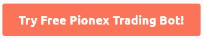

# BTCST 刚刚 3 天涨了 5 倍|目标是 1000 美元吗？

> 原文：<https://medium.com/coinmonks/btcst-just-went-5x-in-3-days-is-it-aiming-for-1-000-9dcba894c954?source=collection_archive---------2----------------------->

## BTCST 旨在将比特币带入 DeFi！看到它最近的增长，很明显，交易者正在全力以赴 BTCST。但它会一直涨到 1000 美元或更高吗？

BTCST 或比特币标准 Hashrate 令牌是比特币和 DeFi 之间的桥梁。此外，每个 BTCST 以 BTC 矿业电力公司的 0.1 Th/s 作为抵押。

此外，持有 BTCST 令牌并在链上下注将使您有权获得比特币挖矿奖励。因此，为任何人提供进入或退出比特币挖矿敞口的服务。

# 为什么是 BTCST？

比特币标准 Hashrate 令牌是一个基于币安智能链的智能合约，没有中央权威。此外，这是一个完全基于社区的项目，没有团队储备。关于这个项目的所有决定都是通过社区投票做出的，正如你在这里看到的。

中国对加密的打击导致 5 月份大幅下跌，现在对比特币采矿工厂的打击导致昂贵的采矿设备迁出中国。BTCST 通过提供一种下注 BTCST 代币并赚取采矿奖励的方式来解决这个问题。

Working of BTCST

# 为什么它的价格上涨了 5 倍？

你还记得我告诉你的那部分吗？每个 BTCST 都以 BTC 矿业 0.1 的杂凑利率作为抵押。现在，让我们来看一些历史数据:

你还记得 5 月 19 日震惊整个加密市场的崩盘吗？我希望你有，每个人都有。继续，这导致了对 BTC 明杂凑率的一个非常陡峭的打击，其结果是，任何猜测？BTCST 价格的下跌。

**BTC 坠落导致坠机**

Data from Glassnode

**4 小时时间框架内的 BTCST 价格**

Chart from Binance

现在向前看，这是过去的情景，过去可以激励我们，但不会让我们赚钱。谈到目前的情况，昨天 BTC 的突然上涨也导致了平均散列率的上涨，这是因为与 BTCST 相关联，导致价格上涨。然而，我认为有多种因素影响了这种激增，哈希只是其中之一。

## 有没有发生过 BTCST 独立于 Hashrates 的情况？

简而言之，是的。根据 BTCST 2021 年 7 月 24 日的一条推文，BTC 平均哈希率大幅下降，但标准哈希组能够保持 150 个五哈希的哈希率。

导致 BTCST 赌注者的 UPTO 增加 34%，这意味着您只需下注即可获得更多奖励。

# BTCST 技术分析

根据我们的技术分析师，截至目前，BTCST 价格从第二个底部反弹，并显示出良好的看涨力量。此外，它目前正面临阻力，如果它打破，我们将看到一个良好的向上移动。然而，如果价格拒绝当前的阻力，它将创建一个 ***杯和*** 柄的模式，并将从标记的支撑反弹。

TradingView

# 接下来标准的 Hashrate 组规划是什么？

你可能听说过[萨尔瓦多成为第一个接受比特币作为法定货币的国家](https://blog.coincodecap.com/bitcoin-news-4-october-2021)。接下来，比特币哈希拉特小组在他们的推特上宣布他们正在做一些有趣的东西。

现在，由于[萨尔瓦多正在着手利用火山能量开采比特币](https://blog.coincodecap.com/bitcoin-news-1-october-2021)，很明显，更多的矿工将转移到该国，以获得更绿色的能源来开采比特币。

# BTCST 简史

该代币于 2020 年 12 月发行，初始供应量为 100 万 BTCST。根据币安的一篇博客文章，该平台拥有初始流通供应量的 4%，其余分配给了初始令牌化矿商。

# 如何购买 BTCST？

到目前为止，很明显 BTCST 可以证明是一个好的投资。而且，不仅如此，你还可以使用 Pionex 的免费网格 bot，在指定的区间内进行交易。而且，机器人会自动代你买卖，而且全免费。要了解更多信息，请阅读我们的 [Pionex 评论](https://blog.coincodecap.com/pionex-review-exchange-with-crypto-trading-bot)，否则

*文章最初发表于:*[*https://blog.coincodecap.com/btcst-analysis-7-october-2021*](https://blog.coincodecap.com/btcst-analysis-7-october-2021)

我很快会带着另一篇文章回来。在那之前，请点击“关注”按钮继续阅读我的文章，如果你读得不错，请鼓掌表示支持！

关联披露:点击一些链接可能有助于我们获得金钱利益。

与我联系，

[推特](https://twitter.com/prabxat) | [领英](https://www.linkedin.com/in/praxhat/)

1.  [2021 年 10 月最值得购买的 5 种代用币](/coinmonks/top-5-altcoins-to-buy-in-october-2021-c864fa9140da?source=user_profile---------0----------------------------)
2.  银行会灭亡还是会适应？DeFi 的未来将会决定。
3.  [你钱包里的 100 美元是钱还是没有价值的东西？](/coinmonks/is-the-100-bill-in-your-wallet-money-or-something-that-has-no-value-99263e8dfba6?source=user_profile---------0----------------------------)
4.  [比特币在 2021 年底前还会突破 100K 吗？](/coinmonks/is-bitcoin-still-on-its-path-to-break-100k-before-the-end-of-2021-4716a56745ce?source=user_profile---------1----------------------------)
5.  [我是如何在大学本科时开始投资加密的？](https://praxhat.medium.com/how-did-i-start-investing-in-crypto-as-a-college-undergrad-ac9635d9d6b3?source=user_profile---------2----------------------------)

这篇文章中所写的一切都是我所相信的，很可能你的想法和我的不同(显然我们是两个不同的人)。因此，把这篇文章当成轻松读物，如果你不喜欢它的内容，就当你没读过它吧！

> *加入* [*Coinmonks 电报频道*](https://t.me/coincodecap) *学习密码交易和投资*

**同样，阅读**

*   [币安 vs 北海巨妖](https://blog.coincodecap.com/binance-vs-kraken) | [美元成本平均交易机器人](https://blog.coincodecap.com/pionex-dca-bot)
*   [如何在印度购买比特币？](/coinmonks/buy-bitcoin-in-india-feb50ddfef94) | [WazirX 评论](/coinmonks/wazirx-review-5c811b074f5b) | [BitMEX 评论](https://blog.coincodecap.com/bitmex-review)
*   [比特币主根](https://blog.coincodecap.com/bitcoin-taproot) | [Bitso 评论](https://blog.coincodecap.com/bitso-review) | [排名前 6 的比特币信用卡](/coinmonks/bitcoin-credit-card-bc8ab6f377c6)
*   [双子座 vs 比特币基地](https://blog.coincodecap.com/gemini-vs-coinbase) | [比特币基地 vs 北海巨妖](https://blog.coincodecap.com/kraken-vs-coinbase) | [硬币罐 vs 硬币点](https://blog.coincodecap.com/coinspot-vs-coinjar)
*   [印度加密交易所](/coinmonks/bitcoin-exchange-in-india-7f1fe79715c9) | [比特币储蓄账户](/coinmonks/bitcoin-savings-account-e65b13f92451) | [Paxful 审核](/coinmonks/paxful-review-4daf2354ab70)
*   [杠杆令牌](/coinmonks/leveraged-token-3f5257808b22) | [最佳加密交易所](/coinmonks/crypto-exchange-dd2f9d6f3769) | [AscendEX 评论](/coinmonks/ascendex-review-53e829cf75fa)
*   [Godex.io 审核](/coinmonks/godex-io-review-7366086519fb) | [邀请审核](/coinmonks/invity-review-70f3030c0502) | [BitForex 审核](https://blog.coincodecap.com/bitforex-review) | [HitBTC 审核](/coinmonks/hitbtc-review-c5143c5d53c2)
*   [Crypto.com 费用](/coinmonks/binance-fees-8588ec17965) | [僵尸密码审查](/coinmonks/botcrypto-review-2021-build-your-own-trading-bot-coincodecap-6b8332d736c7) | [替代品](https://blog.coincodecap.com/crypto-com-alternatives)
*   [有哪些交易信号？](https://blog.coincodecap.com/trading-signal) | [比特斯坦普 vs 比特币基地](https://blog.coincodecap.com/bitstamp-coinbase)
*   [ProfitFarmers 回顾](https://blog.coincodecap.com/profitfarmers-review) | [如何使用 Cornix Trading Bot](https://blog.coincodecap.com/cornix-trading-bot)
*   [MXC 交易所评论](/coinmonks/mxc-exchange-review-3af0ec1cba8c) | [Pionex vs 币安](https://blog.coincodecap.com/pionex-vs-binance) | [Pionex 套利机器人](https://blog.coincodecap.com/pionex-arbitrage-bot)
*   [我的加密副本交易经历](/coinmonks/my-experience-with-crypto-copy-trading-d6feb2ce3ac5) | [比特币基地评论](/coinmonks/coinbase-review-6ef4e0f56064)
*   [CoinFLEX 评论](https://blog.coincodecap.com/coinflex-review) | [AEX 交易所评论](https://blog.coincodecap.com/aex-exchange-review) | [UPbit 评论](https://blog.coincodecap.com/upbit-review)
*   [AscendEx 保证金交易](https://blog.coincodecap.com/ascendex-margin-trading) | [Bitfinex 赌注](https://blog.coincodecap.com/bitfinex-staking) | [bitFlyer 审核](https://blog.coincodecap.com/bitflyer-review)
*   [麻雀交换评论](https://blog.coincodecap.com/sparrow-exchange-review) | [纳什交换评论](https://blog.coincodecap.com/nash-exchange-review)
*   [加密货币储蓄账户](/coinmonks/cryptocurrency-savings-accounts-be3bc0feffbf) | [赌注加密](https://blog.coincodecap.com/staking-crypto)
*   [BigONE 交易所评论](/coinmonks/bigone-exchange-review-64705d85a1d4) | [CEX。IO 审查](https://blog.coincodecap.com/cex-io-review) | [交换区审查](/coinmonks/swapzone-review-crypto-exchange-data-aggregator-e0ad78e55ed7)
*   [最佳比特币保证金交易](/coinmonks/bitcoin-margin-trading-exchange-bcbfcbf7b8e3) | [比特币保证金交易](https://blog.coincodecap.com/bityard-margin-trading)
*   [加密保证金交易交易所](/coinmonks/crypto-margin-trading-exchanges-428b1f7ad108) | [赚取比特币](/coinmonks/earn-bitcoin-6e8bd3c592d9) | [Mudrex 投资](https://blog.coincodecap.com/mudrex-invest-review-the-best-way-to-invest-in-crypto)
*   [WazirX vs coin dcx vs bit bns](/coinmonks/wazirx-vs-coindcx-vs-bitbns-149f4f19a2f1)|[block fi vs coin loan vs Nexo](/coinmonks/blockfi-vs-coinloan-vs-nexo-cb624635230d)
*   [BlockFi 信用卡](https://blog.coincodecap.com/blockfi-credit-card) | [如何在币安购买比特币](https://blog.coincodecap.com/buy-bitcoin-binance)
*   [火币交易机器人](https://blog.coincodecap.com/huobi-trading-bot) | [如何购买 ADA](https://blog.coincodecap.com/buy-ada-cardano) | [Geco？一次回顾](https://blog.coincodecap.com/geco-one-review)
*   [加密副本交易平台](/coinmonks/top-10-crypto-copy-trading-platforms-for-beginners-d0c37c7d698c) | [五大 BlockFi 替代方案](https://blog.coincodecap.com/blockfi-alternatives)
*   [CoinLoan 审核](https://blog.coincodecap.com/coinloan-review)|[Crypto.com 审核](/coinmonks/crypto-com-review-f143dca1f74c) | [火币保证金交易](/coinmonks/huobi-margin-trading-b3b06cdc1519)
*   [Bybit vs 币安](https://blog.coincodecap.com/bybit-binance-moonxbt)|[stealth x 回顾](/coinmonks/stealthex-review-396c67309988) | [Probit 回顾](https://blog.coincodecap.com/probit-review)