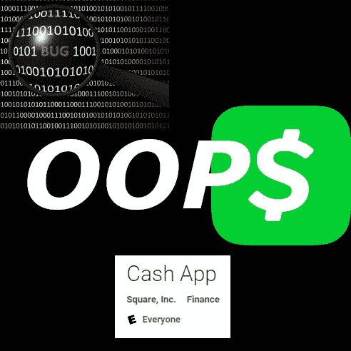

# Cash 应用程序的比特币提取过程中的错误可能会导致您发送错误的金额或错误的地址

> 原文：<https://medium.com/coinmonks/bug-in-cash-apps-bitcoin-withdraw-process-could-cause-you-to-send-wrong-amount-or-to-wrong-address-ae59aea4b50a?source=collection_archive---------2----------------------->

这是之前在 2020 年 8 月初向 Cash App 支持报告的两个尚未解决的错误的简要描述。从那以后，应用程序进行了多次更新，错误仍然存在。对 Cash 应用程序支持的后续工作已启动，以在两周后重新解释漏洞，并让他们知道这将在 30 天后向公众披露。

不管它有什么价值，这个标题是故意措辞以引起你的注意。这里的一个关键词是“**可能**”。据我所知，没有人因疏忽而发送错误的金额，或发送到非预期的地址，因为这样做需要在验证检查期间识别问题，然后完全忽略相同的验证检查。

**下面是重现 bug 的步骤:**

1.  在 Cash 应用程序中，导航到比特币屏幕，通过选择飞机图标发送比特币来启动取款。
2.  指定要发送的金额。任何数量都可以。
3.  指定要发送到的地址。同样，任何地址都可以。
4.  在确认屏幕上，记下您在步骤 2 和 3 中输入的金额和地址。

    *现在，假设您输入的地址或金额不正确。*
5.  按返回按钮返回输入屏幕。
6.  指定要发送的新金额(与步骤 2 不同)。
7.  指定新的发送地址(与步骤 3 不同)。
8.  继续到确认屏幕。请注意，金额和地址都没有更新，并继续反映步骤 2 和 3 中的值。

如果用户在第 5 步注意到输入不正确(例如，金额错位、数字缺失、数字过多等)，并希望进行更正，他们需要确保在第 8 步再次检查。继续第 8 步，输入 pin 或生物特征以完成交易会将金额发送到最初输入的地址，而不是第 6 步和第 7 步可能想要的地址。

这在应用程序的 Android 版本上进行了测试和验证。

在撰写本文时，Cash App 尚未修复该 bug。在此期间，Cash App 应用程序更新为 1)添加新闻部分 2)删除新闻部分 3)更改发送流程 4)再次添加新闻部分。

**不信任。验证。**

检查那些确认屏幕。如果您发现您输入了错误的金额或地址，请完全退出交易，或者关闭应用程序并从主屏幕重新开始。这将清除先前的输入。