# “构建加密 NFT 社区”——加密组件 ERC998 更新

> 原文：<https://medium.com/coinmonks/buidling-the-crypto-nft-community-crypto-composables-erc998-update-189a7c5333a7?source=collection_archive---------4----------------------->

## 为不可替代的令牌建立一个基于协作和创新的加密社区。

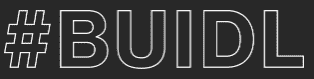

*tldr:2018 年 10 月的 Composables 更新与回顾*[*Composables*](https://discord.gg/eTqnGwZ)*Call 于 2018 年 10 月 16 日在* [*NFTy 魔术师不和谐*](https://discord.gg/5vHcaMW) *语音频道举行。*

*背景和以前的 ERC998 更新:* [*介绍加密组件*](/coinmonks/introducing-crypto-composables-ee5701fde217) *，* [*加密组件 ERC998 更新😊*](/coinmonks/crypto-composables-erc-998-update-1cc437c13664)*[*更新# 2*](/coinmonks/crypto-composables-erc-998-update-2-4b160df79836)*[*更新 3:【第一次接触】*](/@mattdlockyer/crypto-composables-erc-998-update-3-first-contact-f3930a08636) *，* [*更新 4:【The Namening】*](https://hackernoon.com/crypto-composables-erc-998-update-4-the-namening-7a05d28f3401)*，* [*更新 5，更新 6:【在野】*](/coinmonks/crypto-composables-erc-998-update-5-eb0a748a9889)**

**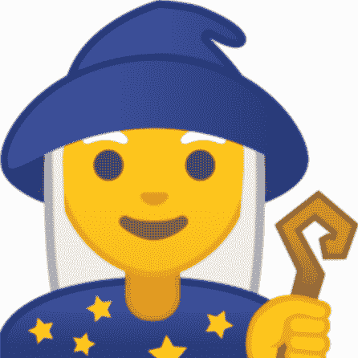**

**[NFTy Magicians](https://www.nftymagicians.org/)**

# ****出席** [**NFTy 魔术师组合调用**](https://discord.gg/5vHcaMW) **(不和谐处理先给):****

*   **阿比**
*   **美国佐治亚州亚特兰大市**
*   **下垂 | [隐色](https://www.cryptorome.io/)(布莱恩)——美国佐治亚州亚特兰大**
*   **弗洛克诺斯(Fabiano， [Cryptokitties](https://www.cryptokitties.co/) ) —加拿大不列颠哥伦比亚省温哥华**
*   **Hsummers ( [Haley](https://twitter.com/haleyrsum) ， [Mokens](https://mokens.io/) ) —美国内华达州里诺**
*   **Jos3ph ( [约瑟夫](https://twitter.com/josephpallant) ) —加拿大不列颠哥伦比亚省温哥华**
*   **穆德根([尼克](https://twitter.com/mudgen)，[莫肯斯](http://mokens.io))——美国加州萨克拉门托**
*   **娜塔莉-ckc ( [娜塔莉](https://twitter.com/nathalie_ckc) )-加拿大不列颠哥伦比亚省温哥华**
*   **Spaded (Zach，[可铸造的](https://mintable.app/) ) —泰国曼谷(原加利福尼亚)**
*   **特里斯特(特里斯坦，[分散地](https://decentraland.org/))——美国缅因州波特兰**

# ****10 月份更新的总结和 9 月份的回顾****

****

**[九月的可组合令牌号召](/coinmonks/crypto-composables-erc-998-update-6-in-the-wild-6ece410d263d)标志着[不可替代令牌(NFT)](http://erc721.org/) 和[可组合令牌(cNFT)](http://erc998.org/) [社群](https://discord.gg/eTqnGwZ)的一个重要里程碑。来自[莫肯斯](https://mokens.io/)的尼克、[cryptome](https://www.cryptorome.io/)的布莱恩和 [BitGuild](https://bitguild.io/) 的卡尔文都能够提供反馈并分享他们实施 [ERC998](https://eips.ethereum.org/EIPS/eip-998) 的经验。**

**这为小组讨论式的方法奠定了基础，随后是每位发言人的问答环节。这感觉很像参加一个加密会议的分组会议，但没有残留在背景中的烧焦咖啡的味道。这种小组成员式的经验分享方式为 10 月份的电话会议定下了基调，并带来了一种充满活力的社区意识。**

**如果说九月的电话会议就像是参加一个秘密小组会议，那么十月的电话会议就像是在活动大厅里，在喝第四杯免费咖啡的时候随意地开始交谈。与会者都有机会介绍自己，他们的项目，以及他们的工作基础。由于机构群体对 10 月号召的集中讨论，新的合作伙伴关系和机会已经形成。**

****

**为了提高未来[可组合](https://discordapp.com/invite/eTqnGwZ)电话的出席率，在可组合 Discord 频道发布了正在进行的每月或每两周电话的[投票](https://goo.gl/forms/w8f7lnKAZ6Tiojzr2)。由于我们的社区是国际性的，我们希望确保这个时间适用于尽可能多的时区。请在这里投！**

**此外，我们还打算通过更多地参与全球聚会，提高 NFT 社群的意识。为了实现这一点，NFTy 魔术师将采取措施创建一个 meetup 工具包，使人们可以轻松地开始他们自己的本地 meetup。**

# ****ERC 998 的更新****

**由尼克·穆奇领导。标准没有变化，但想做一些补充。关于 ERC998 标准的疑问、意见、建议和问题应在第 998 期[以太坊征求意见稿(ERC)](https://github.com/ethereum/EIPs/issues/998)上提出。**

**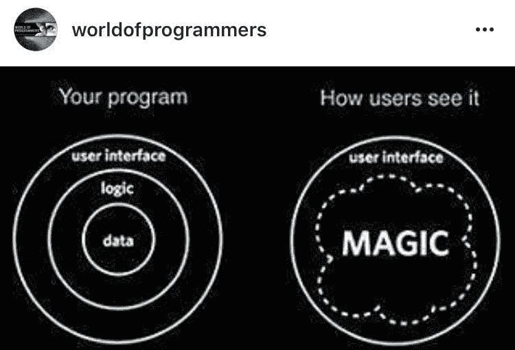**

# ****ERC 998 中的前置运行安全漏洞****

**ERC998 存在前置运行安全漏洞，但不在标准本身。当有人出售 ERC998 令牌时，您需要了解该漏洞。**

**假设一个令牌拥有 10 个或 10 个以上的子令牌，并且所有者决定出售该令牌及其所有组成的数字资产。在列出代币之后，销售者可以监视网络上的交易，等待他们的代币被购买，然后在其他交易确认代币的销售之前移除所有具有高汽油成本的子代币。这将导致购买者得不到子代币。**

**Nick 认为该漏洞不太可能发生，但有一些方法可以防止这种情况。你可以有一个适当数量的孩子的合同支票。或者，如果有大量的子令牌，比如 100 个或更多，您可以进行随机检查，以确保子令牌在那里。**

**【Haley 的评论:在将代币转移到“托管”而不是使用“原子互换”的市场中购买代币可以为购买者提供安全性。**

***来自 Zach* 的评论:也许你可以实现一些时间方面，这样如果有太多的区块经过，购买请求就会被撤回。**

# ****如何使用 ERC998 解决合同限制大小的问题****

**24.3 KB 并不太好用。当实现 ERC998 时，您可能也在实现 ERC721 和您自己的函数。所有的铃铛和哨子很快就加起来了。以下是一些解决方案:**

*   **变通方法 1:在另一个协定中使用具有回退功能的代理模式。**
*   **解决方法 2:使用库。**
*   **变通方法 3:以各种方式对其他协定使用显式委托调用。**
*   **解决方法 4:通过优化和限制附加功能来最小化合同大小。**

**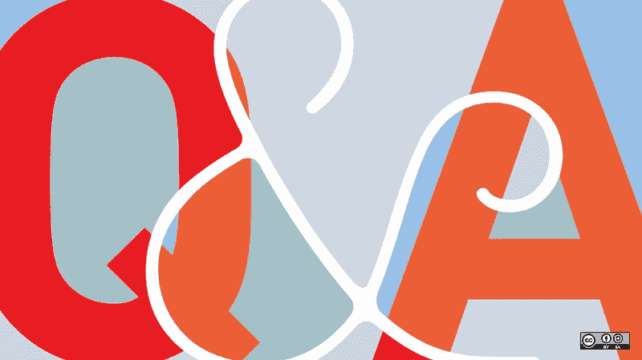**

***来自 Uneeb 的问题* :
以太坊正在致力于提高合约规模吗？看到大小限制在 ERC998 之外也是一个问题。**

***尼克的回答* :
尼克没有意识到任何增加合同规模限制的意图。推荐的方法似乎是委托调用。在 Mokens 中，委托效果很好。**

**Brian 的评论 :
委托调用效果很好，代理模式是一个不错的选择。CryptoRome 单独使用 ERC998 的自底向上实现达到了契约大小限制。Brian 的团队选择在编译期间使契约尽可能小，并做了一点委托。事后看来，代理模式会更好，因为它有助于可升级性。如果你在合同中同时实现了自顶向下和自底向上，你会达到极限。**

**【Zach 的评论 :
Mintable 有 10 个合同通过使用委托方法进行交互。这对他很有效。**

# **[**何时使用不同的可组合方法**](https://hackernoon.com/top-down-and-bottom-up-composables-whats-the-difference-and-which-one-should-you-use-db939f6acf1d)**

**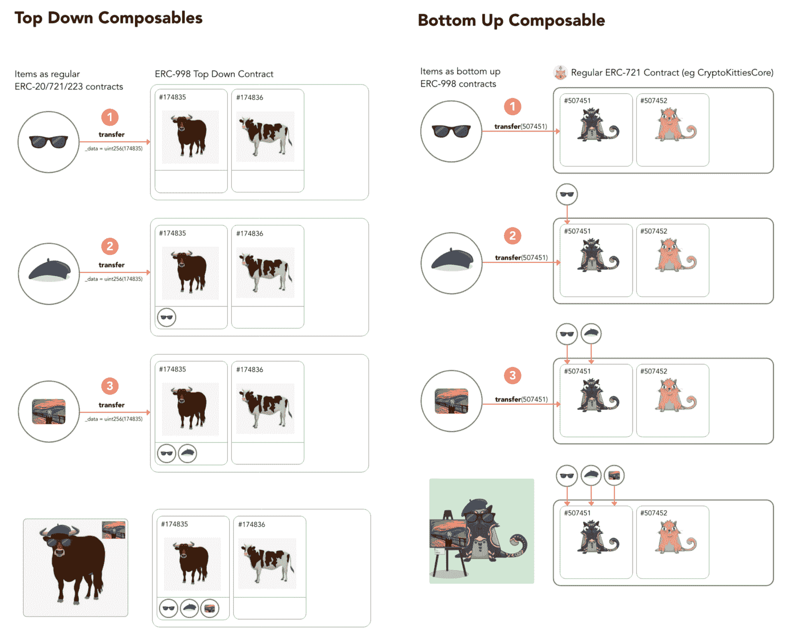**

**自上而下:您的令牌“拥有”其他令牌，您可以在您的契约中查询这些子令牌。**

**自底向上:现有的 NFT(ERC 721)，您希望它们拥有您的令牌。**

# ****DApp 更新****

**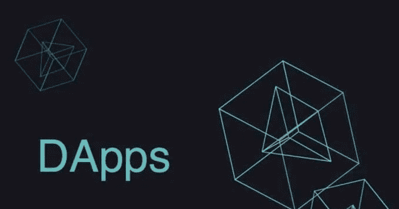**

## ******【哈利】******

****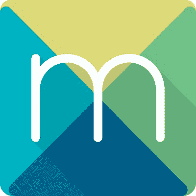****

****Mokens.io 刚刚进入了它的第二个铸造时代:铸模时代。你从新钱包中铸造的第一枚代币是免费的。如果你对 mokens 上的时代有什么想法，我们每个月都会对 mokens 社区撰写的新时代提案进行投票。如果你有一个有趣的想法想看看，请告诉我们。Nick 希望为 mokens.io 上的其他 NFT 实现父母感知功能，如 Ethermons、CryptoStrikers 或 Bitizens。然后，希望添加功能来组成 ERC20 令牌，如 OX、TRON、DAI。****

****如果你想制作一个自己的 NFT minter，mokens smart contract 和 API 允许任何人定制 NFTs。智能合约还允许对任何用于向 mint 支付的 ERC20 令牌进行收入分割。这使得在你的平台上向你的用户介绍免费的 NFTs 变得容易，或者为你快速实现一种新的收入形式。****

****Mokens 被 0x Cert 邀请加入 NFT 联盟。邀请来自 0xCert 的 NFT 思想领袖参加 urban@0xcert.org。****

****我目前正在参加下周在洛杉矶举行的 [Crypto 投资峰会](https://cryptoinvestsummit.io/),来传播关于 NFTs 和 mokens.io 的消息！****

## ********【布莱恩】********

******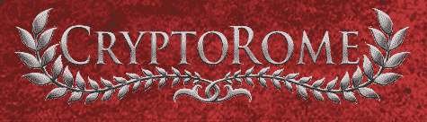******

******CryptoRome 已经向游戏中的玩家发放了近 5000 个 ERC998 代币。ERC998s 代表游戏中的土地(虚拟财产)。你可以把小片段组合成大片段。例如，三个村庄组成一个城镇。玩家可以在接收、购买和铸造后进行合成和分解。CryptoRome 预计用于合成和分解的前端将在几周内准备就绪。团队一直忙于游戏开发。并计划在未来进行更具组合性的开发，比如自顶向下的实现。******

******CryptoRome 还集成了另一款游戏 [Crypto Horse](http://cryptohorse.ch) 的 ERC721！在这两个游戏中，你都可以使用在密码马上铸造的 NFT 密码马。我们不知道其他人这样做。这对 NFT 社区来说是非常令人兴奋的。马的速度是两个游戏共有的属性。在他们的游戏中，你比赛，在我们的游戏中，它是军事资产。******

## **********【特里斯坦】**********

******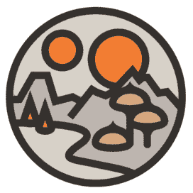******

******Tristan 在分散地做地区形成的社区贡献，并且在音乐中心做一个与 NFT 乐器相关的项目。分散土地使用 NFT 来表示虚拟世界中的地块，他们已经开始捆绑相连的地块，以在虚拟世界中创建“地产”。Tristan 希望利用 ERC998 捆绑多个 NFT 以用于不同的项目，并有兴趣了解 moken 的平台是否可用于捆绑他正在尝试的所有权令牌内的多个 NFT 项目。******

## **********【扎克】**********

******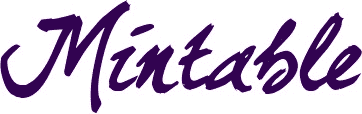******

******扎克已经在 Mintable.app 上工作了大约两到三个月。这个想法是让“正常”的人通过收藏品进入加密空间。部分问题是没有统一的管理界面，Mintable 正在通过为 ERC721s 制作“MyEtherWallet”来解决进入壁垒。******

******Mintable 的 alpha 版本定于 12 月 1 日发布。阿尔法将包括 Axies，Kitties，Mokens 和分散地块的管理器组件，并将有一个页面浏览您的所有令牌。Mintbale 正在努力使所有 ERC721s 在 ERC998 之前都得到支持。测试版和正式版将会有更多类似交易所的组件。Zach 想让用户通过 Metamask 和 web3 点击 3 次就能做事情。最终，Mintable 将让硬件钱包也加入进来。******

******Zach 希望与一些 alpha 用户合作以获得反馈。请向 Spaded 伸出手来解释一下这位魔术师的不和谐。******

# ********社区更新********

## ******[**旧金山区块链周 2018**](https://sfblockchainweek.io/)******

******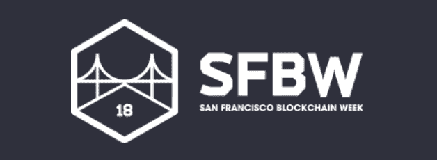******

******我能够参加旧金山区块链周和 CESC 活动——大声感谢 Chika 慷慨赠送我一张门票！旧金山区块链周是一个有 5000 张门票的活动，但有很多没有门票的人到处闲逛。这是一个非常高能量的活动，以瑞士联邦理工学院黑客马拉松开始，进入技术前沿中心和 CESC 活动，随后是 NFT 峰会。我发现这个活动是一个极好的机会，可以向从事企业就绪项目的团队集思广益。许多发言人和专题小组探讨了区块链的可扩展性、互操作性和法规遵从性。******

******当有机会讨论不可替代的代币时，人们有兴趣了解货币环境之外的代币。在区块链社区中，仍然有许多关于非功能性食物疗法的教育需要做。******

******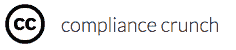******

******[https://www.compliancecrunch.com/](https://www.compliancecrunch.com/)******

******我收到的关于 NFTs 合规性的最有影响力的信息之一来自我与来自 [Compliance Crunch](http://www.compliancecrunch.com/) 的 Tamara Gunawardana 的讨论。她的建议是，考虑你的代币可能被误解为证券的所有方式，把它写出来，然后也记录它如何不是证券。这样，如果监管人员要求审查你的代币，你可以提供一份经过深思熟虑的文件，解释它为什么不是证券，并展示善意。******

******Compliance Crunch 还建议审查整个金融服务行业的最佳实践，并记录将适用的最佳实践纳入您的业务模型的流程。如果最佳实践不适用，请制定一个计划来重新评估您的合规性测试计划的适用性。请联系 tamara@compliancecrunch.com 的塔玛拉·古纳瓦德纳，寻求代币合规方面的帮助。******

## ********SF 区块链周的激进市场会议********

******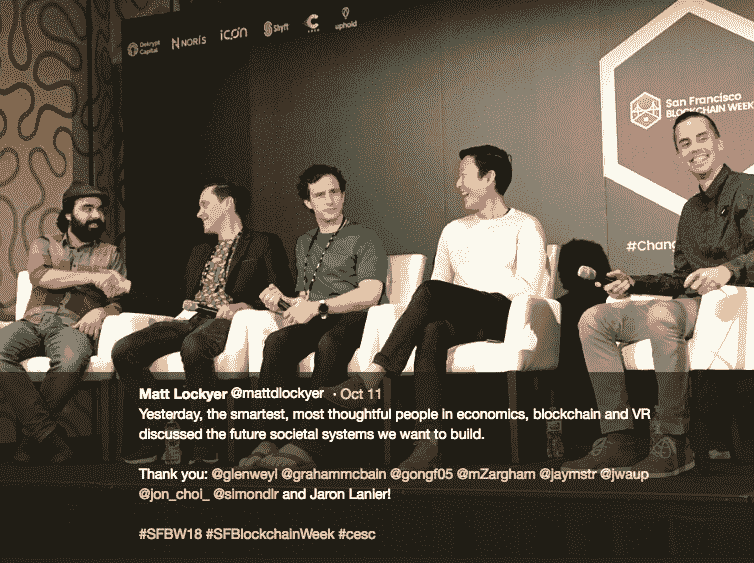******

******Matt Lockyer 在旧金山区块链周主持激进市场会议。他能够联系并创建一个由经济学、区块链和虚拟现实领域最聪明、最有思想的人组成的小组，来讨论未来的社会系统是什么样子，以及我们想要建立什么。******

## ******[**无法登顶**](/ecf-review/non-fungible-blogpost-1b3c555c290a)******

******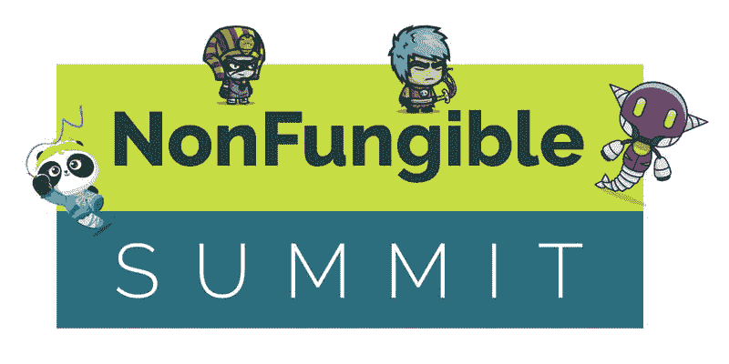******

******尼克参加了 NFT 峰会。我们分享了很多精彩的内容，并且这个活动提供了很多精彩的对话。峰会的出席情况非常好，有很多活动，参加的人数非常多。对 Nick 来说，最大的收获之一是 NFT 的价值可以来自于故事。一个好的故事能引起兴趣，激起对象征物的渴望，并使它变得有趣。此外，重要的是要强调，非功能性交易与金融无关，而是与所有权有关。NFT 与金融界有着相似的语言和术语。******

******我们怎样才能在不太关注非功能性测试的情况下传达它们是什么？如果你有这个问题的答案，请用#ERC721 把你的答案发给 Nick。******

# ********聚会和全球加密社区********

******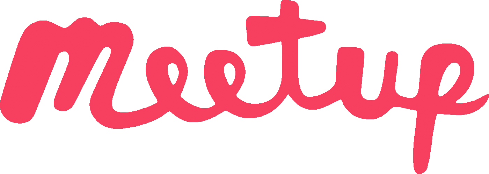******

## ********泰国曼谷********

******扎克一直在泰国参加加密、比特币和交易会议。这些活动的参与者通常是外国人和企业家，有许多 EO 和比特币人士在场。许多人不熟悉 NFTs，扎克是唯一的以太坊家伙。泰国北部有点不同。在这些活动中，人们倾向于分成不同的阵营，因为他们谈论他们所知道的。所以人们和使用相同平台的人组成一个团体。******

## ********内华达州里诺********

******在 Reno meetups 上，Haley 观察到了比特币、以太坊和 HyperLedger 之间类似的“阵营”形式。虽然聚会总是非常学院化和知识化，但就每个区块链社区的细微差异开玩笑还是很有意思的。在里诺，聚会的参加人数非常多，而且每个月都在增长。******

## ********佐治亚州亚特兰大********

******Uneeb 能够参加在佐治亚州亚特兰大举行的会议。经常参加这些活动的人和只是看看现场的人混杂在一起。对于新来的人来说，这是一个非常友好的环境。******

## ********不列颠哥伦比亚省温哥华********

******Nathalie 是 HyperLedger 培训和教育工作组的远程志愿者。她住在不列颠哥伦比亚省的温哥华，那里是举办许多秘密/区块链活动的地方。它是当地分散技术社区的中心。******

## ********新的合作机会********

******来自 [Convergence](http://convergence4d.com/about/) 的 Andrew Prell 正在为他们的 AR/VR 奖励寻找 NFT 游戏资产。安德鲁参加了旧金山区块链周，也参加了加密投资峰会。他正在为他的 AR/VR 奖励系统寻找 NFT。这将给参与 NFT 的现有 DApps 带来新用户(每月数百万活跃用户)。请发电子邮件到 rell@silicanexus.com T2 联系他。******

## ******请确保[就您希望](https://goo.gl/forms/w8f7lnKAZ6Tiojzr2)[下一次组合电话](https://goo.gl/forms/w8f7lnKAZ6Tiojzr2)举行的时间进行投票！******

************

******[NFTy Magicians](https://www.nftymagicians.org/)******

********[**NFTy 魔术师**](https://discord.gg/5vHcaMW) **每月举行会议！我们邀请你加入** [**不和小组**](https://discord.gg/5vHcaMW) **成为 NFT 运动的一份子。**********

**********编辑和共同撰写人:**********

********[**陈冠希**](https://www.linkedin.com/in/nathalie-ckc/)********

********[**尼克·穆奇**](/@mudgen)********

> ********[直接在您的收件箱中获得最佳软件交易](https://coincodecap.com/?utm_source=coinmonks)********

****************