# 使用 Hyperledger Fabric 构建区块链 PoC 应用程序

> 原文：<https://medium.com/coinmonks/build-a-blockchain-poc-application-using-hyperledger-fabric-6bbe633c2204?source=collection_archive---------0----------------------->

这篇文章讲述了我利用 Hyperledger Fabric (HF)区块链平台在区块链创建土地和产权记录的区块链 PoC 应用程序的经历。它可能有利于那些刚刚开始或打算学习心力衰竭的人，对于那些已经有心力衰竭经验的人来说，它可能提供另一个同样可行的选择。这很长，但是对于大多数对区块链技术感兴趣的读者来说，你的时间是值得的。

让我们先确立我们的目标，然后看看如何实现它。

在这里，我们的目标是创建一个 web 应用程序，用于记录一个小的许可区块链上的房屋交易(买卖房屋),并能够搜索它们。我们决定使用 Hyperledger Fabric 平台来完成这项工作。

最后，我们希望这个应用程序看起来像下面这样(除非不言自明，否则要有简洁的解释)。

我们的第一个屏幕是 web 应用程序的登录页面，带有 Hyperledger Fabric api 服务调试输出的背景:

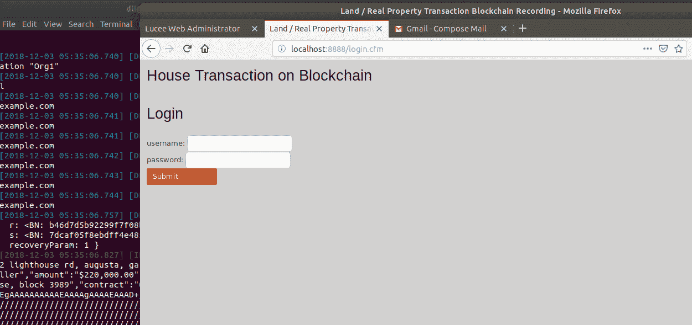

以下屏幕是 web 应用程序的登录页面(续)。登录使用双因素身份验证过程。

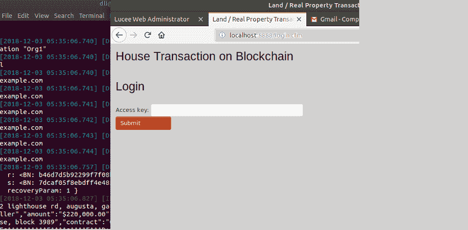

下面的屏幕是应用程序的主屏幕，其中列出了“添加交易”和“搜索它们”两个核心功能。

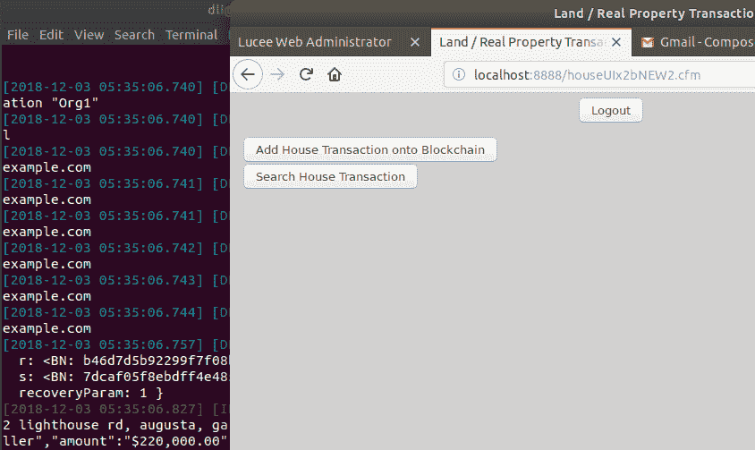

以下屏幕提供了在区块链上记录房屋交易的表格:

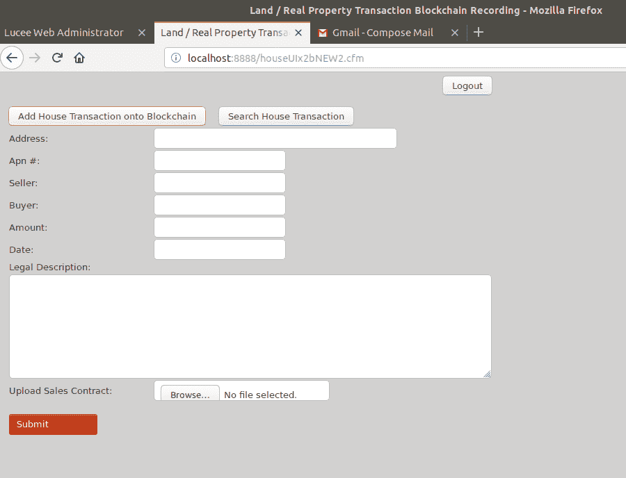

下面的屏幕将一笔房屋交易输入到表单中:

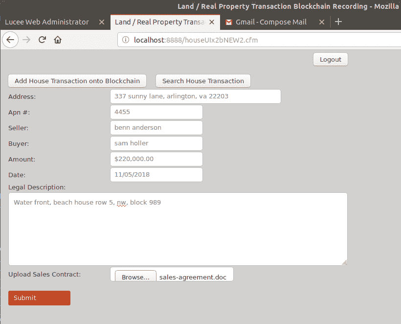

以下屏幕记录了区块链上的房屋交易，并查询链以检索它(以确认交易记录成功):

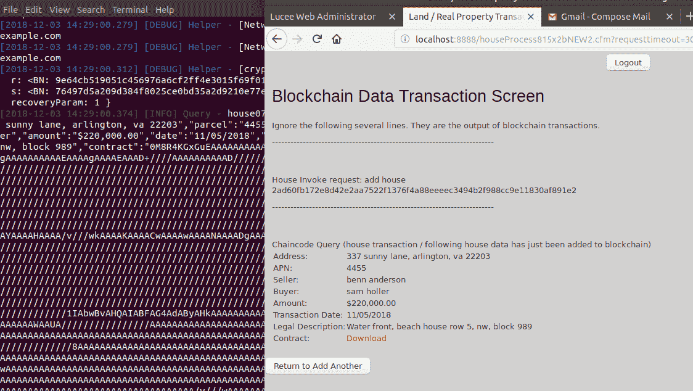

以下屏幕捕获了单击下载(合同)链接时的状态:

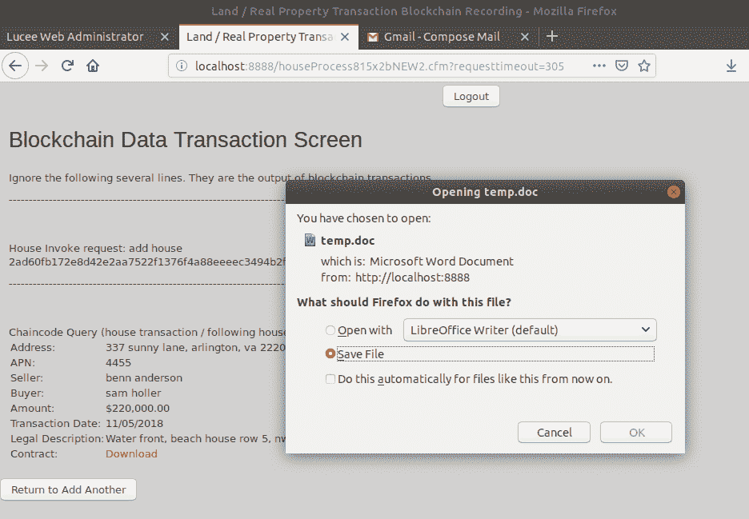

以下屏幕输入房屋交易搜索查询(按 apn 查询房屋):

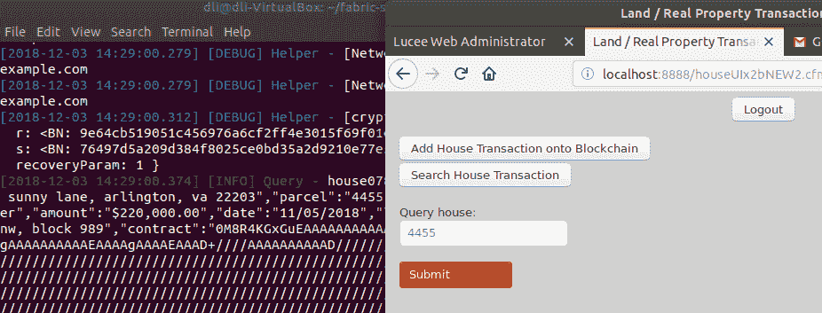

以下屏幕返回交易查询结果:

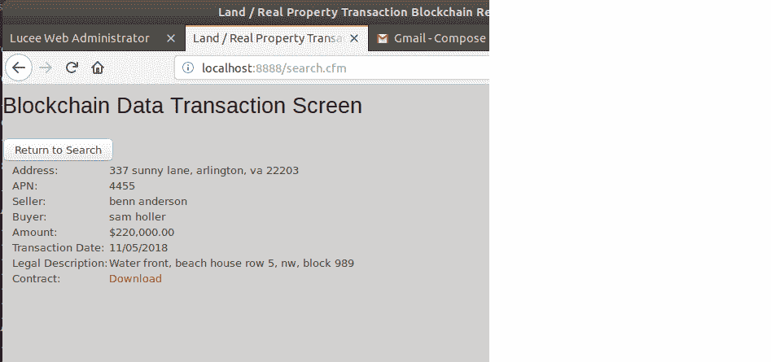

正如我们所看到的，上面是一个功能齐全的概念验证区块链应用程序。之所以称之为 PoC，是因为我们没有将“example.com”的域名和相关的子域名替换为生产域名和其他一些东西。

现在，让我们讨论一下我们是如何做到的。

首先，我们需要概念清晰和架构。

Hyperledger Fabric 具有 3 层架构。具体来说，它的区块链基础设施网络，它的业务规则和逻辑链码，以及最终用户执行业务功能的网络和/或移动应用程序。

将它们分成三层或三个组件将有助于我们在创建区块链应用程序时解决问题。

下图描述了这样一个架构，并让它来指导我们开发这样的区块链应用程序:

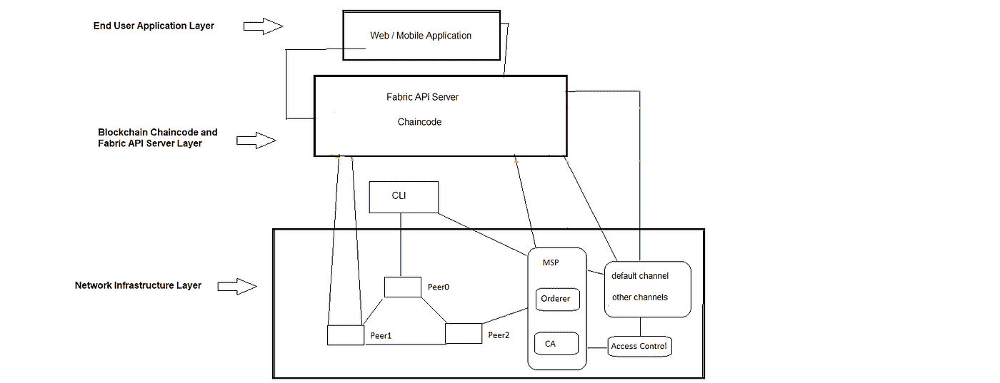

第一部分— Hyperledger 结构网络基础设施

这部分包括与作为网络参与者或分布式节点/对等点的利益相关者一起工作，创建和/或设置规则和策略。使用密码工具创建密钥、安全身份、角色等。使用名为 orderer 的特殊服务来促进对等体之间的通信和数据事务处理。还有更多…

对于这一层，广泛的计算背景，包括 Unix/Linux/Ubuntu、Docker(集装箱化)等方面的技能。都是需要的。它很复杂，但不需要太多的编程。

能够使用该层的结构数量设置区块链网络。一个重要的部分是 yaml 文件，例如 docker-compose.yaml 文件，这样的配置文件定义了整个网络拓扑。你不需要在短时间内以线性方式获得全部能力，但相当好将是一个好的开始。

因为这是一个重要而复杂的过程，所以我专门就如何学习 Hyperledger Fabric Network infra structure 的基础知识创建了一个 45 页长的单独文档，其中还讨论了 chaincode 并一步一步地简要介绍了 web 应用程序，因此，如果您还不熟悉它，请参考本文档的第一部分(联系我以了解更多详细信息，但首先我建议您完整阅读本文)。

第二部分——Hyperledger 结构链代码

术语“链码”相当于以太坊的“智能合约”。Chaincode 可能用 Node.js、Go (Golang)和 Java(我个人是 Node.js 阵营的)三种语言中的一种编写。希望精通其中的一门。

对于这一部分，获得了解结构的能力，如有效使用 CLI 和 docker 命令，将非常重要。一些关键的 docker 命令包括“docker ps”来显示正在运行的进程(程序和/或容器)。“docker exec -it cli bash”将显示 cli 命令提示符。“docker run …”是启动/运行一个容器的服务…”docker RM-f $(docker PS-QA)“杀死所有正在运行的进程/容器。在这个过程中，一些基本的 unix/linux/ubuntu 技能是必须的，例如，列出目录中的文件的“ls”，复制的“cp”，移动或重命名的“mv”，然后一些高级知识也可能是方便的，例如，“chmod a+r myfile”将使“myfile”对用户/组/每个人(全局)的所有三个角色都是 r(可读的)。

链码管理方面，链码有两个主要类别，一个称为“系统链码”，它与给定的区块链和另一个类别交互，另一个类别称为“用户链码”，是我们开发人员/程序员创建的链码。

用户链代码有“安装”、“实例化”、“调用”和“查询”四个生命周期。

“安装”本质上映射了链码的位置/路径，因此，当需要时，可以找到并使用它。

“实例化”将创建一个容器映像来支持特定链代码的所有未来调用和查询需求，这就是为什么“实例化”需要更长时间来完成。

“调用”，简单地说就是将数据写入或放到区块链上。

“查询”，简单地说，从区块链获取数据或检索数据。

超越基础的“安装”和“实例化”

在我看来，在生产环境中，链代码的安装和实例化通常是一次性的过程，一旦特定的链代码被安装和实例化，它们将“总是”在那里供将来使用，例如“调用”和/或“查询”。知道如何安装和实例化是非常重要的。

至少有 3 种方法来安装和实例化链码。

*   (a)通过 CLI 命令提示符下的“peer”命令，这是一个好方法。
*   (b)通过调用 Fabric REST api 服务器，根据我的经验，这种方法也很好
*   通过 Hyperledger Composer，这引入了一个全新的范式。虽然我对 Hyperledger 项目的工作人员非常尊重，但我对它如何适应整体 Fabric 架构有疑问，让 Composer 重新创建 Fabric 网络等。这似乎会走向许多方向/引入不必要的额外流程，因此，就我个人而言，我会避免这种选择。有关此选项未来前景的详细信息，请参见下面的注释和 URL，"*我代表我在 XYZ 的团队发言，我们对过去几年来为 Composer 所做的贡献感到无比自豪，我们感谢社区的所有反馈和贡献。然而——我们 XYZ 认为 Composer 的架构和设计存在一些根本性的问题，就像今天一样，这促使我们重新考虑未来的方向和计划。*”、 [c](https://lists.hyperledger.org/g/composer/message/125) 联系我了解详情。

关于方法(a)，要尝试它，您可以首先调出“first-network ”,然后转到 CLI 命令提示符(docker exec -it cli bash ),现在您可以安装和实例化 chaincode，因为“mycc”已经安装，您可以安装“fabcar ”,从。/byfn.sh up”屏幕。

安装后，您可以通过“对等链代码列表—已安装”命令验证它是否真正安装，然后，通过查看如何为“mycc”链代码完成实例化“fabcar”链代码(并确保您在线，它需要一些 npm 参考)。这可能需要几分钟，一旦完成，使用“对等链代码列表-C my channel-instantiated”来验证它是否真正实例化。

因此，再次重要的是获得执行链代码生命周期的能力，如上所述，安装、实例化、调用和查询。

链码编码——一个很好的学习方法是阅读和理解示例链码。“余额转账”示例应用程序和“Fabcar”示例应用程序都是很好的例子。重要的是愿意尝试或调整它们，这样，我们会获得新的理解，甚至是某种发现。例如，对于“First-Network”示例应用程序,“Instantiate”实际上会将数据写入链中，而“Fabcar”示例应用程序的“Instantiate”则不会。因此，我们知道“实例化”可以用一种更适合我们需求的方式来编写，而不是必须这样或那样。

现在，让我们将所有上述关于 chaincode 的一般知识映射到 House Transaction 区块链应用程序中，在这种情况下，两个关键功能是“addTransaction”和“queryTransaction ”,由于我将 Node.js 用于 chaincode，一个 node.js 源代码文件可以解决这两个问题，一旦完成，我们将使 package.json 配置文件反映这个 node.js 源代码文件。然后，我们准备好开始如上所述的链码生命周期。

现在，我们已经使用 Hyperledger Fabric platform 建立了一个区块链网络，并为这个房屋交易区块链应用程序创建了 chaincode，但是我们的最终用户需要通过 web 或他们的移动电话来访问它，接下来呢？

自然，开发网络和/或移动界面到链中，因为这个应用程序是商业的，我将首先从网络应用程序开始。所以，现在我们进入下一部分。

第三部分——区块链之上的网络和/或移动应用

现在的第一个问题是如何将链码与链的状态数据库和分类帐连接起来，然后如何将链码连接到 web 应用程序，因此，链码位于中间。api 是连接两端的一种方式。在 api 方面，我们有 Fabric api 和 Composer api。如上所述，我是奥卡姆剃刀原理的粉丝，有效地解决问题(与任何复杂的方法相比)，因此，我已经淘汰了 Composer api，这意味着 Fabric api 是我的选择。

简而言之，Fabric api 服务器是这样工作的，在 chaincode 端，它利用一个低级 API 与 chaincode 通信，这个低级 API 被称为“shim”，也称为“fabric-shim”，然后，在网站上，一些服务器端脚本调用 Fabric api 进行链数据操作。

现在，让我们对上面进行扩展，我们首先运行 Fabric API 服务器，然后，我们建立一个 web 服务器，创建一些服务器端代码来调用 API 服务器，用于不同类型的链事务需求，如“安装”、“实例化”、“调用”和“查询”。

现在，让我们将上一段的概念重点放在这个房屋交易应用程序上，对于服务器端代码，我们需要一些用于登录页面(表单)的代码和一些嵌入安全/认证逻辑的代码，然后创建 html 表单来接受房屋交易数据输入，一些代码来接受交易并将数据写入链中，然后一些代码来接受交易查询，一些代码来处理此类查询/搜索，从链中获取数据，然后向用户显示此类结果，如果没有找到，则不显示结果。

到目前为止，我们有几个终端/窗口用于结构链代码类型的业务，例如运行结构 api 服务器，用于验证运行的进程/安装的容器/程序，用于运行 web 服务器，以及可能用于验证文件的另一个；然后，我们有一个 Firefox 网络浏览器，用于业务的 web 应用程序方面；和一个用于文件/代码创建和编辑的文本编辑器…看看下面的截图，在我看来有点乱，但是很好:

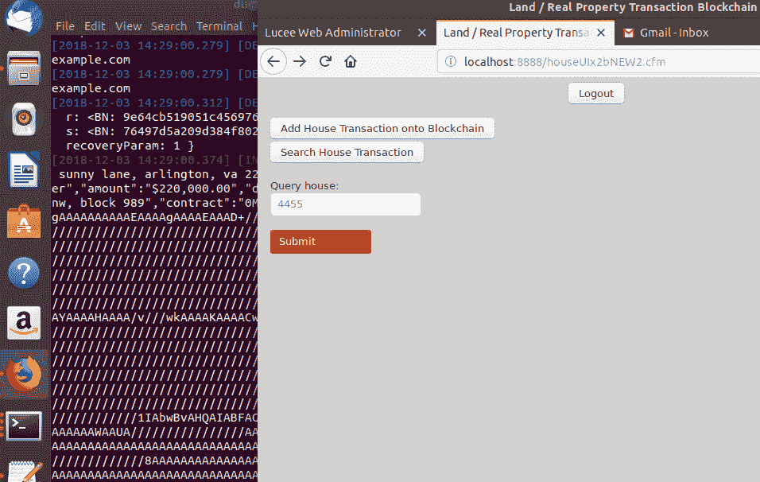

摘要

区块链技术很复杂。我们的背景和能力会影响我们学习的方式和速度。与此同时，我们将努力在开始之前寻求明确性，路线图的技术明确性，我们需要获得哪些关键知识，每个组件/部件如何与另一个组件/部件连接和配合，先做什么和后做什么，我们的优先事项是什么，这些都很重要。我们永远不应该低估愿意尝试理性的价值。

为了更好地理解上述内容，我们可以将它们总结为胜任 Hyperledger Fabric 专业人员的三项核心技能。(1)关于区块链网络或网络基础设施的知识和技能；(2)编写并将链码部署到网络的能力；(3)能够通过 Fabric API 服务器将 web 界面的服务器端脚本写入链代码。作为从业者，我们需要记住奥卡姆剃刀原则，效率胜过任何复杂的设计和/或架构。

同样重要的是，我们需要在旅途中不断发现优秀、有能力和有经验的人，他们不仅可以丰富我们的知识，还可以给我们带来一种社区意识。

像其他区块链平台一样，Hyperledger Fabric 技术仍处于萌芽阶段，好消息是它似乎在稳步发展。

感谢您的阅读，我欢迎投入和反馈。

为了更加清晰，我想补充一点，这篇文章解释了如何在更高的层次上使用 Hyperledger Fabric 构建一个 PoC 区块链应用程序。对于具体的实施，我有两套 Hyperledger Fabric 培训材料来帮助您实现这一目标，它们是收费的。

另外，目前这个 PoC 应用程序是针对一个有两个节点的组织，我打算从另一个组织添加一些节点/对等体到网络中(只需要编辑 docker-compose.yaml 配置文件和编辑一些 chaincode 参数，重新启动网络并做一些测试……)。

如果你觉得你已经从这篇文章中受益，请不要忘记鼓掌，更好的是在下面给小费，或者更好的是，**只需通过 PayPal 支付 6 美元，就可以获得我的两套 Hyperledger Fabric 培训材料(每套约 40 页)。本次特价仅在 9 月 8 日至 9 月 11 日**期间有效。

BTC:1 etjj G7 D1 pq 4k 86 tmk ddg 7 USM 2 destxlf 1

> 加入 Coinmonks [电报频道](https://t.me/coincodecap)和 [Youtube 频道](https://www.youtube.com/c/coinmonks/videos)获取每日[加密新闻](http://coincodecap.com/)

## 另外，阅读

*   [复制交易](/coinmonks/top-10-crypto-copy-trading-platforms-for-beginners-d0c37c7d698c) | [加密税务软件](/coinmonks/crypto-tax-software-ed4b4810e338)
*   [网格交易](https://coincodecap.com/grid-trading) | [加密硬件钱包](/coinmonks/the-best-cryptocurrency-hardware-wallets-of-2020-e28b1c124069)
*   [密码电报信号](http://Top 4 Telegram Channels for Crypto Traders) | [密码交易机器人](/coinmonks/crypto-trading-bot-c2ffce8acb2a)
*   [最佳加密交易所](/coinmonks/crypto-exchange-dd2f9d6f3769) | [最佳加密交易所](/coinmonks/bitcoin-exchange-in-india-7f1fe79715c9)
*   开发人员的最佳加密 API
*   最佳[密码借贷平台](/coinmonks/top-5-crypto-lending-platforms-in-2020-that-you-need-to-know-a1b675cec3fa)
*   杠杆代币的终极指南
*   [AscendEx Staking](https://coincodecap.com/ascendex-staking)|[Bot Ocean Review](https://coincodecap.com/bot-ocean-review)|[最佳比特币钱包](https://coincodecap.com/bitcoin-wallets-india)
*   [Bitget 评论](https://coincodecap.com/bitget-review)|[Gemini vs BlockFi](https://coincodecap.com/gemini-vs-blockfi)|[OKEx 期货交易](https://coincodecap.com/okex-futures-trading)
*   [美国最佳加密交易机器人](https://coincodecap.com/crypto-trading-bots-in-the-us) | [经常性回顾](https://coincodecap.com/changelly-review)
*   [在印度利用加密套利赚取被动收入](https://coincodecap.com/crypto-arbitrage-in-india)
*   [霍比审核](https://coincodecap.com/huobi-review) | [OKEx 保证金交易](https://coincodecap.com/okex-margin-trading) | [期货交易](https://coincodecap.com/futures-trading)
*   [麻雀交换评论](https://coincodecap.com/sparrow-exchange-review) | [纳什交换评论](https://coincodecap.com/nash-exchange-review)