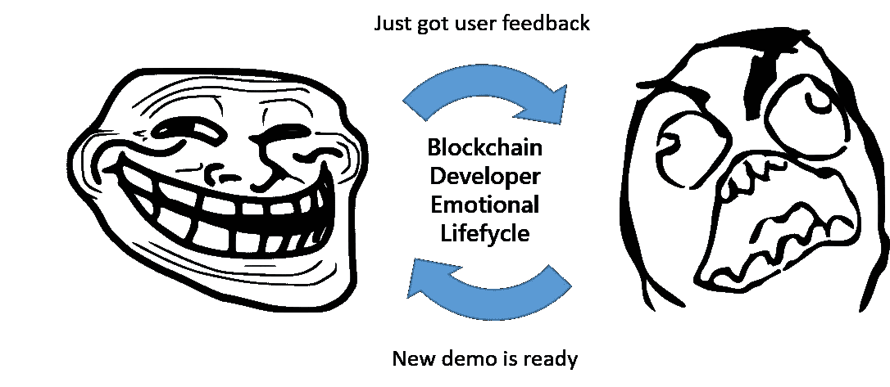
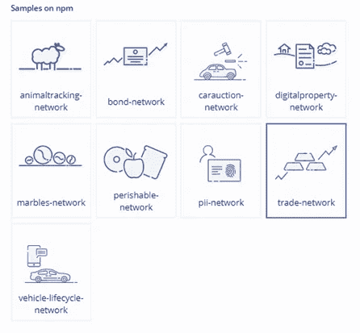
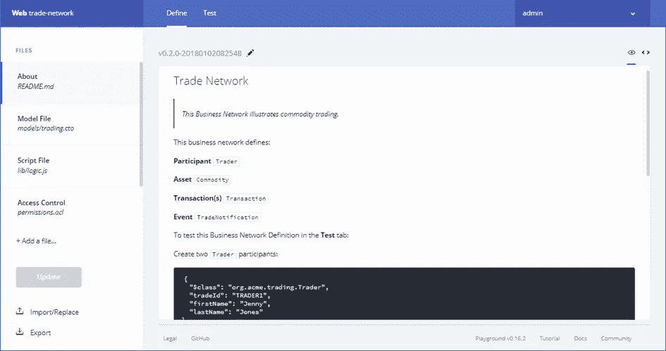
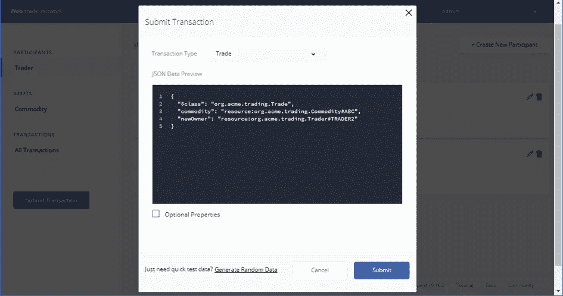
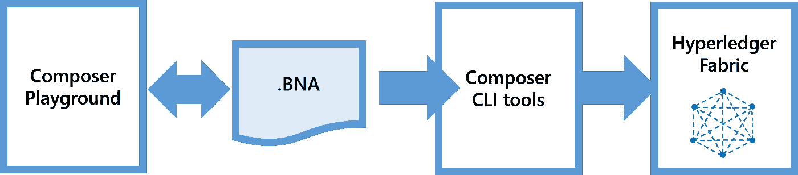
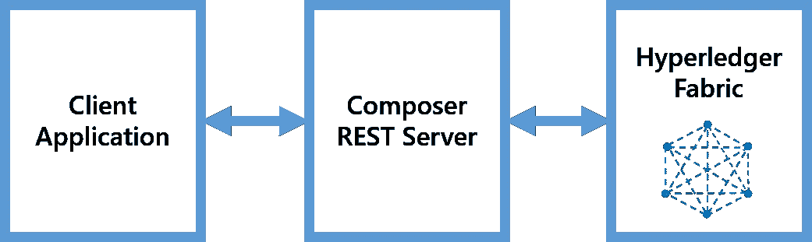

# 使用 Hyperledger Composer 在几分钟内构建一个区块链原型

> 原文：<https://medium.com/coinmonks/build-a-blockchain-prototype-in-minutes-with-hyperledger-composer-e132e17c98c7?source=collection_archive---------0----------------------->

在向潜在用户或投资者展示你的想法之前，建立一个区块链概念验证通常需要几周的编程。在过去几个月中，Hyperledger Composer 等新工具的出现加快了这一过程，使业务分析师或顾问能够在几分钟内构建一个区块链原型，而不需要编码技能。在本文中，我将快速向您展示如何做到这一点，以及之后您还可以用它做什么。

虽然比特币和加密货币继续成为头条新闻，但企业世界越来越熟悉区块链技术，如 Hyperledger Fabric。

> [发现并回顾最佳区块链软件](https://coincodecap.com)

[Hyperledger Fabric](https://hyperledger.org/projects/fabric) 是开源的、生产级的、为安全而设计的，在寻求将区块链应用于企业用例时，它是一个受欢迎的选择。

1.  与比特币或以太坊不同，它允许创建许可网络，参与者是已知的，在私人网络中执行交易，数据仅在*需要知道*的基础上共享。
2.  Hyperledger Fabric 也有很好的文档记录，并得到活跃且不断增长的用户社区的支持——在开始使用、熟悉区块链技术或获得支持以解决您的技术挑战时，它们都很有用。

*注意:要了解更多关于 Hyperledger Fabric 的信息，我推荐一门优秀的免费在线课程*[*【block chain for business——Hyperledger 技术简介】*](https://www.edx.org/course/blockchain-business-introduction-linuxfoundationx-lfs171x) *，它来自 edX 上的 Linux 基金会，提供了一个优秀的介绍。在线官方教程***在你开始第一次实验时也是最有帮助的。**

# *建造区块链原型:在兴奋和痛苦之间*

*发展你的区块链大创意的下一步通常包括创建一个概念证明，不仅是为了让你的投资者们惊叹，也是为了:*

1.  ***测试您的业务案例假设**:网络参与者是谁，他们将扮演什么角色，他们将执行什么交易，他们将交换什么资产，或者最终用户将如何与分类帐进行交互。*
2.  ***建立关于实际问题的知识**，例如网络拓扑(共识、对等、渠道、证书)、您将如何每天操作网络、您将如何开发和部署您的智能合同，或者应用程序将如何与之交互。*

*然而，构建这个原型可能需要数周的开发时间——不管使用的底层区块链技术如何:从编写 smart contract——使用一种新语言挠头( [Go](https://golang.org/) 、 [Solidity](https://remix.ethereum.org/) )，到建立测试区块链网络，编写 web 应用程序与之交互，花时间在论坛上获得技术支持，确保所有都经过测试并且完全安全，等等。*

*这意味着几天或几周之后，你终于有了可以自豪地展示的东西，得到了你的第一次反馈，然后……回到绘图板，再花几天时间来适应原型并展示出来。*

**

# *进入 Hyperledger Composer*

*在过去的几个月里，Hyperledger Composer 等新工具的出现有助于加快区块链应用程序的开发。Hyperledger Composer 是一个工具包，它抽象了区块链的底层技术概念，并帮助您专注于有趣的部分:业务网络。*

*使用 Hyperledger Composer，您可以操作业务领域更熟悉的概念，如交易、交易参与者、资产、角色或权限，而不是创建块、共识、渠道、证书、私钥等。这种方法通常会涵盖 10 个企业用例中的 9 个——否则，您仍然可以选择在 Go…*

*Hyperledger Composer 附带了一个 [web 用户界面](https://composer-playground.mybluemix.net/)，业务分析师或顾问可以在其中设计网络，并通过以下方式逐步演示其工作方式:*

*   ***定义业务网络**(具有成员、资产、交易和访问权限)不需要编码技能，*
*   ***测试网络**，直接从 web 用户界面并在真实的基于 Fabric 的区块链网络上逐步执行交易。*

## *使用操场定义你的区块链网络*

*要开始使用 Hyperledger Composer，您可以在这里 [**在线试用**](https://composer-playground.mybluemix.net/) (托管在 IBM Bluemix 上)。(请注意，您也可以在您的计算机上本地安装它)。*

*Hyperledger Composer 附带了一组[样本网络](https://github.com/hyperledger/composer-sample-networks)，当您寻找可以开始的灵感或示例时，这些样本网络很有用。这些样本非常多样化(从拍卖到资产交易，到供应链管理、身份管理等。)所以你很有可能会找到与你的案例相近的东西。*

**

*在游乐场的“*定义*”部分，你可以用简单的代码定义你的整个商业网络:你的参与者、资产和交易签名的模型；事务的逻辑和访问策略。*

*当网络定义包含错误时，用户界面会向您发出警告。如果您想定义更复杂的事务逻辑，也可以使用一些编码(JavaScript)。*

**

## *通过在操场上执行交易来测试您的网络*

*游戏区的“*测试*”部分是您可以运行您的交易、查看已执行交易的完整历史以及查看创建的不同资产的地方。*

*每个示例都有一个“ *About* ”页面，其中通常包含事务示例，您可以将其复制并粘贴到“ *Test* ”部分，以便进行尝试。*

**

*在您添加了参与者并执行了您的第一个事务之后，您可以浏览事务的历史记录("*所有事务*")，或者浏览已创建的资产列表("*资产*")。这是一个非常强大的功能，可以一步一步地演示网络如何工作。*

*一旦你对你的网络满意了，你就可以把它导出为一个. BNA 文件(*商业网络存档*)，然后再导入到运动场或者更多地方。*

# *下一步做什么？*

*在这个阶段，您能够定义您的网络并运行一些事务。你还可以向同事、潜在用户或投资者展示这一点，并获得他们的反馈。现在，你的原型实际上可以做得更多。*

## *在现有的 Hyperledger 结构网络上部署您的业务网络*

*使用相同的 BNA 文件，您可以在任何现有的 Hyperledger 结构网络上部署您的业务网络。为此，Hyperledger Composer 附带了一组[命令来创建和启动一个简单的 Fabric 网络](https://github.com/hyperledger/composer-tools/blob/master/packages/fabric-dev-servers/README.md)(一个对等的“单独”订购者)，并允许您像任何常规的 smartcontract 一样[部署您的 BNA 文件](https://hyperledger.github.io/composer/business-network/bnd-deploy.html)。*

**

*你也可以将你的 BNA 文件部署在任何现有的光纤网络上，甚至让 Playground(在你[在本地](https://hyperledger.github.io/composer/installing/development-tools.html)安装它的情况下)连接到它。*

## *开发应用程序以连接您的分类帐*

*将您的业务网络定义部署在结构网络上后，您就可以开始开发与之交互的应用程序了。您还可以使用现有的应用程序(如 web 应用程序、Python 脚本甚至大型机)来与您的网络交互、执行事务等。*

*Hyperledger Composer 可以[生成 REST API](https://hyperledger.github.io/composer/integrating/getting-started-rest-api.html) ，使应用程序能够通过 web 服务访问 smartcontract。这里同样不需要编码:REST API 函数是基于您的业务网络定义自动派生的。*

**

*REST 服务器基于 NodeJS 它带有一个 Web UI 来测试你的 API 调用；它还可以[广播事件](https://hyperledger.github.io/composer/business-network/publishing-events.html)，当其中一些事件在您的业务网络定义中定义时。*

## *工业化你的商业网络发展*

*你的。BNA 文件也是区块链开发项目工业化的基础:*

*   *Hyperledger Composer 还发布了对流行开发环境的扩展，如 VSCode 或 Atom，继续使用您喜欢的环境扩展和测试您的业务网络定义，并通过 Git 存储库共享。*
*   *持续集成的爱好者将会喜欢用于测试目的的 API，并将使用流行的 Gerkin 语言编写[特性测试。](/@mrsimonstone/test-your-blockchain-business-network-using-hyperledger-composer-c8e8f112da08)*

# *等等。不要太快。*

*使用 Hyperledger Composer playground 进行原型开发很有趣，并且确实可以更快地获得用户反馈。通过相应地调整您的业务网络定义，并向用户显示更改，反馈也可以更快地集成。*

*但与大多数区块链技术类似，Hyperledger Composer 仍处于非常早期的阶段(撰写本文时为 0.17 版)，并且发展非常迅速。这意味着:*

1.  *在将它投入生产之前，你可能会三思而行，因为这项技术还没有准备好投入生产。1.0 或以上版本)。否则，您可能会引发与稳定性、性能、内存泄漏或安全性泄漏等相关的问题。这在生产环境中可能并不需要。*
2.  *由于源代码发展很快，随着新版本的发布，你冒着部分代码过时的风险——所以在任何情况下，你都应该严格遵循[版本](https://github.com/hyperledger/composer/releases)和路线图。*

*正因为如此，我可能会建议**只在原型阶段使用 Hyperledger Composer】，然后**根据您计划的生产速度，以及这如何与您最喜欢的区块链技术的路线图保持一致，考虑其他前进的选项**。***

*你现在已经准备好跟随[教程](https://hyperledger.github.io/composer/latest/tutorials/tutorials.html)。*

*快乐的区块链原型制作！*

****你呢？您将使用 Hyperledger Composer 构建的下一个大创意是什么？我很乐意听听你的实验。****

> *[直接在您的收件箱中获得最佳软件交易](https://coincodecap.com/?utm_source=coinmonks)*

**

**原载于*[*LinkedIn.com*](https://www.linkedin.com/pulse/build-blockchain-prototype-minutes-hyperledger-olivier-kenji-mathurin/)*

*如果你喜欢阅读这篇文章，请点击下面的“鼓掌”图标，推荐给你的关注者。*