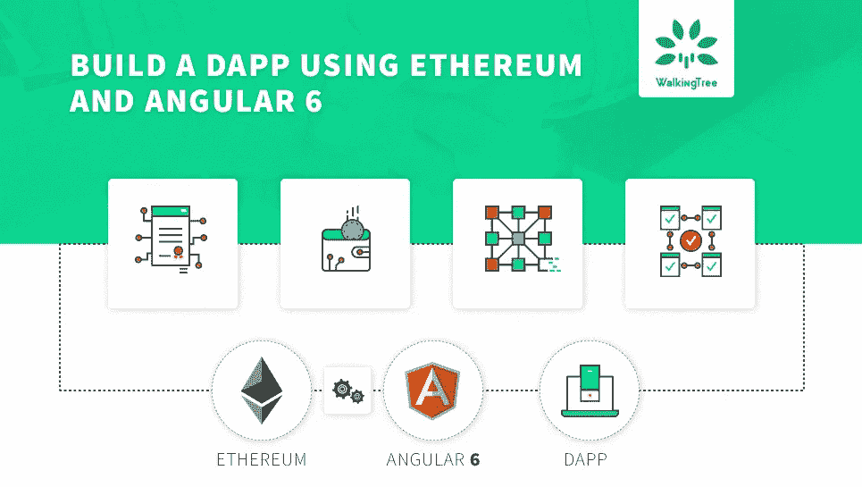
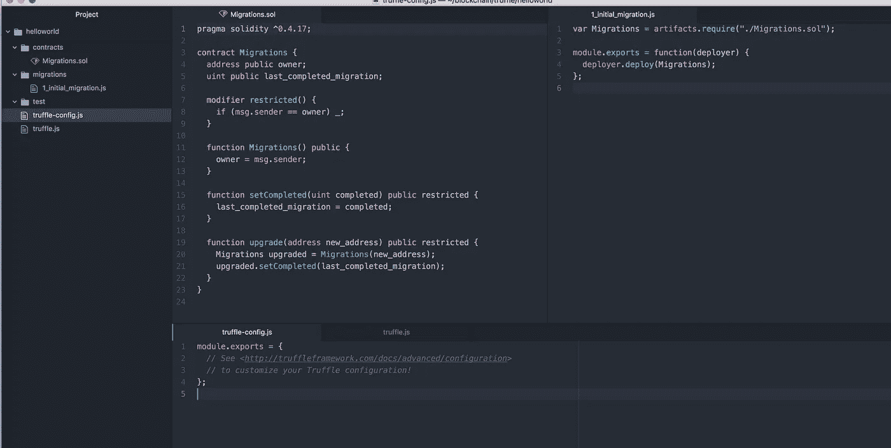
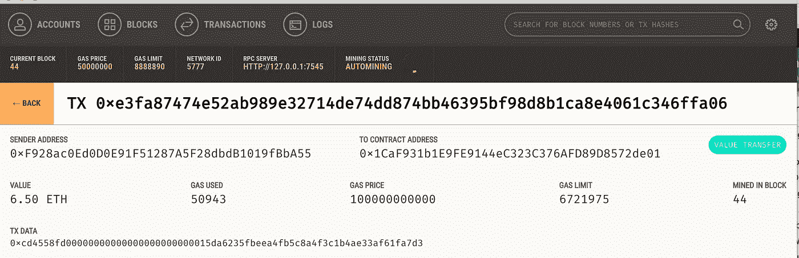
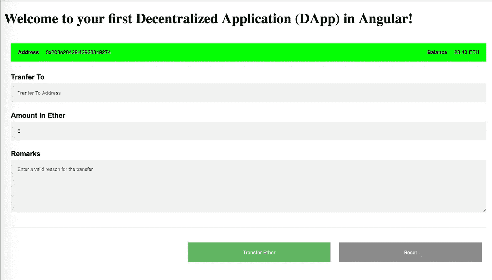
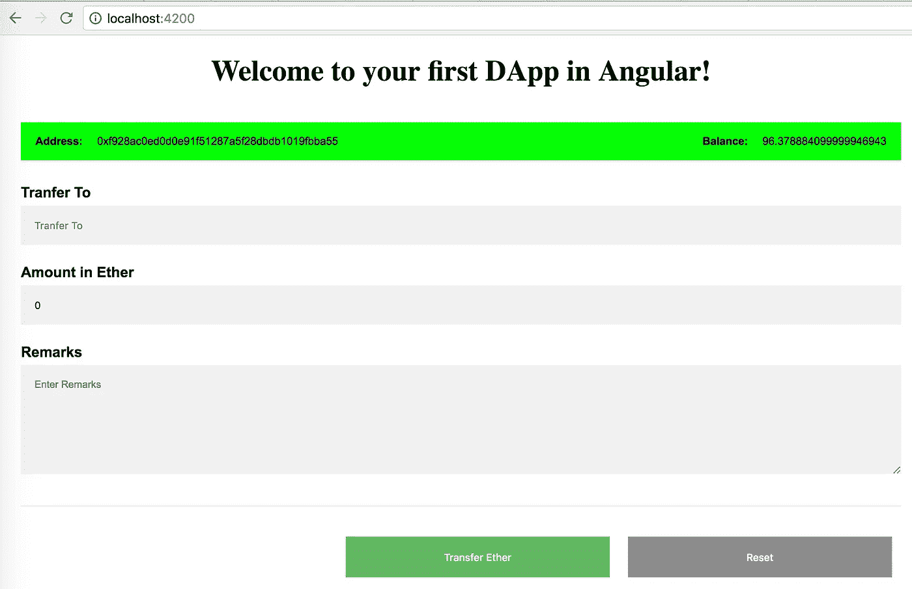
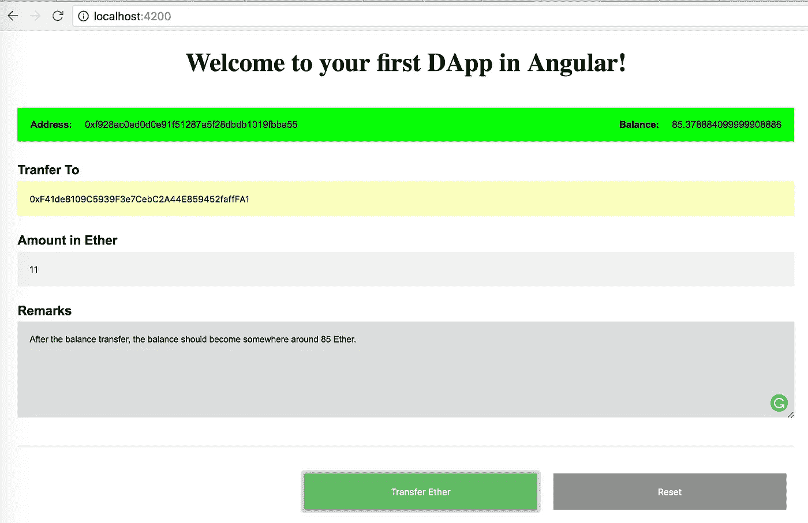
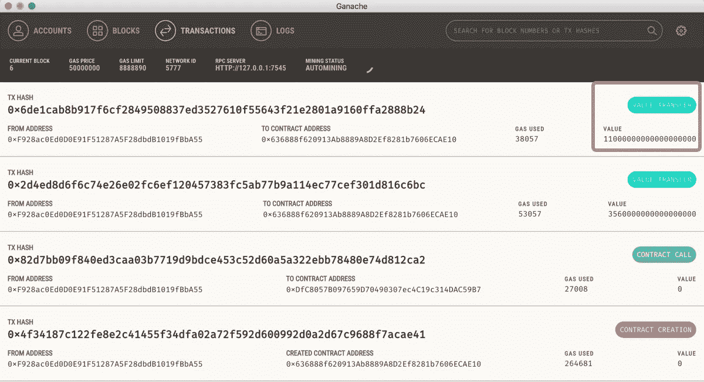
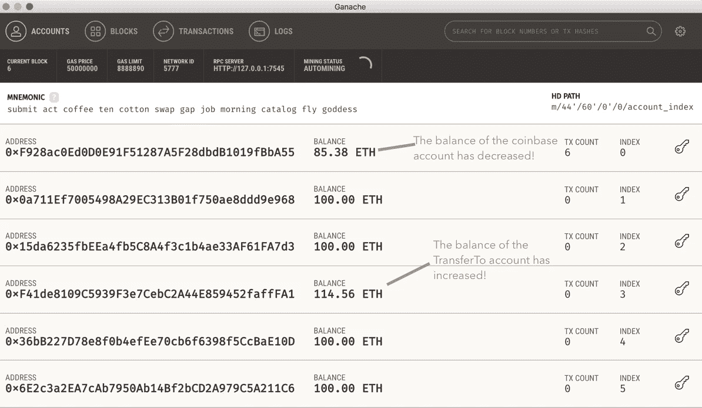

# 使用以太坊和角 6 建立一个 DApp

> 原文：<https://medium.com/coinmonks/build-a-dapp-using-ethereum-and-angular-6-a404fbf3c08d?source=collection_archive---------1----------------------->



DApp 是一个 web 应用程序，它将与部署在区块链的智能合同进行交互。在这篇文章中，我将带你通过使用 Angular 和以太坊创建你的第一个 DApp 的步骤。对于 Ext JS 和 React.js 等其他 UI 框架，集成过程应该是类似的。本文是 DApps 系列文章的一部分，旨在帮助您编写最有效的分布式应用程序。

> [发现并回顾最佳以太坊开发工具](https://coincodecap.com/category/blockchain-node-and-api)

# 先决条件

确保您的计算机上已经安装并运行了以下软件:

*   npm
*   松露
*   掼奶油
*   结节
*   尼日利亚
*   坚实度

此外，本文假设您对 Angular 应用程序开发有所了解。此外，虽然本文假设您可能对可靠性没有太多的了解，但是，可靠性智能合同非常小，应该不会让您不知所措。

# 创建智能合同

在本文中，我们将使用以太坊开发工具 Truffle 来创建和管理智能合约。我们将创建一个非常简单的支付合同，它将执行以下操作:

*   它将允许用户将资金从他/她的账户转移到网络上的账户
*   它将允许用户查询他/她的余额

创建一个空的项目目录，并使用 **truffle init** 命令创建一个没有智能合同的裸 truffle 项目。

> **$松露初始化**
> 
> 正在下载…
> 
> 打开包装…
> 
> 正在设置…
> 
> 拆箱成功。太棒了。
> 
> **命令:**
> 
> 编译:块菌编译
> 
> 迁移:块菌迁移
> 
> 测试合同:块菌测试

**以上步骤产生了一个具有以下文件结构和最少内容的项目:**



您可能需要注意以下几点:

*   迁移是帮助您将合同部署到以太网的 Javascript 文件。这些文件负责准备您的部署任务，它们是在假设您的部署需求会随着时间的推移而改变的情况下编写的。随着项目的发展，您将创建新的迁移脚本来进一步推动区块链的发展。
*   1_initial_migration.js 是有序的迁移文件，在迁移过程中，所有这些迁移都按给定的顺序执行
*   truffle.js 允许您配置项目细节，特别是项目将被部署的网络。
*   truffle-config.js 有时在 windows 机器上使用
*   更喜欢使用 power shell，因此从项目中删除 truffle-config.js
*   在测试目录中，您将会创建测试自动化套件

# 添加付款合同

通过在项目的合同文件夹中添加 Payment.sol 文件来添加付款合同。

```
pragma solidity ^0.4.17;contract Payment {address transferFrom;address transferTo;uint paymentAmount;constructor() public {transferFrom = msg.sender;}event TransferFund(address _transferTo, address _transferFrom, uint amount);function transferFund(address _transferTo) public payable returns (bool){transferTo = _transferTo;transferTo.transfer(msg.value);emit TransferFund(transferTo, transferFrom, msg.value);return true;}function getBalanceOfCurrentAccount() public payable returns (uint) {return transferFrom.balance;}}
```

**注**

*   transferFund 函数必须标记为 payable，以确保传递给该函数的任何以太网都被接受
*   TransferFund 事件允许记录事件，感兴趣的 javascript 客户端可以监视该事件并采取所需的操作

# 配置部署网络

假设您的机器上已经安装并运行了 Ganache，使用以下详细信息配置您的 truffle.js:

```
module.exports = {networks : {ganache : {host : ‘localhost’,port : 7545, // By default Ganache runs on this port.network_id : “*” // network_id for ganache is 5777\. However, by keeping * as value you can run this node on any network}}};
```

**运行合同部署命令，如下图:**

> **$ truffle 迁移—编译—全部—重置—网络 ganache**
> 
> 正在编译。/合同/迁移. sol…
> 
> 正在编译。/contracts/Payment.sol…
> 
> 将工件写入。/构建/合同
> 
> 使用网络“ganache”。
> 
> 运行迁移:1_initial_migration.js
> 
> 替换迁移…
> 
> …0 x8f 8 e 457 f 2584 b 9 d6a 90d 17 a 02 f 4547 a 56127 e 20d 4 f 10 cc 32 f 951 a 86 DC 5 db 4 e5b
> 
> 迁移:0xf 8988 a2 E0 D1 c 41 ddef 6437441 f 4169342105 df 5
> 
> 正在将成功的迁移保存到网络…
> 
> …0x bccbd 28 c 27 EB 973 be 48 c 47656 f 50 f 7a 0 cc 696 f 8 ce 93 e 47 efab 28 af 09 b 216 c 970
> 
> 正在保存工件…
> 
> 运行迁移:2_deploy_contracts.js
> 
> 正在替换付款…
> 
> …0x 99 F9 eabc 15 a 3688 c 78689 e 084d 521 e 5 DBE 7 DC 4531 b 2084464d 332 FEC 4 F2 c 7 b 14
> 
> 付款方式:0x 028 b 63d 210d 8228 e 33 c 21 BCE 8d 87007 Fe 7848 E8 d
> 
> 正在将成功的迁移保存到网络…
> 
> …0xb 217 f 30 cf 4 FB 40 b 837 f 5340 c 565 AAC fc 80 DBC C9 e 75 e 9 ed 42 FD 5 be 3b 51 FFE 10 c 2
> 
> 正在保存工件…

# 在松露控制台中验证您的合同

打开 truffle 控制台，在两个账户之间进行转账。此外，在转账前后检查这些账户的余额。

**Aloks-MacBook-Pro-2:支付 alokranjan$ truffle 控制台—网络 ganache**

```
truffle(ganache)> Payment.deployed().then(function(instance){app = instance;})
```

不明确的

```
truffle(ganache)> web3.fromWei(web3.eth.getBalance(web3.eth.accounts[0]), “ether”).toNumber()
```

89.92725709999996

```
truffle(ganache)> web3.fromWei(web3.eth.getBalance(web3.eth.accounts[2]), “ether”).toNumber()
```

99.97754

```
truffle(ganache)> app.transferFund(web3.eth.accounts[2], {from:web3.eth.accounts[0], value:web3.toWei(“6.5”, “ether”)})
```

{ tx:' 0 xe 3 fa 87474 e 52 ab 989 e 32714 de 74 DD 874 bb 46395 BF 98d 8 B1 ca 8 e 4061 c 346 FFA 06 '，

收据:

{ transaction hash:' 0 xe 3 fa 87474 e 52 ab 989 e 32714 de 74 DD 874 bb 46395 BF 98d 8 B1 ca 8 e 4061 c 346 FFA 06 '，

事务索引:0，

block hash:' 0x8d 85859241 e 2d d69 a 7d 10 ec7 d 38248 e 7 CB 32 f 7669 BD 3 fa 47029183 c 51 b9d 3422 '，

区块编号:44，

汽油用量:50943，

累计评估值:50943，

合同地址:空，

日志:[]，

状态:“0x01”，

logsBloom:‘0x 00000000000000000000000000000000000000000000000000000000000000000000000000000000000000000000000000000000000000000000000:0000000000000000000000000000000000000000000000000000

日志:[] }

```
truffle(ganache)> web3.fromWei(web3.eth.getBalance(web3.eth.accounts[0]), “ether”).toNumber()
```

83.42216279999995

```
truffle(ganache)> web3.fromWei(web3.eth.getBalance(web3.eth.accounts[2]), “ether”).toNumber()
```

106.47754

**当您检查 Ganache 时，您将看到与上述转账相对应的以下交易:**



# 创建角度应用程序

按照以下网址的指示，创建初始默认应用:**[**https://angular.io/tutorial/toh-pt0**](https://angular.io/tutorial/toh-pt0)**

**使用 **ng new** 命令创建一个资金转账应用程序，并使用 ng serve 启动该应用程序:**

****跟着我们上:** [**https://www.facebook.com/walkingtreetech/**](https://www.facebook.com/walkingtreetech/)[**https://www.linkedin.com/company/walking-tree-Technologies**](https://www.linkedin.com/company/walking-tree-Technologies)[**https://twitter.com/walkingtreetech**](https://twitter.com/walkingtreetech)[**https://www.youtube.com/channel/UCH5y9upqT2M7uWwgRWjCWBg**](https://www.youtube.com/channel/UCH5y9upqT2M7uWwgRWjCWBg)**

```
ng new transfercd transfer/ng serve — open
```

**从库[**https://github.com/abhilashahyd/ethdapp/tree/master**](https://github.com/abhilashahyd/ethdapp/tree/master)的单独文件夹中检查代码，并查看以下文件中的代码:**

*   **[app.component.css](https://github.com/abhilashahyd/angularDapp/blob/master/src/app/app.component.css)**
*   **[app.component.html](https://github.com/abhilashahyd/angularDapp/blob/master/src/app/app.component.html)**
*   **[应用组件](https://github.com/abhilashahyd/angularDapp/blob/master/src/app/app.component.ts)**
*   **[应用模块](https://github.com/abhilashahyd/angularDapp/blob/master/src/app/app.module.ts)**

****复制内容，使你的** DApp **类似下面的屏幕:****

****

# **与以太坊网络连接**

# **web3.js**

**web3.js 是一个库的集合，它允许你使用 HTTP 或 IPC 连接与本地或远程以太坊节点交互。**

# **安装 web3.js**

```
$ cd transfer/$ npm install web3@0.20.5
```

**最新版本的 web3 可能与 Angular 6 不兼容。因此，如果你面临任何挑战，试着安装一个稳定版本的 web3。**

# **块菌合同**

**块菌契约提供了契约抽象。契约抽象是使与契约的交互变得容易的包装器代码。**

****使用以下命令安装 truffle-contract 并生成服务:****

```
$ npm install truffle-contract$ ng generate service ethcontractCREATE src/app/ethcontract.service.spec.ts (404 bytes)CREATE src/app/ethcontract.service.ts (140 bytes)
```

**将所有负责与网络或契约交互的代码推送到 ethcontract 服务中。对于这个演示应用程序，我们需要以下内容**

*   **主要用于初始化 web3Provider 的构造函数**
*   **getAccountInfo —检索帐户地址(负责支付汽油和转移乙醚)和该帐户的余额**
*   **transferEther —用于进行实际的 transferFund 合同调用**

****服务文件的内容如下所示:****

```
import { Injectable } from ‘@angular/core’;import * as Web3 from ‘web3’;import * as TruffleContract from ‘truffle-contract’;declare let require: any;declare let window: any;let tokenAbi = require(‘../../../build/contracts/Payment.json’);@Injectable({providedIn: ‘root’})export class EthcontractService {private web3Provider: null,private contracts: {},constructor() {if (typeof window.web3 !== ‘undefined’) {this.web3Provider = window.web3.currentProvider;} else {this.web3Provider = new Web3.providers.HttpProvider(‘http://localhost:7545');}window.web3 = new Web3(this.web3Provider);}getAccountInfo() {return new Promise((resolve, reject) => {window.web3.eth.getCoinbase(function(err, account) {if(err === null) {web3.eth.getBalance(account, function(err, balance) {if(err === null) {return resolve({fromAccount: account, balance:web3.fromWei(balance, “ether”)});} else {return reject(“error!”);}});}});});}transferEther(_transferFrom,_transferTo,_amount,_remarks) {let that = this;return new Promise((resolve, reject) => {let paymentContract = TruffleContract(tokenAbi);paymentContract.setProvider(that.web3Provider);paymentContract.deployed().then(function(instance) {return instance.transferFund(_transferTo,{from:_transferFrom,value:web3.toWei(_amount, “ether”)});}).then(function(status) {if(status) {return resolve({status:true});}}).catch(function(error){console.log(error);return reject(“Error in transferEther service call”);});});}}
```

**在 **app.component.ts** 中导入 EthcontractService。实现 initAndDisplayAccount 方法和 transferEther 事件处理程序。**

****代码应该如下所示:****

```
import { Component } from ‘@angular/core’;import { EthcontractService } from ‘./ethcontract.service’;@Component({selector: ‘app-root’,templateUrl: ‘./app.component.html’,styleUrls: [‘./app.component.css’]})export class AppComponent implements ngOnInit {title = ‘your first DApp in Angular’;accounts:any;transferFrom = ‘0x0’;balance =’0 ETH’;transferTo=’’;amount=0;remarks=’’;constructor( private ethcontractService: EthcontractService ){this.initAndDisplayAccount();}initAndDisplayAccount = () => {let that = this;this.ethcontractService.getAccountInfo().then(function(acctInfo){that.transferFrom = acctInfo.fromAccount;that.balance = acctInfo.balance;}).catch(function(error){console.log(error);});};transferEther(event){let that = this;this.ethcontractService.transferEther(this.transferFrom,this.transferTo,this.amount,this.remarks).then(function(){that.initAndDisplayAccount();}).catch(function(error){console.log(error);that.initAndDisplayAccount();});}}
```

****在 app.module.ts 中添加 EthcontractService 作为提供者。代码应该如下所示:****

```
import { BrowserModule } from ‘@angular/platform-browser’;import { NgModule } from ‘@angular/core’;import { FormsModule } from ‘@angular/forms’;import { AppComponent } from ‘./app.component’;import { EthcontractService } from ‘./ethcontract.service’;@NgModule({declarations: [AppComponent],imports: [BrowserModule,FormsModule],providers: [EthcontractService],bootstrap: [AppComponent]})export class AppModule { }
```

****理想情况下，这应该足够了，当您启动应用程序时，您应该会看到类似这样的内容:****

****

**注意，这个地址是 Ganache 中第一个帐户的地址，它被用作 coinbase。当应用程序初始化时，From 帐户的余额也被检索。在您转移一些乙醚后，coinbase 帐户的余额会减少相应的金额，如下图所示:**

****

****可以通过检查 ganache 接口中的交易列表来验证交易:****

****

****以下屏幕显示两个账户余额的变化:****

****

**恭喜你！您刚刚开发并验证了一个使用以太坊和 Angular 构建的分布式应用程序。我希望这能鼓励你建立自己的应用程序。**

****嗨，我们将于 2018 年 12 月 5 日晚上 9:00(IST)举办一场关于微服务运营管理的免费网络研讨会****

****网上研讨会注册:**[**https://walkingtree.tech/webinar-registration/**](https://walkingtree.tech/webinar-registration/)**

**在本文中，我使用了个人以太坊区块链 Ganache 来测试这个应用程序。默认情况下，在 Ganache 中，一旦创建了事务，就会创建和挖掘区块链中的块，因此，您可以从挖掘事务的复杂性中抽象出来。这篇文章并不谈论最终将你的 DApps 带到公共网络所涉及的各个方面。在接下来的几篇文章中，我将引导您朝着这个方向前进。**

**来源:[https://walkingtree.tech/dapps-using-ethereum-angular/](https://walkingtree.tech/dapps-using-ethereum-angular/)**

> **加入 Coinmonks [电报频道](https://t.me/coincodecap)和 [Youtube 频道](https://www.youtube.com/c/coinmonks/videos)获取每日[加密新闻](http://coincodecap.com/)**

## **另外，阅读**

*   **[复制交易](/coinmonks/top-10-crypto-copy-trading-platforms-for-beginners-d0c37c7d698c) | [加密税务软件](/coinmonks/crypto-tax-software-ed4b4810e338)**
*   **[网格交易](https://coincodecap.com/grid-trading) | [加密硬件钱包](/coinmonks/the-best-cryptocurrency-hardware-wallets-of-2020-e28b1c124069)**
*   **[密码电报信号](http://Top 4 Telegram Channels for Crypto Traders) | [密码交易机器人](/coinmonks/crypto-trading-bot-c2ffce8acb2a)**
*   **[最佳加密交易所](/coinmonks/crypto-exchange-dd2f9d6f3769) | [印度最佳加密交易所](/coinmonks/bitcoin-exchange-in-india-7f1fe79715c9)**
*   **开发人员的最佳加密 API**
*   **最佳[密码借贷平台](/coinmonks/top-5-crypto-lending-platforms-in-2020-that-you-need-to-know-a1b675cec3fa)**
*   **杠杆代币的终极指南**