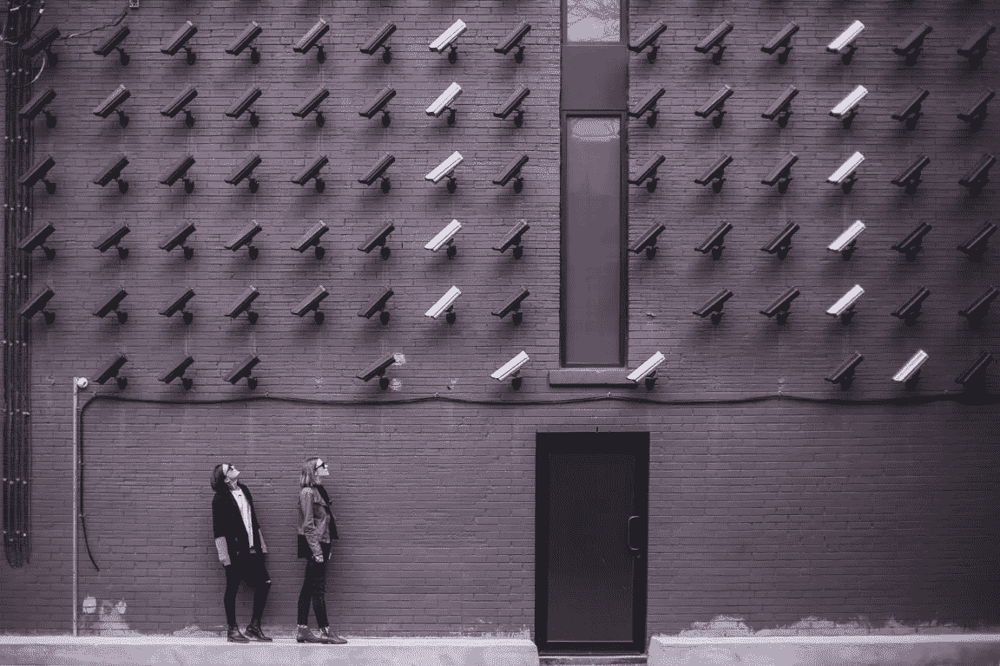

# 用神经计算棒构建 DIY 安全摄像机(第 2 部分)

> 原文：<https://medium.com/coinmonks/build-a-diy-security-camera-with-neural-compute-stick-part-2-d289c0a2f970?source=collection_archive---------3----------------------->

前一篇文章向您展示了如何构建一个由 Raspberry Pi 和 Movidius neural compute stick 支持的安全摄像头，该摄像头可以实时检测人员并只保存有用的图像帧。这一次，我将向您展示如何理解足够的源代码来添加一个 Arduino 伺服转台，使相机自动跟随它检测到的人。