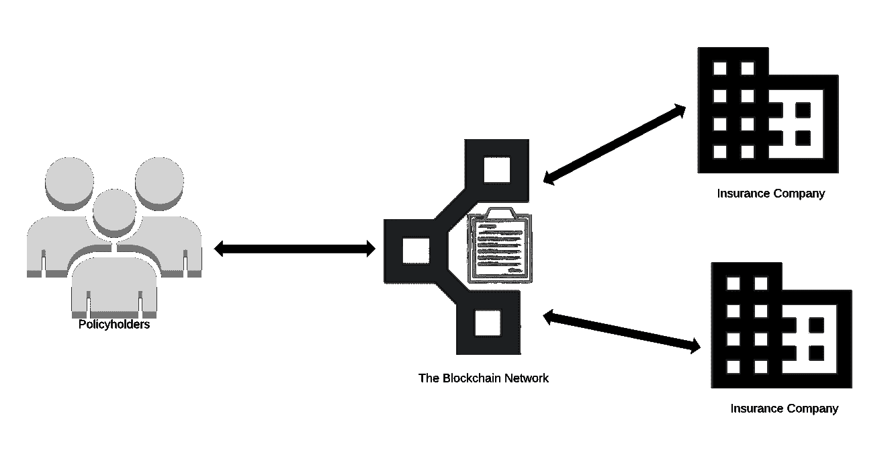
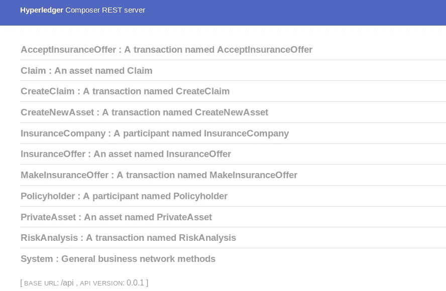
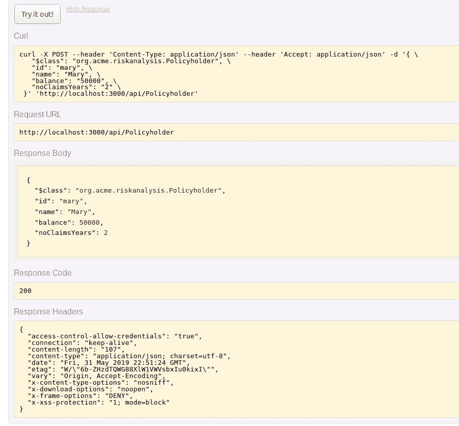
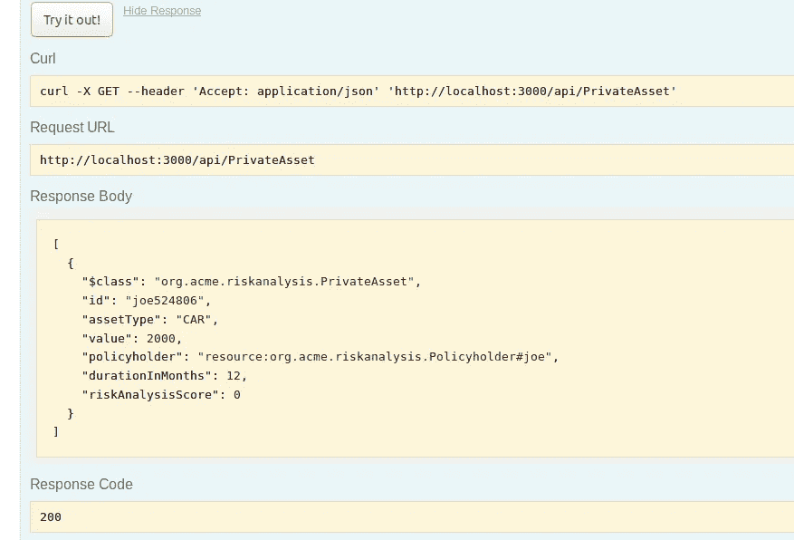
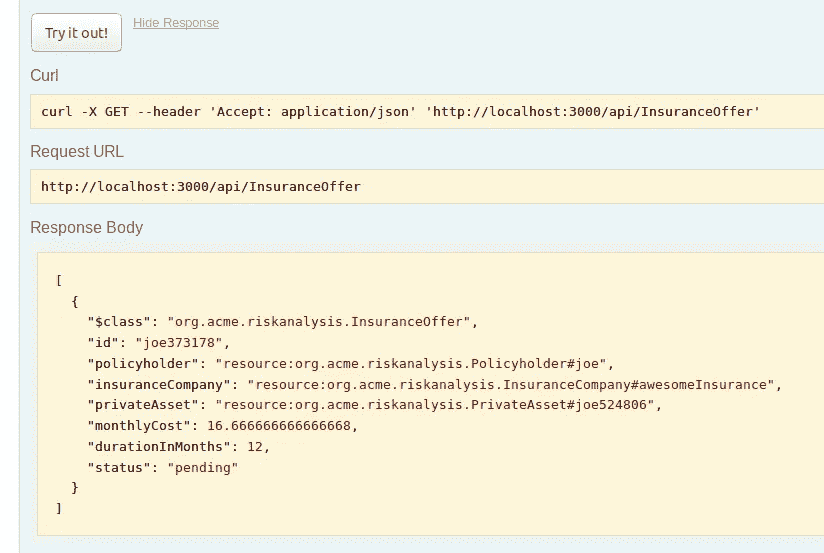
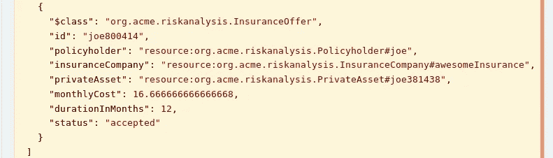
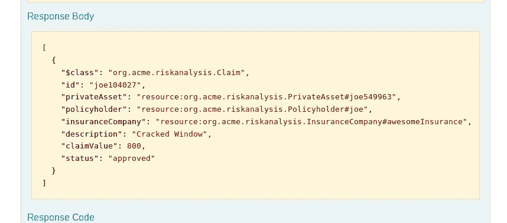

# 使用 Hyperledger Composer 和 React.js 构建保险应用程序第 1 部分

> 原文：<https://medium.com/coinmonks/build-a-insurance-application-with-hyperledger-composer-and-react-js-part-1-3ebe7ad54986?source=collection_archive---------1----------------------->

本教程讲述了如何使用 Hyperledger Composer 和 React.js 作为前端 web 应用程序构建一个简单的 Hyperledger 结构网络。

该应用程序将是一个保险应用程序，利用区块链以更有效和安全的方式执行风险分析。

*   第 1 部分着眼于实现区块链网络
*   第 2 部分着眼于将它连接到 React.js 前端 web 应用程序可以在这里找到

# Hyperledger 编写器

Hyperledger composer 是一个在 Hyperledger 结构上构建区块链商业网络的工具。它抽象了构建区块链网络所涉及的许多复杂性。

要安装 Hyperledger Composer，请按照此处的[说明](https://hyperledger.github.io/composer/latest/installing/installing-prereqs)进行操作。

# 概观

该系统是一个保险应用程序，利用区块链进行更有效和安全的风险分析。这是通过投保人在保险公司之间携带他们的数据来实现的，这意味着投保人将他们的数据带给保险公司。

系统中有两个参与者:

*   投保人
*   保险公司

系统的保单持有人希望执行以下操作:

*   添加资产
*   接受/拒绝保险报价
*   提出索赔

保险公司希望能够执行以下操作:

*   查看可投保的资产
*   提供保险
*   批准/拒绝索赔

投保人是正在寻找保险或已经为房产或汽车等资产投保的人。

保险公司是向投保人提供这种保险的公司。与投保人寻找保险公司的传统保险不同，投保人向区块链网络广告宣传他们的保险需求，保险公司提供服务。

风险分析将作为链码实施，当投保人寻找保险时，链码将自动运行。所有与过去索赔和资产相关的数据均由投保人拥有和携带，并不留给保险公司。这些数据将用于对投保人及其资产要求进行简单评估，以提供风险分析分数，供保险公司用于为其保险报价提供信息。

因为这个系统会有我们不想让每个人都看到的敏感数据，我们将需要实现控制访问这些个人数据的权限。



High-Level System Overview

# 履行

如果您还没有安装 Hyperledger Composer 及其要求，请按照这里的[说明进行操作。](https://hyperledger.github.io/composer/latest/installing/installing-prereqs)

你可以在 GitHub 上找到所有的代码。

让我们从**创建一个文件夹**来存储我们的应用程序开始:

```
mkdir insurance-application && cd insurance-application
```

现在让我们**使用 yeoman 为我们的业务网络**创建一个框架

```
yo hyperledger-composer:businessnetwork
```

**商业网络名称:risk-analysis-tutorial
描述:风险分析教程
作者姓名:您的姓名
作者邮箱:您的邮箱
许可:Apache-2.0
命名空间:org.acme.riskanalysis
是否要生成空模板网络？是**

```
cd risk-analysis-tutorial
```

运行命令 ls 应该会显示以下文件夹和文件:
-models
-package . JSON
-permissions . ACL
-readme . MD

因此，首先我们要**定义我们网络中的参与者**，我们知道他们是投保人和保险人。为此，我们打开文件 org.acme.riskanalysis.cto，该文件可以在 models 文件夹中找到。

投保人还希望能够添加房屋或汽车等资产，因此让我们**定义一个名为 PrivateAsset 的资产和一个名为 AssetType** 的 enum。PrivateAsset 依赖于创建资产的投保人。只有 3 种类型的资产可以添加到由 enum AssetType 定义的系统中。

我们将添加另外两种资产类型，一种用于提供保险，另一种用于提出索赔。

接下来，我们需要**为网络**定义我们的事务。

这是您的**完整模型文件**的外观:

接下来，我们需要**实现我们的事务**，这将作为链码来完成。

首先，您需要**在我们的 Hyperledger composer 项目的主目录中创建一个名为 lib** 的新目录，您将在其中看到 package.json 等文件，或者如果您在终端的 models 目录中，运行以下命令:

```
mkdir ../lib/ && cd ../lib/
```

在 lib 目录中，现在我们将**创建一个名为 logic.js** 的新文件，这将是我们的链码文件。

让我们先**实现 CreateNewAsset** 。您会注意到，我们使用 decorators 为函数提供元数据。

现在我们已经完成了，让我们测试一下，看看它是否有效。

首先，我们必须**启动 Hyperledger 结构**。找到您下载的目录，如下运行脚本:

```
cd ~/fabric-dev-servers
./startFabric.sh
./createPeerAdminCard.sh
```

注意你只需要跑。/createPeerAdminCard.sh 如果您以前没有运行过 Hyperledger Fabric 或以前运行过。/teardownFabric.sh

如果您在使用这些命令时遇到问题，请尝试以**身份运行，错误的节点版本可能会导致问题**，这些问题在抛出的错误消息中并不明显。

```
nvm use 8
```

现在回到风险分析教程目录，我们将开始**部署我们网络的 0.0.1 版本。**

运行该命令将**生成一个名为 risk-analysis-tutorial @ 0 . 0 . 1 . bna 的业务网络**归档文件

```
composer archive create -t dir -n .
```

接下来，我们将**在我们已经建立的 Hyperledger Fabric 对等体上安装我们的 Composer business network**

```
composer network install --card PeerAdmin@hlfv1 --archiveFile risk-analysis-tutorial@0.0.1.bna
```

现在我们可以**启动我们的业务网络**，这可能需要几分钟时间

```
composer network start --networkName risk-analysis-tutorial --networkVersion 0.0.1 --networkAdmin admin --networkAdminEnrollSecret adminpw --card PeerAdmin@hlfv1 --file networkadmin.card
```

然后只需**导入网络管理员身份**作为可用的业务网卡

```
composer card import --file networkadmin.card
```

要测试这一切是否成功，只需 **ping 网络**

```
composer network ping --card admin@risk-analysis-tutorial
```

为了**检查您部署的网络运行的当前版本**

```
composer network ping -c admin@risk-analysis-tutorial | grep Business
```

Hyperledger Composer 可以基于业务网络生成定制的 REST API。对于我们的网络，我们现在只想保持简单，所以只需运行下面的命令来**创建我们的 REST API**

```
composer-rest-server -c admin@risk-analysis-tutorial -n never -u true -w true
```

现在您可以通过导航到来**测试 REST API**

```
[http://localhost:3000/explorer](http://localhost:3000/explorer)
```

您应该会看到以下屏幕



Hyperledger Composer REST Server

如果我们想测试我们的 CreateNewAsset 功能，我们需要先**创建一些保单持有人**，因此选择保单持有人，然后选择 post 并输入以下内容，然后单击试用

```
{
  "$class": "org.acme.riskanalysis.Policyholder",
  "id": "joe",
  "name": "Joe",
  "balance": "50000",
  "noClaimsYears": "2"
}
```


composer network ping -c admin@risk-analysis-tutorial | grep Business

现在**以同样的方式，使用以下信息创建另一个投保人**

```
{
  "$class": "org.acme.riskanalysis.Policyholder",
  "id": "mary",
  "name": "Mary",
  "balance": "50000",
  "noClaimsYears": "5"
}
```

对这两个错误响应应该都是 200(如果不是的话)。请检查错误消息，并检查您的代码是否有任何潜在的错误。



现在我们准备好测试 CreateNewAsset 函数。为此，请创建一个新的 Asset >帖子。让我们为 Joe 创建一辆价值为 2000 的汽车，并寻求 12 个月的保险。

```
{
  "$class": "org.acme.riskanalysis.CreateNewAsset",
  "policyholder": "resource:org.acme.riskanalysis.Policyholder#joe",
  "assetType": "CAR",
  "value": 2000,
  "durationInMonths": 12
}
```

如果一切正常，响应代码应该是 200。如果没有，请检查一切是否正常，并注意它是否区分大小写。

现在，如果您转到“private assets”>“Get ”,然后单击“试用”,您应该会看到我们刚刚创建的资产。



现在，让我们通过在您的终端中点击 ctrl-c 来关闭 REST 服务器，我们将完成其余事务的编写。

风险分析交易的**逻辑只是检查资产类型、投保人没有索赔的年数以及资产的价值。**

为了测试这一点，请转到 package.json 文件，并将版本号从 0.0.1 更改为 0.0.2，然后创建一个新的业务网络归档文件

```
composer archive create --sourceType dir --sourceName . -a risk-analysis-tutorial@0.0.2.bna
```

**安装新文件**

```
composer network install --card PeerAdmin@hlfv1 --archiveFile risk-analysis-tutorial@0.0.2.bna
```

**升级网络**

```
composer network upgrade -c PeerAdmin@hlfv1 -n risk-analysis-tutorial -V 0.0.2
```

检查网络是否已升级到版本:0.0.2

```
composer network ping -c admin@risk-analysis-tutorial | grep Business
```

然后**再次运行您的 Composer REST 服务器**

```
composer-rest-server -c admin@risk-analysis-tutorial -n never -u true -w true
```

您之前创建的所有投保人和资产仍将存在，因此无需再次设置。让我们获取之前为 Joe 添加的汽车的 id。然后**进入风险分析> Post** 并进入下面的**用你的资产 ID** 替换 ASSETID。

```
{
  "$class": "org.acme.riskanalysis.RiskAnalysis",
  "privateAsset": "resource:org.acme.riskanalysis.PrivateAsset#ASSETID"
}
```

现在回到 PrivateAsset > Get，您应该看到风险分析分数已经从 0 变为 3。

接下来，让我们**实现 MakeInsuranceOffer**

现在让我们**添加接受保险的能力**

让我们**实现 CreateClaim**

注意这个函数是如何使用查询的。这个查询还没有定义，它只是简单地查找这个资产的保险报价。

因此，为了实现这个查询**,在 risk-analysis-tutorial 目录中创建一个名为 queries.qry** 的新文件，然后**向该文件添加以下行**。

我们只需要多一个功能，那就是**处理索赔的能力**。

现在让我们测试所有这些，但首先让我们**将 package.json 文件更新到版本 0.0.3** 。然后**运行下面的命令集**。

```
composer archive create --sourceType dir --sourceName . -a risk-analysis-tutorial@0.0.3.bna
composer network install --card PeerAdmin@hlfv1 --archiveFile risk-analysis-tutorial@0.0.3.bna
composer network upgrade -c PeerAdmin@hlfv1 -n risk-analysis-tutorial -V 0.0.3
```

现在让我们再次运行 **composer REST API 服务器**

```
composer-rest-server -c admin@risk-analysis-tutorial -n never -u true -w true
```

所以让我们从创建一家保险公司开始

```
{
  "$class": "org.acme.riskanalysis.InsuranceCompany",
  "id": "awesomeInsurance",
  "name": "The Awesome Insurance Company",
  "balance": "0.0",
  "insuranceContracts": "0"
}
```

现在你可以做你的第一份保险要约了。确保替换资产 ID。

```
{
  "$class": "org.acme.riskanalysis.MakeInsuranceOffer",
  "policyholder": "resource:org.acme.riskanalysis.Policyholder#joe",
  "insuranceCompany": "resource:org.acme.riskanalysis.InsuranceCompany#awesomeInsurance",
  "privateAsset": "resource:org.acme.riskanalysis.PrivateAsset#joe549963",
"monthlyCost": 100
}
```

现在转到 **InsuranceOffer > GET** ，您应该会看到您新创建的保险要约，状态为 pending。记下下一步的 ID。



现在，使用保险产品的 ID，让我们测试一下是否接受这个保险产品。转到**accept insurance offer>POST**并使用以下内容将要约 ID 替换为您的 ID。

```
{
  "$class": "org.acme.riskanalysis.AcceptInsuranceOffer",
  "offer": "resource:org.acme.riskanalysis.InsuranceOffer#OFFERID"
}
```

你现在应该注意到，如果你去**保险公司>获取**并点击试用！你应该注意到保险报价的状态现在是接受的，如果一切工作如下。



既然 Joe 的资产已经投保，我们就来测试一下如何索赔。**创建索赔>帖子**并输入以下内容，用您的 ID 替换私有资产 ID。

```
{
  "$class": "org.acme.riskanalysis.CreateClaim",
  "privateAsset": "resource:org.acme.riskanalysis.PrivateAsset#PRIVATEASSETID",
  "policyholder": "resource:org.acme.riskanalysis.Policyholder#joe",
  "description": "Cracked Window",
  "claimValue": 800
}
```

如果一切都解决了，你现在应该可以得到索赔。

最后，我们可以测试处理该索赔的能力。转到**处理索赔>发布**并记住更改索赔 ID。

```
{
  "$class": "org.acme.riskanalysis.ProcessClaim",
  "claim": "resource:org.acme.riskanalysis.Claim#CLAIMID",
  "status": "approved"
}
```

现在，当您前往**申请>获取**时，您应该会看到您的申请获得批准，如下所示。



在下一部分中，我们将着眼于将我们的 Hyperledger Fabric 网络与 React.js 前端 web 应用程序集成。

[**第二部分可以在这里找到。**](/@jackjulianhickey/build-an-insurance-application-with-hyperledger-composer-and-react-js-part-2-da27a9dfdee5)


> [在您的收件箱中直接获得最佳软件交易](https://coincodecap.com/?utm_source=coinmonks)

[](https://coincodecap.com/?utm_source=coinmonks)