# 构建一个简单且不可阻挡的分散式 Web 应用程序(DAPP)

> 原文：<https://medium.com/coinmonks/build-a-simple-and-unstoppable-decentralized-web-application-dapp-aa8d08e35f9c?source=collection_archive---------1----------------------->

在阅读本文之前，您首先需要能够[使用 Truffle](/coinmonks/test-a-smart-contract-with-truffle-3eb8e1929370) 来玩和测试智能合约。

分散式应用程序是一个不可阻挡的应用程序，因为它由成千上万的计算机保护着。这是一个抵制审查的应用程序。它将颠覆整个世界。在本文中，我将向您展示如何在 web 平台中构建一个简单的分散式应用程序。


Unstoppable application. Photo by Rohit Rao (Unsplash)

智能合约不同于分散式应用程序(dapp)。智能合约存在于区块链。dapp 是在区块链上与智能合约交互的应用程序(通常在 web 上)。在上一篇文章中，您在 Truffle 控制台中玩并测试了智能合约。dapp 和你在 Truffle 控制台上输入的命令在同一层。它们与智能合约进行交互。

> [发现并回顾最好的以太坊开发工具](https://coincodecap.com/category/blockchain-node-and-api)

如果智能合约是这样的。

```
pragma solidity ^0.4.19;contract Auction {
  uint public number; function constructor() public {
    number = 1;
  }
}
```

你可以像这样在 Truffle develop 控制台中与智能合约进行交互。

```
truffle(develop)> Auction.at(“0x345ca3e014aaf5dca488057592ee47305d9b3e10”).number();
```

web dapp 会是这样的。

```
<html><head><script src=”https://cdn.jsdelivr.net/gh/ethereum/web3.js/dist/web3.min.js"></script><script type=”text/javascript”>var Web3 = require(‘web3’);var web3 = new Web3(window.web3.currentProvider);const address = ‘0x345ca3e014aaf5dca488057592ee47305d9b3e10’;const abi = [//omitted for brevity];var contract = web3.eth.contract(abi);var auction = contract.at(address);auction.number.call(function(e, r) {console.log(r);});</script></head><body></body></html>
```

所以请记住，dapp 是一个你与生活在区块链的智能合约互动的地方。通常它是一个 web 应用程序。但它可以是移动应用程序，甚至可以是控制台应用程序。

# 元掩码

要使用 web 分散式应用程序，用户需要做额外的工作。这就像为了能够在网络上使用 Flash 应用程序，用户需要安装 Flash 插件。要使用 web 分散式应用程序，用户需要安装 Metamask。别担心，这个步骤比安装 Flash 插件简单多了。

进入 [Metamask](https://metamask.io) 网站。所以在这个例子中，我使用了 Firefox 浏览器。根据您使用的浏览器进行调整。如果您使用 Chrome 浏览器，请单击 Chrome 链接。如果您使用 Opera 浏览器，请单击 Opera 链接。

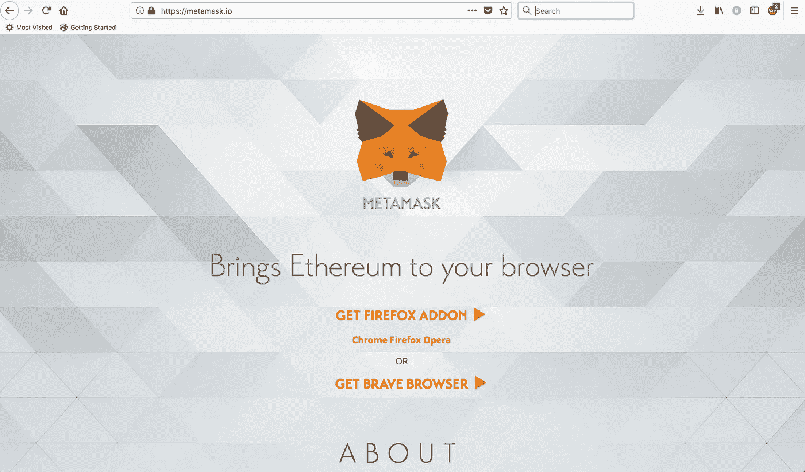

Metamask website

如果你使用不同的浏览器，你的将会不同。如果您使用 Firefox，请点按“添加到 Firefox”按钮。

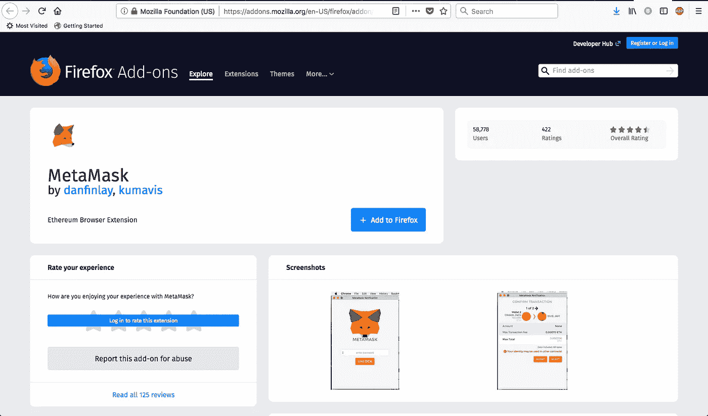

Firefox Metamask plugin webpage

您将收到确认信息。点击“添加”按钮进行确认。

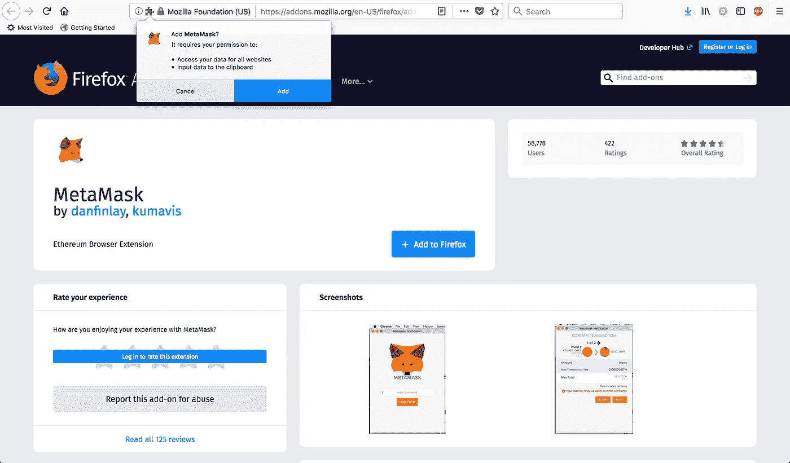

Confirmation before installing Metamask plugin

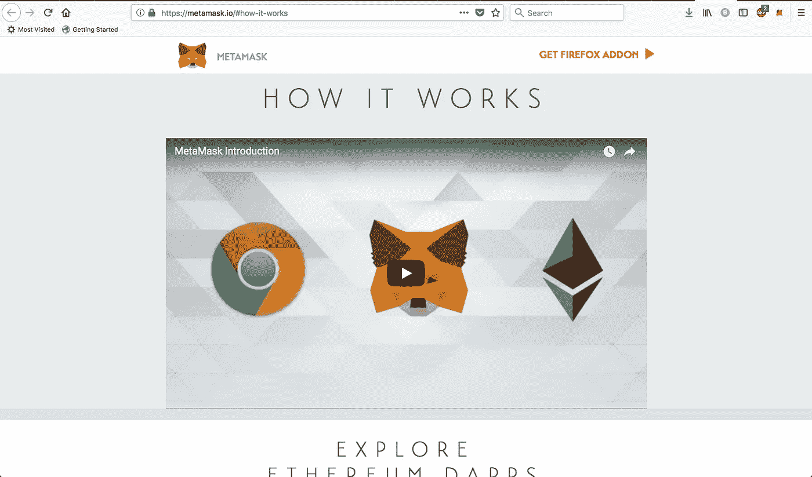

A successful webpage launched after installing Metamask plugin

要开始使用 Metamask 插件，请单击右上角的小狐狸图标。首先，你会收到隐私声明。基本上，它告诉你使用后退出元掩码插件。点击“接受”按钮。

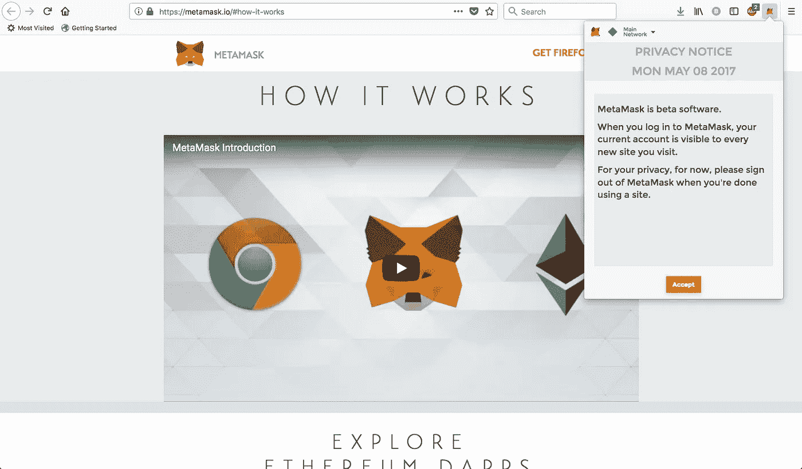

Privacy notice

然后你会看到 Metamask 登录界面。这些密码字段不是通用的。不要把它当成解锁你的 Dropbox 或 Gmail 账户的密码。这些密码字段仅适用于本地。您在这里输入的内容在其他机器甚至其他浏览器上都无法运行。如果您想从其他机器或其他浏览器重用元掩码帐户，请使用种子短语或私钥。种子短语或私钥有点类似于 Gmail 或 Dropbox 服务的用户名和密码。如果您在两个字段中都键入密码，然后单击“创建”按钮，元掩码会为您创建一个“帐户”。它会为你生成种子短语，所以你可以在其他地方使用这个帐户。

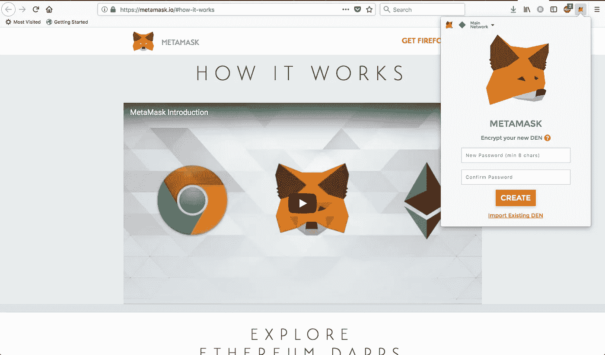

Metamask login screen

如果您创建一个新帐户而不是导入一个，您将得到一个名为“Account 1”的帐户，其余额为 0。现在，你在主网络中，那里有“真正的钱”。如果你在币安或比特币基地买以太坊，硬币会留在这里。但是我们希望在本地网络中与智能合约进行交互。所以点击“主网络”选择框。你有几个选择。单击自定义 RPC。

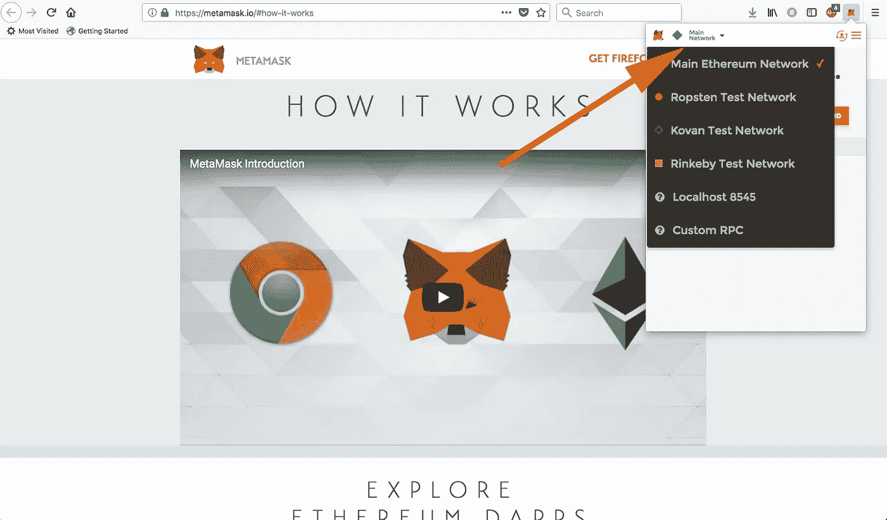

A few networks of Ethereum

但首先你需要启动当地的区块链网络。打开控制台。去[你的块菌项目目录](/coinmonks/test-a-smart-contract-with-truffle-3eb8e1929370)，你在我之前的文章中工作过，然后运行*块菌开发*。然后打开一个新的控制台。转到您的松露项目目录，然后运行*松露迁移*将您的智能合同启动到这个本地区块链网络。默认情况下，truffle develop 将在端口 9545 上启动本地区块链网络。所以在这里，选择“自定义 RPC”后，在“新 RPC URL”字段中键入 [http://localhost:9545](http://localhost:9545) 。然后点击“保存”按钮。最后，选择这个网络。

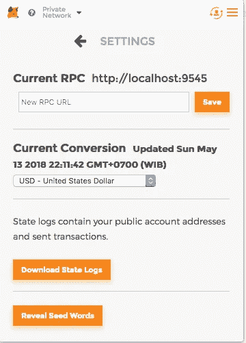

Private blockchain network setting

你的余额中还有 0 乙醚。现在，我们需要导入运行 *truffle develop* 的控制台中显示的私钥。

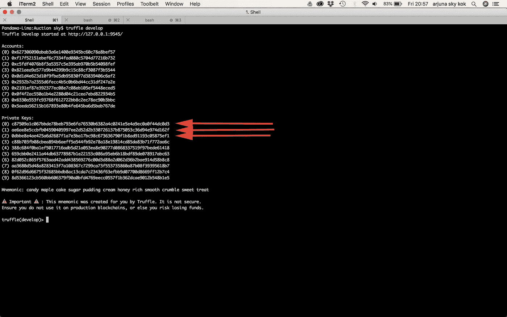

Private keys in private blockchain network

在我们的例子中，我们需要三个独立的帐户:经理、卖方和投标人。你可以有第二个投标人，所以你需要四个账户。

单击元掩码屏幕中的用户图标。然后点击“导入账户”。然后在点击“导入”之前粘贴私钥。

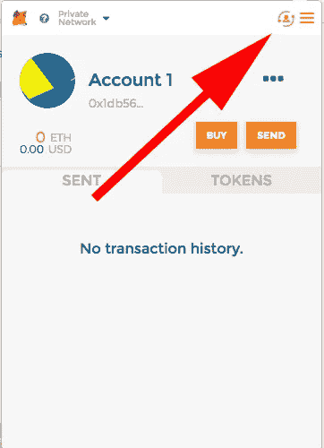

Click user icon

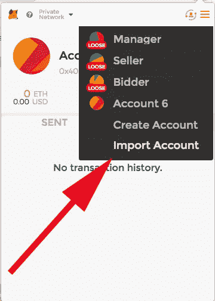

Import account

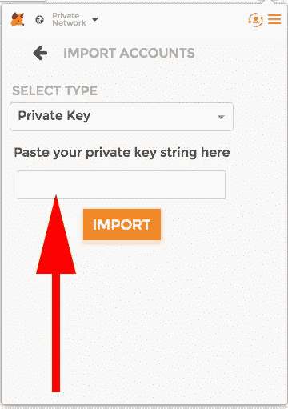

Paste private key

这样做三到四次(一次给经理，一次给卖方，一两次给投标人)。

您已经完成了元掩码设置。现在是时候设置 dapp 项目了。

# 反应

React 不是编写 dapp 的必要条件。可以用 Angular 或者 vanilla JS。我试过用香草 JS，很痛苦。所以我选择用 React 来写这个 dapp。这种体验变得更加易于管理。如果你没有 React 的经验，我会一路讲解。

基本上，React 是一个流行的 Javascript 框架，它使得 Javascript 应用程序中的状态管理变得更容易管理。安装 create-react-app cli 应用程序。

```
npm install -g create-react-app
```

如果您使用的是 MacOS 或 Linux，请将 *sudo 添加到*中。但是现在，如果你愿意，你可以避免安装并使用 *npx* 来运行 create-react-app cli 应用程序。

创建一个新的反应应用程序。您可以将这个项目放在您的块菌项目目录或其他地方。

```
create-react-app auction_dapp
```

或者如果你使用 npx

```
npx create-react-app auction_dapp
```

反应应用程序基本上是一个节点应用程序。有 node_modules 目录，一个 package.json 文件。如果您运行这个 React 应用程序，您会看到的索引文件位于公共目录中，名为*index.html*。

让我们运行应用程序，看看它是什么样子。在反应项目目录中运行该程序。

```
npm start
```

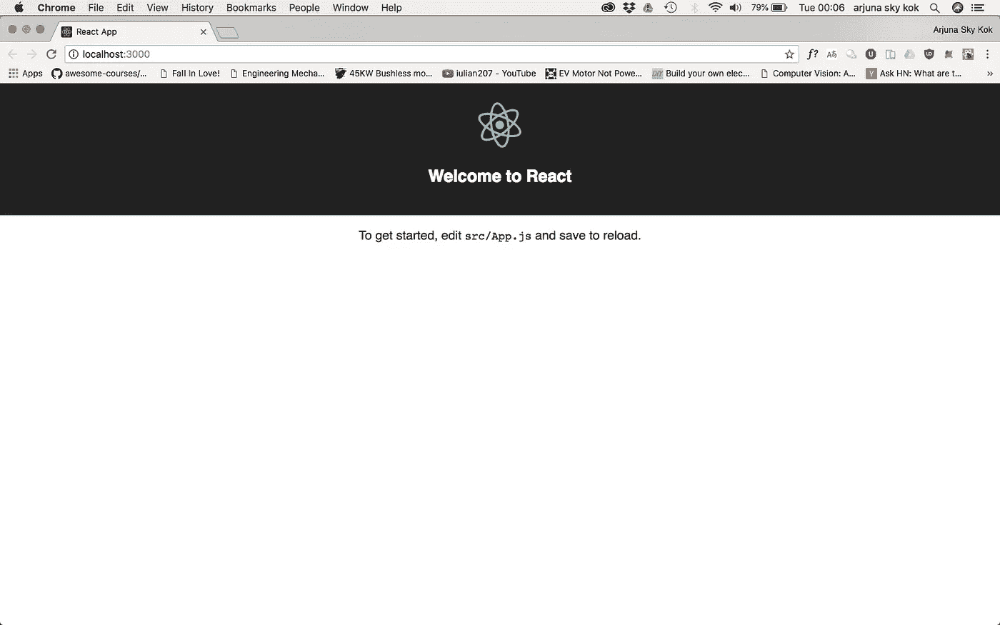

React default page

打开 *public/index.html* 。在身体标签内，您会看到:

```
<div id=”root”></div>
```

它是一个空元素。那么，这个酷的标志和文字(欢迎反应)是从哪里来的呢？打开 *src/index.js* 。您会看到:

```
import React from ‘react’;
import ReactDOM from ‘react-dom’;
import ‘./index.css’;
import App from ‘./App’;
import registerServiceWorker from ‘./registerServiceWorker’;ReactDOM.render(<App />, document.getElementById(‘root’));
registerServiceWorker();
```

您是否看到了*文档. getelementbyid(‘root’)*部分？它将 App 渲染为根标签内的 *< App / >* 所示。那么，这个应用程序组件来自哪里呢？打开 *src/App.js* 。

```
import React, { Component } from ‘react’;
import logo from ‘./logo.svg’;
import ‘./App.css’;class App extends Component {
  render() {
    return (
      <div className=”App”>
        <header className=”App-header”>
          
          <h1 className=”App-title”>Welcome to React</h1>
        </header>
        <p className=”App-intro”>
          To get started, edit <code>src/App.js</code> and save to reload.
        </p>
      </div>
    );
  }
}export default App;
```

看看渲染方法。它返回带有类“App”的 div 标签。这就是酷的标志和文字“欢迎反应”的来源。

因此，React 使用某些方法来管理 Javascript 中的状态并呈现 html。

# Web3.js

为了与智能合同交互，Javascript 应用程序需要 Web3.js 库。安装它。

```
npm install --save web3@1.0.0-beta.34
```

创建 *src/web3.js* 并填写此内容。

```
import Web3 from ‘web3’;const web3 = new Web3(window.web3.currentProvider);export default web3;
```

*窗口. web3.currentProvider* 指元掩码。它告诉 Javascript 应用程序使用元掩码中的 web3 提供程序。如果您创建一个控制台 dapp，您将使用不同的提供程序。

创建 *src/auction.js* 并填写此内容。

```
import web3 from ‘./web3’;const address = ‘0x345ca3e014aaf5dca488057592ee47305d9b3e10’;const abi = [{“constant”: true,“inputs”: [],“name”: “seller”,“outputs”: [{“name”: “”,“type”: “address”}],“payable”: false,“stateMutability”: “view”,“type”: “function”},{“constant”: true,“inputs”: [],“name”: “manager”,“outputs”: [{“name”: “”,“type”: “address”}],“payable”: false,“stateMutability”: “view”,“type”: “function”},{“constant”: true,“inputs”: [],“name”: “latestBid”,“outputs”: [{“name”: “”,“type”: “uint256”}],“payable”: false,“stateMutability”: “view”,“type”: “function”},{“constant”: true,“inputs”: [],“name”: “latestBidder”,“outputs”: [{“name”: “”,“type”: “address”}],“payable”: false,“stateMutability”: “view”,“type”: “function”},{“inputs”: [],“payable”: false,“stateMutability”: “nonpayable”,“type”: “constructor”},{“constant”: false,“inputs”: [{“name”: “bid”,“type”: “uint256”}],“name”: “auction”,“outputs”: [],“payable”: false,“stateMutability”: “nonpayable”,“type”: “function”},{“constant”: false,“inputs”: [],“name”: “bid”,“outputs”: [],“payable”: true,“stateMutability”: “payable”,“type”: “function”},{“constant”: false,“inputs”: [],“name”: “finishAuction”,“outputs”: [],“payable”: false,“stateMutability”: “nonpayable”,“type”: “function”}];export default new web3.eth.Contract(abi, address);
```

本声明中的地址:

```
const address = ‘0x345ca3e014aaf5dca488057592ee47305d9b3e10’;
```

来自*块菌迁徙*的输出。

```
$ truffle migrate
Using network ‘development’.Running migration: 1_initial_migration.js
 Replacing Migrations…
 … 0x3a8f8c4379f1d7269b9d931a088984f4ccfeec797bbb6e128582e2915c8f3ea1
 Migrations: 0x8cdaf0cd259887258bc13a92c0a6da92698644c0
Saving successful migration to network…
 … 0xd7bc86d31bee32fa3988f1c1eabce403a1b5d570340a3a9cdba53a472ee8c956
Saving artifacts…
Running migration: 2_deploy_contracts.js
 Replacing Auction…
 … 0xf0b10908aeb415b8b13fe60aeed8ade6769679572a44cf679b5616e38670329d
 Auction: 0x345ca3e014aaf5dca488057592ee47305d9b3e10
Saving artifacts…
```

检查第二行最后一行。

abi 值是一组对象，来自[块菌项目](/coinmonks/test-a-smart-contract-with-truffle-3eb8e1929370)中的*构建/合同/拍卖. json* 文件。我们关心的价值来自 abi 密钥。

```
{“contractName”: “Auction”,“abi”: [{“constant”: true,“inputs”: [],“name”: “seller”,“outputs”: [{“name”: “”,“type”: “address”}],“payable”: false,“stateMutability”: “view”,“type”: “function”},… //omitted for brevity
```

在此声明中:

```
export default new web3.eth.Contract(abi, address);
```

我们与我们的拍卖合同连接，拍卖合同位于 abi 变量中定义了接口的特定地址。

# Dapp

打开 *src/App.js* 。擦除所有内容。开始写这些句子。

```
import React, { Component } from ‘react’;import web3 from ‘./web3’;import auction from ‘./auction’;
```

除了我们之前创建的 web3 对象和拍卖对象之外，我们还从反应库中导入了反应和组件。

继续创建应用程序类。

```
class App extends Component { state = { manager: ‘’, latestBid: ‘’, latestBidder: ‘’, seller: ‘’, balance: ‘’, auctionValue: ‘’, bidValue: ‘’, closingRemark: ‘’ };
```

*状态*在反应中有特殊的位置。请记住我说的“反应”可以帮助您管理 Javascript 应用程序中的状态。我是认真的。“反应”之所以如此受欢迎，主要是因为它有助于您进行州管理。有了*状态*，您就不用再这样做了:

```
$(“#box”).html(“You win!!!!”);
```

或者

```
document.getElementById(“box”).innerHTML = “You win!!!!”;
```

通过“反应”，您只需如下设置:

```
<div id=”box”>{this.state.boxMessage}</div>
```

然后在其他地方设置状态:

```
this.setState({boxMessage: “You win!!!!”});
```

瞧啊。就是这样。id 为“box”的 div 将自动更新其内部 HTML。

我们从 react 库中导入的组件就是我们呈现到 html 中的内容。通常我们创建一个继承自组件的类，该组件具有*状态*属性。这个*状态*是一个对象(在其他语言的通用语中称为 hash/dictionary)。

我们继续吧。添加这些行。

```
async componentDidMount() { const manager = await auction.methods.manager().call(); const latestBid = await auction.methods.latestBid().call(); const latestBidder = await auction.methods.latestBidder().call(); const seller = await auction.methods.seller().call(); const balance = await web3.eth.getBalance(auction.options.address); this.setState({ manager, latestBid, latestBidder, seller, balance });}
```

在类内部，有一些方法。*组件卸载*方法是一种特殊的方法。此方法在呈现组件之前执行。但是方法名前面的 *async* 是什么？在这个方法中，你会多次看到*等待*关键字。

在这条线上

```
const manager = await auction.methods.manager().call();
```

我们在智能合约中称*经理为*物业。我们阻塞调用，直到我们得到结果。在我们的例子中，区块链网络位于本地，这没有任何区别。但是，当您与住在主网络或 Rinkeby 网络中的远程智能联系人进行交互时，该方法的执行需要时间。该方法可能需要几分钟才能完成。这就是 API 设计者将与智能合约交互的方法标记为异步方法的原因。如果该方法是异步的，则用回调函数调用它。所以在方法执行之后，它只是直接把控制权返回给你。您可以做其他事情，如果方法已经完成(智能契约返回结果)，它将执行您在执行方法的同时发送的回调。但是在我们的例子中，为了使事情更简单，我们强制异步与 *await* 关键字同步。 *await* 基本上告诉异步方法，“我不在乎你执行方法多长时间。我不在乎复试。我会在这里等到你把结果发给我”。在编写 dapp 时，这是一个糟糕的做法，因为它会使应用程序没有响应。但出于教育目的，这是可以的。

这一行:

```
const balance = await web3.eth.getBalance(auction.options.address);
```

意味着智能合约有多少钱。在以太坊中，不仅“人”可以有钱，智能合约也可以。

这一行:

```
this.setState({ manager, latestBid, latestBidder, seller, balance });
```

告诉组件更新它的状态。订阅该状态的任何部分都会更新其内部内容。

让我们继续。添加这些行。

```
onAuctionSubmit = async (event) => { event.preventDefault(); const accounts = await web3.eth.getAccounts(); await auction.methods.auction(this.state.auctionValue).send({ from: accounts[0] }); this.setState({ seller: accounts[0] });}
```

这是声明方法的不同方式。以这种方式声明方法的优点和缺点超出了本文的范围。此方法将附加到按钮上。当我们点击按钮执行这个方法时，它将发送事件参数。通过这个事件参数，我们可以停止提交按钮的默认操作(更改页面)，方法是:

```
event.preventDefault();
```

然后我们得到元掩码中使用的帐户:

```
const accounts = await web3.eth.getAccounts();
```

然后我们执行智能合约的方法:

```
await auction.methods.auction(this.state.auctionValue).send({from: accounts[0]});
```

请记住，如果我们执行方法来读取智能契约的属性，它不会产生成本，我们使用*调用*。但是，如果我们执行该方法来更新将由世界上所有矿工确认的智能合同的状态，这将导致成本，我们使用*发送*。

我们继续吧。添加这些行。

```
onBidSubmit = async (event) => { event.preventDefault(); const accounts = await web3.eth.getAccounts(); const weiAmount = web3.utils.toWei(this.state.bidValue, ‘ether’); await auction.methods.bid().send({ from: accounts[0], value: weiAmount }); this.setState({ latestBid: weiAmount, balance: weiAmount, latestBidder: accounts[0] });}
```

看看这条线。

```
const weiAmount = web3.utils.toWei(this.state.bidValue, ‘ether’);
```

这就是你如何把以太翻译成魏。记住 1 乙醚是 100000000000000000 魏。这一行基本上是美化版的:

```
const weiAmount = this.state.bidValue * 1000000000000000000;
```

这一行是你如何把钱(乙醚)送到智能合同。这些钱必须是 wei，所以这就是为什么您将 ether(您将在网页上的表单中键入)转换为 wei(智能合约接受它)。人们对以太的熟悉程度超过了魏，这就是为什么在网页中你使用以太货币而不是魏。这是为了 UX 的目的。

```
await auction.methods.bid().send({ from: accounts[0], value: weiAmount});
```

让我们继续我们的旅程。添加这些行。

```
onFinishSubmit = async (event) => { event.preventDefault(); const accounts = await web3.eth.getAccounts(); await auction.methods.finishAuction().send({ from: accounts[0] }); this.setState({ closingRemark: ‘Auction has been closed.’ })}
```

这和我们看到的差不多。我们继续吧。添加这些行。

```
render() { return ( <div> <h2>Auction Contract</h2> <p>This contract is managed by {this.state.manager}.</p> <p>The seller is {this.state.seller}.</p> <p>The lattest bidder is {this.state.latestBidder}.</p> <p>The lattest bid is {web3.utils.fromWei(this.state.latestBid, ‘ether’)} ether.</p> <p>The balance in the contract is {web3.utils.fromWei(this.state.balance, ‘ether’)} ether.</p> <hr /> <h4>Auction by seller</h4> <div> <label>Auction limit</label> <inputvalue={this.state.auctionValue}onChange={event => this.setState({ auctionValue: event.target.value })} /> </div> <button onClick={this.onAuctionSubmit}>Auction</button> <hr /> <h4>Bidding Form</h4> <div> <label>Bidding amount</label> <inputvalue={this.state.bidValue}onChange={event => this.setState({ bidValue: event.target.value })} /> </div> <button onClick={this.onBidSubmit}>Bid</button> <hr /> <h4>Closing Auction</h4> <button onClick={this.onFinishSubmit}>Close Auction</button> <p>{this.state.closingRemark}</p> </div> ); }}export default App;
```

当您将组件呈现为 html 时，它会调用 render 方法来完成这项工作。

看看这条线。

```
<p>This contract is managed by {this.state.manager}.</p>
```

该行订阅组件中状态的最新变化。

这一行:

```
<inputvalue={this.state.auctionValue}onChange={event => this.setState({ auctionValue: event.target.value })}/>
```

是我们如何从网页中的表单更新 React 组件中的状态。当我们在网页中键入文本字段时，它触发了 *onChange* 回调，该回调将更新 *App* 组件中的状态。

看看这条线。

```
<button onClick={this.onAuctionSubmit}>Auction</button>
```

这是您如何通过单击网页上的按钮来调用应用程序组件内的方法。

现在，确保您已经运行了专用区块链网络，部署了智能合同，并运行了 React 项目。如果你忘了怎么做，这里有一些提醒。

通过在 [Truffle 项目](/coinmonks/test-a-smart-contract-with-truffle-3eb8e1929370)中执行这个命令来运行私有区块链网络。

```
truffle develop
```

通过在 [Truffle 项目](/coinmonks/test-a-smart-contract-with-truffle-3eb8e1929370)中执行这个命令来部署智能契约。

```
truffle migrate
```

通过在 React 项目中执行以下命令来运行 React 项目。

```
npm start
```

使用带有元掩码插件的浏览器访问 localhost:3000。

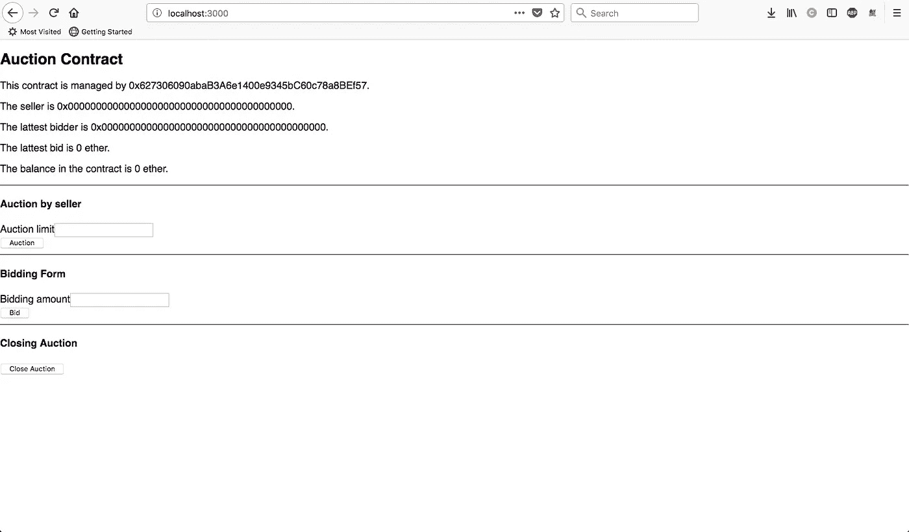

Auction web dapp

将 Metamask 中的帐户更改为卖家。


Seller account

在“拍卖限额”字段填写 2 或您喜欢的任何金额。然后按下“拍卖”按钮。

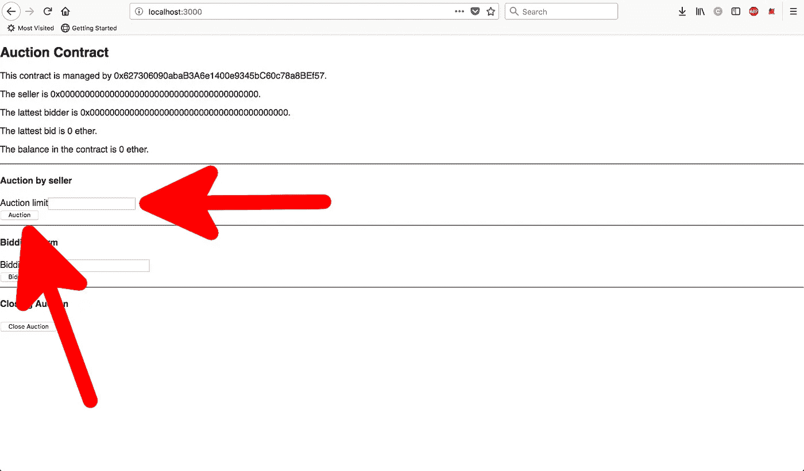

Auctin limit by seller

你会看到一个 Metamask 弹出屏幕来确认操作，因为你尝试采取的操作会产生开销，尽管开销很小。点击“提交”按钮。

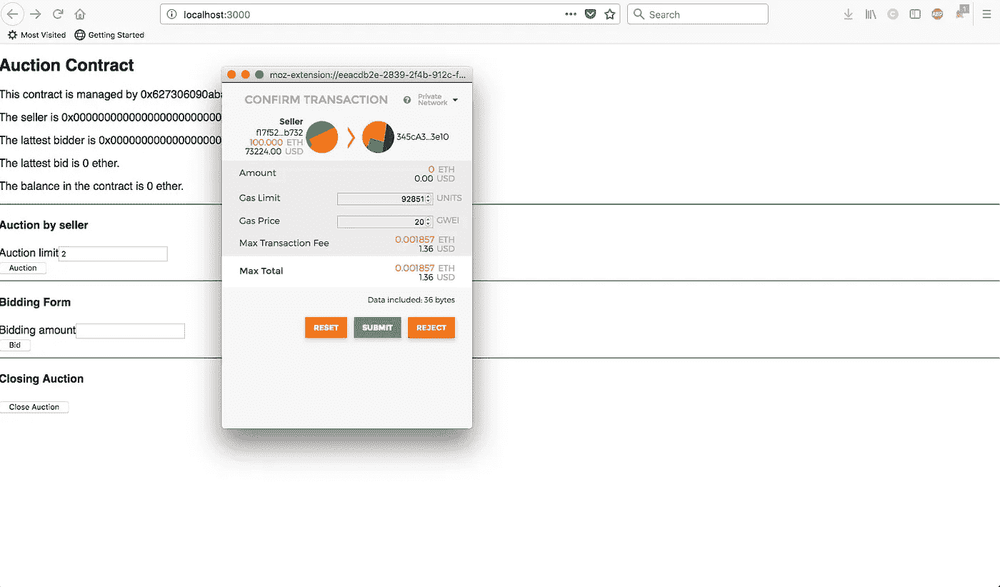

Metamask popup screen

你会看到页面更新它的卖家。

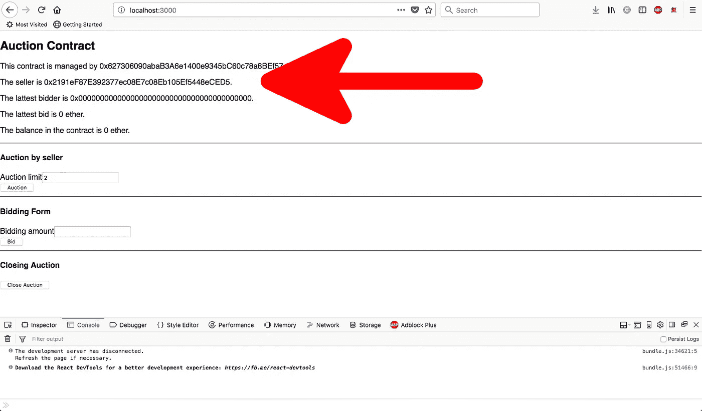

The seller information is updated.

你也可以从 Truffle develop 控制台查看卖家信息。

```
truffle(develop)> Auction.at(“0x345ca3e014aaf5dca488057592ee47305d9b3e10”).seller();
‘0x2191ef87e392377ec08e7c08eb105ef5448eced5’
```

你的卖家地址可能不同。最重要的是要检查的地址必须与网页上的地址相同。

现在把你的 Metamask 账户改成 bidder。

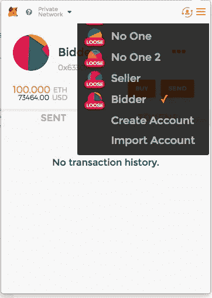

Bidder account

填写“出价金额”字段(任何大于 2 的金额)，然后按“出价”按钮。

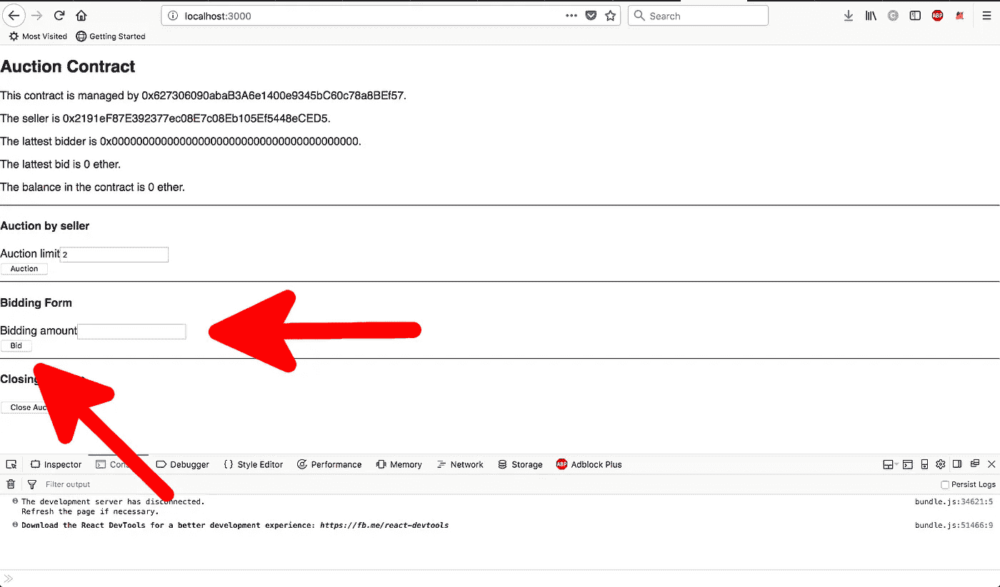

Bid amount

你会看到一个 Metamask 弹出窗口，要求你确认付款。这一次，你将发送金额加上小额费用。我的情况是 4.001 乙醚。点击“提交”按钮。

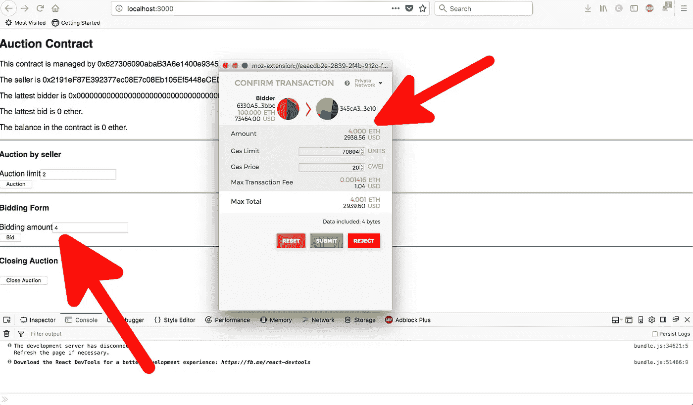

Send the payment to the smart contract

网页将更新其关于投标和投标人的信息。如果你查一下投标人账户的余额，已经不是 100 eth 了。在我的例子中，它是 95.999 eth，因为我向智能合约发送了 4.001 ether。

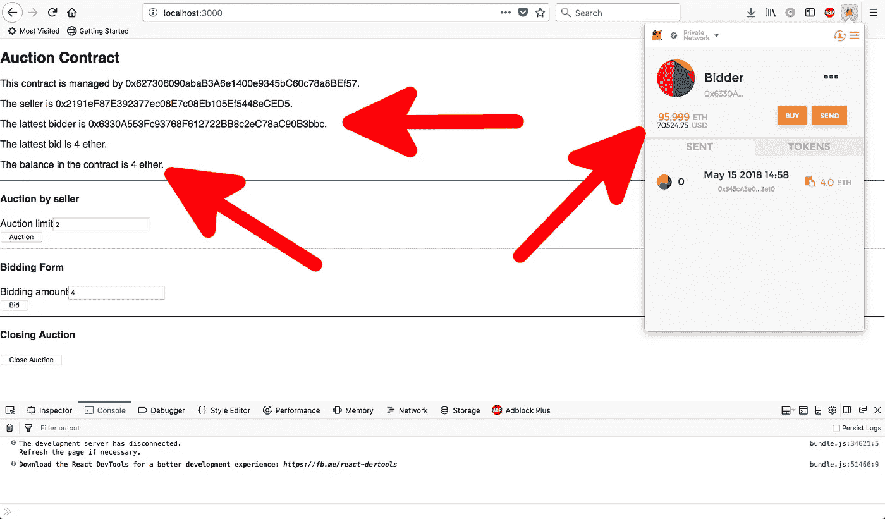

The bidder balance changed

现在，让我们完成这次拍卖。你需要成为经理。将元掩码中的帐户更改为 manager。

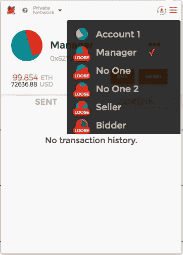

Manager account

点击“结束拍卖”按钮。

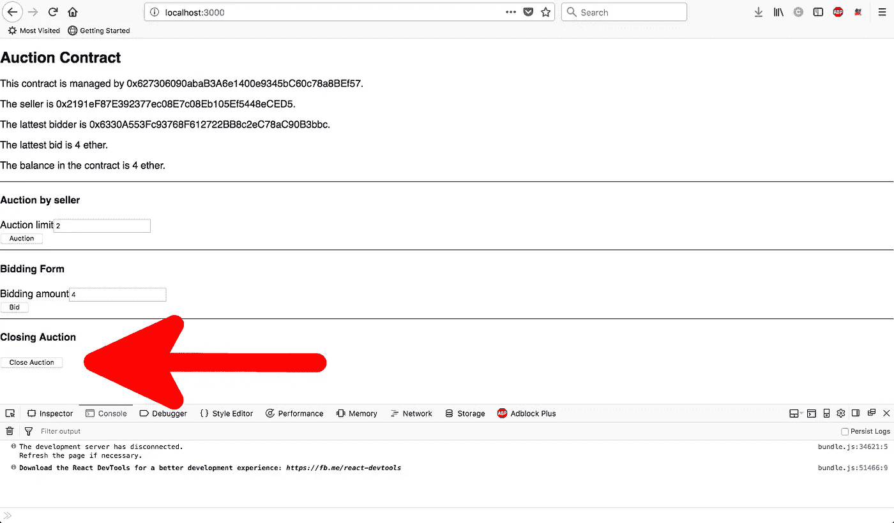

Close auction smart contract

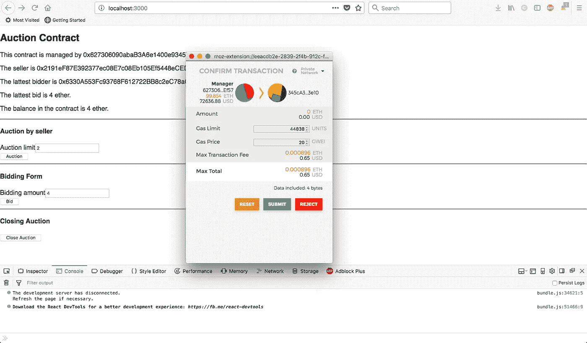

Confirm the closing auction action

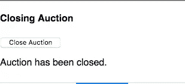

Auction has been closed

要检查智能合同是否已最终确定，请检查卖方余额。它将增加投标人发送的金额。在我的情况下，它几乎是 4 以太。

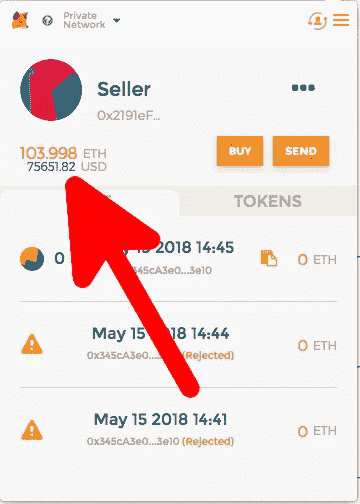

The seller received money from the smart contract

因此，您已经构建了一个简单的 web 分散式应用程序。恭喜你！！！这个例子当然有 bug。例如，关闭拍卖后，网页中的余额不会更新。我们仍然没有使用回调(我们使用 *await* 来调用异步方法，这在编写 dapp 时是一大禁忌)。所有这些都将在以后的文章中讨论。

如果您得到错误“tx 没有正确的 nonce。”，尝试使用不同的帐户作为卖家或买家。

这是 *src/App.js* 的完整源代码。

```
import React, { Component } from ‘react’;import web3 from ‘./web3’;import auction from ‘./auction’;class App extends Component {state = {manager: ‘’,latestBid: ‘’,latestBidder: ‘’,seller: ‘’,balance: ‘’,auctionValue: ‘’,bidValue: ‘’,closingRemark: ‘’};async componentDidMount() {const manager = await auction.methods.manager().call();const latestBid = await auction.methods.latestBid().call();const latestBidder = await auction.methods.latestBidder().call();const seller = await auction.methods.seller().call();const balance = await web3.eth.getBalance(auction.options.address);this.setState({ manager, latestBid, latestBidder, seller, balance });}onAuctionSubmit = async (event) => {event.preventDefault();const accounts = await web3.eth.getAccounts();await auction.methods.auction(this.state.auctionValue).send({from: accounts[0]});this.setState({ seller: accounts[0] });}onBidSubmit = async (event) => {event.preventDefault();const accounts = await web3.eth.getAccounts();const weiAmount = web3.utils.toWei(this.state.bidValue, ‘ether’);await auction.methods.bid().send({from: accounts[0],value: weiAmount});this.setState({ latestBid: weiAmount, balance: weiAmount, latestBidder: accounts[0] });}onFinishSubmit = async (event) => {event.preventDefault();const accounts = await web3.eth.getAccounts();await auction.methods.finishAuction().send({from: accounts[0]});this.setState({ closingRemark: ‘Auction has been closed.’ })}render() {return (<div><h2>Auction Contract</h2><p>This contract is managed by {this.state.manager}.</p><p>The seller is {this.state.seller}.</p><p>The lattest bidder is {this.state.latestBidder}.</p><p>The lattest bid is {web3.utils.fromWei(this.state.latestBid, ‘ether’)} ether.</p><p>The balance in the contract is {web3.utils.fromWei(this.state.balance, ‘ether’)} ether.</p><hr /><h4>Auction by seller</h4><div><label>Auction limit</label><inputvalue={this.state.auctionValue}onChange={event => this.setState({ auctionValue: event.target.value })}/></div><button onClick={this.onAuctionSubmit}>Auction</button><hr /><h4>Bidding Form</h4><div><label>Bidding amount</label><inputvalue={this.state.bidValue}onChange={event => this.setState({ bidValue: event.target.value })}/></div><button onClick={this.onBidSubmit}>Bid</button><hr /><h4>Closing Auction</h4><button onClick={this.onFinishSubmit}>Close Auction</button><p>{this.state.closingRemark}</p></div>);}}export default App;
```

> 加入 Coinmonks [电报频道](https://t.me/coincodecap)和 [Youtube 频道](https://www.youtube.com/c/coinmonks/videos)获取每日[加密新闻](http://coincodecap.com/)

## 另外，阅读

*   [复制交易](/coinmonks/top-10-crypto-copy-trading-platforms-for-beginners-d0c37c7d698c) | [加密税务软件](/coinmonks/crypto-tax-software-ed4b4810e338)
*   [网格交易](https://coincodecap.com/grid-trading) | [加密硬件钱包](/coinmonks/the-best-cryptocurrency-hardware-wallets-of-2020-e28b1c124069)
*   [密码电报信号](http://Top 4 Telegram Channels for Crypto Traders) | [密码交易机器人](/coinmonks/crypto-trading-bot-c2ffce8acb2a)
*   [ko only 回顾](https://coincodecap.com/koinly-review) | [Binaryx 回顾](https://coincodecap.com/binaryx-review)|[Hodlnaut vs CakeDefi](https://coincodecap.com/hodlnaut-vs-cakedefi-vs-celsius)
*   [MoonXBT vs Bybit vs 币安](https://coincodecap.com/bybit-binance-moonxbt) | [硬件钱包](/coinmonks/hardware-wallets-dfa1211730c6)
*   [火币交易机器人](https://coincodecap.com/huobi-trading-bot) | [如何购买 ADA](https://coincodecap.com/buy-ada-cardano) | [Geco？一次回顾](https://coincodecap.com/geco-one-review)
*   [币安 vs Bitstamp](https://coincodecap.com/binance-vs-bitstamp) | [比特熊猫 vs 比特币基地 vs Coinsbit](https://coincodecap.com/bitpanda-coinbase-coinsbit)
*   [如何购买 Ripple (XRP)](https://coincodecap.com/buy-ripple-india) | [非洲最好的加密交易所](https://coincodecap.com/crypto-exchange-africa)
*   [最佳加密交易所](/coinmonks/crypto-exchange-dd2f9d6f3769) | [印度最佳加密交易所](/coinmonks/bitcoin-exchange-in-india-7f1fe79715c9)
*   开发人员的最佳加密 API
*   最佳[密码借贷平台](/coinmonks/top-5-crypto-lending-platforms-in-2020-that-you-need-to-know-a1b675cec3fa)
*   杠杆代币的终极指南