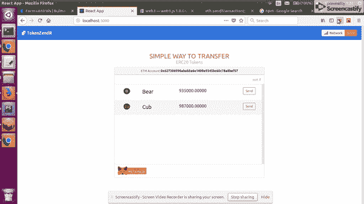
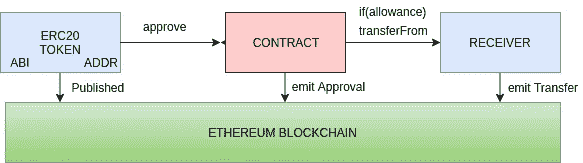
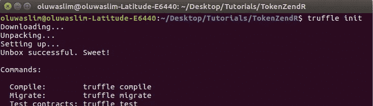
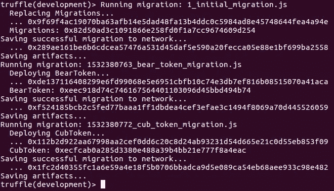
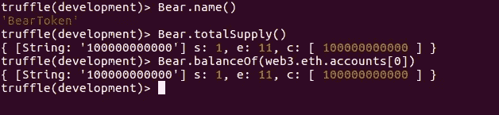
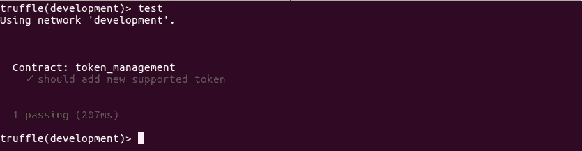
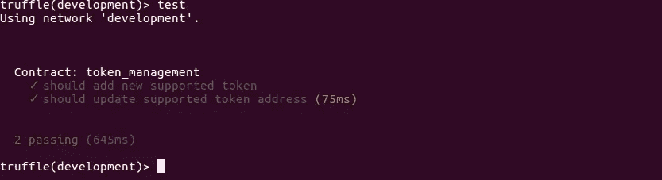
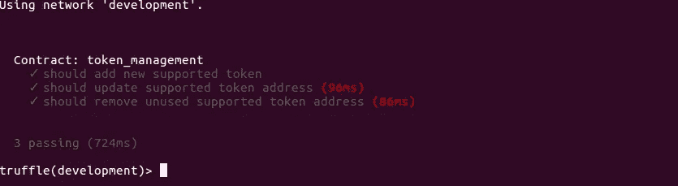
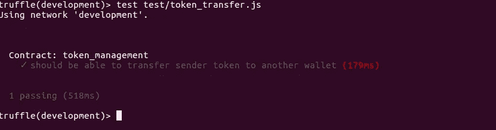

# 构建一个智能合约，将您的电子钱包中的 ERC20 令牌转移到其他 ERC20 兼容电子钱包-第 1 部分

> 原文：<https://medium.com/coinmonks/build-a-smart-contract-that-transfers-erc20-token-from-your-wallet-to-other-addresses-or-erc20-ee8dc35f40f6?source=collection_archive---------0----------------------->



## 概观

在本教程中，您将构建一个智能合约，用于将 ERC20 令牌转移到任何 ERC20 兼容的钱包，包括元掩码和交换地址。本教程中显示的方法是 forkdelta 等分散式交换所使用的方法的简化版本。在第一部分中，我们将编写和测试智能契约，在下一篇文章中，我们将使用 Reactjs 构建 UI。

> [发现并回顾最佳加密钱包](https://coincodecap.com/category/wallets)

## 我会学到什么？

您将学习如何编写和测试一个智能契约，该契约可以将令牌从您的钱包转移到其他 ERC20 兼容地址。

*   分散式交易所存取特征机制如何工作
*   如何在 solidity 中编写智能合同来转移 ERC20 令牌
*   测试您的智能合约并通过 truffle 控制台与之交互

## 要求

本教程对 Dapps 初学者并不友好，所以建议你先了解一下 ERC20 令牌的工作原理，并具备编写 solidity 代码的基本知识。

出于本教程的目的，需要在您的系统上安装以下软件。

*   Trufflesuite [安装指南在此](https://github.com/trufflesuite/truffle)
*   Ganache [私人区块链服务器](https://github.com/trufflesuite/ganache/releases)
*   为 chrome、firefox、opera 安装 Metamask

本教程假设您使用的是 *UNIX 操作系统*

## 写我们的合同



此图说明了该流程的工作步骤。

*   首先，向以太网发布一个 ERC20 令牌
*   令牌被分配一个约定地址并具有一个 ABI
*   持有令牌的地址批准代表其消费的合同
*   然后，合同将令牌发送到接收地址

够清楚了！！

## 说够了，让我们开始编码

到目前为止，我假设您已经安装了所有的需求，所以启动 *Ganache* 然后导航到您的工作目录并创建一个文件夹，将其命名为 *TokenZendR* 。从您的终端导航到 *TokenZendR* 目录，并运行命令`truffle init`，您现在应该看到类似如下的输出。



在任何你喜欢的编辑器中打开项目目录，我更喜欢在激活 solidity 插件的情况下使用 PhpStorm(我很喜欢这个编辑器)。在根目录下创建一个 *package.json* 文件，并将以下内容粘贴到其中。

```
{  
  "dependencies": {  
  "babel-register": "^6.23.0",  
  "babel-polyfill": "^6.26.0",  
  "babel-preset-es2015": "^6.18.0"  
  },  
  "devDependencies": {  
  "openzeppelin-solidity": "^1.10.0",  
  "chai": "^4.1.2",  
  "chai-as-promised": "^7.1.1",  
  "chai-bignumber": "^2.0.2"  
  }  
}
```

接下来打开 truffle.js 项目，用以下内容替换它

```
require('babel-register');  
require('babel-polyfill');  

module.exports = {  
  networks: {  
  development: {  
  host: "127.0.0.1",  
  port: 7545,  
  network_id: "*" // Match any network id  
  }  
 }};
```

从项目根目录下的控制台运行`npm install`来安装 package.json 中指定的所有包。

到现在为止，您可能想知道为什么您的 *package.json* 中需要依赖项。在编写我们的测试时，我们需要 *babel* 和 *chai* ，并且我们将需要扩展*ERC 20*open zeppelin-solidity 框架的令牌契约接口。

不，我们需要为本教程创建两个 *ERC20* 令牌智能合约，并将它们部署在我们的私有区块链( *Ganache* )上，这样我们就可以使用它们来测试我们的令牌发送者合约，因为我们无法访问我们网络( *5777* )外部已经部署的令牌，例如 *testnet* 、mainnet

在联系人文件夹中创建两个文件 BearToken.sol 和 CubToken.sol，并将以下内容粘贴到其中。

`BearToken.sol`

```
pragma solidity ^0.4.19;  

import "openzeppelin-solidity/contracts/token/ERC20/StandardToken.sol";  
import "openzeppelin-solidity/contracts/ownership/Ownable.sol";  

/**  
* @title BearToken is a basic ERC20 Token  
*/  
contract BearToken is StandardToken, Ownable{  

  uint256 public totalSupply;  
  string public name;  
  string public symbol;  
  uint32 public decimals;  

  /**  
 * @dev assign totalSupply to account creating this contract */  constructor() public {  
  symbol = "BEAR";  
  name = "BearToken";  
  decimals = 5;  
  totalSupply = 100000000000;  

  owner = msg.sender;  
  balances[msg.sender] = totalSupply;  

  emit Transfer(0x0, msg.sender, totalSupply);  
 }}
```

这只是一个 ERC20 token BearToken，符号为 *BEAR* ，总供应量为 1000 亿，总供应量分配给契约的创建者。它扩展了 *StandardToken* 和 *Ownable* 契约。

`Cub.sol`

```
pragma solidity ^0.4.19;  

import "openzeppelin-solidity/contracts/token/ERC20/StandardToken.sol";  
import "openzeppelin-solidity/contracts/ownership/Ownable.sol";  

/**  
* @title BearToken is a basic ERC20 Token  
*/  
contract CubToken is StandardToken, Ownable{  

  uint256 public totalSupply;  
  string public name;  
  string public symbol;  
  uint32 public decimals;  

 /**  
 * @dev assign totalSupply to account creating this contract 
 */  
 constructor() public {  
  symbol = "CUB";  
  name = "CubToken";  
  decimals = 5;  
  totalSupply = 100000000000;  

  owner = msg.sender;  
  balances[msg.sender] = totalSupply;  

  emit Transfer(0x0, msg.sender, totalSupply);  
 }}
```

这只是一个 ERC20 token CubToken，符号为 *CUB* ，总供应量为 1000 亿，总供应量分配给合同的创建者。它扩展了 *StandardToken* 和 *Ownable* 契约。

让我们为这两个合同添加迁移。按以下顺序运行以下命令。

```
truffle consoletruffle(development)> create migration bear_token_migration truffle(development)> create migration cub_token_migration
```

上面的命令将为我们的两个合同创建两个迁移文件，格式为*{ timestamp } _ bear _ token _ migration . js*和*{ timestamp } _ cub _ token _ migration . js*。接下来用这个替换两个文件的内容。

`*{timestamp}_bear_token_migration.js*`

```
let BearToken = artifacts.require("./BearToken.sol");  

module.exports = function(deployer) {  
  deployer.deploy(BearToken);  
};
```

`*{timestamp}_cub_token_migration.js*`

```
let CubToken = artifacts.require("./CubToken.sol");  

module.exports = function(deployer) {  
  deployer.deploy(CubToken);  
};
```

现在我们已经有了那个集合，继续编译和迁移您的契约。

```
truffle(development)> compiletruffle(development)> migrate
```



上图显示两个合同都已经编译并部署在网络上，你的项目目录现在应该有一个包含 *json* 文件的`build`文件夹，仔细查看其中一个文件，你会发现它包含合同的 *abi* 和编译成字节码的 it 代码以及其他一些信息。

在我们开始为两个契约编写测试之前，让我们从控制台开始研究契约。当你在编写测试和修复 bug(如果需要的话)之前与你的合同进行交互时，它会给你更多的信心。在控制台上记录两个合同的合同地址很重要

```
BearToken: 0xeec918d74c746167564401103096d45bbd494b74
CubToken: 0xecfcab0a285d3380e488a39b4bb21e777f8a4eac
```

让我们简单地检查 *BearToken* 的名称、符号和总供应量，并记录合同创建者的余额，记住在我们的合同中，我们将总供应量记入合同创建者账户。

```
truffle(development)> Bear = BearToken.at("0xeec918d74c746167564401103096d45bbd494b74")truffle(development)> Bear.name()truffle(development)> Bear.totalSupply()truffle(development)> Bear.balanceOf(web3.eth.accounts[0])
```



好运👌

现在我们有两个 *ERC20* 令牌要测试，接下来让我们创建处理传输的 *TokenZendR* 契约。

创建一个新合同， *TokenZendR.sol*

```
pragma solidity ^0.4.23;  

import "openzeppelin-solidity/contracts/token/ERC20/ERC20.sol";  
import "openzeppelin-solidity/contracts/lifecycle/Pausable.sol";  

contract TokenZendR is Ownable, Pausable {}
```

该契约扩展了 openzeppelin 库中的 Ownable 和 Pausable 契约，您将很快看到我们使用的这些契约中的方法。

*ERC20.sol* 是所有 *ERC20* 兼容令牌必须实现的 *ERC20* 标准接口，详见[https://github.com/ethereum/EIPs/issues/20](https://github.com/ethereum/EIPs/issues/20)。

接下来定义保存每次传输的数据结构，用它更新合同。

```
/**  
* @dev Details of each transfer  
* @param contract_ contract address of ER20 token to transfer  
* @param to_ receiving account  
* @param amount_ number of tokens to transfer to_ account  
* @param failed_ if transfer was successful or not  
*/  
struct Transfer {  
  address contract_;  
  address to_;  
  uint amount_;  
  bool failed_;  
}
```

添加一个映射，保存每个用户在*事务*数组上的所有传输索引，其中每个用户地址都是一个所有事务索引数组的键。

```
/**  
* @dev a mapping from transaction ID's to the sender address  
* that initiates them. Owners can create several transactions  
*/  
mapping(address => uint[]) public transactionIndexesToSender;/**  
* @dev a list of all transfers successful or unsuccessful  
*/  
Transfer[] public transactions;
```

我们定义了一个 address 类型的所有者属性，它保存启动该契约的地址，而令牌将保存契约支持传输的所有 *ERC20* 令牌的地址。

值得注意的一点是这些漂亮的代码

```
ERC20 public ERC20Interface;
```

这些实现了 *ERC20* 接口，允许我们在使用令牌契约地址时调用方法`approve`和`transferFrom`。这将在本教程后面的 *transferToken* 方法中变得更加清晰。

```
address public owner;  

/**  
* @dev list of all supported tokens for transfer  
* @param string token symbol  
* @param address contract address of token  
*/  
mapping(bytes32 => address) public tokens;  

ERC20 public ERC20Interface;
```

传输成功或失败时发出的事件

```
/**  
* @dev Event to notify if transfer successful or failed  
* after account approval verified  
*/  
event TransferSuccessful(address indexed from_, address indexed to_, uint256 amount_);  

event TransferFailed(address indexed from_, address indexed to_, uint256 amount_);
```

在本合同中，我们主要想做三件事，即:

*   添加此合同支持的新令牌的地址
*   如果我们可以添加令牌，我们也希望能够删除它
*   最后是转让权，这是本合同要履行的主要内容。

我们也许可以考虑增加一个从合同中提取资金的支付方法，以防有人觉得慈善…😉

```
/**  
* @dev add address of token to list of supported tokens using  
* token symbol as identifier in mapping  
*/  
function addNewToken(bytes32 symbol_, address address_) public onlyOwner returns (bool) {  
  tokens[symbol_] = address_;  

  return true;  
}  

/**  
* @dev remove address of token we no more support  
*/  
function removeToken(bytes32 symbol_) public onlyOwner returns (bool) {  
  require(tokens[symbol_] != 0x0);  

  delete(tokens[symbol_]);  

  return true;  
}  

/**  
* @dev method that handles transfer of ERC20 tokens to other address  
* it assumes the calling address has approved this contract  
* as spender  
* @param symbol_ identifier mapping to a token contract address  
* @param to_ beneficiary address  
* @param amount_ numbers of token to transfer  
*/  
function transferTokens(bytes32 symbol_, address to_, uint256 amount_) public whenNotPaused{  
  require(tokens[symbol_] != 0x0);  
  require(amount_ > 0);  

  address contract_ = tokens[symbol_];  
  address from_ = msg.sender;  

  ERC20Interface = ERC20(contract_);  

  uint256 transactionId = transactions.push(  
  Transfer({  
  contract_:  contract_,  
        to_: to_,  
        amount_: amount_,  
        failed_: true  
  })  
 );  
  transactionIndexesToSender[from_].push(transactionId - 1);  

  if(amount_ > ERC20Interface.allowance(from_, address(this))) {  
  emit TransferFailed(from_, to_, amount_);  
  revert();  
 }  
  ERC20Interface.transferFrom(from_, to_, amount_);  

  transactions[transactionId - 1].failed_ = false;  

  emit TransferSuccessful(from_, to_, amount_);  
}  

/**  
* @dev allow contract to receive funds  
*/  
function() public payable {}  

/**  
* @dev withdraw funds from this contract  
* @param beneficiary address to receive ether  
*/  
function withdraw(address beneficiary) public payable onlyOwner whenNotPaused {  
  beneficiary.transfer(address(this).balance);  
}
```

# 把所有的放在一起

```
pragma solidity ^0.4.23;  

import "openzeppelin-solidity/contracts/token/ERC20/ERC20.sol";  
import "openzeppelin-solidity/contracts/lifecycle/Pausable.sol";  

contract TokenZendR is Ownable, Pausable {  

  /**  
 * @dev Details of each transfer * @param contract_ contract address of ER20 token to transfer * @param to_ receiving account * @param amount_ number of tokens to transfer to_ account * @param failed_ if transfer was successful or not */  struct Transfer {  
  address contract_;  
  address to_;  
  uint amount_;  
  bool failed_;  
 }  
  /**  
 * @dev a mapping from transaction ID's to the sender address * that initiates them. Owners can create several transactions */  mapping(address => uint[]) public transactionIndexesToSender;  

  /**  
 * @dev a list of all transfers successful or unsuccessful */  Transfer[] public transactions;  

  address public owner;  

  /**  
 * @dev list of all supported tokens for transfer * @param string token symbol * @param address contract address of token */  mapping(bytes32 => address) public tokens;  

  ERC20 public ERC20Interface;  

  /**  
 * @dev Event to notify if transfer successful or failed * after account approval verified */  event TransferSuccessful(address indexed from_, address indexed to_, uint256 amount_);  

  event TransferFailed(address indexed from_, address indexed to_, uint256 amount_);  

  constructor() public {  
  owner = msg.sender;  
 }  
  /**  
 * @dev add address of token to list of supported tokens using * token symbol as identifier in mapping */  function addNewToken(bytes32 symbol_, address address_) public onlyOwner returns (bool) {  
  tokens[symbol_] = address_;  

  return true;  
 }  
  /**  
 * @dev remove address of token we no more support */  function removeToken(bytes32 symbol_) public onlyOwner returns (bool) {  
  require(tokens[symbol_] != 0x0);  

  delete(tokens[symbol_]);  

  return true;  
 }  
  /**  
 * @dev method that handles transfer of ERC20 tokens to other address * it assumes the calling address has approved this contract * as spender * @param symbol_ identifier mapping to a token contract address * @param to_ beneficiary address * @param amount_ numbers of token to transfer */  function transferTokens(bytes32 symbol_, address to_, uint256 amount_) public whenNotPaused{  
  require(tokens[symbol_] != 0x0);  
  require(amount_ > 0);  

  address contract_ = tokens[symbol_];  
  address from_ = msg.sender;  

  ERC20Interface = ERC20(contract_);  

  uint256 transactionId = transactions.push(  
  Transfer({  
  contract_:  contract_,  
            to_: to_,  
            amount_: amount_,  
            failed_: true  
  })  
 );  
  transactionIndexesToSender[from_].push(transactionId - 1);  

  if(amount_ > ERC20Interface.allowance(from_, address(this))) {  
  emit TransferFailed(from_, to_, amount_);  
  revert();  
 }  
  ERC20Interface.transferFrom(from_, to_, amount_);  

  transactions[transactionId - 1].failed_ = false;  

  emit TransferSuccessful(from_, to_, amount_);  
 }  
  /**  
 * @dev allow contract to receive funds */  function() public payable {}  

  /**  
 * @dev withdraw funds from this contract * @param beneficiary address to receive ether */  function withdraw(address beneficiary) public payable onlyOwner whenNotPaused {  
  beneficiary.transfer(address(this).balance);  
 }}
```

# 编写我们的测试

如果你还在松露控制台上，运行`create test`命令或返回命令`truffle console`，运行如下所示的命令创建两个测试文件。

```
truffle(development)> create test token_managementtruffle(development)> create test token_transfer
```

如果您检查您的项目`test`，您的两个测试文件将会用一个默认断言创建。打开`token_management.js`文件，清除当前内容，然后导入文件开头的 chai 和合同。

**PS:** 为了避免在运行您的第一个测试时遇到错误，也清空 *token_transfer.js* 的内容。

```
const TokenZendR = artifacts.require('./TokenZendR.sol');  

const should = require('chai')  
 .use(require('chai-as-promised'))  
 .should();  

let sender;  

contract('token_management', async (accounts) => {

}
```

该测试将运行测试，以检查从合同中添加、更新和删除令牌是否正常工作。在运行每个测试之前，我们想添加一个缺省令牌，如果你还不习惯使用`asyn/await`，你可能想仔细阅读一下。

```
beforeEach(async () => {  
	  sender = await TokenZendR.new();  
	  await sender.addNewToken('OPEN', '0x69c4bb240cf05d51eeab6985bab35527d04a8c64');  
	});
```

接下来是我们添加令牌的第一个断言

```
it("should add new supported token", async() => {  
  let address = await sender.tokens.call('OPEN');  

  address.should.equal('0x69c4bb240cf05d51eeab6985bab35527d04a8c64');  
});truffle(development)> test
```



断言它是否正确更新了令牌地址

```
it("should update supported token address", async() => {  
  await sender.addNewToken('OPEN', '0x3472059945ee170660a9a97892a3cf77857eba3a');  

  let address = await sender.tokens.call('OPEN');  

  address.should.equal('0x3472059945ee170660a9a97892a3cf77857eba3a');  
});truffle(development)> test
```



最后断言一个令牌被移除

```
it("should remove unused supported token address", async() => {  
  await sender.removeToken('OPEN');  

  let address = await sender.tokens.call('OPEN');  

  address.should.equal('0x0000000000000000000000000000000000000000');  
});truffle(development)> test
```



把所有的放在一起

```
const TokenZendR = artifacts.require('./TokenZendR.sol');  

const should = require('chai')  
 .use(require('chai-as-promised'))  
 .should();  

let sender;  

contract('token_management', async (accounts) => {  
	  beforeEach(async () => {  
	  sender = await TokenZendR.new();  
	  await sender.addNewToken('OPEN', '0x69c4bb240cf05d51eeab6985bab35527d04a8c64');  
	 }); 

	  it("should add new supported token", async() => {  
	  let address = await sender.tokens.call('OPEN');  

	  address.should.equal('0x69c4bb240cf05d51eeab6985bab35527d04a8c64');  
	  }); 

	  it("should update supported token address", async() => {  
	  await sender.addNewToken('OPEN', '0x3472059945ee170660a9a97892a3cf77857eba3a');  

	  let address = await sender.tokens.call('OPEN');  

	  address.should.equal('0x3472059945ee170660a9a97892a3cf77857eba3a');  
	  });  

	  it("should remove unused supported token address", async() => {  
	  await sender.removeToken('OPEN');  

	  let address = await sender.tokens.call('OPEN');  

	  address.should.equal('0x0000000000000000000000000000000000000000');  
	 });
 });
```

最后，让我们测试一下契约是否真的可以传递令牌，以确认一切都正常工作。导入三份合同，柴在文件最上面。

```
const TokenZendR = artifacts.require('./TokenZendR.sol');  
const BearToken = artifacts.require('./BearToken.sol');  
const CubToken = artifacts.require('./CubToken.sol');  

const BigNumber = web3.BigNumber;  

const should = require('chai')  
 .use(require('chai-as-promised'))  
 .use(require('chai-bignumber')(BigNumber))  
 .should();
```

在运行每个测试之前，创建所有合同的新实例。

```
const TokenZendR = artifacts.require('./TokenZendR.sol');  
const BearToken = artifacts.require('./BearToken.sol');  
const CubToken = artifacts.require('./CubToken.sol');  

const BigNumber = web3.BigNumber;  

const should = require('chai')  
 .use(require('chai-as-promised'))  
 .use(require('chai-bignumber')(BigNumber))  
 .should();  

let sender, bear, cub;  

contract('token_management', async (accounts) => {  

	 let accountA, accountB, accountC, accountD;  

	 [accountA, accountB, accountC, accountD ] = accounts;  

	 beforeEach(async () => {  
	  sender = await TokenZendR.new();  
	  bear = await BearToken.new();  
	  cub = await CubToken.new();  

	  await sender.addNewToken('BEAR', bear.address);  
	  await sender.addNewToken('CUB', cub.address);  
	 });
 }
```

测试地址二的余额是否等于合同成功转让的*承载*令牌的金额。

```
it("should be able to transfer sender token to another wallet", async() => { 
  // When transfering  token, multiple by
  //figure of decimal to get exact token e.g
  //to send 5 BEAR = 5e5, where 5 is the decimal places 
  let amount = new BigNumber(500000e5);  

  //Account a approve contract to spend on behalf
  await bear.approve(sender.address, amount,{from: accountA});  

  await sender.transferTokens('BEAR',accountB, amount,{from: accountA});  

  let balance = ((await bear.balanceOf(accountB)).toString());  

  balance.should.equal(amount.toString())  
});truffle(development)> test
```



本教程已经成功地向您展示了如何建立一个合同，将 *ERC20* 代币从您的地址转移到任何其他 *ERC20* 兼容的钱包甚至交易所。你可以在 testnet 或者 main net 上用现有的令牌比如 *GTO* 或者 *TRX* 进行测试。

# 第二部分

本教程的结论部分可以在 [*这里*](/coinmonks/building-ethereum-dapps-with-reactjs-truffle-contract-web3-a-ui-for-tokenzendr-a-smart-bf345478b116) 中找到

# 代码库

完整的智能合同代码可以在这里找到&克隆[https://github.com/slim12kg/tokenzendr-contract](https://github.com/slim12kg/tokenzendr-contract)

**想要学习使用节点 API 构建 Defi 储蓄智能合约，以便与智能合约进行交互？**👇👇👇

[](https://www.udemy.com/course/the-complete-solidity-mastery-course/) [## 完整的坚实掌握课程

### 大家好，我的名字是奥卢瓦费米。在接下来的 8 年里，我一直在构建可伸缩的 web 应用程序…

www.udemy.com](https://www.udemy.com/course/the-complete-solidity-mastery-course/) 

> 加入 Coinmonks [电报频道](https://t.me/coincodecap)和 [Youtube 频道](https://www.youtube.com/c/coinmonks/videos)获取每日[加密新闻](http://coincodecap.com/)

## 另外，阅读

*   [密码电报信号](http://Top 4 Telegram Channels for Crypto Traders) | [密码交易机器人](/coinmonks/crypto-trading-bot-c2ffce8acb2a)
*   [复制交易](/coinmonks/top-10-crypto-copy-trading-platforms-for-beginners-d0c37c7d698c) | [加密税务软件](/coinmonks/crypto-tax-software-ed4b4810e338)
*   [电网交易](https://coincodecap.com/grid-trading) | [加密硬件钱包](/coinmonks/the-best-cryptocurrency-hardware-wallets-of-2020-e28b1c124069)
*   [最佳加密交易所](/coinmonks/crypto-exchange-dd2f9d6f3769) | [印度最佳加密交易所](/coinmonks/bitcoin-exchange-in-india-7f1fe79715c9)
*   [面向开发人员的最佳加密 API](/coinmonks/best-crypto-apis-for-developers-5efe3a597a9f)
*   最佳[密码借贷平台](/coinmonks/top-5-crypto-lending-platforms-in-2020-that-you-need-to-know-a1b675cec3fa)
*   杠杆代币的终极指南
*   [加密交易的最佳 VPN](https://coincodecap.com/best-vpns-for-crypto-trading)
*   [最佳加密分析或链上数据](https://coincodecap.com/blockchain-analytics) | [Bexplus 评论](https://coincodecap.com/bexplus-review)
*   [NFT 十大市场造币集锦](https://coincodecap.com/nft-marketplaces)
*   [AscendEx Staking](https://coincodecap.com/ascendex-staking)|[Bot Ocean Review](https://coincodecap.com/bot-ocean-review)|[最佳比特币钱包](https://coincodecap.com/bitcoin-wallets-india)
*   [Bitget 回顾](https://coincodecap.com/bitget-review)|[Gemini vs block fi](https://coincodecap.com/gemini-vs-blockfi)|[OKEx 期货交易](https://coincodecap.com/okex-futures-trading)