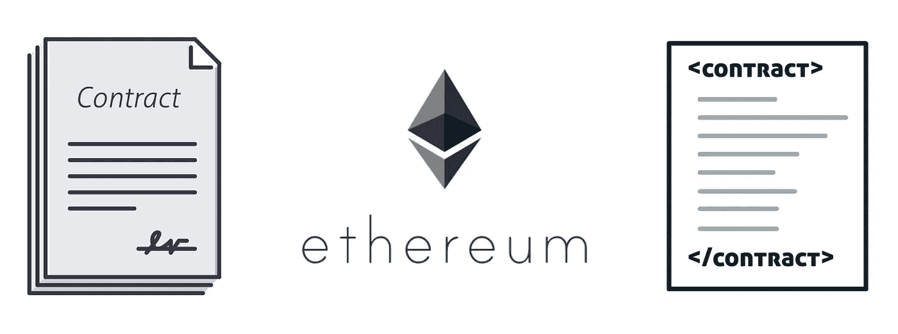
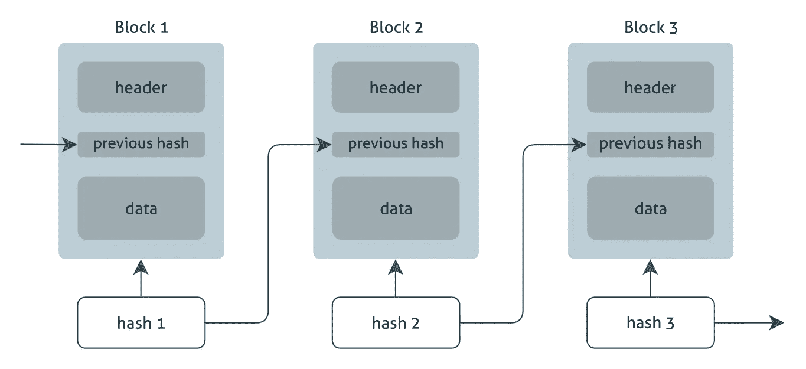
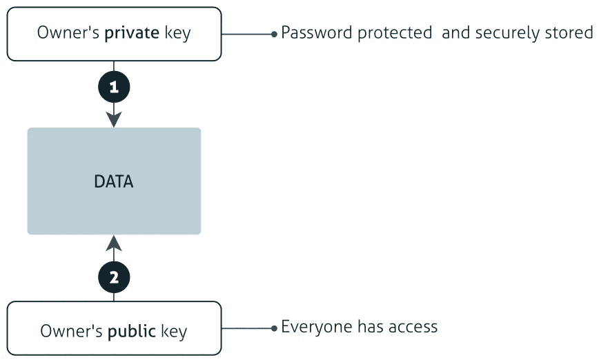
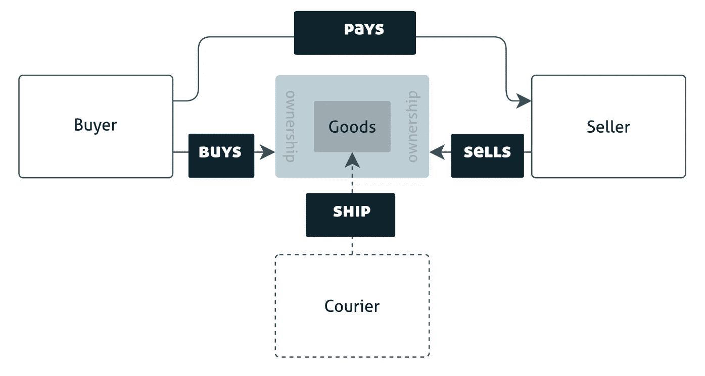
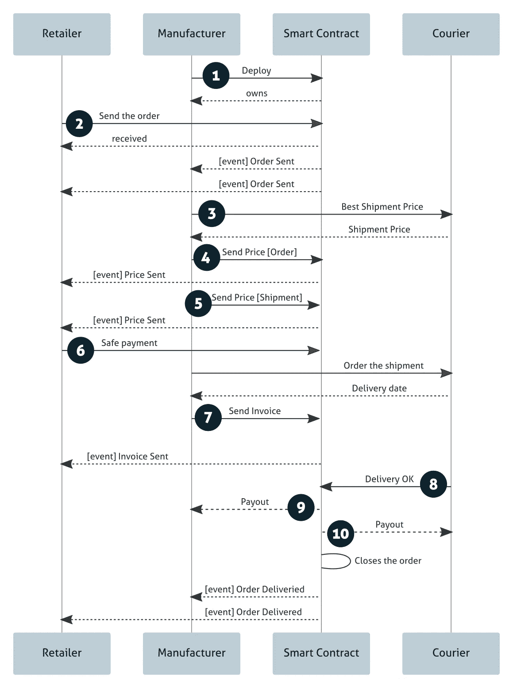
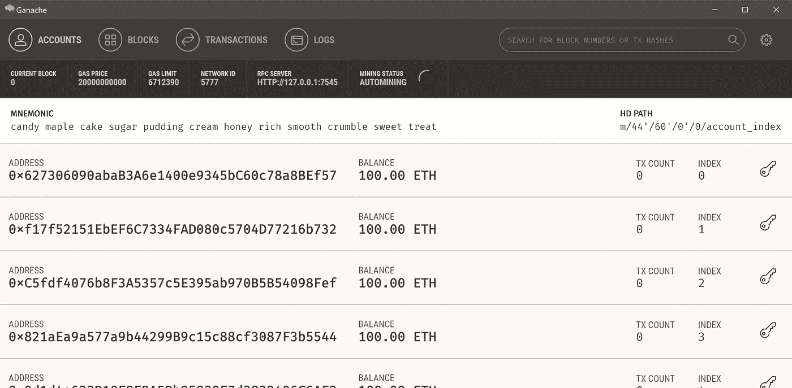

# 建立销售商品的智能合同

> 原文：<https://medium.com/coinmonks/build-a-smart-contract-to-sell-goods-6cf73609d25?source=collection_archive---------0----------------------->



毫无疑问，由于智能合约，比特币已经改变了我们看待和理解货币、价值以及最近所有权的方式。这很有趣，因为几乎每个人都听说过它或加密货币。来自许多业务领域的人们，不仅仅是我们，还有 it 工作者。

在这篇文章中，我将展示我在以太坊上的第一个智能合约，这是我个人关于区块链研究的一部分。

> 交易新手？试试[加密交易机器人](/coinmonks/crypto-trading-bot-c2ffce8acb2a)或者[复制交易](/coinmonks/top-10-crypto-copy-trading-platforms-for-beginners-d0c37c7d698c)

# 新手区块链

有许多概念涉及区块链技术，但在这一节中，我将尝试解释这一惊人的和颠覆性的技术。

顾名思义，区块链是使用散列数据链接在一起的数据块(# 1)(# 3)，由用户的私钥(#2) 签名。由于这种限制，这些块通常被限制在 1MB 的大小，并且存储尽可能多的事务。

*概念* **#1** — **块**:存储事务的块。我认为这些块是有一些元组的表，每个元组存储事务。



The blocks

*概念* **#2** — **非对称加密**，公钥和私钥对:每个人都可以访问我们的公钥，只有我们可以访问我们的私钥。不对称加密意味着:我们用其中一个密钥编码，只有用另一个密钥才能解码。没有例外。

**真实性**:如果我们要对数据进行签名，我们使用**私钥对**进行编码，因为每个人都可以使用我们的公钥进行解码，并安全地证明是我们。但是没有人可以更改数据和重新签名，因为它会被命运拒绝。当真实性是一个问题的时候，这被使用。**这就是区块链的案例**。



Sign the data to guarantee the authenticity

1.  使用**私钥**，所有者对数据进行编码，或者更好地说，**对数据进行签名**。通过这种操作，所有者保证没有人伪造他或她的身份。
2.  使用**公钥**，每个人都可以解码数据，或者更好的是，**检查**和**签名**。这次行动的始作俑者就是我们期待的人。

*概念***# 3**—**区块链不可侵犯的本质**在于链接区块的机制:当一个新的区块将被生成时，一个哈希将从当前区块的数据中生成，包括它的签名。然后，生成一个新的块，将前一个块的散列与当前块的数据相结合，生成一个新的散列并用用户的私钥签名，依此类推。如果有人试图改变块的数据来伪造交易，他或她必须在整个网络开始使所有这些重新生成的块无效之前快速生成所有后续的块。

***一开始没有灯…***

一切都从创世纪区块开始，这个区块负责启动区块链网络并设定许多参数值，例如挖掘硬币的难度。

***链条是如何创建的？***

基于来自当前块的所有数据，包括签名，生成散列并将其包含在新生成的块的报头中。此时，这个新块成为当前块，并开始注册事务。

*惊艳！不是吗？。*

这里有一个很棒的视频，很好地解释了什么是区块链:[https://www.youtube.com/watch?v=NTNQMKB0A3A](https://www.youtube.com/watch?v=NTNQMKB0A3A)

# 个案研究

我选择了一个非常常见的用例来使其易于理解，将所有的复杂性都留给了智能合约逻辑和技术细节的实现。

*企业对企业— B2B*

*   一家**零售商**向**制造商**订购商品。制造商检查库存数量，收集产品，包装，准备和运输。零售商和制造商有着可信赖的商业关系。
*   **货物**是由制造商委托的**快递公司**运送的，他们也有值得信赖的商业关系。
*   **零售商**和**快递**之间的可信商业**关系**是**传递的**，因为为制造商提供了公共关系。
*   信任的商业关系非常重要，因为传统市场需要这种关系。零售商在收到货物几天后向制造商付款。而且，在确认送货后的几天内，制造商会向快递员付款。如果没有信任，他们就不会相信对方，也不会达成交易。这不会促进对最佳价格、服务和产品的竞争。

## 一般化

商业交易的最细粒度由三部分组成: ***买方******货物*** 和 ***卖方*** 。最基本的过程是将*商品*的*所有权*从*卖方转移到*买方以换取现金。你对此有什么看法？

我们可以把这个模型称为:*卖方购买货物所有权*或 ***bogos***



The buy-ownership-goods-from-seller diagram model

让我展示一些例子，然后翻译成 ***bogos*** 模型。

*   B2C——商品:约翰想要一部新的智能手机，他去了当地的超市，挑了一部最好的，用信用卡付了款。在本例中，“约翰”是**买家**，“智能手机”是**商品**，“本地集市”是**卖家**。在约翰付款之前，“本地超市”拥有智能手机，付款后所有权转移到他身上。
*   B2C —服务:Maria 饿了，她去了妈妈的意大利面店，点了一份意大利面。厨师记下她点的菜，准备菜肴，服务员上菜。当玛丽亚满意时，她付了帐，然后回家。在这个例子中，“玛利亚”是买家**,“菜肴”是商品**,“妈妈的意大利面”是卖家**。付款后,“菜肴”的所有权从“妈妈的意大利面”转移到“玛丽亚”。******
*   ******商品:约瑟夫正在卖他的车。几周后，波塔想从他那里买下这辆车。他们完成交易，波塔支付相应的价值，约瑟夫将所有权转让给她。在这种情况下，“Berta”是**买方**，“car”是**货物**，“Joseph”是**卖方**。**所有权**在支付后转移给“Berta”。******
*   ****B2B —货物:Jong，即**买方**，是一名电子产品经销商，拥有一家商店，他从**卖方**北京公司订购货物。当**货物**准备装运时，它们被打包，一个叫做海外的快递员将打包好的货物运送给 Jong。当他收到货物和发票时，就会付款。****

# ****(智能)解决方案****

****正如我们在案例研究部分看到的，各部分之间的信任是传统业务的主要关注点。这一概念验证的目的是建立一种不可信的方式，使用以太坊区块链网络上的智能合约在各部分之间进行交易。****

********

****Sequence diagram with the (smart) solution****

****为了定义一系列事件、外部互动和支付，我为案例研究提出了一个新的流程。****

1.  ******制造商**专门为**零售商**的账户部署智能合同。****
2.  ******零售商**在**制造商**的智能合同中订购*产品* *X* ，数量等于 *N* 。通过所谓的订单发送事件，制造商可以接收订单数据并进行处理。****
3.  ******制造商**在**快递**智能合同上寻找最佳运输价格。****
4.  ******制造商**发送订单价格，零售商通过名为 price sent 的事件接收订单价格。****
5.  ******制造商**发送发货价格，而**零售商**通过名为 price sent 的事件接收该价格。****
6.  ******零售商**执行总额的安全支付:订单价格+发货价格。这些硬币进入智能合约账户，并在那里等待，直到交货。****
7.  ******制造商**发送带有交货日期和其他数据的发票。零售商通过名为 invoice sent 的事件接收发票数据。****
8.  ******快递员**将订单交付给**零售商**后，在**智能合约**上标记订单已交付。快递员可能是机器人，无人机。和我一起想！今天我们有许多可能性。****
9.  ******智能合同**向**制造商**支付订单。****
10.  ******智能合约**向**快递**支付货物。****

*****好了，理论够了，我们来编码吧！*****

# ****开发工具****

****为了加速我们的开发，有一个很好的选项叫做[松露框架](http://truffleframework.com/)。这个框架有很多东西可以帮助我们用以太坊编程语言 Solidity 开发智能合约。****

****要快速浏览 Solidity，我推荐这个网站:[http://Solidity . readthe docs . io/en/develop/Solidity-by-example . html](http://solidity.readthedocs.io/en/develop/solidity-by-example.html)****

## ****松露****

****Truffle 是一个将 [Solidity](http://solidity.readthedocs.io) 中编写的智能合约编译、测试和部署到以太坊区块链中的工具。要使用它，我们需要 nodejs。然后，检查安装的节点工具的版本。****

> ****如果您的计算机中没有 nodejs，请遵循这些[说明](https://nodejs.org/en/download/package-manager/)。****

```
**$ node -v
**v6.11.5**$ npm -v
**3.10.10****
```

****使用以下命令全局安装 truffle。****

```
**$ sudo npm install -g truffle**
```

****键入`truffle version`检查松露版本。****

```
**$ truffle version
**Truffle v4.0.5 (core: 4.0.5)
Solidity v0.4.18 (solc-js)****
```

## ****Ganache****

****在全局范围内安装 ganache CLI，以便在本地主机上运行专用以太网区块链网络。****

```
**$ sudo npm install -g ganache-cli**
```

****然后，尝试在终端运行键入`ganache-cli`。您一定会看到下面这样的内容:在本地主机上监听端口 8545。****

```
**$ ganache-cli
**Ganache CLI v6.0.3 (ganache-core: 2.0.2)****Available Accounts
==================
(0) 0x8baae15bf75ffdb6fcde77ecc4e2aa8063ad820c
(1) 0x1f6c6fa7aceb8124e9db0bd283dbe99489cd7b80
(2) 0x85e1e869e57004618481539c1ee8b2a55195892b
(3) 0x05dd0af1306a4537ca25e651f97df23c68d9b2d7
(4) 0x84a9964a2a9d8136498b26f27311c1ecd244733a
(5) 0x79e21b3f20eca854fa6ca822a8550b1fbdda3c30
...
HD Wallet
==================
Mnemonic:      stereo pistol pulp advance same transfer eight deal unhappy charge attitude lock
Base HD Path:  m/44'/60'/0'/0/{account_index}****Listening on localhost:8545****
```

****开始后，我们有十个账户(或钱包，或地址)，每个账户有 100.00 ETH 的余额，还有一个完整的工作和私人区块链来玩，试错，丢硬币，做我们想做的一切，直到得到一个稳定的代码。****

****如果你想要一种更直观的方式来观察正在发生的事情，那么安装 [Ganache](http://truffleframework.com/ganache/) 代替 ganache-cli。这个工具可以做 ganache-cli 做的事情，加上一个非常酷的 GUI 来使用鼠标点击。****

********

****Really cool! Hun?****

****这些工具，ganache-cli 和 Ganache GUI 在关机后不保持状态，它们每次重启我们都需要重新部署合同。****

****MyEtherWallet 是初学者感兴趣的另一个 GUI，它比 Ganache GUI 更直观，因为我们可以在下拉列表中选择要调用的函数。它对演示和电影放映也很有用。****

> ****我的电子钱包只是一个与以太网块链交互的附加工具。之前，我们必须运行 ganache-cli 或 Ganache GUI。****

****在这里 下载 [**包，将其解压缩并在您最喜欢的浏览器中打开`index.html`文件，然后添加一个指向您正在运行的区块链的自定义节点。**](https://github.com/kvhnuke/etherwallet/releases/tag/v3.11.3.3)****

## ****设置****

****在本文中，我不会假装展示如何成为一个实实在在的程序员，但是如果你想开始一个绿色领域的项目，按照下面的方式进行。****

```
**$ mkdir my-contract$ cd my-contract$ truffle init
**Downloading...
Unpacking...
Setting up...
Unbox successful. Sweet!****Commands:****Compile:          truffle compile
  Migrate:        truffle migrate
  Test contracts: truffle test****
```

****为了有效地部署我们的合同，我们必须在`migrations`目录中创建一个迁移文件。下面我向你展示负责部署`Deal.sol`合同的`2_deploy_contract.js`文件的内容。通过这种方法，我们可以将参数传递给契约构造器，以及许多其他的可能性。****

```
**“use strict”;var **Deal** = artifacts.require(“**./Deal.sol**”);module.exports = function(deployer, network, accounts){
 deployer.deploy(**Deal**, accounts[1]);
};**
```

****创建一个工作目录。以下命令将在您的家中创建区块链目录。****

```
**$ mkdir -p ~/blockchain
$ cd ~/blockchain**
```

****去看看密码吧。将源代码从[https://github.com/fabiojose/ethereum-ex,](https://github.com/fabiojose/ethereum-ex)克隆到`~/blockchain`目录中。****

```
**$ git clone [https://github.com/fabiojose/ethereum-ex.git](https://github.com/fabiojose/ethereum-ex.git)
$ cd ethereum-ex**
```

****安装依赖项。****

```
**$ npm install**
```

> ****一个普通的块菌项目不需要 npm 安装，但是如果我们想要更多的库，只需要创建一个 package.json 文件，并将依赖项放在那里。****

## ****构建和部署****

****要执行松露命令，我们需要访问我们的私人区块链。为了做到这一点，编辑`truffle.js`文件，添加以下几行。****

```
**module.exports = {
  networks: {
    development: {
      host: "**localhost**",
      port: **8545**,
      network_id: "*"
    }
  }
};**
```

> ****默认情况下，Ganache GUI 绑定在端口号 7545 上。好吧，如果你选择这个端口而不是 ganache-cli，就改成这个端口。****

****在可靠性方面，我们需要编译。sol 文件。为此，我们只需在项目目录中键入以下命令****

```
**$ truffle compile **Compiling ./contracts/Deal.sol...
Writing artifacts to ./build/contracts****
```

****来**部署**我们的编制。我们必须使用 migrate 命令。该命令将在`truffle.js`文件中配置的网络中部署合同。****

```
**$ truffle migrate
**Using network 'development'.****Running migration: 1_initial_migration.js
  Deploying Migrations...
  ... 0xa74ff1912d2a53a3d77d2678e9fc617f9baa838a46e57a4182d1da6ff4a0cc4f
  Migrations: 0xd86037f19f3adac9bdf3331298b3e9709baabb2e
Saving successful migration to network...
  ... 0x221758e993424fa81581100e2cdd278ed45f9c84820f3ced69362813e409a098
Saving artifacts...
Running migration: 2_deploy_contracts.js
  Deploying Deal...
  ... 0x16f5149e71dd77f8891278e824c9d6e477f7408253fbc2f36560da4aa2a7c6f0
  Deal: 0x3c7396d30e70b4deec5b33582b59766249b6ea83
Saving successful migration to network...
  ... 0x0631419bcf68146a50f524b1d6735f62fca5a825858e57458d4f8cf45e0e70aa
Saving artifacts...****
```

> ****为了更好地理解移民，请阅读:[http://truffleframework.com/docs/getting_started/migrations](http://truffleframework.com/docs/getting_started/migrations)****

## ****试验****

******单元测试**:是！我们可以用智能合约进行单元测试。毕竟，一个简单的错误就能让我们失去所有的硬币。****

****在幕后，我们有摩卡和柴，主要的区别是使用关键字`contract`而不是`describe`来创建测试场景。****

****要执行测试，只需在项目目录中输入下面的命令。****

```
**$ truffle test
**Using network 'development'.****Contract: Deal
    ✓ should the seller account owns the contract (72ms)
    ✓ should the second account was the buyer (72ms)
    ✓ should first order was number 1 (154ms)
    ✓ should the shipment price was set (189ms)
    ✓ should the order's price was set (169ms)
    ✓ should the safe pay was correct (218ms)
    ✓ should the contract's balance was correct after the safepay (186ms)
    ✓ should the first invoice was number 1 (177ms)
    ✓ should the invoice 1 it is for order 1 (190ms)
    ✓ should the courier was correct (186ms)
    ✓ should the contract's balance was correct after the delivery (268ms)****11 passing (2s)****
```

****可以用 JavaScript 实现测试，就像我在本文中做的那样，也可以用 Solidity 进行测试。你可以在这里得到更多关于测试的细节:[http://truffleframework.com/docs/getting_started/testing](http://truffleframework.com/docs/getting_started/testing)。****

## ****编码****

****为了实现这个解决方案，我应用一般化并使用这些实体:**买方**、**卖方**、**货物**、**订单**、**发票**和一个名为**交易**的智能合同。你可以通过[克隆](https://github.com/fabiojose/ethereum-ex)源代码来看到实现。****

****卖方为每个想要与之交易的买方部署一个智能合同，即交易的实例。为此，我们需要一个带有一个参数的**构造函数**:买家账户地址。****

```
**/// The smart contract’s constructor
**function** Deal(address _buyerAddr) **public payable** {

  /// The seller is the contract’s owner
  owner = msg.sender; buyerAddr = _buyerAddr;
}**
```

****注意，像许多语言一样，Solidity 有与类名相同的[构造函数](http://solidity.readthedocs.io/en/develop/contracts.html?highlight=constructor)，或者更好，与契约名相同。****

```
****contract** Deal {
  /// ...
}**
```

****为了将参数传递给构造函数，我们使用位于`migrations/2_deploy_contracts.js`的部署文件，这是一个. js 文件，当我们调用`truffle compile`或`truffle test`时，truffle 会使用这个文件。****

****下面我们有`migration/2_deploy_contract.js`的内容。在第`3`行，我们需要加载智能合约的可靠性实现。在第`6`行，我们使用由 truffle 注入的 deployer 实例来执行交易的部署。而`deploy()` 函数的第二个参数会传递给第一个构造函数参数。在这种情况下，我们从 ganache 提供的 accounts 数组中传递第二个帐户。****

```
**1\. “use strict”;
2.
3\. var **Deal** = artifacts.require(“./Deal.sol”);
4\. 
5\. module.exports = function(deployer, network, accounts){
6\.   deployer.deploy(**Deal**, **accounts[1]**);
7\. };**
```

****为了发送货物订单，我们有`sendOrder`功能。在改变契约状态的函数中返回数据是没有用的，因为它们启动了一个将被异步处理(或挖掘)的事务。只有查询合同状态的函数可以返回数据。****

```
 **/// The function to send purchase orders
  /// requires fee
  /// Payable functions returns just the transaction object, with no custom field.
  /// To get field values listen to OrderSent event.
  **function** sendOrder(**string** goods, **uint** quantity) **payable public** {
    /// ...
  }**
```

****为了获得订单编号，在`sendOrder`执行之后，我们必须监听事件。在这种情况下，我们必须使用下面的签名监听`OrderSent`。****

```
**/// Event triggered for every new order
**event** OrderSent(**address** buyer, **string** goods, **uint** quantity, **uint** orderno);**
```

> ****实际上，对于每个改变契约状态的函数，都要触发一个事件来获取新的数据状态。****

****对于序列图中的每个阶段，我们都有一个方法来执行它: **sendPrice** ， **sendSafepay** ， **sendInvoice** 和 **delivery** 。**零售商**是买方，**制造商**是卖方。****

> ****完整代码推送到我的 Github:[https://github.com/fabiojose/ethereum-ex](https://github.com/fabiojose/ethereum-ex)。****

*****克隆它，玩得开心！*****

# ****最后的话****

****现在是时候体验智能合约的功能了，尝试解决现实世界的问题。去吧，也试试，让我知道！！我们可以分享我们的实验。****

## ****关于模式****

****在这一点上，我们应该思考一些模式。我注意到这两点与部署方法有关。****

*   *******部署一次，使用多次:*** 这个工作就像一个应用程序，因为我们部署了我们的智能合约的一个版本，使用多次，直到销毁它。这是本文使用的方法。****
*   *******一次部署，一次使用:*** 在这种方法中，我们部署了一个版本的智能合约，使用一次就可以实现一个非常具体的目标，最后销毁。****

****仅此而已！让一些掌声👏！！****

# ****参考****

1.  ****[http://solidity.readthedocs.io/en/develop/contracts.html](http://solidity.readthedocs.io/en/develop/contracts.html)****
2.  ****[http://solidity . readthedocs . io/en/develop/solidity-by-example . html](http://solidity.readthedocs.io/en/develop/solidity-by-example.html)****
3.  ****【https://vomtom.at/solidity-send-vs-transfer/ 号****
4.  ****【https://zupzup.org/smart-contract-solidity/ ****
5.  ****[http://truffle framework . com/docs/getting _ started/JavaScript-tests](http://truffleframework.com/docs/getting_started/javascript-tests)****

> ****加入 Coinmonks [电报频道](https://t.me/coincodecap)和 [Youtube 频道](https://www.youtube.com/c/coinmonks/videos)获取每日[加密新闻](http://coincodecap.com/)****

## ****另外，阅读****

*   ****[复制交易](/coinmonks/top-10-crypto-copy-trading-platforms-for-beginners-d0c37c7d698c) | [加密税务软件](/coinmonks/crypto-tax-software-ed4b4810e338)****
*   ****[网格交易](https://coincodecap.com/grid-trading) | [加密硬件钱包](/coinmonks/the-best-cryptocurrency-hardware-wallets-of-2020-e28b1c124069)****
*   ****[密码电报信号](http://Top 4 Telegram Channels for Crypto Traders) | [密码交易机器人](/coinmonks/crypto-trading-bot-c2ffce8acb2a)****
*   ****[40 个最佳电报频道](https://coincodecap.com/best-telegram-channels) | [喜美元评论](https://coincodecap.com/hi-dollar-review)****
*   ****[折叠 App 审核](https://coincodecap.com/fold-app-review) | [StealthEX 审核](/coinmonks/stealthex-review-396c67309988) | [Stormgain 审核](https://coincodecap.com/stormgain-review)****
*   ****[购买 PancakeSwap(蛋糕)](https://coincodecap.com/buy-pancakeswap) | [俱吠罗评论](/coinmonks/coinswitch-kuber-review-1a8dc5c7a739)****
*   ****[瓦济里克斯 NFT 评论](https://coincodecap.com/wazirx-nft-review) | [比茨盖普 vs 皮奥克斯](https://coincodecap.com/bitsgap-vs-pionex) | [坦吉姆评论](https://coincodecap.com/tangem-wallet-review)****
*   ****[如何使用 Solidity 在以太坊上创建 DApp？](https://coincodecap.com/create-a-dapp-on-ethereum-using-solidity)****
*   ****[最佳加密交易所](/coinmonks/crypto-exchange-dd2f9d6f3769) | [印度最佳加密交易所](/coinmonks/bitcoin-exchange-in-india-7f1fe79715c9)****
*   ****[面向开发人员的最佳加密 API](/coinmonks/best-crypto-apis-for-developers-5efe3a597a9f)****
*   ****最佳[密码借贷平台](/coinmonks/top-5-crypto-lending-platforms-in-2020-that-you-need-to-know-a1b675cec3fa)****
*   ****杠杆代币的终极指南****