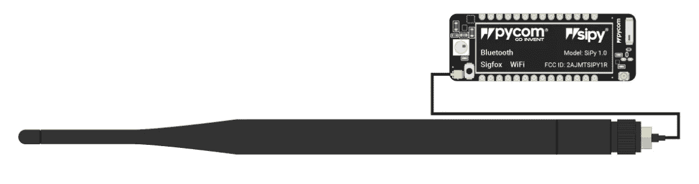
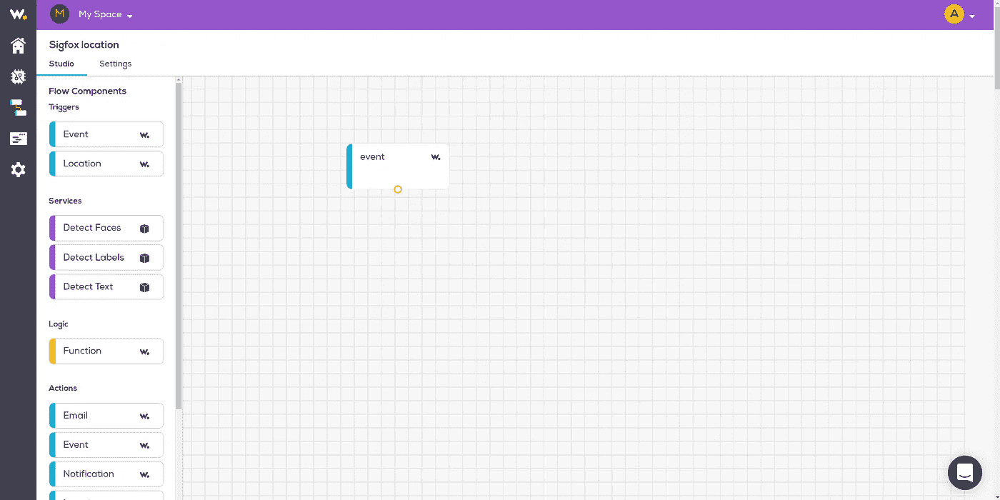
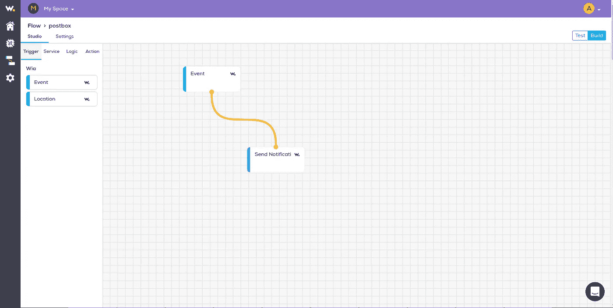
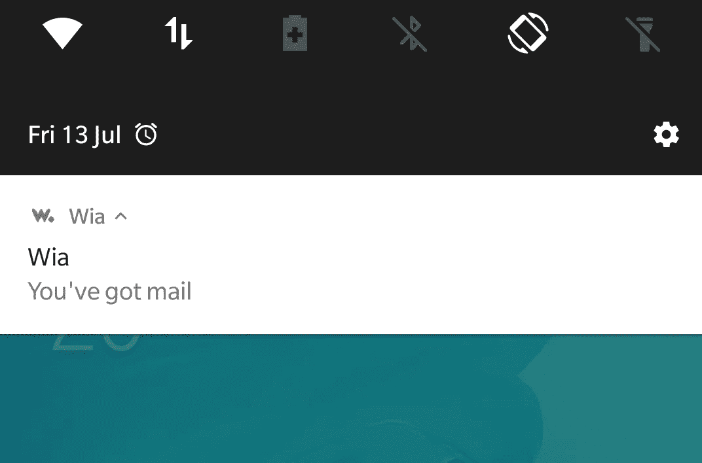

# 使用 Sigfox 和 Pycom 构建智能邮箱

> 原文：<https://medium.com/coinmonks/build-a-smart-mailbox-with-sigfox-and-pycom-364e272666db?source=collection_archive---------6----------------------->


今天，我们将向您展示如何使用 Wia 和 Pycom SiPy 创建 Sigfox 邮件通知程序。

本教程假设您已经将 Sigfox 连接到 Wia。如果尚未连接，请单击此处查找 Sigfox 初始设置和向 Wia 发布数据的教程。

# 成分

*   [Pycom SiPy](https://pycom.io/hardware/sipy-specs/)
*   [Pycom 扩展板](https://pycom.io/product/expansion-board-3-0/)
*   Sigfox 兼容天线
*   移动设备(iOS 或安卓)
*   [HC-SR04 超声波传感器](https://www.amazon.co.uk/ELEGOO-Ultrasonic-Raspberry-Datasheet-Available/dp/B01M0QL1F1/ref=sr_1_3?ie=UTF8&qid=1531485159&sr=8-3&keywords=hc-sr04)

# 设置您的电路板

*   将 SiPy 连接到扩展板。(Pycom 标志应该面向同一方向)
*   将 Sigfox 天线连接到 SiPy。连接是 SiPy 板左下方的小金圆。只需将天线卡入到位。



对于 HC-SR04 超声波传感器，需要将以下引脚连接到 Pycom SiPy:

*   HC-SR0 | Pycom
*   Vcc -> Vin
*   Trig -> G8
*   回声-> G7
*   Gnd -> GND

# 设置您的项目

原子中:

*   为项目创建一个新文件夹。我要给我的邮箱打电话
*   在 [Atom](https://atom.io/) 中，转到`File > New Window`打开一个新窗口
*   单击`File > Add Project Folder`并导航至新创建的文件夹，添加该文件夹
*   如果你的 Atom 窗口底部没有打开 [Pymakr](https://atom.io/packages/pymakr) 插件，点击右边的箭头打开它
*   选择`Settings > Project Settings`。在地址字段中，用上述步骤中的设备名称替换该值，例如`/dev/tty.usbmodemPy343431` (Mac OS X)、`COM3` (Windows)、`/dev/ttyACM0` (Linux)，然后保存该文件

# 为我们的邮件发布 sigfox 事件

我们的申请需要三个文件:

*   `boot.py`设备通电时运行
*   `main.py`这是我们的主要代码
*   `ultrasonic.py`是我们获取距离和校准的功能所在

在 Atom 中:

*   右键单击您的项目，然后单击新建文件。输入`boot.py`作为文件名
*   将下面的代码复制并粘贴到文件中

```
**from** machine **import** UART
**import** machine
**import** osuart = UART(0, baudrate=115200)
os.dupterm(uart)machine.main('main.py')
```

*   右键单击您的项目，然后单击新建文件。输入`main.py`作为文件名
*   将下面的代码复制并粘贴到文件中

```
**import** time
**import** pycom
**import** socket
**from** network **import** Sigfox
**from** machine **import** Pin, Timer
**import** ultrasonic pycom.heartbeat(**False**)echo = Pin(Pin.exp_board.G7, mode=Pin.IN)
trigger = Pin(Pin.exp_board.G8, mode=Pin.OUT)
trigger(0)# Get the chronometer object
chrono = Timer.Chrono()# init Sigfox for RCZ1 (Europe)
sigfox = Sigfox(mode=Sigfox.SIGFOX, rcz=Sigfox.RCZ1)
# create a Sigfox socket
s = socket.socket(socket.AF_SIGFOX, socket.SOCK_RAW)
# make the socket blocking
s.setblocking(**True**)
# configure it as uplink only
s.setsockopt(socket.SOL_SIGFOX, socket.SO_RX, **False**) calabrated_distance = ultrasonic.calabration(chrono, trigger, echo, 1)
mailed_distance = 0
**while** **True**:
    time.sleep(30)
    distance = ultrasonic.getDistance(chrono, trigger, echo)
    print("distance: {}, calabration: {}".format(distance, calabrated_distance))
    **if** distance < calabrated_distance:
        **if** distance != mailed_distance:
            s.send('') # Send 1 bit
            print("you got mail")
            mailed_distance = ultrasonic.calabration(chrono, trigger, echo)
```

*   右键单击您的项目，然后单击新建文件。输入`ultrasonic.py`作为文件名
*   将下面的代码复制并粘贴到文件中

```
**from** machine **import** Pin, Timer
**import** pycom
**import** time
**import** socket**def** **calabration**(chrono, trigger, echo, led = False):
    **if** led:
        pycom.rgbled(0x7f0000) # red
    prev_distance = 0
    distance = getDistance(chrono, trigger, echo)
    print("calibration distance is {}".format(distance))
    count = 0
    **while** **True**:
        prev_distance = distance
        distance = getDistance(chrono, trigger, echo)
        **while** prev_distance == distance:
            count+=1
            print("count: {}".format(count))
            **if** count > 5:
                **if** led:
                    pycom.rgbled(0x007f00) # green
                    time.sleep(1.5)
                    pycom.rgbled(0) # off
                **return** distance
            time.sleep(5)
            prev_distance = distance
            distance = getDistance(chrono, trigger, echo)
        **else**:
            count = 0**def** **getDistance**(chrono, trigger, echo):
    chrono.reset()
    trigger(1)
    time.sleep_us(10)
    trigger(0) **while** echo() == 0:
        **pass**
    chrono.start() **while** echo() == 1:
        **pass**
    chrono.stop() distance = chrono.read_us() / 58.0
    **if** distance > 400:
        **return** -1
    **else**:
        **return** int(distance) time.sleep(1)
```

您的文件夹结构现在应该如下所示:

*   `ultrasonic.py`
*   `boot.py`
*   `main.py`

点击 Atom 窗口底部的 Pymakr 插件中的`Upload`，将代码发送到您的 Pycom 板。现在转到 Wia 仪表板，您应该看到数据出现在仪表板的调试器部分。

为了让传感器正常工作，它需要校准你的邮箱内的距离。

# 校准

要校准传感器，请将传感器放在邮箱中最合适的位置。给董事会供电；当板上的 LED 为红色时，传感器正在校准；一旦 LED 闪烁绿色，传感器已被校准。传感器需要至少 2 厘米的空间才能正常工作。

现在，当邮件被插入您的邮箱时，距离将从校准后的距离减少，代码将通过 Sigfox 向 Wia 发布一个事件。

# 发送推送通知

现在，下一步，一旦我们在 Wia 中收到 Sigfox 事件，我们将向任何连接的电话发送一个有邮件的通知。为此，我们需要建立一个流程。

走到你的 Wia 仪表盘和你的 Sigfox 设备所在的地方。从那里点击左边菜单中的流程图标，进入您的流程。



现在来创建你的心流，你可以给它起任何你喜欢的名字。一旦你创建了一个流，你应该被带到流工作室。

在 Flow studio 中:

*   将`trigger event node`从左侧拖到画布上
*   点击节点并输入`sigfoxDataUplink`作为事件名称
*   启用 Sigfox 设备作为事件源

现在，我们将为 Sigfox 事件添加一个通知，这样我们就可以收到关于入站邮件的通知。为此，您将需要 Wia 移动应用程序。iOS [这里](https://itunes.apple.com/us/app/wia-talk-to-your-things/id1320616870?ls=1&mt=8)安卓[这里](https://play.google.com/store/apps/details?id=io.wia.wia)都可以下载。



在 Flow Studio 编辑器中:

*   将鼠标拖到通知节点上，并输入以下文本

```
You've got Mail!
```

现在，您应该可以在移动设备上接收 Sigfox 数据了。

