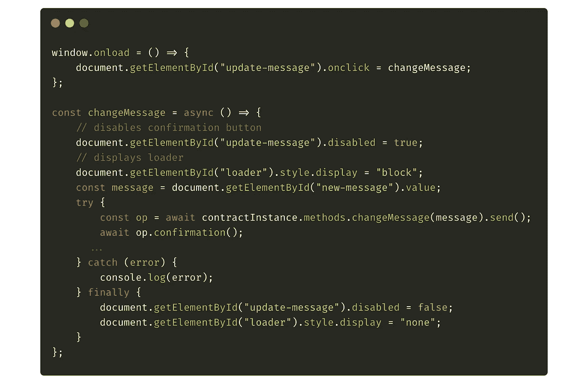
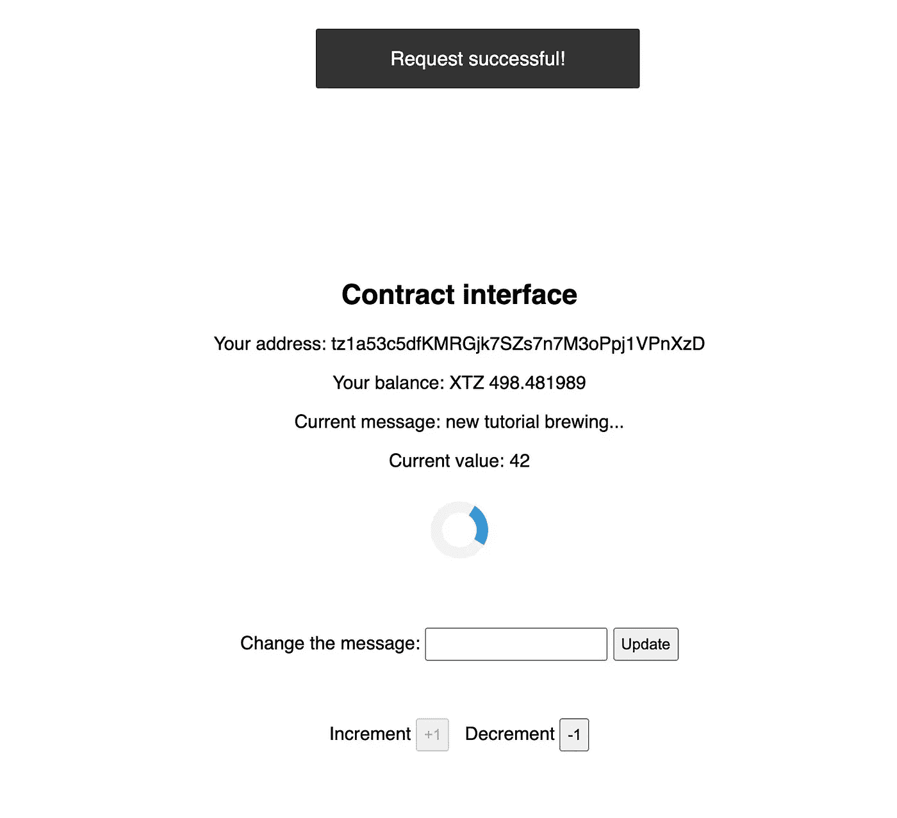

# 使用 Taquito 和 Beacon SDK 构建一个 Tezos dapp

> 原文：<https://medium.com/coinmonks/build-a-tezos-dapp-using-taquito-and-the-beacon-sdk-692d7dc822aa?source=collection_archive---------0----------------------->

## 使用 Tezos 开发中最热门的两种技术来构建 dapp

[Background Vectors by Vecteezy](https://www.vecteezy.com/free-vector/background)

> 注意:自本文撰写以来，Taquito 和 Beacon 方面已经有了很多更新。要构建使用这两个库的最新版本的 dapp，您可以查看[如何在 2021 年](https://news.ecadlabs.com/how-to-build-your-first-tezos-dapp-2021-edition-b1263b4ba016)构建您的第一个 dapp。

在过去的六个月里，Tezos 上的 dapp 开发环境已经发生了很大的变化。它从痛苦而漫长的努力变成了公园里的散步。这种变化之所以成为可能，是因为引入了强大的工具，允许开发人员专注于为他们的[dapp](https://blog.coincodecap.com/what-are-dapps-an-ultimate-guide)提供价值和功能，而忘记将他们的 dapp 插入区块链的技术细节。

[Taquito](https://tezostaquito.io/) 不需要任何介绍，它是连接您的 Tezos dapp 和区块链的事实上的工具。但是不要让它的垄断地位诱惑你，它是一个令人惊叹的工具，会让你作为开发者的工作快 100 倍，也容易 100 倍。通过几行代码，您的 dapp 将被设置并连接到区块链和您的智能合约。Taquito 将在后台完成所有繁重的工作，因此您不必担心。

[Beacon](https://www.walletbeacon.io/) 是由 [Airgap](https://airgap.it/) 开发的一个工具包，它连接到一个钱包(目前是连接到 Airgap 钱包)并对要发送到网络的交易进行签名。稳定版是最近才推出的，但已经很有前景了。我们将在本教程中使用 Beacon 扩展来签署交易，但您也可以使用手机上的钱包！Beacon 提供了一个简单、时尚、高效的界面，包含大量信息和可定制的选项！

对于本教程，我选择普通 JavaScript 来编写 dapp，因为它将为您提供使用 Taquito 和 Beacon wallet 所需的所有信息，并使代码适应您喜欢的任何框架。我们将构建的 dapp 非常简单，它连接到我在 Carthagenet ( *testnet* )上部署的演示智能合约，以测试不同的功能，dapp 有一个按钮来连接您的钱包，一个简单的界面，带有来自区块链和智能合约的信息，它为您提供了两个选项来将数据保存到智能合约中。为了继续阅读，你必须至少掌握 HTML/CSS/JS 的基本知识，以及[Tezos 区块链是如何工作的](https://blog.coincodecap.com/tezos-blockchain-a-simple-overview-for-beginners/)。

# 准备工作区

由于本教程并不关注 HTML 或 CSS，我准备了一个样板文件，您可以从 Github 下载，这样我们就可以更快地开始编写一些 JavaScript 了😉你会在这个地址找到整个项目[。您可以跟随本教程并查看。或者你可以删除这个文件，从零开始。](https://github.com/claudebarde/taquito-beacon-tutorial)

首先要做的是下载必要的包。您可以简单地从项目的根目录运行`npm install`并检查`package.json`文件。您将看到创建 Tezos dapp 所需的两个主要依赖项:`@taquito/taquito ^6.3.0-wallet.4`和`@taquito/beacon-wallet ^6.3.1-beta.0`。这些是本教程发布时可用的最新版本。

> 注意:你不需要安装`@airgap/beacon-sdk`，因为 Taquito 会帮你安装！

如果你检查 HTML 文件，你会看到它非常简单，一个`main`标签包含两个`divs`:一个会显示连接你钱包的按钮，一个会显示合约界面。

`style.css`文件包含基本的样式信息，您可能已经注意到了一个`toast.css`文件，我们稍后将覆盖 Beacon wallet 的一些特性时会用到它。

此时，您应该已经在浏览器中安装了 Beacon 扩展。如果没有，请按照这些说明进行安装。您将需要它来与 dapp 中的智能合约进行交互。

# 连接您的钱包

让我们现在开始编码吧😅

打开一个名为“ *index.js* 的新 JS 文件。首先，让我们导入我们需要的依赖项。如果您检查了 Github repo 中提供的`index.js`文件，您可能会在顶部看到`import "babel-polyfill"`。这仅需要与本项目中使用的捆扎机[包](https://parceljs.org/)一起使用 ES6 语法。

接下来，我们导入这个项目所必需的两个依赖项:

第一行导入了创建`wallet`对象所需的`BeaconWallet`类。第二行从 Taquito 导入`Tezos`对象。这是一个多用途的物体，我们将在不同的情况下使用。您还可以看到，我们初始化了一个名为`contractAddress`的变量，该变量将保存[我们想要连接到的契约](https://better-call.dev/carthagenet/KT1PCLg8Da8T5h5SWibMopPVsxiKg27tSRxx/operations)的地址(在地址可能经常改变的开发过程中非常有用)。

当你运行`npm run dev`并在`[http://localhost:1234](http://localhost:1234,)`上打开一个新窗口时，你会看到一个大的蓝绿色按钮。这是您将点击以连接您的钱包的按钮。首先，我们必须将它连接到初始化钱包的函数:

之后，我们可以开始编写钱包初始化的不同步骤:

请注意，该函数必须是异步的。下一步包括设置我们之前导入的`Tezos`对象。我们将通过调用它的`setProvider`方法告诉它我们想要连接到哪个网络(这里是 *Carthagenet* ):

我通常建议将钱包初始化或交易过程的步骤打包到一个`try ... catch ...`语句中，因为很多事情都可能出错，如果事情没有按预期进行，通知用户是至关重要的。

`Tezos` singleton 实例，即从`@taquito/taquito`导入的对象(在文档中称为`[TezosToolkit](https://tezostaquito.io/typedoc/classes/_taquito_taquito.tezostoolkit.html)`)有一个名为`setProvider`的方法，该方法接受一个具有[不同属性](https://tezostaquito.io/typedoc/classes/_taquito_taquito.tezostoolkit.html#setprovider)的对象，其中一个名为`rpc`，该属性必须是到 Tezos 节点 RPC 接口的链接。我一般用 SmartPy 提供的，你也可以用自己喜欢的。

既然我们已经告诉了我们的 dapp 我们想要连接到哪个网络，那么现在是时候照顾好钱包了！首先，我们用从库中导入的类创建一个新的 Beacon wallet 实例:

新的`wallet`对象必须用包含不同选项的对象实例化。至少，您应该为您的 dapp 提供一个名称，它将出现在用于签署交易的弹出窗口中。我们稍后将添加更多选项。

> 在钱包中设置您的 dapp 的名称对于一般用户体验来说是一个重要的细节，因为您的 dapp 的用户将知道他们正在使用的 dapp 触发了弹出窗口，而不是其他东西。

然后，用`new BeaconWallet(options)`创建一个新的钱包。一旦创建了新的钱包，您就可以通过创建一个带有`type`属性的对象来设置您想要连接的网络。默认情况下，信标钱包将连接到`mainnet`，但是您也可以使用`carthagenet`值连接到 Carthagenet 或`custom`连接到沙盒节点。如果您愿意，您还可以使用`rpcUrl`属性指定您想要连接到的 RPC URL(如果没有提供，wallet 将连接到它的默认 RPC 访问点)。

在您决定了网络之后，`wallet`对象提供了一个`requestPermissions`方法，该方法将请求连接到指定网络并代表您签署交易的许可。一旦允许，你的钱包就配置好了，可以使用了！在此配置步骤中要做的最后一件事是将 wallet 设置为 Taquito 的默认 wallet:

新的 Wallet API 在`Tezos`对象上提供了一个`setWalletProvider`方法，允许您向 Taquito 指示您想要使用的 Wallet(在设置好之后)。从现在开始，Taquito 将使用 Beacon 钱包发送交易！

# 更新 dapp 界面

当你创建一个 dapp 时，总是建议给你的用户提供关于他们账户的基本信息，比如他们的地址和余额。这种反馈表明他们的钱包设置正确，并且 dapp 连接到区块链和他们的钱包。

初始化钱包后，你可以很容易地从`wallet.permissions.address`获得用户的地址。一旦有了地址，就可以使用 Taquito 提供的`Tezos`对象获得用户的余额:

同时，将契约实例保存在内存中会很有用，这样我们在向区块链发送事务时就可以方便地访问它。多功能的`Tezos`物体将再次帮助我们。在新的 Wallet API 下，使用`Tezos.wallet.at(contractAddress)`为您提供了智能契约的抽象。在此过程中，我们可以使用同一个抽象实例来获取契约的存储，并通过调用契约实例上的`storage`方法，使用直接来自契约的数据进一步更新我们的 dapp 接口:

现在在现实生活中，你可能会使用一个框架来构建你的 dapp，比如 React 或 Vue，但是我们在这里使用的是普通的 JS，所以我们必须手动更新 DOM。我创建了一个简单的函数来更新 HTML 标签中的文本，以遵循 [DRY(不要重复自己)原则](https://en.wikipedia.org/wiki/Don%27t_repeat_yourself)。首先，我们希望隐藏“Connect”按钮并显示 dapp 界面，然后用我们从智能合约中获得的数据更新所有值:

这里有一些一般性的观察:

*   为了避免不必要的代码多次请求地址和余额，我通常更喜欢将用户的地址和余额放在顶层，并在代码的任何地方都可以访问。大多数钱包在用户登录和退出时调度事件，您可以拦截这些事件来修改地址或余额(我们将在后面看到)。
*   余额总是在 microtez 中返回，这对于计算来说很好，但是对于 dapp 用户来说很难阅读。不要忘记用余额除以`1,000,000`来得到一个更易读的数字。你可以多做一点，把它弄圆，然后用`toLocaleString("en-US")`让它变得更漂亮！
*   Taquito 将值保存在存储器中，作为由`contractInstance.storage()`返回的对象的属性。这样就很容易访问存储中的值(除了稍微复杂一点的地图和大地图)。

# 更新智能合约中的消息

现在我们的 dapp 已经准备好玩智能合约了！

Github 存储库中提供的 JavaScript 文件包含 3 个函数，用于更改智能合约中的消息和递增/递减一个整数值。我们将在这里编写`changeMessage`函数，你也可以尝试自己编写`increment`和`decrement`函数(如果需要帮助，请发表评论)！

首先，我们创建一个`changeMessage`函数，并将其附加到 id 为`update-message`的按钮的`click`事件上:

这是记住一些用户体验建议的好时机。许多 dapp 用户没有意识到，在 mainnet 上向一个块添加一个事务实际上需要一分钟(在 testnet 上大约需要 30 秒)，他们中的一些人会失去耐心，多次点击确认按钮。这将创建多个交易，他们可能会接受，认为第一个交易没有通过。你必须阻止它。当他们确认一个交易时，你应该禁用界面中可操作的部分，并清楚地告诉他们必须等待。这是接下来两行代码的目标:

现在，在当前事务处理完之前，您的用户不能发送新的事务，他们会看到一个小的微调按钮，表示有东西正在加载，他们应该等待😊同时，我们得到他们在输入中输入的信息。如果您愿意，您可以检查是否有消息或者字符串是否遵循某些规则。

接下来，是时候再次使用 Taquito 并发送事务以将消息保存到智能合约中:

下面是几行代码中发生的情况:

1.  我们使用一个`try ... catch ... finally ...`语句来包装事务。如果事务由于任何原因失败，您必须通知您的用户，这样他们就可以停止等待，也许可以自己解决问题。
2.  我们之前保存的契约实例公开了一个`methods`属性，该属性包含反映智能契约的入口点的自身属性。在这种情况下，我们想调用`changeMessage`，它需要一个字符串作为参数。结果提供了一个`send`方法，该方法将把事务发送到 Tezos 节点，并返回一个承诺，该承诺通过一个事务操作对象进行解析。
3.  交易发送后，您必须等待其确认。上面一行返回的事务操作对象提供了一个`confirmation`方法。如果没有提供参数，Taquito 等待 1 个块确认。如果您提供一个数字`n`作为参数，Taquito 将在执行下面几行之前等待`n`阻塞确认。
4.  如果事务失败，您将获得一个`error`对象，可以用它向用户显示一条消息。
5.  在事务处理完成或失败之后，您希望通过启用确认按钮并删除微调器来将界面返回到工作状态。

交易确认后，您可以做几件事:

1.  您可以重置消息的值。一般来说，这是一个很好的线索，表明发生了一些事情，消息“消失了”。
2.  你应该刷新存储器。虽然您也可以只更新包含来自存储区的消息的 HTML 标记，但最好在事务处理后获取一个新的存储区，以防在事务处理过程中发生其他变化。如果你使用一个框架，你可能有一个带有`storage`属性的状态，获取一个新的存储将会更新链接到该状态的接口中的所有数据。
3.  您可以做一些其他小的更新，例如获取用户的新余额，以反映交易中记入借方的汽油费用。

# 定制 Beacon SDK

Beacon SDK 提供了多种方式来定制用户的钱包体验。让我们在这里检查其中一个。

发送交易以更新智能合约后，您可以在 dapp 中看到一个弹出窗口，为您提供有关交易的有用信息:

也许您不希望这个弹出窗口出现，并且您希望提供一个定制的响应，比如祝酒词。不要害怕，因为只需要 2 分钟就可以完成！

让我们回到过去。你还记得我们是如何创造新的 Beacon 钱包的吗？用`new BeaconWallet(options)`。对象包含了你的 dapp 的名字。事实证明，您可以提供更多选项来定制您的 dapp！在本教程中，我们将使用一个祝酒词来通知我们的用户，交易已成功发送到网络！

在 HTML 文件中，你可以在最底部看到 toast:`
Some text...
`。在 JS 文件中，让我们添加一个函数，该函数将在 toast 中显示一条消息，并在 3 秒钟后显示和隐藏该消息:

首先，我们将 toast 延迟 3 秒钟，因为在您确认交易后，Beacon wallet 窗口大约需要 2 秒钟才能关闭。然后我们更新 toast 中的消息，我们显示它 3 秒钟，然后再次隐藏它。

现在，让我们回到钱包初始化选项，看起来应该是这样的:

我们将向`options`对象添加一个`eventHandlers`属性，告诉 Beacon 当事务请求成功发送时我们想要做什么。`eventHandlers`属性接受一个对象，您可以根据想要捕捉的事件设置不同的属性。让我们看看它是如何在请求成功时调度事件的:

该属性必须是 Github repo 的[枚举中列出的事件之一。每个事件处理程序接受一个带有`handler`属性的对象，您可以将该属性设置为接收事件数据的承诺。当交易成功发送时，我们使用这个承诺来显示我们的祝酒辞。结果如下:](https://github.com/airgap-it/beacon-sdk/blob/master/src/events.ts)

现在，默认的信标弹出窗口消失了，取而代之的是我们的祝酒词。使用这种非常简单的方法，您可以定制来自信标 wallet 的响应，例如在出现错误的情况下或针对不同的事件，如连接到 wallet。当用户使用不同的地址登录时，您也可以使用它来更改用户的地址和余额。

# 结论

这个非常简单的 dapp 提供了一个机会来展示你现在可以用来构建 Tezos 的两个最好的工具的优势:Taquito 和 Beacon SDK。两者都提供了广泛的功能、高水平的定制和一个界面，允许开发人员编写更少的代码，更关注用户体验，而不是与 Tezos 节点交互的细节。

Taquito 的新钱包 API 朝着使用不同钱包将 dapp 连接到区块链的方向迈出了一大步，Beacon wallet 最终为 Tezos dapps 提供了一个安全、美观且易于使用的钱包解决方案。

> [直接在您的收件箱中获得最佳软件交易](https://coincodecap.com/?utm_source=coinmonks)

现在生态系统终于准备好迎接更多的 dapp 开发者了，所以让我们开始建设吧👷‍♀️👷‍♂️

👇

你也可以通过阅读 [Jev 关于这个主题的最后一篇文章](/@jevonearth/the-start-of-a-better-dapp-wallet-story-for-tezos-7538a399724e)来获得更多关于 Taquito 和 Wallet API 的信息。