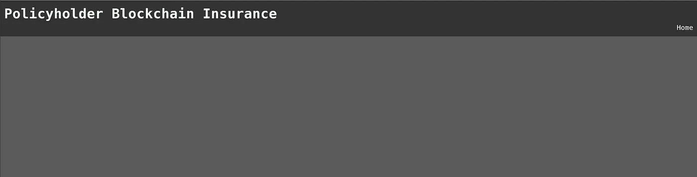
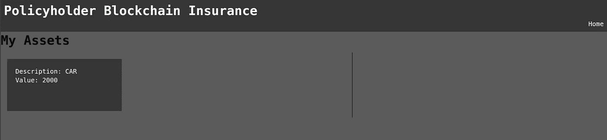
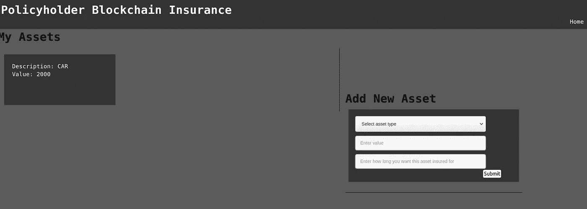
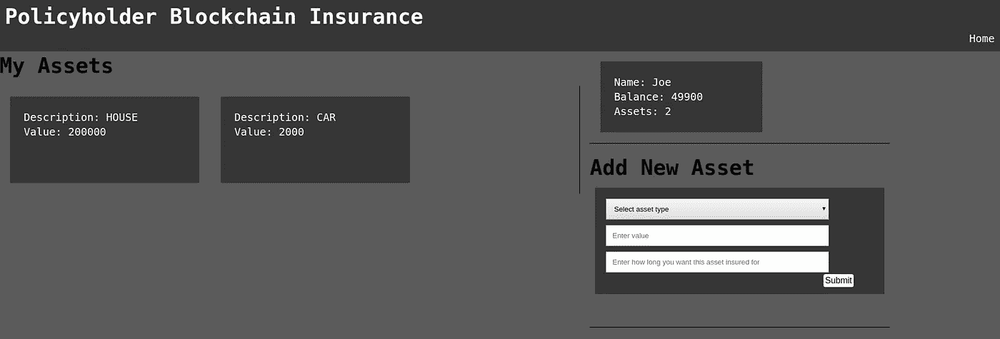
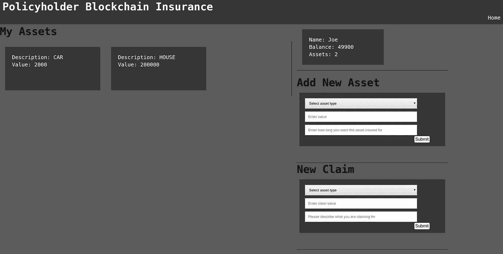
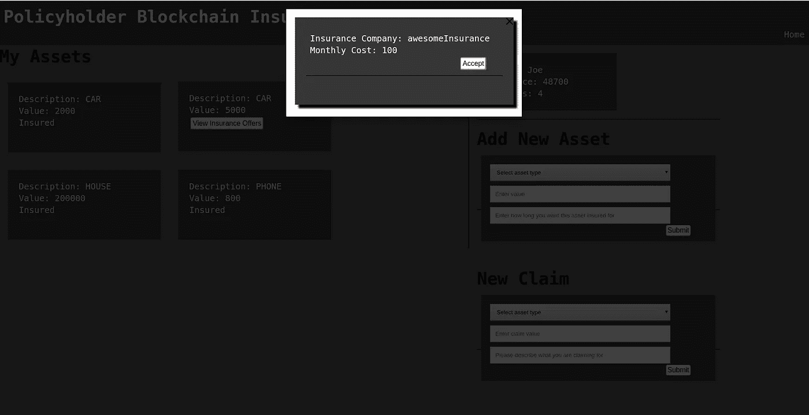

# 使用 Hyperledger Composer 和 React.js 构建保险应用程序第 2 部分

> 原文：<https://medium.com/coinmonks/build-an-insurance-application-with-hyperledger-composer-and-react-js-part-2-da27a9dfdee5?source=collection_archive---------0----------------------->

这是教程的第二部分，第一部分可以在这里找到:

**找到** [**这里**](https://github.com/jackjulianhickey/Hyperledger-Insurance-Tutorial/tree/master/policyholder_app)

在本节中，我们将通过 RESTful API 将 Hyperledger Fabric 网络与 web 应用程序集成，并在前端使用 React.js。**本教程中构建的 web 应用程序只是投保人应用程序。**

# **实施**

请注意，上一教程中的设置是必需的，因此已经创建了资产、投保人、保险公司等。

在 insurance_application 文件夹中，运行以下命令来**创建投保人 web 应用程序的框架:**

```
npx create-react-app policyholder_app
cd policyholder_app
```

**打开 src/App.js，删除函数 App** 返回中的代码，只添加 Hello World 作为占位符，这样你的 App.js 文件看起来就像这样:

**用以下代码替换 src/App.css** 中的代码:

React 应用程序的默认端口号是 3000，因此需要进行更改，以免与 REST API 端口冲突。为此，c **将 package.json 的脚本部分更改为以下内容，以使端口 3001:**

我们还需要**在文件底部添加一个代理**，它将连接到 Hyperledger Composer 网络，所以只需在右花括号前添加以下代码行:

```
"proxy": "[http://localhost:3000/](http://localhost:3000/)"
```

在该文件夹中制作以下**新文件夹 src/components** 和以下**新文件 Header.js** 。这将为我们的应用程序创建一个带有主页链接的简单标题:

现在**修改 App.js** 以便它导入:

```
import { BrowserRouter as Router, Route } from 'react-router-dom';
import Header from './components/Header'
```

它实现**组件 Header.js** 如下:

```
<Router>
      <Header/>
</Router>
```

App.js 现在应该是这样的:

您可能需要**安装 react-router-dom:**

```
npm install --save react-router-dom
```

此外，稍后您可能还需要**安装 react-responsive-modal:**

```
npm install react-responsive-modal --save
```

现在**运行应用程序**，通过运行 policyholder_app 文件夹中的以下内容来测试一切正常

```
npm start
```

如果一切正常，应用程序应该如下所示:



**创建一个函数连接区块链 RESTful API** 。使用以下代码创建 src/Connection.js:

**在 components 文件夹中创建一个类 component Homepage.js** 。这将在主页上显示所有组件:

要导入用户资产并在主页上显示它们，需要另一个类组件。**创建一个类组件 UsersAssets.js** 并包含以下代码:

这需要将资产作为 props 数组传递。
要显示资产，使用 map 遍历数组，并将项目传递给名为 UserAssetsItems.js 的类组件

**创建单独处理资产的类组件 userassetitems . js**。这只是创建了一个带有资产类型和值的卡片。注意，我在这里做了内联样式，但是如果你觉得这样做更舒服的话，你也可以用 CSS 来做。

**通过在文件顶部添加以下代码行，将用户资产项导入用户资产**

```
import UserAssetsItems from './UserAssetsItems'
```

**将用户资产导入主页，并更新主页代码，如下所示**。这只是显示用户的资产并对它们进行样式化。Homepage 现在还要求将 assets 数组作为 prop 传递，这样就可以将它传递给 UserAssets.js

在 App.js **中返回**添加一个状态**以便包含我们的用户名和一个空的资产数组，如下所示:**

```
state = {
  name: "joe",
  assets: []
}
```

该名称将被用作硬编码值，因为该网站还没有登录。

**通过在文件顶部添加以下行，将 Connection.js 导入 App.js** 。

```
import Connection from './Connection'
```

为了能够获得用户的资产，需要在我们的区块链网络中创建一个执行此操作的查询。**因此，在 risk-analysis-tutorial 文件夹中，向 queries.qry 添加以下行将返回用户的资产:**

```
query selectAssetByPolicyholder {
  description: "Select an asset based on the owner"
  statement:
    SELECT org.acme.riskanalysis.PrivateAsset
      WHERE (policyholder == _$policyholder)
}
```

**现在将 package.json 更新到版本 4，并重新部署您的网络:**

```
composer archive create --sourceType dir --sourceName . -a risk-analysis-tutorial@0.0.4.bna
composer network install --card PeerAdmin@hlfv1 --archiveFile risk-analysis-tutorial@0.0.4.bna
composer network upgrade -c PeerAdmin@hlfv1 -n risk-analysis-tutorial -V 0.0.4
```

**运行 composer rest 服务器**

```
composer-rest-server -c admin@risk-analysis-tutorial -n never -u true -w true
```

**在 App.js 中添加一个函数，从区块链网络中检索用户的资产，如下所示:**

**通过在文件顶部添加以下行，将主页导入 App.js**

```
import Homepage from './components/Homepage'
```

现在我们有了资产，我们可以将它们传递到我们的主页，所以在 App.js 的路由器中添加下面的行，它将资产作为道具传递。

**您的完整 App.js 文件现在应该看起来像这样**

如果一切正常，您应该会在 web 应用程序上看到以下内容。注意:此处显示的资产是在本教程的第 1 部分中创建的资产。



为了添加新资产，我们需要 App.js 中的一个函数来实现这一点，因此**在 App.js 中创建函数 add asset:**

接下来，我们想要创建用于显示和实现添加新资产的能力的组件。**在组件中新建一个组件 add asset . js:**

您会注意到，在上面的代码中，我们还使用了表单的另一个组件，因此我们需要**创建 AddAssetForm.js:**

在**首页. js 导入 AddAsset.js:**

```
import AddAsset from "./AddAsset"
```

**现在通过添加以下 div、样式和道具在 Homepage.js** 中实现 AddAsset:

现在我们需要**通过更新 App.js 中的主页路径，将我们的 addAsset 功能从 App.js 传递到 Homepage.js** 如下:

```
<Homepage assets={this.state.assets} addAsset={this.addAsset} />
```

您现在应该在您的 web 应用程序中查看以下内容。



通过添加新的资产对其进行测试，单击“提交”后，它应该会出现在您的资产中。这可能需要几秒钟才能完全完成。

现在，我们还可以添加一个显示用户基本信息的配置文件。

在组件中**创建一个名为 Profile.js 的新文件，并添加以下代码:**

**在 App.js update getAssets 中，状态和组件将挂载以表示以下内容，并添加函数 getUserProfile:**

**将配置文件导入到 Homepage.js，并添加以下 div、样式和道具**，这样您的 Homepage.js 现在看起来如下:

请记住，我们现在还需要将用户对象从 App.js 传递到主页，因此**将主页路径更新为以下**:

```
<Homepage assets={this.state.assets} addAsset={this.addAsset} user={this.state.user}/>
```

您的 web 应用程序现在应该是这样的:



投保人网络应用程序的最后两个部分是接受和提供保险以及提出索赔的能力。这两者都依赖于保险公司的申请。但是，我们仍然可以使用 Hyperledger Composer Rest Server 提供的测试界面来测试这些工作。

让**实现创建一个声明，首先添加一个名为 NewClaim.js 的新组件，并向其中添加以下代码:**

接下来**创建新的索赔表单。js** 将处理用户创建索赔时的表单细节 **:**

**在 Homepage.js 导入 NewClaim.js** 时，在代码顶部添加以下一行:

```
import NewClaim from "./NewClaim"
```

**将以下样式**添加到 Homepage.js 的内嵌样式中:

```
NewClaimStyle: {
        position: 'absolute',
        top: '610px',
        width: '30%',
        height: '34%',
        borderBottom: '1px solid black',
        left: '59%'
      }
```

同时**增加以下 div:**

```
<div style={style.NewClaimStyle}>
          <NewClaim newClaim={this.props.newClaimFunc} assets=   {this.props.assets} />
</div>
```

我们还需要一个函数来处理新索赔的创建，所以**将以下函数添加到 App.js 中:**

现在**更新首页路线**通过功能如下:

```
<Homepage assets={this.state.assets} addAsset={this.addAsset} user={this.state.user} newClaimFunc={this.newClaim} />
```

现在你的主页应该如下所示



投保人申请的最后一部分是接受未保险资产的保险提议。这是一个需要实现的大元素。

首先，我们需要创建一个新的查询，返回该投保人的保险报价，因此**将以下内容添加到查询中。qry 在您的区块链网络代码中:**

```
query selectInsuranceOffersByPolicyholder {
  description: "Select an insurance offer based on the policyholder"
  statement:
    SELECT org.acme.riskanalysis.InsuranceOffer
      WHERE (policyholder == _$policyholder)
}
```

现在**将 package.json 更新到版本 5，再次启动您的网络:**

```
composer archive create --sourceType dir --sourceName . -a risk-analysis-tutorial@0.0.5.bna
composer network install --card PeerAdmin@hlfv1 --archiveFile risk-analysis-tutorial@0.0.5.bna
composer network upgrade -c PeerAdmin@hlfv1 -n risk-analysis-tutorial -V 0.0.5
```

**运行 composer rest 服务器:**

```
composer-rest-server -c admin@risk-analysis-tutorial -n never -u true -w true
```

如果您还没有，**从 Hyperledger Composer Rest 服务器界面创建一项新资产并提供保险。**

**在组件:**中创建一个名为 ViewInsuranceOffers.js 的新组件

现在**创建 viewinsuraceoffersitems . js:**

**更新 UserAssets.js，如下所示:**

**还要更新 UserAssetsItems.js，使其看起来如下:**

**将这些函数添加到 App.js:**

**更新 App.js 中的主页路径，使其看起来像这样:**

```
<Homepage assets={this.state.assets} addAsset={this.addAsset} user={this.state.user} newClaimFunc={this.newClaim} 
insuranceOffers={this.state.insuranceOffers} 
acceptInsuranceOfferFunc={this.acceptInsuranceOffer}/>
```

**将 componentWillMount()更新为以下内容:**

```
componentWillMount() {
    this.getAssets()
    this.getUserProfile()
    this.getInsuranceOffers()
  }
```

Homepage.js 中的 **UserAssets 组件必须更新为以下内容:**

```
<UserAssets assets={this.props.assets}
insuranceOffers={this.props.insuranceOffers} acceptInsuranceOfferFunc={this.props.acceptInsuranceOfferFunc}/>
```

现在，尝试通过在 Hyperledger Composer Rest 界面中向没有保险的资产提供保险来进行测试，您应该会看到类似于以下内容的内容:



由于本教程已经相当长了，我将稍后提供保险公司应用程序的代码，但是我鼓励你自己尝试一下，如果你有任何问题，请随时联系我。

> [直接在您的收件箱中获得最佳软件交易](https://coincodecap.com/?utm_source=coinmonks)

[](https://coincodecap.com/?utm_source=coinmonks)