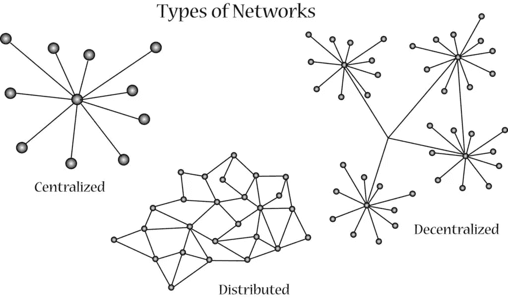

# 用 NBdomain 构建分散式 Web

> 原文：<https://medium.com/coinmonks/build-decentralized-web-with-nbdomain-b1f7c6980d82?source=collection_archive---------2----------------------->



正如我们已经知道的，NBdomain 系统是为了解决传统领域系统的[问题，并在 Web3 中提供](https://nbdomain.medium.com/nbdomain-blockchain-domains-for-a-better-internet-bcd07213ef5c)[强大的功能](/coinmonks/nbdomain-a-global-id-owned-by-you-26539e05245)而创建的。

我们还学习了如何[将降价内容放入 NBdomain](/coinmonks/use-nbdomain-to-manage-contents-on-blockchain-with-ease-561eb3b04095) 。

这里我们要涵盖最重要的部分，如何在 NBdomain 系统上搭建一个功能齐全的去中心化网站？

> **我们将利用 IPFS 来托管内容**

# 为什么是 IPFS？

IPFS 是一种众所周知的成熟技术，可以以分散的方式托管数据。它已经被很多项目使用，这意味着它现在相当可靠。要了解更多关于 IPFS 的信息，请访问 [https://ipfs.io](https://ipfs.io) 。

它提供了一个绝大多数区块链项目都难以应对的独特功能，**IPFS 的数据可以被删除**。它让内容提供商安心，无需担心错误上传的内容。

NBdomain 利用 IPFS 托管内容，并将内容的哈希放在区块链上，完美地证明了所有权，大大降低了托管成本。

> 请注意:使用 IPFS 托管分散式站点只是 NBdomain 的一个用例。这不是在 NBdomain 上托管站点的唯一方式。例如，一个应用程序也可以托管区块链上的所有网站内容。

# 逐步说明

1.  将网站的所有文件放入一个文件夹中。
2.  使用[自托管节点](https://docs.ipfs.io/how-to/command-line-quick-start/)或[云服务提供商](https://pinata.cloud/)将文件夹上传到 IPFS。
3.  上传完成后，您将获得内容的 CID，类似于“qmehanhlunbkbo 42y 54s 4 th 6 uasrskjgttut 1c vhn V8 y”
4.  转到[https://nbdomain.com](https://nbdomain.com)，登录到您的域名，使用您的内容的 **CID** 创建一个包含以下内容的新子域名(或更新现有子域):

```
{
 "t":"web",
 "summary":"This is a test site",
 "tags":["game","demo"],
 "format":"ipfs",
 "home":"index.html",
"cid":"QmehANHLuNBkBo42Y54s4TH6UaSrSKbjjGtTut1CvhNV8y"
}
```

> 如果您使用“*”作为子域名称，当人们访问您的 NBdomain 时，它的内容将是默认内容。

5.在傲游浏览器中打开你的 NBdomain 或子域。你将能够看到你的网站。

> 该网站将显示由'主页'键定义的文件内容，默认是'索引. html '文件夹中的文件。如果没有“index.html”，将显示该文件夹的文件列表。

# 您可以使用以下任一方式查看 NBdomain 网站

> 假设你的 nbdomain 是 **hello123.b**

1.  [傲游浏览器](http://www.maxthon.com):直接访问 **hello123.b**
2.  带[扩展名](https://chrome.google.com/webstore/detail/nbdomain/pblhkipfpdimkeddffljpkjgpgeigmik)的谷歌 chrome:直接访问 **hello123.b**
3.  经由形式为***gateway URL/hello 123 . b***
    *[https://api.nbdomain.com/web/**hello 123 . b**](https://api.nbdomain.com/web/hello123.b)
    *[https://nbnode.maxthon.com/web/**hello 123 . b**](https://nbnode.maxthon.com/web/hello123.b)*[http://127 . 0 . 0 . 1:9000/web/**hello 123**](http://127.0.0.1:9000/web/hello123.b)

# **我们社区建的一些很酷的网站**

*   HexGL HTML5 游戏: [hexgl.hello123.b](https://api.nbdomain.com/web/hexgl.hello123.b)
*   3D 象棋游戏: [3dchess.hello123.b](https://api.nbdomain.com/web/3dchess.hello123.b)
*   NBdomain 游乐场: [play.nbdomain.b](https://api.nbdomain.com/web/play.nbdomain.b)
    …

NBdomain 用户电报组[https://t.me/nbdomain](https://t.me/nbdomain)

NBdomain 开发者电报集团【https://t.me/nb_dev 