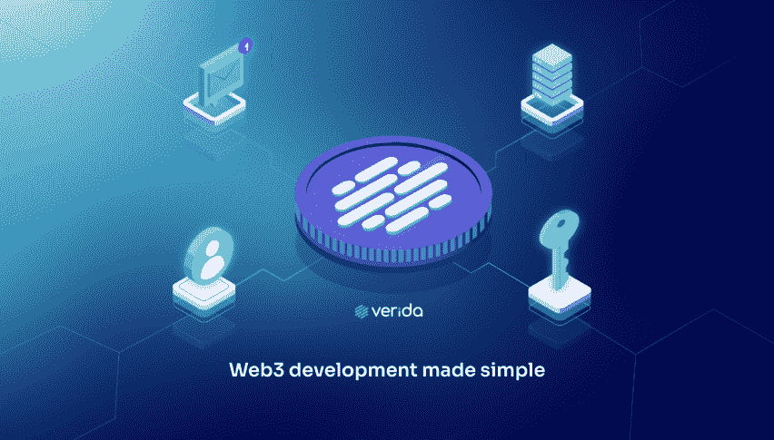

# 使用 Verida 构建保护隐私的 Web3 dApps

> 原文：<https://medium.com/coinmonks/build-privacy-preserving-web3-dapps-with-verida-c9952399073b?source=collection_archive---------4----------------------->

## **面向开发者的 Web3 应用开发**

Source: [www.verida.io](http://www.verida.io)

随着越来越多的公司采用 Web3.0，并创造出符合 web 3.0 的产品，web 3.0 的理念正在逐渐成形。Web3.0 是一种互联网发展理念，旨在通过区块链技术让用户控制他们的数据，从而消除当今互联网上存在的中央集权，使互联网更加安全。

随着越来越多的隐私问题出现，用户必须了解并接受这项技术，在获得补偿的同时控制自己的数据。

为了实现这个想法，全球的开发人员孜孜不倦地利用各种框架将它成功地部署给用户。其中一个框架是 Verida 协议。

## **什么是 Verida 协议？**

Verida 协议是一个框架，它使开发人员能够构建自主应用程序，允许用户拥有和控制他们的数据在互联网上的使用方式。这是一个基于用户拥有的数据、分散身份、数据安全性和应用程序互操作性的价值而设计的协议。

它使开发人员能够使用以下工具构建应用程序:

基于 QR 码的分散式应用单点登录体验

使用户能够在多个区块链上进行交易的简单界面

分散式个人存储

分散式消息传递，以便在应用程序、用户和共享数据之间进行有效通信。

为了成功发布 Verida Protocol alpha 版本，我们在幕后付出了巨大的努力，该版本现已上线，供 Web3 开发人员访问。这个 alpha 版本包含了不同的特性，将会给 Web3 带来光明。它们包括 Verida [客户端 SDK](https://developers.verida.io/docs/client-sdk) 、[单点登录(SSO) SDK](https://developers.verida.io/docs/single-sign-on-sdk) 、[存储节点](https://developers.verida.io/docs/storage-node)和 [Verida Vault](https://www.verida.io/user-vault) 。

## **Verida 客户端软件开发套件**

作为 Verida 网络的开源实现，Verida Client SDK 提供加密存储、身份、消息传递和模式功能。它允许开发人员构建抽象复杂性的自主应用程序，并且是开发人员用来将 Verida 协议支持添加到应用程序中的主要库。

NodeJsClient 和 React Native client 是客户端 SDK 的两个实现。Verida Client SDK 还可以通过已知的私钥或 Web3 模式弹出窗口对用户进行身份验证，在不同的用户和应用程序之间发送/接收消息，并为经过身份验证的用户的应用程序访问加密的数据库存储。

## Sign-On SDK

这是一个分散的单点登录客户端和身份验证服务器 SDK，它实现了一种易于使用的集成方法，允许用户扫描 QR 码来登录您的应用程序。

## **存储节点**

Verida 协议提供的存储节点服务器确保一个或多个 Verida 帐户的数据库存储的加密。它提供了一个中间件，将 Verida 网络上分散的身份与 CouchDB 数据库集群中经过身份验证的用户连接起来。

借助 Verida 存储节点，开发人员可以为用户提供他们的默认存储节点，最终用户可以获得增强的隐私和数据控制，企业用户也有机会为所有员工提供高度安全的私有存储。

## **威瑞达保险库**

Verida Vault 是一个移动应用程序，提供私钥管理和用户友好的界面，供最终用户与 Verida 网络交互。它管理您分散的身份和个人数据，同时让用户能够访问不断增长的以用户为中心的应用程序社区。

Verida Vault 确保用户拥有和控制他们的个人数据，浏览加密数据，并在与其他用户和服务共享这些数据时申请授权。

它还为用户提供了一个安全的数据收件箱，允许将消息和数据安全地传输给其他用户或第三方服务。它拥有单点登录体验，具有简单的身份验证和反网络钓鱼架构，可确保用户访问在 Verida 网络上开发的分散式应用程序。应用程序也可以进行令牌交易。

## **为什么 Verida 协议面向开发者？**

使用 Verida 协议，开发的所有应用程序都允许同一用户在所有其他应用程序之间共享或同步数据，这提供了无与伦比的数据可移植性，因为系统是按设计分布的。

> 加入 Coinmonks [电报频道](https://t.me/coincodecap)和 [Youtube 频道](https://www.youtube.com/c/coinmonks/videos)了解加密交易和投资

## 另外，阅读

*   [WazirX vs CoinDCX vs bit bns](/coinmonks/wazirx-vs-coindcx-vs-bitbns-149f4f19a2f1)|[block fi vs coin loan vs Nexo](/coinmonks/blockfi-vs-coinloan-vs-nexo-cb624635230d)
*   [BlockFi 信用卡](https://blog.coincodecap.com/blockfi-credit-card) | [如何在币安购买比特币](https://blog.coincodecap.com/buy-bitcoin-binance)
*   [火币交易机器人](https://blog.coincodecap.com/huobi-trading-bot) | [如何购买 ADA](https://blog.coincodecap.com/buy-ada-cardano) | [Geco？一次回顾](https://blog.coincodecap.com/geco-one-review)
*   [AscendEx Staking](https://blog.coincodecap.com/ascendex-staking)|[Bot Ocean Review](https://blog.coincodecap.com/bot-ocean-review)|[最佳比特币钱包](https://blog.coincodecap.com/bitcoin-wallets-india)
*   [霍比评论](https://blog.coincodecap.com/huobi-review) | [OKEx 保证金交易](https://blog.coincodecap.com/okex-margin-trading) | [期货交易](https://blog.coincodecap.com/futures-trading)
*   [比特币基地跑马圈地](https://blog.coincodecap.com/coinbase-staking) | [Hotbit 评论](/coinmonks/hotbit-review-cd5bec41dafb) | [KuCoin 评论](https://blog.coincodecap.com/kucoin-review)
*   [美国最佳加密交易机器人](https://blog.coincodecap.com/crypto-trading-bots-in-the-us) | [不断回顾](https://blog.coincodecap.com/changelly-review)
*   [A-Ads 审查](https://blog.coincodecap.com/a-ads-review) | [Bingbon 审查](https://blog.coincodecap.com/bingbon-review) | [Mudrex 投资](https://blog.coincodecap.com/mudrex-invest-review-the-best-way-to-invest-in-crypto)
*   [最好的卡达诺钱包](https://blog.coincodecap.com/best-cardano-wallets) | [Bingbon 副本交易](https://blog.coincodecap.com/bingbon-copy-trading)
*   [印度最佳 P2P 加密交易所](https://blog.coincodecap.com/p2p-crypto-exchanges-in-india) | [柴犬钱包](https://blog.coincodecap.com/baby-shiba-inu-wallets)
*   [8 大加密联盟项目](https://blog.coincodecap.com/crypto-affiliate-programs) | [eToro vs 比特币基地](https://blog.coincodecap.com/etoro-vs-coinbase)
*   [最佳以太坊钱包](https://blog.coincodecap.com/best-ethereum-wallets) | [电报上的加密货币机器人](https://blog.coincodecap.com/telegram-crypto-bots)
*   [交易杠杆代币的最佳交易所](https://blog.coincodecap.com/leveraged-token-exchanges)
*   [5 大最佳社交交易平台](https://blog.coincodecap.com/best-social-trading-platforms) | [瓦济克斯 NFT 印度](https://blog.coincodecap.com/wazirx-nft-india)
*   [10 本关于加密的最佳书籍](https://blog.coincodecap.com/best-crypto-books) | [英国 5 个最佳加密机器人](https://blog.coincodecap.com/uk-trading-bots)
*   [ko only 回顾](https://blog.coincodecap.com/koinly-review) | [Binaryx 回顾](https://blog.coincodecap.com/binaryx-review)|[Hodlnaut vs CakeDefi](https://blog.coincodecap.com/hodlnaut-vs-cakedefi-vs-celsius)