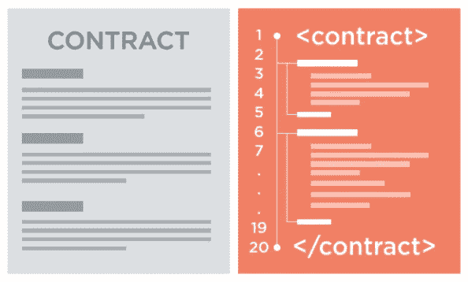

# 构建智能合约，无需块菌，只需 Solcjs —可靠性教程 1

> 原文：<https://medium.com/coinmonks/build-smart-contract-without-truffle-just-solcjs-solidity-tutorial-1-4434f98dbb18?source=collection_archive---------4----------------------->



有许多方法来建立坚实的智能合同，如松露框架，Embark JS 等。我试图不使用任何 DApp 框架，只使用 Solcjs。

下面是 gist 示例代码

首先，在 Javascript 教程中，我需要声明所有必需的包

```
const path = require('path');
const fs = require('fs');
const solc = require('solc');
const md5File = require('md5-file');// Retrieve the command line arguments
var argv = require('minimist')(process.argv.slice(2));
```

**“solc”**是 Solidity 编译器，它将编译 sol 源代码，输出 JSON 格式的 ABI &字节码。

```
var solcInput = {    
    language: "Solidity",    
    sources: { },    
    settings: {
...
    }
};
```

**solcInput** 变量为 solc 编译器提供设置。输入参数说明请参见此[链接](https://solidity.readthedocs.io/en/develop/using-the-compiler.html#compiler-input-and-output-json-description)。

```
function findImports(importFile) {
...
}
```

**findImports()** 将被调用来查找外部 sol 文件，这些文件在 sol 文件内部用 **import()** 语句声明。首先，该函数将尝试在"中查找 sol 文件。/contracts“文件夹 then”。/node_modules”文件夹，然后将 sol 文件的内容返回给编译器。

```
function buildContract(contract) {
...
}
```

**buildContract()** 将检查先前编译的 JSON 格式的文件是否存在。如果编译的 JSON 文件存在，它将根据编译的 JSON 文件中记录的校验和检查源 sol 文件的 md5 校验和，如果两个校验和都匹配，函数将返回而不编译源。

如果校验和不同或者没有找到 JSON 文件，该函数将继续执行编译过程，该过程将输出 JSON 格式的内容。将智能合约部署到以太坊区块链需要“ **abi** ”和“**字节码**”字段。

下一个教程会讲如何使用 web3js 将智能合约部署到以太坊区块链。

我的源代码库是这里的。😄

> [直接在您的收件箱中获得最佳软件交易](https://coincodecap.com/?utm_source=coinmonks)

[](https://coincodecap.com/?utm_source=coinmonks)