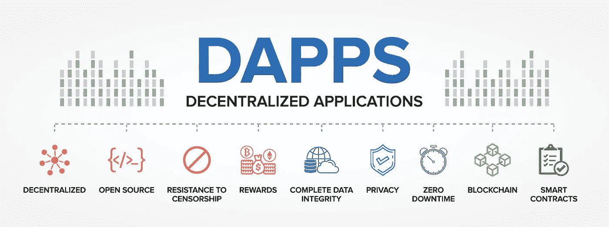

# 构建您的以太坊应用程序(DAPP)

> 原文：<https://medium.com/coinmonks/build-your-ethereum-app-in-react-js-or-vue-with-create-eth-app-577e41860a47?source=collection_archive---------0----------------------->

## 用“create-eth-app”在 React.js 或 Vue 中构建你的以太坊 App

Licenced Image from Adobe Stock

” [**Coinmonks**](https://medium.com/coinmonks) 问我能不能写一篇关于“ [**create-eth-app**](https://github.com/PaulRBerg/create-eth-app) ”的教程，作者是“ [**保罗·拉兹万伯格**](https://paulrberg.com/) ”。我得承认我以前从未听说过它。通常对于 React.js 以太坊应用程序，我要么用 Javascript“[**web 3**](https://github.com/ethereum/web3.js/)”库编写自己的程序，要么使用“[**Truffle Suite Box for React**](https://www.trufflesuite.com/boxes/react)**。**