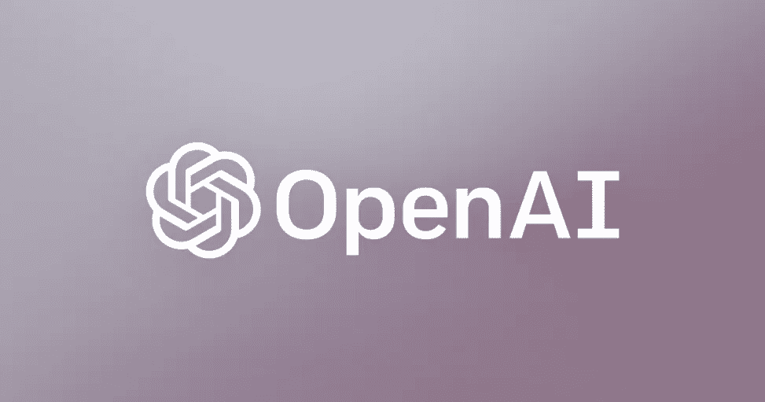
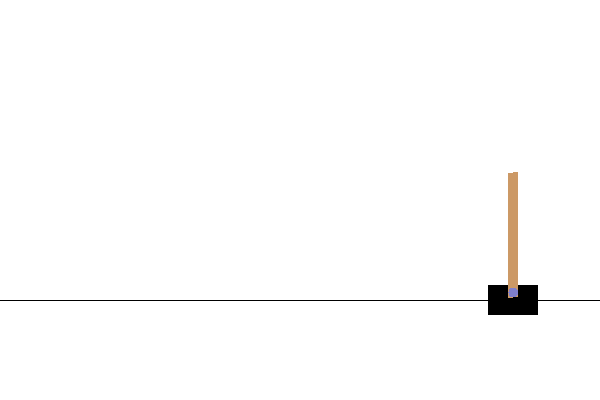
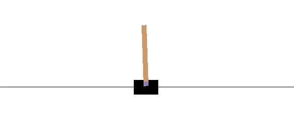

# 在 Python 中使用 OpenAI Gym、Keras、TensorFlow 构建您的第一个人工智能游戏机器人

> 原文：<https://medium.com/coinmonks/build-your-first-ai-game-bot-using-openai-gym-keras-tensorflow-in-python-50a4d4296687?source=collection_archive---------0----------------------->



这篇帖子将解释关于 [**OpenAI Gym**](https://gym.openai.com/) 的内容，并向您展示如何应用**深度学习**来玩一个**侧手翻**游戏。

每当我听到关于谷歌 DeepMind 的 AlphaGo 的故事，我都会想，我希望我能建造一个类似的东西，至少是小规模的。我想上帝听到了我的愿望，他给我指明了方向😃。

最近了解了 **OpenAI 健身房**和**强化学习**。我开始阅读这些，并爱上了它。我现在不使用强化学习来构建游戏机器人。我一定会为未来打算的。

我们需要建造一个游戏机器人，这意味着它需要做我们在玩游戏时做的事情。如果我们对一个游戏没有任何线索，在这种情况下我们通常会怎么做？

我们会问我们的朋友或阅读游戏说明，以了解在玩游戏时我们需要按什么键，对吗？

然后，我们开始玩游戏，观察游戏，根据当前的阶段或状态，我们按下按钮，如向上或向下或向右或向后或其他。

这意味着我们的游戏机器人应该知道游戏的当前**状态/阶段**并且根据当前**状态**机器人需要按一个按钮意味着它需要执行某个**动作**。如果这是一个好的举措，那么我们将得到好的结果意味着**积极的** **奖励**如果不是，那么我们将得到不好的结果意味着**消极的奖励**。机器人每次都应该根据当前的状态重复这些动作，直到我们赢得或输掉游戏，也就是说直到我们完成游戏。

你可能想知道 Bot 是如何像我们一样了解游戏**环境**的当前状态的。我们通过眼睛观察比赛意味着我们应该实现计算机视觉来训练我们的机器人还是什么？

这里 **OpenAI 健身房**将帮助我们。OpenAI 健身房会给我们当前的**状态**细节游戏手段**环境**。它将根据当前的**状态**/情况给我们句柄来执行我们想要执行的**动作**。

我假设你的系统中有 Keras、TensorFlow 和 Python，如果没有，请先阅读[这篇文章](/@ashok.tankala/build-your-first-deep-learning-neural-network-model-using-keras-tensorflow-in-python-a3e76a6b3ccb)。我们需要安装**开放式健身房**。安装在下面运行命令

```
# If you are using python2 then use this command 'pip3 install gym'
pip3 install gym
```

每当我们学习一门新的语言时，我们就从“你好，世界”节目开始，通常是这样的。每当有人开始学习开放体操时，他们就从**钢管舞**游戏开始。在这篇文章中，我们将集中讨论这个游戏。



OpenAI Gym 为我们提供了一个游戏的所有细节或信息及其当前状态。它也给了我们句柄去做我们想要执行的动作，以继续玩游戏，直到游戏完成。

在写代码之前，让我们先了解一些关于 OpenAI Gym 的词汇。

环境(environment)——它就像一个对象或界面，我们或我们的游戏机器人(代理)可以通过它与游戏进行交互，并获得当前状态的细节等。有几种不同的游戏或环境可供选择。你可以在这里找到它们。
**步骤** :-这是一个功能，通过它我们可以在游戏的当前状态/阶段做一个我们真正想做的动作。
**动作:-** 这是我们在游戏当前状态/阶段基本想要做的一个值或对象。像向左或向右移动或跳跃等等。
**观察(对象):-** 一个环境特定的对象，代表你对环境的观察。例如，来自相机的像素数据、机器人的关节角度和关节速度，或者棋盘游戏中的棋盘状态。
**奖励(浮动):-** 上一次行动获得的奖励金额。规模因环境而异，但目标始终是增加你的总回报。
**done (boolean):-** 是不是该重新设置环境了。大多数(但不是全部)任务被划分为定义明确的情节，done 为 True 表示该情节已经终止。(例如，也许杆子倾斜得太厉害，或者你失去了上一条命。)
**info (dict):-** 对调试有用的诊断信息。它有时对学习很有用(例如，它可能包含环境最后一次状态变化背后的原始概率)。但是，官方对你的代理人的评价是不允许用这个来学习的。

让我们通过写一些[翻筋斗](https://gym.openai.com/envs/CartPole-v1/)的代码来了解一下 OpenAI 健身房。

让我们一行一行地理解上面的代码。

1.  进口健身房套餐。
2.  创造了'**翻跟斗**的环境。
3.  重置环境。
4.  运行一个循环来做几个动作来玩游戏。现在，让我们尽可能多的玩。这就是为什么尝试在这里发挥高达 1000 步。
5.  env.render() —用于渲染游戏。因此，我们可以看到当我们采取任何步骤/行动时实际发生了什么。
6.  得到一个我们将要采取的随机行动。这里的“env.action_space.sample()”代码会给我们一个允许玩这个游戏的随机动作。
7.  通过阶跃函数做随机动作。这将返回我们的观察，奖励，完成，信息。

8–13.打印他们知道我们做了什么，到底发生了什么，我们得到了什么奖励，以及游戏是否完成。

14–15.如果游戏完成/完成，停止采取下一步/行动。

最后，这段代码会给出这样的输出。

```
Step 0:
action: 0
observation: [-0.0120364  -0.21794704 -0.00759187  0.26062941]
reward: 1.0
done: False
info: {}
Step 1:
action: 1
observation: [-0.01639534 -0.02271754 -0.00237928 -0.03443839]
reward: 1.0
done: False
info: {}
Step 2:
action: 1
observation: [-0.0168497   0.17243845 -0.00306805 -0.32787105]
reward: 1.0
done: False
info: {}
Step 3:
action: 0
observation: [-0.01340093 -0.02263969 -0.00962547 -0.03615722]
reward: 1.0
done: False
info: {}
Step 4:
action: 1
observation: [-0.01385372  0.17261896 -0.01034861 -0.33186148]
reward: 1.0
done: False
info: {}
Step 5:
action: 1
observation: [-0.01040134  0.36788668 -0.01698584 -0.6277898 ]
reward: 1.0
done: False
info: {}
Step 6:
action: 1
observation: [-0.00304361  0.56324153 -0.02954164 -0.9257734 ]
reward: 1.0
done: False
info: {}
Step 7:
action: 1
observation: [ 0.00822122  0.75874972 -0.04805711 -1.22759172]
reward: 1.0
done: False
info: {}
Step 8:
action: 1
observation: [ 0.02339622  0.95445615 -0.07260894 -1.53493579]
reward: 1.0
done: False
info: {}
Step 9:
action: 1
observation: [ 0.04248534  1.15037357 -0.10330766 -1.84936587]
reward: 1.0
done: False
info: {}
Step 10:
action: 1
observation: [ 0.06549281  1.3464699  -0.14029497 -2.17226059]
reward: 1.0
done: False
info: {}
Step 11:
action: 0
observation: [ 0.09242221  1.15296679 -0.18374019 -1.92596929]
reward: 1.0
done: False
info: {}
Step 12:
action: 0
observation: [ 0.11548155  0.96023062 -0.22225957 -1.69544763]
reward: 1.0
done: True
info: {}
```

这将使我们对正在发生的事情有一些合理的想法。每走一步，我们得到奖励 1.0，直到游戏结束。它还给出了杆和车的当前位置。这里，动作 0 表示向左移动购物车，1 表示向右移动购物车。更多详情请访问其[维基页面](https://github.com/openai/gym/wiki/CartPole-v0)。

所以我们对开放式健身房有了了解。所以是时候建立我们的模型了，这意味着我们需要一些数据来训练。因此，让我们玩一些随机动作的游戏，并收集我们玩得更好的游戏的数据。

首先，让我们导入完成工作所需的包。

```
import gym
import random
import numpy as np
from keras.models     import Sequential
from keras.layers     import Dense
from keras.optimizers import Adam
```

然后让我们初始化一些需要进一步的变量。

```
env = gym.make('CartPole-v1')
env.reset()
goal_steps = 500
score_requirement = 60
intial_games = 10000
```

在下面的代码中，我们将使用来填充深度学习模型训练所需的数据。

让我们了解一下我们在上面的模型 _ 数据 _ 准备函数中做了什么。

1.  我们初始化了 training_data 和 accepted_scores 数组。
2.  我们需要玩多次，这样我们可以收集数据，我们可以进一步使用。因此，我们将播放 10000 次，以便获得大量数据。这一行表示“游戏索引在范围内(初始游戏):”
3.  我们初始化了 score、game_memory、previous_observation 变量，这些变量将存储当前游戏的总分数和前一步观察值(表示推车和杆子的位置)以及我们为此采取的行动。
4.  对于范围内的 step _ index(goal _ steps):—此代码将游戏玩 500 步，因为玩此游戏到 500 步意味着成功完成游戏。
5.  我们需要采取随机行动，这样我们就可以玩游戏，这可能会导致成功完成该步骤或输掉游戏。这里只允许向左(0)或向右(1)移动两个动作，所以这个代码(random.randrange(0，2))用于采取随机动作之一。
6.  我们将采取那个行动/步骤。然后，我们将检查它是否是第一个行动/步骤，然后我们将存储之前的观察和我们为此采取的行动。然后，我们将添加分数，并检查游戏是否完成，如果是，然后停止玩它。
7.  我们将检查这个游戏是否满足我们的最低要求，这意味着我们是否能够玩 60 步。
8.  如果我们能够玩 60 步，那么我们将把这个分数添加到 accept_scores 中，我们进一步打印该分数，以了解我们将多少游戏数据及其分数输入到我们的模型中。
9.  然后我们将对动作进行热编码，因为它的值 0(向左移动)，1(向右移动)代表分类数据。
10.  然后我们会将它添加到我们的训练数据中。
11.  我们将重置环境，以确保一切都清楚，开始玩下一个游戏。
12.  print(accepted_scores) —该代码用于了解我们向模型中输入了多少游戏数据及其分数。然后我们会返回训练数据。

该代码在执行后最终打印 accepted_scores。

```
[63.0, 62.0, 74.0, 66.0, 84.0, 69.0, 65.0, 64.0, 66.0, 63.0, 62.0, 67.0, 62.0, 60.0, 76.0, 65.0, 87.0, 85.0, 76.0, 81.0, 68.0, 63.0, 80.0, 65.0, 63.0, 60.0, 60.0, 61.0, 86.0, 71.0, 72.0, 60.0, 95.0, 65.0, 68.0, 68.0, 63.0, 95.0, 91.0, 99.0, 86.0, 68.0, 72.0, 69.0, 62.0, 74.0, 76.0, 74.0, 64.0, 77.0, 92.0, 67.0, 67.0, 99.0, 81.0, 81.0, 63.0, 73.0, 70.0, 68.0, 63.0, 77.0, 61.0, 62.0, 78.0, 61.0, 71.0, 77.0, 70.0, 72.0, 80.0, 61.0, 68.0, 61.0, 86.0, 145.0, 74.0, 68.0, 79.0, 61.0, 63.0, 65.0, 62.0, 64.0, 65.0, 80.0, 67.0, 78.0, 76.0, 66.0, 63.0, 110.0, 62.0, 70.0, 72.0, 109.0, 76.0, 75.0, 75.0, 73.0, 75.0, 65.0, 77.0, 64.0, 61.0, 60.0, 66.0, 61.0, 62.0, 71.0, 75.0, 82.0, 95.0, 67.0, 61.0, 66.0, 67.0, 65.0, 61.0, 65.0, 66.0, 62.0, 70.0, 89.0, 96.0, 86.0, 62.0, 61.0, 75.0, 84.0, 63.0, 66.0, 73.0, 68.0, 61.0, 66.0, 144.0, 64.0, 61.0, 62.0, 62.0, 67.0, 66.0, 65.0, 66.0, 71.0, 68.0, 81.0, 73.0, 75.0, 75.0, 79.0, 75.0, 104.0, 69.0, 66.0, 81.0, 73.0, 60.0, 64.0, 78.0, 115.0, 62.0, 91.0, 70.0, 69.0, 64.0, 86.0, 70.0, 70.0, 68.0]
```

所以我们的数据准备好了。是时候建立我们的神经网络了。

```
def build_model(input_size, output_size):
    model = Sequential()
    model.add(Dense(128, input_dim=input_size, activation='relu'))
    model.add(Dense(52, activation='relu'))
    model.add(Dense(output_size, activation='linear'))
    model.compile(loss='mse', optimizer=Adam())return model
```

这里我们将使用序列模型。

```
def train_model(training_data):
    X = np.array([i[0] for i in training_data]).reshape(-1, len(training_data[0][0]))
    y = np.array([i[1] for i in training_data]).reshape(-1, len(training_data[0][1]))
    model = build_model(input_size=len(X[0]), output_size=len(y[0]))

    model.fit(X, y, epochs=10)
    return model
```

我们有训练数据，因此，我们将创建功能和标签。

然后我们将开始训练

```
trained_model = train_model(training_data)
```

我们将得到这样的输出

```
Epoch 1/10
12236/12236 [==============================] - 1s 94us/step - loss: 0.2483
Epoch 2/10
12236/12236 [==============================] - 1s 71us/step - loss: 0.2348
Epoch 3/10
12236/12236 [==============================] - 1s 67us/step - loss: 0.2333
Epoch 4/10
12236/12236 [==============================] - 1s 68us/step - loss: 0.2334
Epoch 5/10
12236/12236 [==============================] - 1s 64us/step - loss: 0.2325
Epoch 6/10
12236/12236 [==============================] - 1s 63us/step - loss: 0.2324
Epoch 7/10
12236/12236 [==============================] - 1s 66us/step - loss: 0.2315
Epoch 8/10
12236/12236 [==============================] - 1s 65us/step - loss: 0.2318
Epoch 9/10
12236/12236 [==============================] - 1s 65us/step - loss: 0.2317
Epoch 10/10
12236/12236 [==============================] - 1s 65us/step - loss: 0.2318
```

是时候让我们的游戏机器人为我们玩游戏了。

让我们来理解这个代码

1.  我们正在初始化分数和选择数组，它将存储我们得到的分数和做出的选择。
2.  玩这个游戏 100 次。
3.  初始化 score 和 prev_obs 变量以存储当前分数和以前的观察值。
4.  我们将玩 500 步游戏，这就是为什么这个循环(对于范围内的步长索引(目标步长):)
5.  对于第一步，我们不知道状态和其他事情，所以我们将采取随机步骤。
6.  从第二步开始，我们知道游戏的当前状态。因此，我们将把观察结果提供给我们的模型，以预测我们需要采取的行动。这部分(**trained _ model . predict(prev _ OBS . shape(-1，len(prev_obs)))** )的代码会给我们每个类别的概率。我们将采用最大概率类别并采取行动。
7.  我们将存储我们做出的选择，存储当前状态，并将奖励添加到我们的分数中。
8.  我们将在完成游戏后重置环境以玩下一个游戏，并存储游戏的完成分数以打印。

我们会得到这样的输出

```
[500.0, 500.0, 500.0, 500.0, 500.0, 500.0, 500.0, 500.0, 500.0, 500.0, 500.0, 500.0, 500.0, 500.0, 500.0, 500.0, 500.0, 500.0, 247.0, 500.0, 500.0, 500.0, 500.0, 500.0, 500.0, 500.0, 500.0, 500.0, 259.0, 500.0, 500.0, 500.0, 500.0, 500.0, 500.0, 500.0, 500.0, 500.0, 500.0, 500.0, 500.0, 500.0, 500.0, 264.0, 500.0, 500.0, 500.0, 500.0, 500.0, 500.0, 500.0, 500.0, 500.0, 500.0, 500.0, 500.0, 500.0, 500.0, 500.0, 241.0, 500.0, 500.0, 500.0, 500.0, 500.0, 500.0, 500.0, 500.0, 500.0, 500.0, 500.0, 500.0, 500.0, 500.0, 500.0, 500.0, 500.0, 500.0, 500.0, 500.0, 500.0, 500.0, 500.0, 500.0, 500.0, 500.0, 500.0, 255.0, 500.0, 500.0, 500.0, 245.0, 500.0, 500.0, 500.0, 500.0, 500.0, 500.0, 500.0, 500.0]
Average Score: 485.11
choice 1:0.5007936344334275  choice 0:0.49920636556657255
```

最后，我们的机器人被训练了。它终于可以像专业选手一样打球了。



你可以在这里找到 Jupyter 笔记本来实现。

如果你喜欢这篇文章，请给它一些掌声来表达你的爱👏。
和平。快乐编码。
[这里看我的原创文章。](https://blog.tanka.la/2018/10/19/build-your-first-ai-game-bot-using-openai-gym-keras-tensorflow-in-python/)

> 加入 Coinmonks [电报频道](https://t.me/coincodecap)和 [Youtube 频道](https://www.youtube.com/c/coinmonks/videos)获取每日[加密新闻](http://coincodecap.com/)

## 另外，阅读

*   [复制交易](/coinmonks/top-10-crypto-copy-trading-platforms-for-beginners-d0c37c7d698c) | [加密税务软件](/coinmonks/crypto-tax-software-ed4b4810e338)
*   [网格交易](https://coincodecap.com/grid-trading) | [加密硬件钱包](/coinmonks/the-best-cryptocurrency-hardware-wallets-of-2020-e28b1c124069)
*   [最佳加密交易所](/coinmonks/crypto-exchange-dd2f9d6f3769) | [印度最佳加密交易所](/coinmonks/bitcoin-exchange-in-india-7f1fe79715c9)
*   [开发人员的最佳加密 API](/coinmonks/best-crypto-apis-for-developers-5efe3a597a9f)
*   [密码电报信号](http://Top 4 Telegram Channels for Crypto Traders) | [密码交易机器人](/coinmonks/crypto-trading-bot-c2ffce8acb2a)
*   最佳[密码借贷平台](/coinmonks/top-5-crypto-lending-platforms-in-2020-that-you-need-to-know-a1b675cec3fa)
*   杠杆代币的终极指南
*   [加密交易的最佳 VPN](https://coincodecap.com/best-vpns-for-crypto-trading)
*   [用于 Huobi 的加密交易信号](https://coincodecap.com/huobi-crypto-trading-signals) | [HitBTC 审查](/coinmonks/hitbtc-review-c5143c5d53c2)
*   [TraderWagon 回顾](https://coincodecap.com/traderwagon-review) | [北海巨妖 vs 双子星 vs BitYard](https://coincodecap.com/kraken-vs-gemini-vs-bityard)
*   [如何在 FTX 交易所交易期货](https://coincodecap.com/ftx-futures-trading)
*   [OKEx vs KuCoin](https://coincodecap.com/okex-kucoin) | [摄氏替代度](https://coincodecap.com/celsius-alternatives) | [如何购买 VeChain](https://coincodecap.com/buy-vechain)
*   [3 commas vs . Pionex vs . crypto hopper](https://coincodecap.com/3commas-vs-pionex-vs-cryptohopper)
*   [如何使用 Cornix 交易机器人](https://coincodecap.com/cornix-trading-bot)
*   [Bitget 回顾](https://coincodecap.com/bitget-review)|[Gemini vs block fi](https://coincodecap.com/gemini-vs-blockfi)cmd |[OKEx 期货交易](https://coincodecap.com/okex-futures-trading)
*   [用信用卡购买密码的 10 个最佳地点](https://coincodecap.com/buy-crypto-with-credit-card)