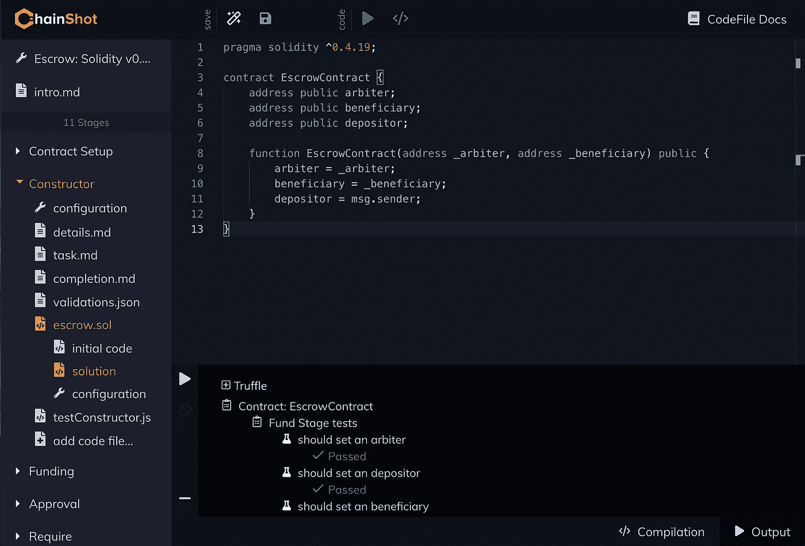
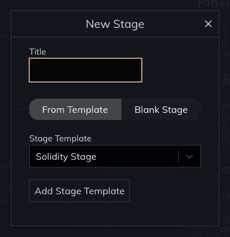
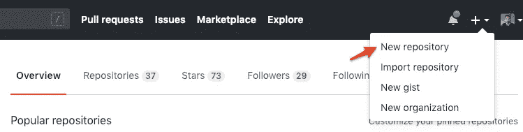
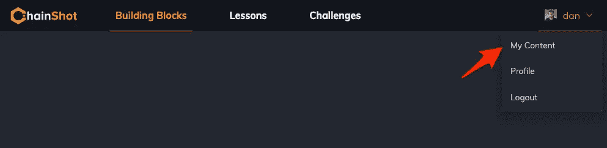

# 用 4 个步骤创建一个以太坊代码教程

> 原文：<https://medium.com/coinmonks/build-your-own-ethereum-code-tutorial-in-4-steps-5f0e46c5b413?source=collection_archive---------4----------------------->

## 很容易上手！

本周我们发布了 [ChainShot Builder](https://github.com/ChainShot/Builder) ，目标很简单:**帮助人们构建伟大的开源教育内容**。

在过去的几个月里，我们很喜欢创建编码教程/挑战，如[构建 JavaScript 区块链](https://www.chainshot.com/lessons/5c36bf15143eed0017f579755b3afd70d9f99763e5c4b4fe/)、[Vyper 简介](https://www.chainshot.com/lessons/5c36bf15143eed0017f579755bb2c8ded9f99705a60c62d3/)和[谁有我的以太？](https://www.chainshot.com/challenges/5c36bf15143eed0017f579755b45277dd9f997416b4b0413/)

现在，我们希望社区能够创建他们自己的编码教程和挑战。为此，我们承诺在 Github 上开放源代码内容库！

入门挺简单的。以下是您需要采取的步骤:

# 步骤 1:设置生成器

要开始，您需要最新版本的 [Node.js](https://nodejs.org/en/) 。然后，您可以全局安装 ChainShot Builder CLI:

```
npm i -g chainshot-builder
mkdir myContentFolder
cd myContentFolder
chainshot-builder init
```

嘣！至此，您已经启动了 ChainShot Builder IDE:



Build your own tutorial stage by stage in our open source IDE

# 步骤 2:建立教程或挑战

这就是你发挥创造力的时候了！

创建能真正吸引你的观众的教程或挑战。我们有很多方法可以帮助你开始。你可以选择[派生我们现有的内容](https://chainshotbuilder.readthedocs.io/en/latest/forking_existing_content.html)或者你可以查看这个关于构建内容的 [YouTube 视频](https://www.youtube.com/watch?v=trs4sU2HQf8)。

此外，IDE 还配备了 stage 模板，可确保您从正常设置开始:



Select a Stage Template

IDE 中保存的任何更改都会自动反映到文件系统的内容文件夹中。因此，一旦您对自己的进展感到满意，剩下的工作就是将您的内容放入源代码控制中并进行部署！

# 步骤 3:创建您的 Github 存储库

前往 Github 并[创建您的新存储库](https://github.com/new):



Create a new Github repository

你可以随便给它起什么名字。然后添加新的 github URL 作为内容文件夹的遥控器，并开始提交更改:

```
cd myContentFolder
git init
git add .
git commit -m "init"
git remote add origin https://github.com/OWNER/REPO.git
git push origin master 
```

太好了，你所有的内容现在都保存在源代码控制中了！

# 步骤 4:部署到连锁快照

首先，你需要一个在 www.chainshot.com 的连锁账户

一旦您创建了一个，您就可以访问[我的内容](https://www.chainshot.com/content/mine):



Manage your content repositories on ChainShot

从那里，您只需要连接您的 Github 帐户并选择您的内容库进行部署。想了解更多关于链接 Github 的信息，请查看我们关于这个主题的[文档](https://chainshotbuilder.readthedocs.io/en/latest/linking_github.html#connect-to-github)！

一旦你完成了这一步，你的内容将会在 ChainShot 上直播，让用户开始学习你的教程！从现在起，您对内容存储库所做的任何更改都将自动部署到 ChainShot。

# 就是这样！

好了，现在就这些了。如果这让你兴奋，一定要进入我们的[休闲频道](https://join.slack.com/t/chainshotnodes/shared_invite/enQtMzU3ODc5NTM3MTI3LTFlZTY1YzcwM2QzYWI0ODY2ZDczMmYzOTVlYWQwZjkyZDFlYzUxZWM4NDNlNjk3N2EyNGMwOGQ0ZTVkZjQyNjE)讨论建设内容，或者[在 Twitter 上关注我们](https://twitter.com/TeamChainShot)了解更多更新。

> [直接在您的收件箱中获得最佳软件交易](https://coincodecap.com/?utm_source=coinmonks)

[](https://coincodecap.com/?utm_source=coinmonks)