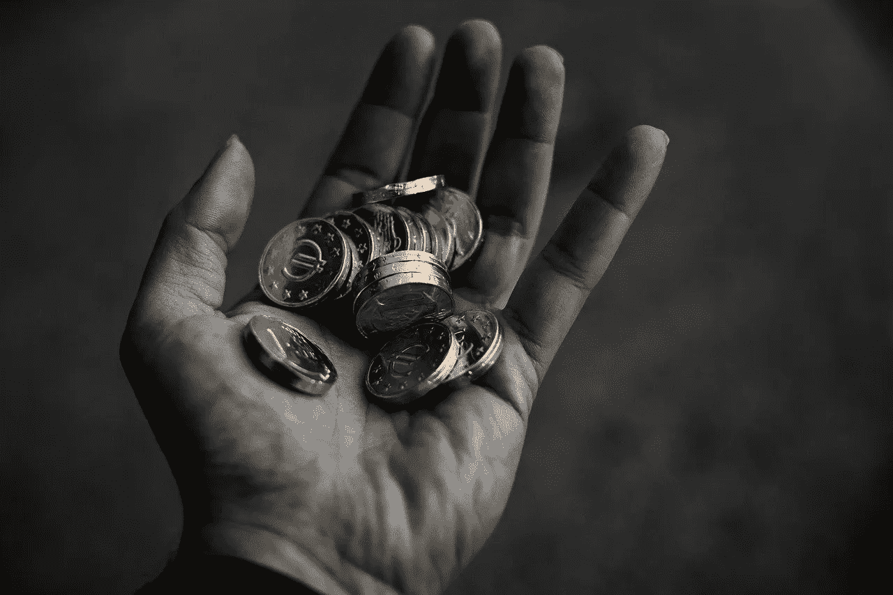
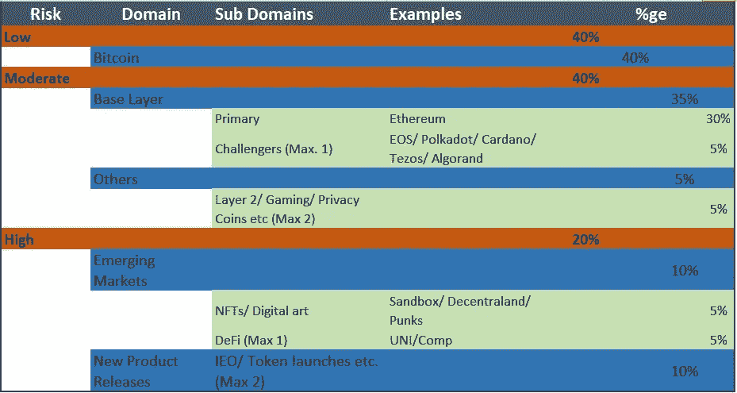

# 构建平衡的加密组合

> 原文：<https://medium.com/coinmonks/building-a-balanced-crypto-portfolio-2a384492b1c?source=collection_archive---------2----------------------->

在[语音](https://app.voice.com/post/@tulip/cryptowriter-building-a-balanced-crypto-portfolio-1603293092-1)阅读我的原创文章

秘密投资需要纪律。太多的人因为涉足抽水和倾倒工程而烧伤了自己的手。两位数以上乘数的承诺难以抗拒。

本文从 ABC 分类法和帕累托法则中得到启示，得出了密码投资风险管理的一些基本规律。这种方法有 3 个基本支柱

长期增长潜力

平衡风险管理

投资组合稳定性

记住基本的支柱，一个加密的投资组合可以分成**低、中、高风险，**各有利弊。

**低风险(40%)**

**比特币(40%)** 是唯一被证明的价值储存手段。它的波动性已经稳定下来，并慢慢看到了增长的上升趋势。2020 年黑天鹅事件期间，比特币价值跌至 4000 美元左右。然而，它已经反弹到 12000 美元。这是加密领域最安全的赌注，对所有基本支柱都有很大的正面影响。

**中等风险(40%)**

这将主要包括具有良好长期潜力的成熟项目。我们将给予基础层协议更多的权重。这些是区块链试图解决速度、安全和去中心化的区块链三难问题。在这一部分，我想到的最重要的项目是以太坊。

**以太坊** **(30%)** 是最受认可的项目。大多数流行的去中心化应用都是建立在以太坊之上的。这包括游戏平台，NFT 项目和商店，最重要的是，分散的金融。以太坊的每一笔交易都需要燃气费。这些以太坊 Dapps 的流行，保证了每次交易都使用以太坊。人们需要购买以太坊来使用这样的平台。我们已经看到了统一令牌推出期间的气体战争。大多数企业区块链解决方案都建立在以太坊之上。它也是开发者活动最多的地方之一。

通过比特币和以太坊，我们已经覆盖了 70%的投资组合。现在我们将进入未知领域

**其他基层——任何人(5%)** 。这是一个需要大量研究的领域。没有一个核心层能与以太坊竞争。许多像创一样的人迷失了方向。许多像 Cosmos 和 Polkadot 这样的公司都显示出了潜力。好的一面是，购买这类项目的代币仍然很便宜。少量购买 Polkadot/Cardano/te zos/EOS/Cosmos/algrand 中的一个是有意义的。做你的研究，了解他们的权衡和路线图。

**其他— Dapps、第 2 层、游戏、隐私币** **(5%)** 许多构建在基础层上的项目已经变得流行，互操作性的引入确保了这样的项目可以在基础层之间移动，以防单个基础层不起作用。对金恩、莫内罗、新加坡航空这样的高潜力项目进行小额投资是有意义的。它们中的每一个都有其用途。看看哪个用例对你更有吸引力，你将会使用它。购买代币并开始使用。

**高风险(20%)**

购买高风险项目主要是为了获得乘数。这样的项目可能有也可能没有长期的潜力，然而，它们背后可能有伟大的概念或巨大的宣传。大多数这些项目的切入点是在启动阶段。由于这些都是短期持有，这里唯一的政策是低买高卖。

区块链已经产生了巨大的潜力。一些新开发/相对未经测试的项目被称为新兴市场。

**NFTs/ Digitals Arts (5%):** 随着 Rarible 的推出，NFTs 现在变得越来越受欢迎，然而，它们已经在生态系统中存在了相当长的一段时间。像 SuperRare 和 Knownorigin 这样的数字艺术平台非常有名。OpenSea 的引入也提供了获取这些资产的便利。金恩支持 ERC-1155 NFT 有潜力彻底改变游戏产业。钱包里有几个 NFT 总是好的。我确信第一代 NFTs 在未来的日子里会花费很多。数字土地(分散土地，沙盒)的引入是一个游戏改变者。你可以把你的土地游戏化，从中获得被动收入。

是的，我只分配了很少的%ge 给 DeFi 代币。炒作结束了。DeFi 治理令牌还没有多大意义。此外，DeFi 产量正在缓慢下降。钱包里有一小部分 Uniswap 或 Compound 之类的好项目的代币是很好的。这种令牌的一个很好的用例可能很快就会出现。

**IEO/ Token Launches (10%)** :那里是德根家族兴旺的地方！这是赚钱或赔钱的地方。这也是大多数研究需要完成的地方。找出将会带来创新的项目。如果可能的话，进入种子轮，如果没有进入令牌发射。一个安全的选择是币安发射台。这类项目的价格会迅速上涨。小心，总是以你的目标价格出售。此类项目的价格在最初上涨后有可能大幅下跌。

**请注意，我不是区块链专家，以上是我的个人观点。这篇文章是为了知识的目的。在投资任何项目之前，请做好调查。**

**跟着我**

https://twitter.com/rumadas123➡推特:

https://www.linkedin.com/in/ruma-das-a1439320/➡领英:

## 另外，阅读

*   [最佳加密交易机器人](/coinmonks/whats-the-best-crypto-trading-bot-in-2020-top-8-bitcoin-trading-bot-c16adeb13317)
*   最好的比特币[硬件钱包](/coinmonks/the-best-cryptocurrency-hardware-wallets-of-2020-e28b1c124069?source=friends_link&sk=324dd9ff8556ab578d71e7ad7658ad7c)
*   最好的[加密税务软件](/coinmonks/best-crypto-tax-tool-for-my-money-72d4b430816b)
*   [最佳加密交易平台](/coinmonks/the-best-crypto-trading-platforms-in-2020-the-definitive-guide-updated-c72f8b874555)
*   [unis WAP 最佳钱包](/coinmonks/best-wallets-to-use-uniswap-e91a6385d9e8)
*   最佳[加密贷款平台](/coinmonks/top-5-crypto-lending-platforms-in-2020-that-you-need-to-know-a1b675cec3fa)
*   [莱杰 vs 特雷佐](/coinmonks/ledger-vs-trezor-best-hardware-wallet-to-secure-cryptocurrency-22c7a3fd391e)
*   [顶级 DeFi 项目](/coinmonks/defi-future-10-promising-projects-in-the-defi-world-ff2b697ab006)
*   Bitsgap 评论——一个轻松赚钱的加密交易机器人
*   为专业人士设计的加密交易机器人
*   [3commas Review](https://blog.coincodecap.com/3commas-review-an-excellent-crypto-trading-bot) |一款优秀的密码交易机器人
*   [3Commas vs Cryptohopper](/coinmonks/cryptohopper-vs-3commas-vs-shrimpy-a2c16095b8fe)
*   Bitmex 的[保证金交易指南](/coinmonks/the-idiots-guide-to-margin-trading-on-bitmex-dbbd7742c6fc?source=friends_link&sk=7bfa99d2a181142510c8442c8ddb0786)
*   [加密摇摆交易的权威指南](/coinmonks/the-definitive-guide-to-crypto-swing-trading-7e4af6496d4d?source=friends_link&sk=70448050bd9323b42f63bfc0bb1e60d1)
*   [Bitmex 高级保证金交易指南](/coinmonks/bitmex-advanced-margin-trading-guide-2270c195ce25?source=friends_link&sk=1d986cca731f5084b9a2db4a4bc4a7ad)
*   [面向开发人员的最佳加密 API](/coinmonks/best-crypto-apis-for-developers-5efe3a597a9f)
*   [加密套利](/coinmonks/crypto-arbitrage-guide-how-to-make-money-as-a-beginner-62bfe5c868f6)指南:新手如何赚钱
*   顶级[比特币节点](https://blog.coincodecap.com/bitcoin-node-solutions)提供商
*   最佳[加密制图工具](/coinmonks/what-are-the-best-charting-platforms-for-cryptocurrency-trading-85aade584d80)

> [直接在您的收件箱中获得最佳软件交易](https://coincodecap.com?utm_source=coinmonks)

