# 使用具有角度前端的 Hyperledger Fabric 构建区块链应用程序:第 1 部分

> 原文：<https://medium.com/coinmonks/building-a-blockchain-application-using-hyperledger-fabric-with-angular-frontend-part-1-f070bf169231?source=collection_archive---------4----------------------->

在这一系列教程中，我们将使用 Hyperledger Composer 构建一个简单的供应链管理系统，将其部署在我们的计算机上，并构建一个 angularfront-end 与之交互。

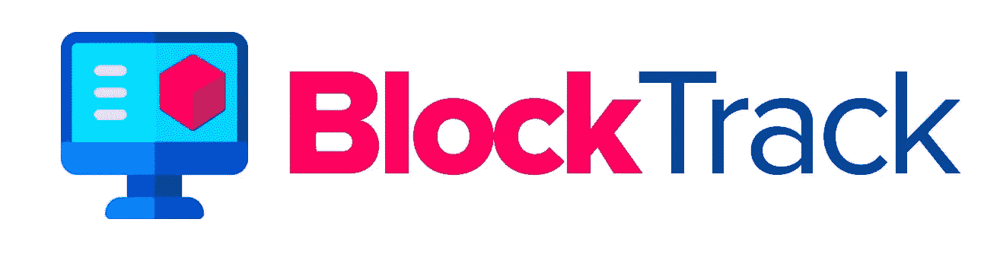

第 1 部分主要关注在在线 composer 平台上编码、部署和测试我们的应用程序。如果您想了解如何在本地部署它并构建前端，请跳到[第 2 部分](/@yashwanthmadaka/building-a-blockchain-application-using-hyperledger-fabric-with-angular-frontend-part-2-22ef7c77f53)。

> [发现并回顾最佳区块链软件](https://coincodecap.com)

首先，我们将访问 [hyperledger composer 在线游乐场](http://composer-playground.mybluemix.net/login)。当我们访问网站时，我们可以看到下面的屏幕。

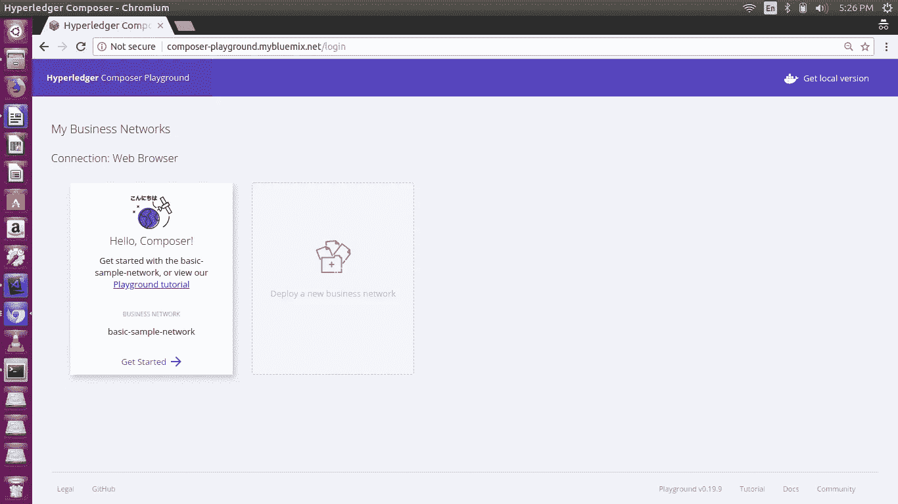

现在，我们单击部署新的业务网络。我们将把我们的项目命名为 Block-Track。因此，将**业务网络名称**命名为 block-track，并描述您的选择。将**网络管理卡的名称**命名为 admin@block-track

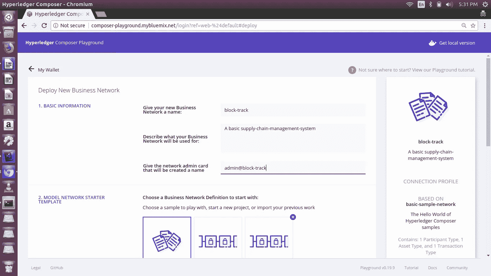

现在点击右侧的**部署**按钮，出现以下页面。

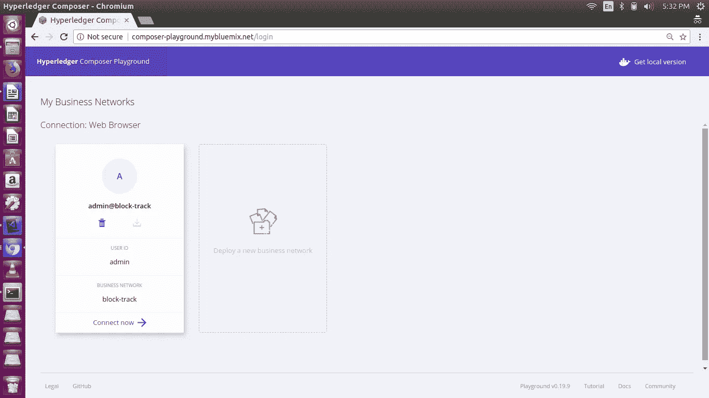

现在，点击**立即连接。**

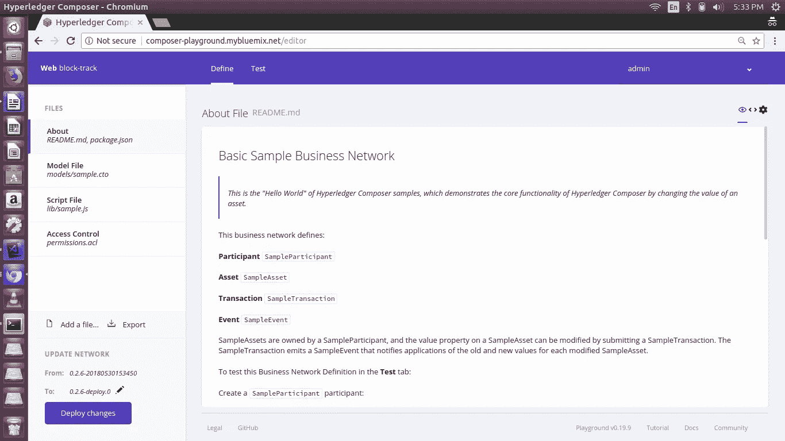

现在，这是我们定义模型的主页。“定义”选项卡用于创建、编辑和升级您的业务网络。在**定义**选项卡的左侧，您可以看到您当前业务网络定义中所有文件的列表。使用**添加文件**按钮可以将新文件添加到您的企业网络中。可以将模型文件、脚本文件、访问控制文件和查询文件添加到您的业务网络中。

一旦您添加并修改了业务网络定义的文件，您就可以使用**部署更改**按钮将更改部署到您的网络中。点击**部署变更**后，您可以在**测试**选项卡中试验您的变更。**导出**按钮允许您下载当前的业务网络作为**。bna** 文件。

首先是

模型文件:开发人员与业务分析师一起定义我们业务网络的模型。这是用 Composer 建模语言写的。现在用下面的代码替换模型文件中的代码

```
namespace org.hyperledger_composer.scmsenum ProductDesc {
 o Shoes
 o Socks
 o Belts
 o SportsShoes
 o Flipflops
}enum ProductSize {
 o SMALL
 o MEDIUM
 o LARGE
}asset Product identified by productId {
 o String productId
 o String producttype
 o ProductSize size
 o ProductDesc description
 --> Participant owner
 --> Participant issuer
}participant Customer identified by email {
 o String email
 o String firstName
 o String lastName
 o String type
}participant Manufacturer identified by email {
 o String email
 o String firstName
 o String lastName
 o String type
}participant Distributor identified by email {
 o String email
 o String firstName
 o String lastName
 o String type
}participant Retailer identified by email {
 o String email
 o String firstName
 o String lastName
 o String type
}transaction MoveProduct {
 --> Product product
 --> Participant issuer
 --> Participant newOwner
}
```

我们创建了 4 个参与者。制造商、分销商、零售商和客户，并通过他们的电子邮件进行识别。我们创建一个名为 Product 的资产，由 productId 标识。我们通过指定枚举为产品创建额外的描述。我们创建了一个名为 MoveProduct 的事务。

用以下代码替换**脚本文件**。这是我们模型的主要逻辑。

```
/**
 * Trade a product to a new player
 * [@param](http://twitter.com/param) {org.hyperledger_composer.scms.MoveProduct} moveProduct - the trade product transaction
 * [@transaction](http://twitter.com/transaction)
 */
async function moveProduct(moveProduct) { // eslint-disable-line no-unused-vars
 moveProduct.product.issuer = moveProduct.product.owner;
 moveProduct.product.owner = moveProduct.newOwner;
 const assetRegistry = await getAssetRegistry('org.hyperledger_composer.scms.Product');
 await assetRegistry.update(moveProduct.product);
}
```

现在用下面的代码替换**访问控制文件**。这个文件列出了每个人拥有的所有访问控制。

```
rule Default {
 description: "Allow all participants access to all resources"
 participant: "ANY"
 operation: ALL
 resource: "org.hyperledger_composer.scms.*"
 action: ALLOW
}rule SystemACL {
 description: "System ACL to permit all access"
 participant: "org.hyperledger.composer.system.Participant"
 operation: ALL
 resource: "org.hyperledger.composer.system.**"
 action: ALLOW
}rule NetworkAdminUser {
 description: "Grant business network administrators full access to user resources"
 participant: "org.hyperledger.composer.system.NetworkAdmin"
 operation: ALL
 resource: "**"
 action: ALLOW
}rule NetworkAdminSystem {
 description: "Grant business network administrators full access to system resources"
 participant: "org.hyperledger.composer.system.NetworkAdmin"
 operation: ALL
 resource: "org.hyperledger.composer.system.**"
 action: ALLOW
}
```

在替换了所有的文件后，现在点击 deploy，应该会出现一条消息说 ***变更已部署。***

现在我们可以通过点击 test 选项卡来测试我们的模型。出现以下页面。

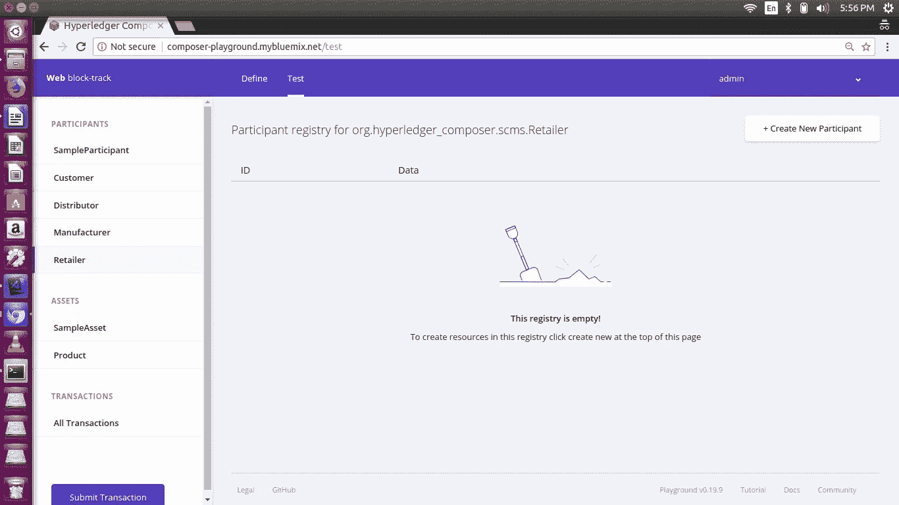

忽略“参与者和资产”选项卡中的 SampleParticipant 和 SampleAsset。这些出现是因为我们一开始在一个**基本样本网络**中创建了一切。选择**空业务网**避开这些多余的参与者。

现在，单击客户选项卡，然后单击**+创建新参与者**按钮。

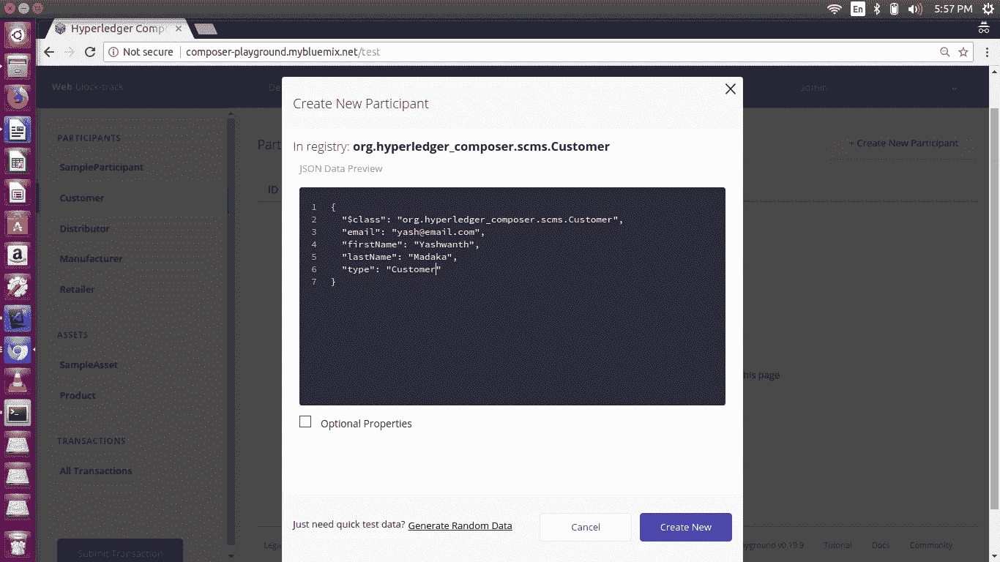

输入您选择的详细信息，然后单击“新建”按钮。同样，为分销商、制造商和零售商创建其他参与者。

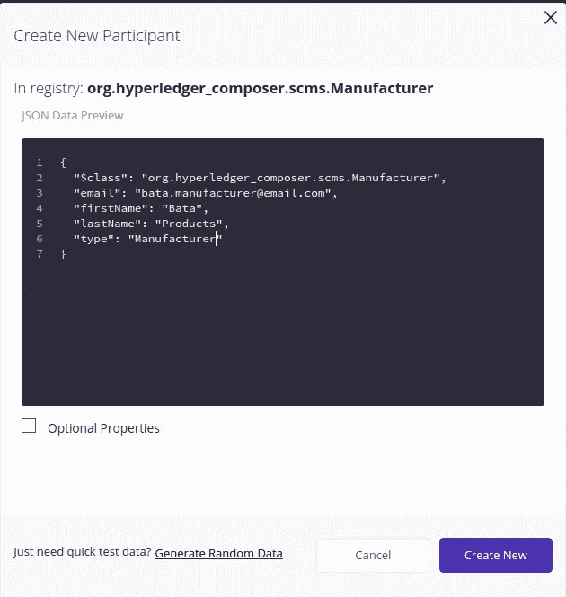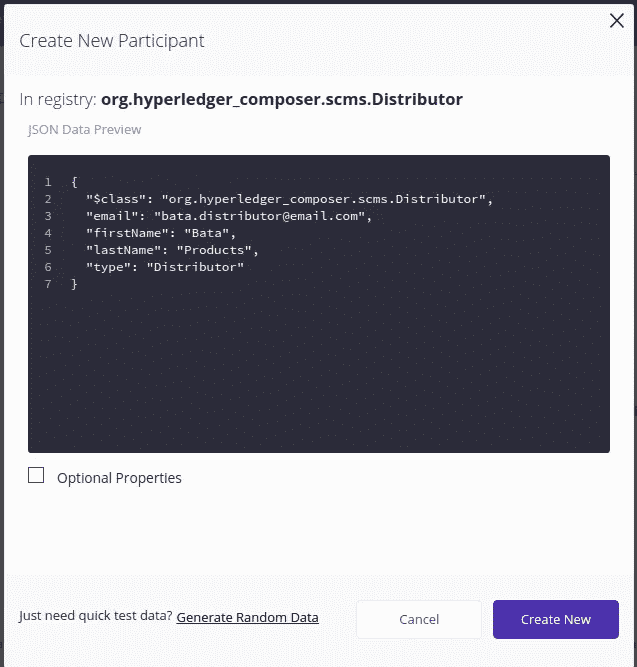

现在，我们通过单击“资产”选项卡中的“产品”选项卡来创建新产品。

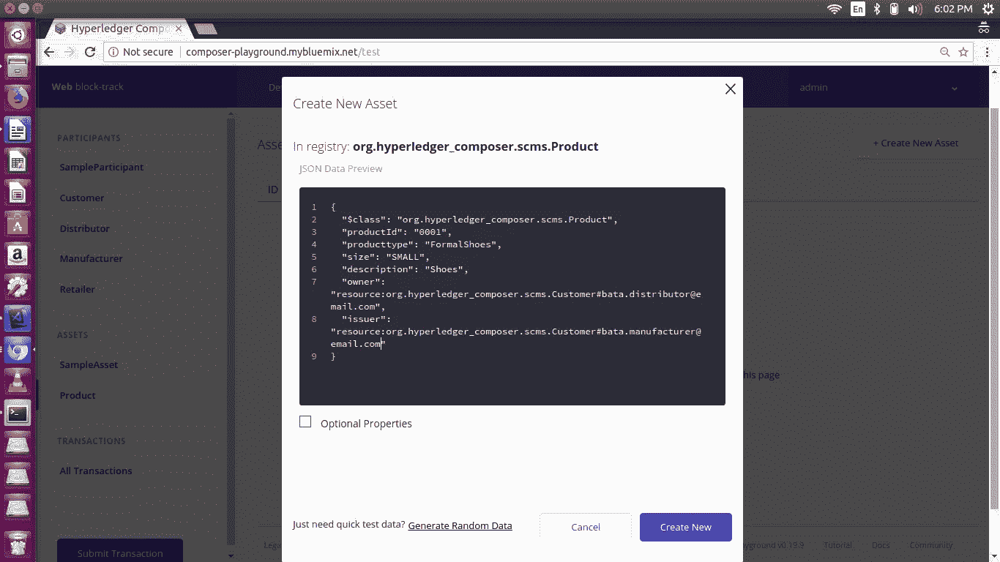

请输入您选择的详细信息。我们在“发行者”列中给出制造商的电子邮件，在“所有者”列中给出经销商的电子邮件，然后单击“新建”。创建了一个新产品，其详细信息已从制造商转移到分销商。
现在我们对产品进行交易。单击提交事务，并从事务类型中选择 MoveProduct。我们想把这个产品从经销商那里发给客户。所以键入如下。

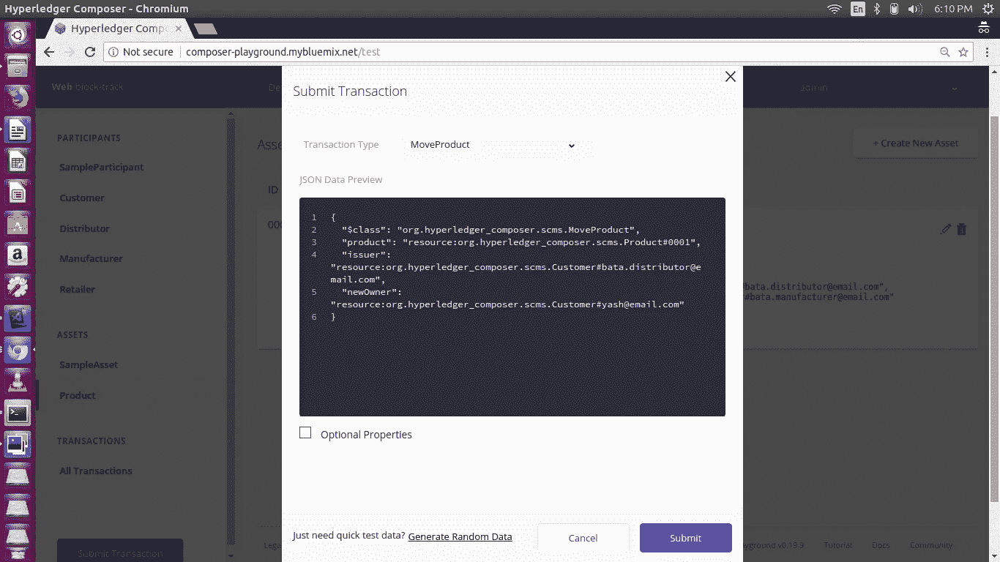

点击提交，交易成功消息出现。我们可以看到产品的所有者和发行者已经发生了变化。

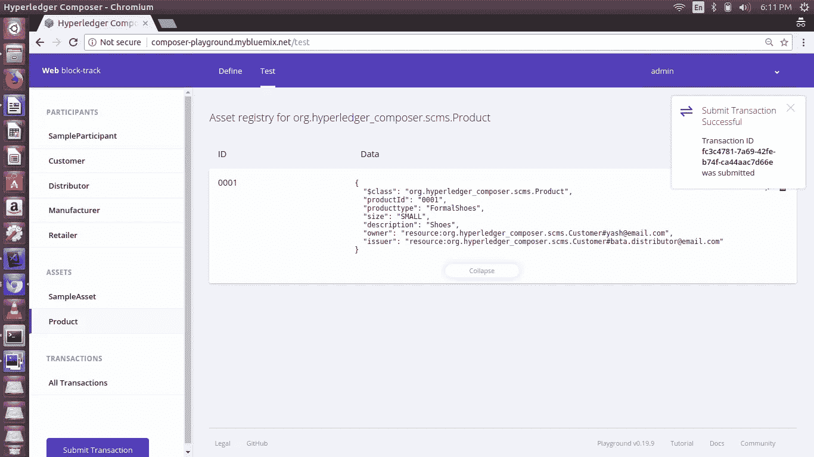

单击所有事务选项卡，查看到目前为止发生的所有操作。

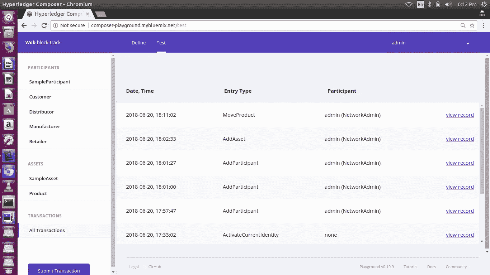

这是主要部分(即区块链部分)。所有不同的条目类型都被记录下来，并按照时间戳的顺序链接起来。单击 viewrecord 查看该特定块的内容。我们可以看到特定条目类型的 transactionId 和时间戳。

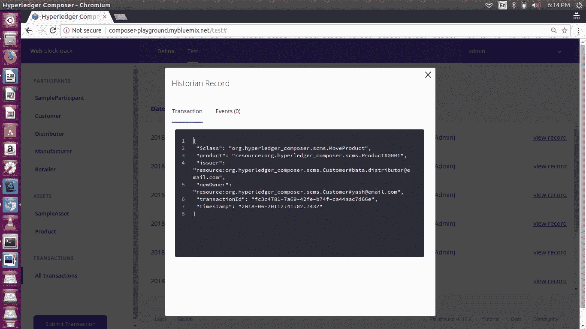

**祝贺你..！！**

您已经在在线 hyperledger composer playground 中成功完成了**构建、部署和测试**您的第一个区块链应用程序。在下一个教程中，我们将在本地部署它，并构建一个有角度的前端与之交互。现在转到 [part-2](/@yashwanthmadaka/building-a-blockchain-application-using-hyperledger-fabric-with-angular-frontend-part-2-22ef7c77f53) 继续封锁。

**注意:**以上代码只是供应链管理系统的一个简单版本，仅用于演示目的。那段代码有很多漏洞，需要改进。

*原载于 2018 年 6 月 20 日*[*【medium.com】*](/coinmonks/building-a-blockchain-application-using-hyperledger-fabric-with-angular-frontend-part-1-c7d1cbb70007)*。*