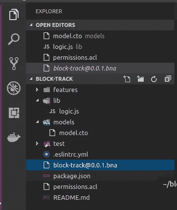

# 使用具有角度前端的 Hyperledger Fabric 构建区块链应用程序:第 2 部分

> 原文：<https://medium.com/coinmonks/building-a-blockchain-application-using-hyperledger-fabric-with-angular-frontend-part-2-22ef7c77f53?source=collection_archive---------4----------------------->

## 欢迎阅读本文的第 2 部分。这是我最喜欢的部分。


在开始之前，你需要安装[先决条件](https://hyperledger.github.io/composer/latest/installing/installing-prereqs.html)和[开发环境](https://hyperledger.github.io/composer/latest/installing/development-tools.html)。推荐的操作系统是 Ubuntu 或 Mac。我知道这对 windows 用户来说是悲哀的，我自己也是 Windows 用户。[我在双引导模式下把 Ubuntu 16.04 和 windows 一起安装。](https://www.tecmint.com/install-ubuntu-16-04-alongside-with-windows-10-or-8-in-dual-boot/)

有一种方法可以在 windows 中获得 [linux 环境，但是与 windows 一起安装 Ubuntu 要容易得多，而且 Windows 并不是区块链开发的首选，因为它容易受到威胁。](/cochain/hyperledger-fabric-on-windows-10-26723116c636)

现在，让我们开始开发。在安装了先决条件和开发环境之后，确保您的 docker 正在运行，并且您运行了**。/startFabric.sh 和。/createPeerAdminCard.sh**

> 交易新手？尝试[加密交易机器人](/coinmonks/crypto-trading-bot-c2ffce8acb2a)或[复制交易](/coinmonks/top-10-crypto-copy-trading-platforms-for-beginners-d0c37c7d698c)

# **第一步:生成 app 的框架**

现在，我们将使用 **Yeoman 生成一个骨架。**打开终端，输入以下命令:

```
yo hyperledger-composer
```

现在，它会射出一系列的问题。遵循下图所示的选项:


现在，在文本编辑器中打开这个项目。我更喜欢 visual-studio-code，因为它的动态特性和安装数千个扩展的能力。确保在 vs 代码中安装 hyperledger composer。


# 步骤 2:用我们在[第一部分](/@yashwanthmadaka/building-a-blockchain-application-using-hyperledger-fabric-with-angular-frontend-part-1-c7d1cbb70007)中完成的代码填充文件


在文本编辑器中打开后，我们可以看到 3 个文件 **logic.js，model.cto，permissions.acl.**

复制…的代码

**模型文件** → model.cto

**脚本文件** → logic.js

**访问控制** →权限. acl

# **第三步。创建业务网络档案(BNA)文件**

BNA 或业务网络存档文件是我们在教程— 1 中创建的文件包，即**模型文件、脚本文件和访问控制文件**


source : [https://hyperledger.github.io/composer/v0.16/business-network/businessnetworkdefinition](https://hyperledger.github.io/composer/v0.16/business-network/businessnetworkdefinition)

现在，我们在终端中导航到 block-track 应用程序，并键入以下命令。这将创建一个 **block-track@0.0.1.bna** 文件。

```
composer archive create -t dir -n .
```



# 步骤 4:部署。结构上的 bna 文件

## 步骤 4.1:安装 composer 运行时

为了将业务网络档案安装到 Hyperledger 结构网络上，您需要将业务网络安装到对等网络上。为此，您需要有业务网络存档。

```
composer network install --card PeerAdmin@hlfv1 --archiveFile
block-track@0.0.1.bna
```


## 步骤 4.2:部署业务网络

以下命令部署业务网络。

```
composer network start --networkName block-track
--networkVersion 0.0.1 --networkAdmin admin
--networkAdminEnrollSecret adminpw --card PeerAdmin@hlfv1 --file
networkadmin.card
```


## 步骤 4.3:导入网络管理员身份作为可用的业务网卡

这一步的下一个命令如下。

```
composer card import --file networkadmin.card
```


## 步骤 4.4:检查卡

要检查业务网络是否部署成功，请运行以下命令。

```
composer network ping --card admin@block-track
```


# 步骤 5:启动 RESTful API

现在，我们启动一个 REST 服务器。这里，角前端和 Hyperledger 结构通过这个 REST 服务器相互联系。在 Angular App 中所做的所有更改都会反映在 Hyperledger fabric 中，反之亦然。下图更清晰地展示了我们应用程序的流程。


source : [https://github.com/IBM/Decentralized-Energy-Composer/blob/master/images/arch.png](https://github.com/IBM/Decentralized-Energy-Composer/blob/master/images/arch.png)

运行下面的命令。

```
composer-rest-server
```

这将提出几个问题。遵循下面输出图像中显示的步骤。


现在，在你最喜欢的浏览器中打开[http://localhost:3000/explorer](http://localhost:3000/explorer)，你就可以和 API 进行交互了。


如果代码在 composer playground 中正常工作，那么它在这个 API 中也会正常工作。

# 步骤 6:用一个命令构建前端

是的，你没看错。您可以通过使用下面的一个命令来构建整个前端。在此之前，请确保您没有终止服务器，并打开一个新的终端和导航到您的应用程序文件夹。

```
yo
```

确保您在块跟踪文件夹中。


从以上选项中选择 Hyperledger Composer。现在这将提出几个问题。遵循下图所示的选项。


这将在主**块轨迹**文件夹中创建一个名为**角度应用**的文件夹。在您的终端中导航到该文件夹并启动应用程序。

```
cd angular-app
npm start 
```


在您的浏览器中打开 [http://localhost:4200](http://localhost:4200) ，您可以与您的模型进行交互。


尝试所有功能，如创建资产、参与者。


当您尝试调用事务按钮时，它不起作用。

# 步骤 7:修复调用事务按钮

我已经在下面的链接中写了一篇关于如何修复这个按钮的详细文章

[](/coinmonks/fixing-transaction-issue-in-angular-for-hyperledger-fabric-blockchain-application-fe7e28a7bb6e) [## 为 Hyperledger 结构区块链应用程序修复 Angular 中的事务处理问题

### 本文指导您如何在 angular 前端中修复调用事务按钮。

medium.com](/coinmonks/fixing-transaction-issue-in-angular-for-hyperledger-fabric-blockchain-application-fe7e28a7bb6e) 

# 步骤 8:尝试调用特性

我增加了一些小功能，比如资产页面中的**搜索栏**。我添加了一个新的信息标签，就像这个应用程序的主页。

我创造了

具有**产品 ID: Shoes_01** 的产品

一家名为【lifestyle.manufacturer@email.com】的制造商电子邮件地址:

一个叫【lifestyle.distributor@email.com】的经销商邮箱:

固定按钮后，打开下面的表单。


我想把这个产品从制造商那里发给经销商。所以我提一下上面的细节。

当我单击“确认”时，我会转到“资产”页面，当我搜索“产品 ID”时，我会看到该产品的新所有者。


我暂时从资产的 html 页面中删除了更新和删除选项。我还在 Info 选项卡中添加了一个功能，显示区块链上发生的所有 MOVEPRODUCT 事务的事务 ID。


现在，你已经成功地创建了你的第一个区块链应用程序，它有一个很好的前端与之交互。

**尽情享受！！:)**

**GitHub 链接:**

[https://github.com/yashwanthmadaka24/Block-Track](https://github.com/yashwanthmadaka24/Block-Track)

**参考文献:**

[](https://medium.freecodecamp.org/ultimate-end-to-end-tutorial-to-create-an-application-on-blockchain-using-hyperledger-3a83a80cbc71) [## 如何使用 Hyperledger 在区块链上创建应用程序

### 我们将使用 Hyperledger Composer 建立一个数字银行。它会有客户和账户。在它的结尾…

medium.freecodecamp.org](https://medium.freecodecamp.org/ultimate-end-to-end-tutorial-to-create-an-application-on-blockchain-using-hyperledger-3a83a80cbc71) 

> 加入 Coinmonks [电报频道](https://t.me/coincodecap)和 [Youtube 频道](https://www.youtube.com/c/coinmonks/videos)获取每日[加密新闻](http://coincodecap.com/)

## 另外，阅读

*   [复制交易](/coinmonks/top-10-crypto-copy-trading-platforms-for-beginners-d0c37c7d698c) | [加密税务软件](/coinmonks/crypto-tax-software-ed4b4810e338)
*   [网格交易](https://coincodecap.com/grid-trading) | [加密硬件钱包](/coinmonks/the-best-cryptocurrency-hardware-wallets-of-2020-e28b1c124069)
*   [KuCoin vs 北海巨妖 vs BitYard](https://coincodecap.com/kucoin-vs-kraken-vs-bityard) | [密码交易机器人](/coinmonks/crypto-trading-bot-c2ffce8acb2a)
*   [最适合加密交易的 VPN](https://coincodecap.com/best-vpns-for-crypto-trading)
*   [最佳加密分析或链上数据](https://coincodecap.com/blockchain-analytics) | [Bexplus 评论](https://coincodecap.com/bexplus-review)
*   [NFT 十大市场造币集锦](https://coincodecap.com/nft-marketplaces)
*   [密码电报信号](http://Top 4 Telegram Channels for Crypto Traders) | [密码交易机器人](/coinmonks/crypto-trading-bot-c2ffce8acb2a)
*   [最佳加密交易所](/coinmonks/crypto-exchange-dd2f9d6f3769) | [印度最佳加密交易所](/coinmonks/bitcoin-exchange-in-india-7f1fe79715c9)
*   [面向开发人员的最佳加密 API](/coinmonks/best-crypto-apis-for-developers-5efe3a597a9f)
*   最佳[密码借贷平台](/coinmonks/top-5-crypto-lending-platforms-in-2020-that-you-need-to-know-a1b675cec3fa)
*   杠杆代币的终极指南