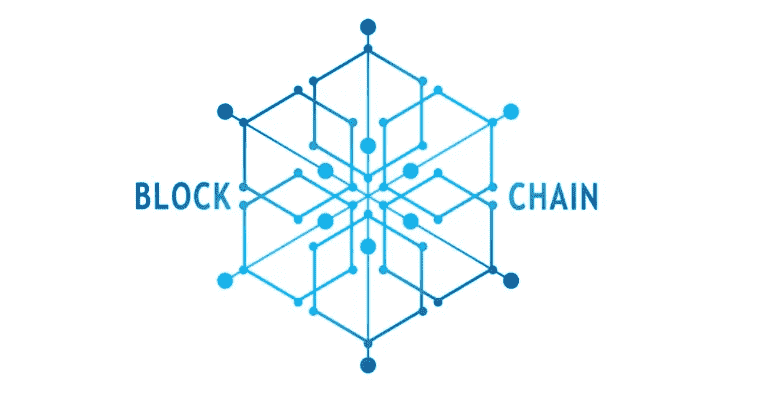
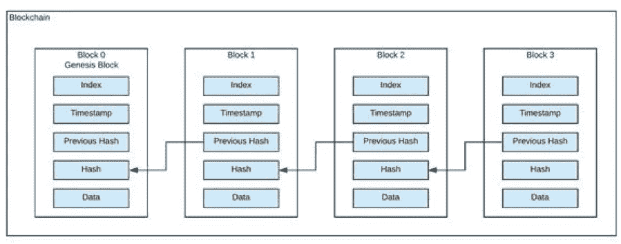

# 如何在 Elixir 中构建区块链第 1 部分

> 原文：<https://medium.com/coinmonks/building-a-blockchain-in-elixir-part-1-4d4ed889525b?source=collection_archive---------0----------------------->



区块链是一种允许在对等(P2P)基础上存储和交换数据的技术。在结构上，由于基于共识的算法，区块链数据可以被咨询、共享和保护。它以分散的方式使用，消除了对中介或“可信第三方”的需要

简单来说，区块链就是一个数据库。什么是数据库？数据库是有组织的数据集合。或者，你可以说，一个存储数据的数据结构。所以，区块链只是一个存储数据的数据结构。顾名思义，会有一连串的区块。



[https://www.spheregen.com/blockchain-technology-basics/](https://www.spheregen.com/blockchain-technology-basics/)

这个基本的区块链有一个由块组成的链表。每个块具有以下属性。

*   索引
*   时间戳
*   以前的哈希
*   混杂
*   数据

> 参加[这个区块链课程](https://blog.coincodecap.com/go/learn)，成为一名区块链开发者

今天我们要建造一个长生不老的区块链。我们将建造任何基本区块链提供的东西，概念很简单，我假设你对长生不老药和区块链概念有点熟悉，但即使你不熟悉，我也会试着解释关于区块链的每个细节。

我们将一步一步地构建区块、散列、钱包、共识，因此在这一部分，我们将构建一个具有区块链的区块链。然后在后面的部分中，我们将看到如何构建事务、挖掘和其他与区块链相关的东西。

所以还是赶紧立项，赶紧开始做吧。

```
mix phx.new ex_chain --no-html --no-ecto
```

这将初始化我们的应用程序，让我们进入项目并开始导航。

```
cd ex_chain
```

现在，让我们创建一个新文件`lib/blockchain/block.ex`，它将包含块相关的功能和逻辑。

让我们为块构建结构，所以我们的块现在将有 4 个基本的东西，然后慢慢地我们将继续添加新的东西。

假设在区块链中的一个非常基础的程序块中有`timestamp, hash of block, block data and previous block hash`。所以我们把它加到块上。

这给了我们一个基本的块结构。上面有这个街区的详细信息。

让我们在`block.ex`中添加一些基本函数，通过这些函数我们可以创建新的块和一个 genesis 块(Genesis 块是任何区块链中的第一块)，Genesis 块中没有任何以前的散列，所以我们将把以前的散列字段留空。

因此，让我们先添加一些测试，然后我们将实现通过这些测试的函数。在`test/blockchain/block_test.exs`中创建一个文件

现在运行`mix test`两个测试都会失败，所以让我们写函数，这样它就能通过。

让我们用以下函数修改`lib/blockchain/block.ex`。

这里我们创建了两个新函数，分别是`new/4`和`genesis/0`，现在我们的测试应该通过了。

我们的下一个任务是创建 mine 函数并添加 hash 函数，以便我们传递的数据可以被验证，我们可以构建 hash 函数的基础。

现在我们将添加接受`timestamp, last_hash and data`的函数`hash/3`，这样我们就可以得到当前的块散列。所以让我们修改测试和函数。

这里我们修改了现有的函数，从`new/3`函数生成块散列，并返回给我们新的`%Block{}`结构。

我们添加了一个`mine_block/2`函数，它在我们给出 last_hash 时挖掘新的块，因此它相应地设置参数并创建新的块。

让我们在这里停止这一部分，在下一部分，我们将从这些块创建区块链。

这是第二篇文章的链接[链接](/@y316nitk/how-to-build-a-blockchain-in-elixir-part-2-5c99ea9a7733?sk=e74a67d4d964039cc8f7503463d44bd8)

## 另外，阅读

*   最好的[加密交易机器人](/coinmonks/crypto-trading-bot-c2ffce8acb2a)
*   [密码本交易平台](/coinmonks/top-10-crypto-copy-trading-platforms-for-beginners-d0c37c7d698c)
*   最好的[加密税务软件](/coinmonks/best-crypto-tax-tool-for-my-money-72d4b430816b)
*   [最佳加密交易平台](/coinmonks/the-best-crypto-trading-platforms-in-2020-the-definitive-guide-updated-c72f8b874555)
*   最佳[密码借贷平台](/coinmonks/top-5-crypto-lending-platforms-in-2020-that-you-need-to-know-a1b675cec3fa)
*   [最佳区块链分析工具](https://bitquery.io/blog/best-blockchain-analysis-tools-and-software)
*   [加密套利](/coinmonks/crypto-arbitrage-guide-how-to-make-money-as-a-beginner-62bfe5c868f6)指南:新手如何赚钱
*   最佳[加密制图工具](/coinmonks/what-are-the-best-charting-platforms-for-cryptocurrency-trading-85aade584d80)
*   [莱杰 vs 特雷佐](/coinmonks/ledger-vs-trezor-best-hardware-wallet-to-secure-cryptocurrency-22c7a3fd391e)
*   了解比特币的[最佳书籍有哪些？](/coinmonks/what-are-the-best-books-to-learn-bitcoin-409aeb9aff4b)
*   [3 商业评论](/coinmonks/3commas-review-an-excellent-crypto-trading-bot-2020-1313a58bec92)
*   [AAX 交易所评论](/coinmonks/aax-exchange-review-2021-67c5ea09330c) |推荐代码、交易费用、利弊
*   [德里比特评论](/coinmonks/deribit-review-options-fees-apis-and-testnet-2ca16c4bbdb2) |选项、费用、API 和 Testnet
*   [FTX 密码交易所评论](/coinmonks/ftx-crypto-exchange-review-53664ac1198f)
*   [n 零审核](/coinmonks/ngrave-zero-review-c465cf8307fc)
*   [Bybit 交换审查](/coinmonks/bybit-exchange-review-dbd570019b71)
*   [3Commas vs Cryptohopper](/coinmonks/cryptohopper-vs-3commas-vs-shrimpy-a2c16095b8fe)
*   最好的比特币[硬件钱包](/coinmonks/the-best-cryptocurrency-hardware-wallets-of-2020-e28b1c124069?source=friends_link&sk=324dd9ff8556ab578d71e7ad7658ad7c)
*   最佳 [monero 钱包](https://blog.coincodecap.com/best-monero-wallets)
*   [莱杰 nano s vs x](https://blog.coincodecap.com/ledger-nano-s-vs-x)
*   [bits gap vs 3 commas vs quad ency](https://blog.coincodecap.com/bitsgap-3commas-quadency)
*   [莱杰纳米 S vs 特雷佐 one vs 特雷佐 T vs 莱杰纳米 X](https://blog.coincodecap.com/ledger-nano-s-vs-trezor-one-ledger-nano-x-trezor-t)
*   [block fi vs Celsius](/coinmonks/blockfi-vs-celsius-vs-hodlnaut-8a1cc8c26630)vs Hodlnaut
*   Bitsgap 评论——一个轻松赚钱的加密交易机器人
*   为专业人士设计的加密交易机器人
*   [PrimeXBT 审查](/coinmonks/primexbt-review-88e0815be858) |杠杆交易、费用和交易
*   [埃利帕尔泰坦评论](/coinmonks/ellipal-titan-review-85e9071dd029)
*   [SecuX Stone 评论](https://blog.coincodecap.com/secux-stone-hardware-wallet-review)
*   [BlockFi 评论](/coinmonks/blockfi-review-53096053c097) |从您的密码中赚取高达 8.6%的利息