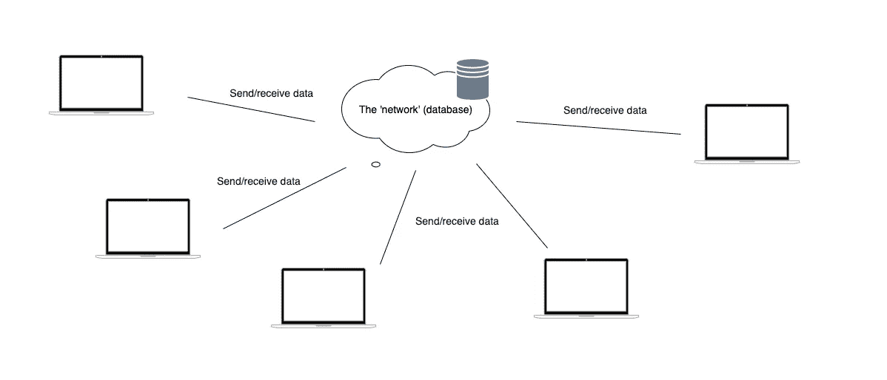
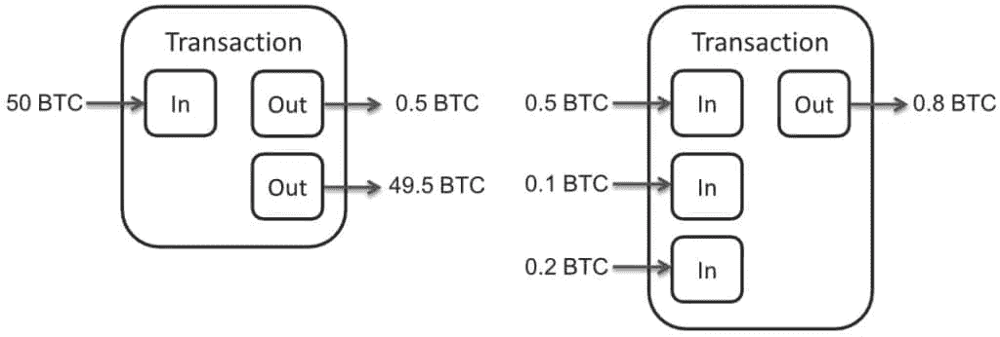
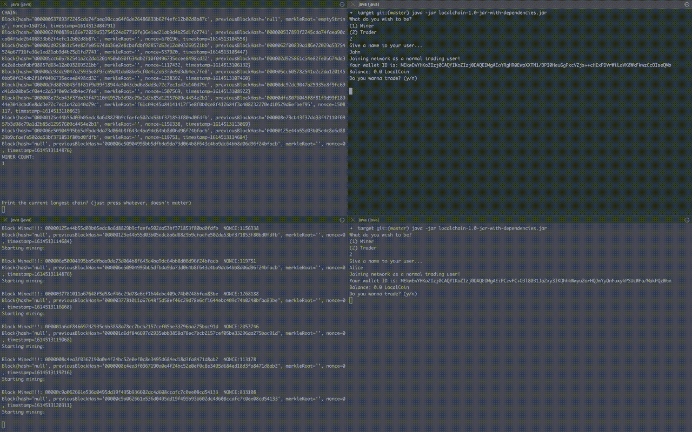

# 建造一个区块链模拟器

> 原文：<https://medium.com/coinmonks/building-a-blockchain-simulator-2331087bebc4?source=collection_archive---------3----------------------->

## Github 代码[这里](https://github.com/mdvictor/localchain)！

# 动机

在过去的几周里，我对所有与加密相关的东西都产生了浓厚的兴趣。参加派对有点晚了，但我希望不会太晚。我想更深入地了解事物是如何工作的，所以我开始阅读原始的加密货币——比特币。

然后，我决定至少复制比特币区块链的一些主要功能，但加入一个更具互动性的元素，这是我在所有教程中从未见过的。我的想法是在我面前的监视器屏幕上看到网络和它的演员在做他们的工作。

对于这个任务，我选择了 Java。

# 证明文件

你看，选择 Java 并没有什么逻辑上的原因，只是凭喜好。幸运的是，其他人也以类似的方式使用它。当我搜索其他学习资源时，我找到了[cryptokas 的区块链开发 Megabundle](/programmers-blockchain/blockchain-development-mega-guide-5a316e6d10df) ，它有足够的资源让任何区块链的新手开发者快速上手。他的一个教程甚至有一个用 Java 编写的区块链实现，这一过程中很有帮助，我也从其中借用了一些代码。

除了 megabundle，还有中本聪写的比特币白皮书，我觉得解释得很好。

# 模拟器的描述

我的最终产品应该是一个玩具区块链模拟器，矿工和用户可以加入其中，做人们在区块链共识工作证明上做的基本操作，如比特币——我的和交易的硬币。所有这些都将在一台 PC 机上本地发生，通过终端，每个网络参与者由程序的一个不同实例来代表。命名方案的想法由此而来——local chain 和它的本地令牌 LocalCoin。

在开发的大部分时间里，我试图要么遵循最初的比特币论文，要么在不可能实现的地方即兴创作。为了创造一个分散网络的假象，我使用了一个 SQLite 数据库，其中存储了应该从一个用户广播到网络其余部分的所有内容。



Where each notebook shown above is actually a different process on the same computer

这到底是什么意思？这意味着*‘网络’*本身就存在于上面提到的数据库中。从一个节点的角度来看，事情有点像一个适当的分散区块链。节点要么挖掘一个块，要么通过适当的 API 向另一个钱包发送一些本地硬币，所以这两个动作都以节点向网络广播数据而结束。一旦节点将其数据发送到网络，它并不真正关心此后会发生什么。

诚然，这种实现有其错误，而且它肯定与 Satoshi 提出的白皮书相去甚远，但我的目的不是再造比特币，而是理解其内部技术工作原理，并实现某种交互式模拟。为了实现这一点，我意识到网络部分会很麻烦，所以我选择了使用数据库的路线。

这种实现的结果是，在可以被视为将数据传播到所有节点的非常快速的网络中，为所有节点提供相同的数据——相同的区块链和相同的事务池，以便永远不会有两台机器同时广播不同的数据，并将网络分成两部分(实质上是分叉链)。所以，最终…它真的就像一个中央集权的机构。

*‘网络’*上的所有矿工将解决新的块，并试图将他们的链版本推向其他所有人(也称为保存到数据库)。与比特币标准的另一个偏差是，在矿工推出他的版本之前，他会与“网络”(又名 DB)检查他的链是否最长。如果是，那么他将它推送到数据库，所有其他节点都开始使用它。否则，他会放弃该版本，从数据库中选择正确的版本，并开始使用它来解决新的块。澄清一下，在这个实现中，最长的链实际上是按大小而不是按投入的努力的最长的链。因此，如果存在难度为 6 的复杂四块链，它将在难度为 1 的五区块链面前被视为无效，难度是提议的标准，这意味着哈希解决方案前缀的零的数量，以便该哈希被视为对特定块有效。

现在很明显，网络方面与最初的提议相去甚远，因此许多问题，如硬分叉或 51%攻击，都无法在这个区块链模拟器中重现。除了上面提到的一切之外，还有一个事实，即每个挖掘器实际上具有相同的处理能力，每个都是在同一台计算机上运行的进程，这意味着挖掘器之间几乎没有竞争:网络上的第一个将总是具有最长的链，并将产生所有后续块，因为所有挖掘器的计算能力都是恒定的。

# 它实际上是如何工作的？

模拟器通过运行编译程序的多个实例来工作。第一次运行将创建一个进程，该进程将通过创建一个存储在名为*‘local chain . db’*的文件中的本地数据库来设置【T2’‘网络’。这是第一个进程的主要功能，在完成所有设置后，它将在终端中保持活动状态，以便在用户需要时打印区块链数据。

程序分割和遵循不同功能的方式在*‘Main’*类中定义。因为 DB 是作为本地文件保存的，所以程序会检查它是否存在，如果不存在就创建它。然后，它会等待用户说出他希望这个特定的程序实例是什么——矿工还是交易者。

```
File f = new File(System.*getProperty*("user.dir")+"/localchain.db");if (!f.exists()) {
    System.*out*.println("Starting the network!");
    network = new Network();
    network.startNetwork(); // ask the user if he wants to print the currently accepted blockchain while (answer != null) {
        //print the blockchain }
} else { ... // ask the user if he wants to launch a miner or a trader switch (answer) {
        case 1:
            System.*out*.println("Joining network as a miner!");
            Miner miner = new Miner(userName);
            miner.startMining();
            break;
        case 2:
            System.*out*.println("Joining network as a normal trading user!");
            User trader = new User(userName); //logic that sends money from the network wallet to the first trader to get on the blockchain
            ... trader.startTrading(userInput);
            break;
    }
}
```

上面看到的*‘网络’*类是通过创建所需的表和创建一个 genesis 块来准备 DB 的类。由于我们在创建区块链时没有用户，所以 DB 还将存储一对代表网络钱包的公钥/私钥。这个钱包将会凭空制造 1000 个 LC，并将它们发送给第一个进入网络的交易者。这将被视为创世交易。

这个类还表示接口，通过这个接口，其他对象可以插入、选择、更新或删除数据库(也称为网络)中的数据。

还要注意的是上面的'*、while()'* 指令。所有的过程都陷入了一个无限循环中。第一个过程是最明显的，因为指令就在主文件中，但是用户和矿工过程也在它们各自的方法中无限循环: *'startTrading()'* 和 *'startMining()'* 。

# 街区、矿工和商人

这些块是以标准方式实现的，它们的属性是散列、前一个块散列、nonce、时间戳和一个代表添加的事务的 Merkle 树根。

nonce，或块的难度，根据网络上矿工的数量增加，再一次使用数据库来记录参与者的数量。

矿工会不断开采新的矿块。

```
while(true) {
    networkChain = Network.*getLatestChainFromFakeNetwork*();
    if (localChain.size() < networkChain.size()) {
        localChain = networkChain;
    }

    Network.*adaptDifficulty*();

    Block lastBlock = Network.*getLastBlockInChain*();
    System.*out*.println(lastBlock.toString());
    if (!lastBlock.isMined()) {
        Block solvedBlock = pickaxe.mine(lastBlock, Network.*difficulty*);

        localChain.get(localChain.size() - 1).transactionIds.forEach(Network::*confirmTxRecord*);
        localChain.get(localChain.size() - 1).transactionIds = null;
        localChain.get(localChain.size() - 1).nonce = solvedBlock.nonce;
        localChain.get(localChain.size() - 1).hash = solvedBlock.hash;

        Block block = new Block(localChain.get(localChain.size() - 1).hash);
        ArrayList<TxRecord> txRecords = Network.*getUnconfirmedTxRecords*();
        if (txRecords != null) {
            txRecords.forEach(block::addTx);
        }
        block.merkleRoot = CryptoService.*getMerkleRoot*(block.transactions);
        //transactions need not stay on block. only merkleRoot
        block.transactions = null;

        localChain.add(block);

        networkChain = Network.*getLatestChainFromFakeNetwork*();
        if (localChain.size() < networkChain.size()) {
            localChain = networkChain;
            System.*out*.println("My chain is smaller than network chain, switching to that one...\n\n");
        } else {
            Network.*sendChainOverFakeNetwork*(localChain);
        }
    }
}
```

首先，一个矿工会检查他们是否在已接受的链上建造并调整难度，然后他会开采最后一块。挖掘算法放在' *MineUtils* '类中，并使用 CryptoKass 中的代码。实际上，所有隐含任何加密的东西都是由 CryptoKass 编写的代码，所以，对于那些浏览代码的人来说，整个*‘CryptoService’*类。

矿工做的下一件事是建造一个新的区块。为此，它将从一个未确认的事务池中获取事务，从中构建一个 Merkle 树，并计算 Merkle 树的根。其他属性也在块上设置，块被添加到链中，然后挖掘器将整个链广播到网络。

当前实现的另一个缺点是，不是在区块被开采之后，而是一旦开采者将事务添加到区块中，事务就被认为是确认的。这个问题还没有解决，因为如前所述，每个采矿机的计算能力是恒定的，所以第一个加入网络的采矿机将总是创建一个新块并在不久后开采它。

另一边是交易者。交易者主要通过他们的钱包来代表，并且可以发送或接收信用证。控制台将打印每个交易者的公钥和余额，这些信息可以用来发送硬币。很容易从一个用户向另一个用户发送资金，因为在终端屏幕上有很容易遵循的指令。

从实现的角度来看，用户基本上是这样做的:

```
while (true) {
    System.*out*.println("Your wallet ID is: " + CryptoService.*getStringFromKey*(this.wallet.publicKey));
    System.*out*.println("Balance: " + this.wallet.getBalance() + " LocalCoin");
    System.*out*.println("Do you wanna trade? (y/n)");
    String tradeSomething = userInput.next();
    userInput.nextLine();

    if (tradeSomething.equals("y")) {
        System.*out*.println("\nWho do you wanna send LC to?");
        String publicKeyIdentifier = userInput.nextLine();

        System.*out*.println("\nWhat amount of LC to send?");
        float val = userInput.nextFloat();
        userInput.nextLine();

        if (this.wallet.sendFunds(
CryptoService.*getPublicKeyFromString*(publicKeyIdentifier),val)) {
            System.*out*.println(this.name + " has sent funds to wallet ID " + publicKeyIdentifier);
        }
    }
}
```

交易遵循比特币白皮书实现，它说一个交易由输入交易和输出交易组成。这样，硬币可以被追踪到一个原点，并跟踪一个用户的余额，这样他就不会把不属于他的硬币送给别人。更具体地说，如果用户想要发送硬币，那么必须存在一个或多个交易记录，在这些交易记录中，他至少接收到他想要发送的硬币的数量，并且如此继续下去。



Example transaction records

在上图中，我们假设 0.5BTC 从第一笔交易的“出”字段进入第二笔交易的“入”字段。正是由于这些“In”字段，第二个事务可以存在，并且一些用户可以发送 0.8BTC。但是 49.5 BTC“Out”字段呢？比特币论文解释说，对于每一笔交易,“进”字段的总和必须等于“出”字段的总和。因此，在这种情况下，如果用户不想清空他的钱包，他可以简单地将剩余的硬币发送回自己，在这种情况下，交易将硬币发送到它们离开的相同地址。

通常，在区块链中，当用户想要向另一个用户发送硬币时，他将生成这个新的交易，设置‘In’和‘Out’字段，使用他的私钥签署交易，然后将它广播到网络。然后，该记录将被其他节点获取和验证。他们将通过检查签名和来龙去脉来决定交易是否有效，并将其发送到未经确认的交易池，矿工将从中进行选择。

唉，模拟器不是这样工作的。用户在发送资金之前，在本地进行简单的余额验证。他验证他有足够的未用交易输出(UTXO ),然后创建交易，签名，设置谁接收多少金额，并将其广播到网络。稍后，当一个新的块被创建时，挖掘器将事务添加到其中，他验证签名，如果无效，则丢弃事务。

```
public boolean sendFunds(PublicKey _recipient, float value ) {
    if(getBalance() < value) {
        System.*out*.println("Not enough funds to send transaction. Transaction Discarded.");
        return false;
    }
    ArrayList<TxInput> inputs = new ArrayList<>();

    float total = 0;
    for (Map.Entry<String, TxOutput> item: UTXOs.entrySet()){
        TxOutput UTXO = item.getValue();
        total += UTXO.value;
        inputs.add(new TxInput(UTXO.id));
        if(total > value) break;
    }

    TxRecord newTransaction = new TxRecord(publicKey, _recipient , value, inputs);
    newTransaction.generateSignature(privateKey);
    Network.*addUncofirmedTxRecord*(newTransaction);

    for(TxInput input: inputs){
        UTXOs.remove(input.txOutputId);
    }

    return true;
}
```

我在上面提到过，矿商可以选择哪些未确认的交易被确认为大宗交易。通常情况下，每笔交易都应该收取一定的费用。这笔费用将由矿工收取，同时还有完成区块并将其添加到链中的另一笔奖励。这是矿工在现实生活中保持动力的原因。用户声明他们希望向矿商支付多少费用，这带来了另一个问题:如果用户支付的费用太少，没有矿商会选择他们的交易，最终会被忽略。

这样的问题在本模拟器中不存在。矿工们没有报酬，他们做这项工作是出于好心。他们也不能选择进入区块的交易，因为这个模拟器不像比特币那样每月处理数百万笔交易。所有事务在到达池时都被处理。

# 结论

尽管提出的解决方案没有现实生活中的效用，也不同于最初的比特币实现，但它提供了一种更好地可视化区块链的互动方式。它还保留了最初的比特币论文中讨论的大部分实现，并帮助我更好地理解区块链是如何工作的。

我希望这将证明对其他好奇事情如何在引擎盖下工作的加密货币爱好者是有帮助的。



Example functionality of the program

> 加入 Coinmonks [Telegram group](https://t.me/joinchat/EPmjKpNYwRMsBI4p) 并了解加密交易和投资

## 另外，阅读

*   什么是[闪贷](https://blog.coincodecap.com/what-are-flash-loans-on-ethereum)？
*   最好的[密码交易机器人](/coinmonks/crypto-trading-bot-c2ffce8acb2a) | [网格交易](https://blog.coincodecap.com/grid-trading)
*   [3 商业评论](/coinmonks/3commas-review-an-excellent-crypto-trading-bot-2020-1313a58bec92) | [Pionex 评论](/coinmonks/pionex-review-exchange-with-crypto-trading-bot-1e459d0191ea) | [Coinrule 评论](https://blog.coincodecap.com/coinrule-review-a-perfect-trading-bot)
*   [AAX 交易所评论](/coinmonks/aax-exchange-review-2021-67c5ea09330c) | [德里比特评论](/coinmonks/deribit-review-options-fees-apis-and-testnet-2ca16c4bbdb2) | [FTX 交易所评论](/coinmonks/ftx-crypto-exchange-review-53664ac1198f)
*   [n 零审核](/coinmonks/ngrave-zero-review-c465cf8307fc) | [Phemex 审核](/coinmonks/phemex-review-4cfba0b49e28) | [PrimeXBT 审核](/coinmonks/primexbt-review-88e0815be858)
*   [Bybit Exchange 审查](/coinmonks/bybit-exchange-review-dbd570019b71) | [Bityard 审查](https://blog.coincodecap.com/bityard-reivew) | [CoinSpot 审查](https://blog.coincodecap.com/coinspot-review)
*   [3 commas vs Cryptohopper](/coinmonks/3commas-vs-pionex-vs-cryptohopper-best-crypto-bot-6a98d2baa203)|[赚取加密利息](/coinmonks/earn-crypto-interest-b10b810fdda3)
*   最好的比特币[硬件钱包](/coinmonks/the-best-cryptocurrency-hardware-wallets-of-2020-e28b1c124069?source=friends_link&sk=324dd9ff8556ab578d71e7ad7658ad7c) | [BitBox02 回顾](/coinmonks/bitbox02-review-your-swiss-bitcoin-hardware-wallet-c36c88fff29)
*   [总账 vs n 平均](https://blog.coincodecap.com/ngrave-vs-ledger) | [总账 nano s vs x](https://blog.coincodecap.com/ledger-nano-s-vs-x)
*   [密码拷贝交易平台](/coinmonks/top-10-crypto-copy-trading-platforms-for-beginners-d0c37c7d698c) | [比特码拷贝交易](https://blog.coincodecap.com/bityard-copy-trading)
*   [Vauld Review](https://blog.coincodecap.com/vauld-review)|[you hodler Review](/coinmonks/youhodler-4-easy-ways-to-make-money-98969b9689f2)|[BlockFi Review](/coinmonks/blockfi-review-53096053c097)
*   最好的[加密税务软件](/coinmonks/best-crypto-tax-tool-for-my-money-72d4b430816b) | [硬币追踪评论](/coinmonks/cointracking-review-a-reliable-cryptocurrency-tax-software-5114e3eb5737)
*   最佳[加密借贷平台](/coinmonks/top-5-crypto-lending-platforms-in-2020-that-you-need-to-know-a1b675cec3fa) | [杠杆代币](/coinmonks/leveraged-token-3f5257808b22)
*   [莱杰 Nano S vs 特雷佐 one vs 特雷佐 T vs 莱杰 Nano X](https://blog.coincodecap.com/ledger-nano-s-vs-trezor-one-ledger-nano-x-trezor-t)
*   [block fi vs Celsius](/coinmonks/blockfi-vs-celsius-vs-hodlnaut-8a1cc8c26630)|[Hodlnaut Review](https://blog.coincodecap.com/hodlnaut-review)
*   [Bitsgap 审查](https://blog.coincodecap.com/bitsgap-review) | [Quadency 审查](/coinmonks/quadency-review-a-crypto-trading-automation-platform-3068eaa374e1) | [Bitbns 审查](https://blog.coincodecap.com/bitbns-review)
*   [埃利帕尔泰坦评论](/coinmonks/ellipal-titan-review-85e9071dd029) | [赛克斯斯通评论](https://blog.coincodecap.com/secux-stone-hardware-wallet-review)
*   [DEX Explorer](https://explorer.bitquery.io/ethereum/dex)|[w](https://explorer.bitquery.io/graphql)|[local bitcoins 评论](https://blog.coincodecap.com/localbitcoins-review)
*   最佳[区块链分析](https://bitquery.io/blog/best-blockchain-analysis-tools-and-software)工具| [赚比特币](https://blog.coincodecap.com/earn-bitcoin)
*   [加密套利](/coinmonks/crypto-arbitrage-guide-how-to-make-money-as-a-beginner-62bfe5c868f6)指南:新手如何赚钱
*   最佳[加密制图工具](/coinmonks/what-are-the-best-charting-platforms-for-cryptocurrency-trading-85aade584d80) | [最佳加密交易所](/coinmonks/crypto-exchange-dd2f9d6f3769)
*   [如何在印度购买比特币](https://blog.coincodecap.com/buy-bitcoin-app-india)？
*   [印度比特币交易所](/coinmonks/bitcoin-exchange-in-india-7f1fe79715c9) | [比特币储蓄账户](https://blog.coincodecap.com/bitcoin-savings-account)
*   了解比特币的[最佳书籍有哪些？](/coinmonks/what-are-the-best-books-to-learn-bitcoin-409aeb9aff4b)

> [直接在您的收件箱中获得最佳软件交易](/coinmonks/newsletters/coinmonks)

[](https://medium.com/coinmonks/newsletters/coinmonks)