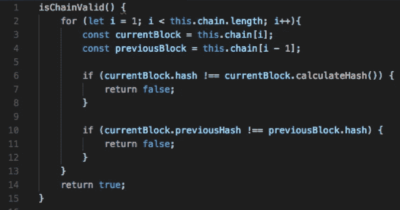

# 使用 JavaScript 构建区块链

> 原文：<https://medium.com/coinmonks/building-a-blockchain-using-javascript-ac75d1b2af23?source=collection_archive---------2----------------------->

区块链的基本概念是指一个分布式数据库，它维护着一个不断增长的有序记录列表，任何人都可以读取这些记录，但这些记录是不可变的。

一旦一个块被添加到链中，在不使链的其余部分无效的情况下，就不能再改变它。

# 搭积木

必须定义块的结构，下面的图像显示了结构应该是什么样子的例子。确保每个数据块的数据完整性非常重要，这就是为什么每个数据块都包含基于其内容计算的哈希。它还包含前一个块的哈希。

A blockchain data structure

在 JavaScript 中，我们的 block 类看起来是这样的:

JS class Block

## 块散列

请记住，为了保持数据的完整性，需要对数据块进行哈希处理，并将其包含在数据块的特定字段中。我们使用 crypto-js 库，这是“calculateHash”函数:

calculateHash Function

## 生成块

为了生成一个块，必须知道前一个块的散列，并且应该提供数据。addBlock()负责向我们的链中添加一个新的块。为此，我们将前一个块的哈希添加到新块中。这样我们就能保持链条的完整性。因为我们改变了新块的内容，所以需要重新计算它的散列。完成后，我将块推到链(数组)上。

Generate a new Block

## getLatestBlock()方法

这是返回我们区块链的最新区块

getLatestBlock Function

## 创世街区

用 genesis 块的值初始化我们的链数组:

Genesis Block Function

## 验证链

以确保没有人改变区块链。它遍历所有块，检查每个块的哈希是否正确。它还通过比较 previousHash 值来检查每个块是否指向正确的前一个块。如果一切正常，它将返回 true，如果有问题，它将返回 false。

Validate the chain

## 构建链条

现在我们可以开始在区块链类中将区块链接在一起了！这个类将包括前面提到的函数和构造函数。

Blockchain class

在构造函数中，我们通过创建一个包含 genesis 块的数组来初始化这个链。第一个块很特殊，因为它不能指向前一个块。

# 运行应用程序

首先，在初始化应用程序后，您可以使用以下代码向链中添加一些块:

adding some blocks to the chain

要查看区块链数据，您可以执行以下操作:

command to show the blockchain

> *注意，为了便于阅读，采用了 JSON 样式:

**从终端运行:
节点< javascript_file.js >**

您可以通过调用 is valid()函数来检查该链是否有效。此外，您可以更改数据，如接下来的 2 行代码所示，我们将更改块数据值，甚至重新计算区块链。 ***再次运行 app 时检查结果***

How to validate the chain

# 结论

尽管这一实现还远未完成。它演示了区块链的工作方式，清楚地解释了区块链的基本概念，以及这些概念是如何易于理解和实施的。

完整的项目代码可以在以下 Git 存储库中找到:

[https://github.com/juliomacr/blockchain-demo](https://github.com/juliomacr/blockchain-demo)

如果您想了解更多关于 Blockchain 开发的信息，对 Blockchain 相关技术进行 [SalsaMobi](https://www.salsamobi.com/) 教育可能是一个很好的起点，您也可以 [**在这里**](https://salsamobi.us19.list-manage.com/subscribe?u=f699b5966f72d084516ecc1fc&id=3846bc403e) 订阅，我们会在创建更多的文章或教程时通知您。

[SalsaMobi](https://salsamobi.com/) Logo

[*胡利奥·马林*](https://www.linkedin.com/in/juliomacr/) *倡导研究和实施新技术，并将其应用于日常生活中。研究领域包括多媒体开发和交付、密码货币、移动开发和营销自动化。目前在 SalsaMobi 担任高级课程开发人员和区块链开发团队负责人。*

> [直接在您的收件箱中获取最佳软件交易](https://coincodecap.com/?utm_source=coinmonks)

