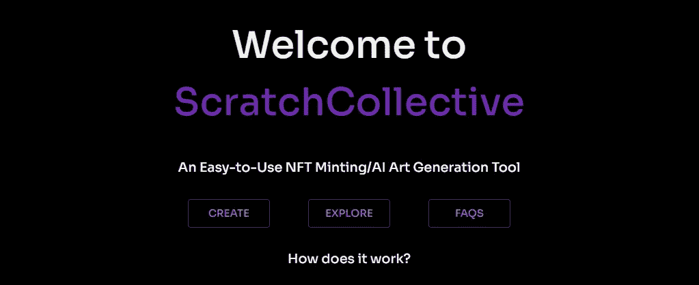
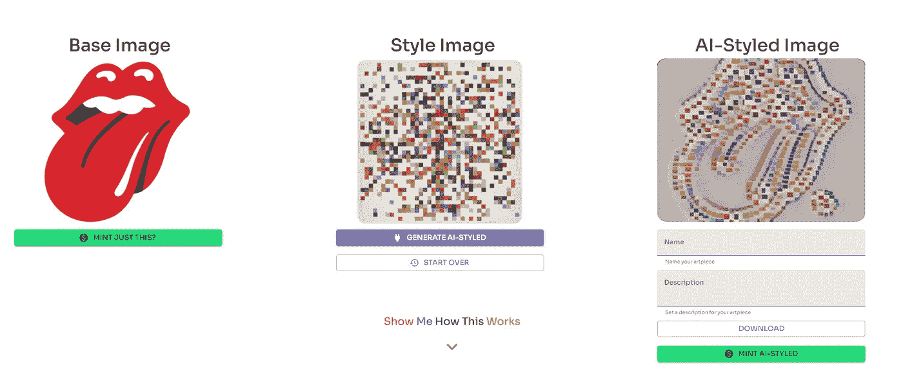

# 构建全栈 Web3 应用(DApp): Scratchcollective.app

> 原文：<https://medium.com/coinmonks/building-a-full-stack-web3-application-dapp-scratchcollective-app-c843adcee8a0?source=collection_archive---------2----------------------->

今天的 web 行业越来越倾向于第三代互联网，称为 Web 3.0，这是一种分散的范式，利用以太坊这样的区块链来促进无信任的交易，而无需通过 Web 进行集中的中介。

因此，我很自豪地介绍[**scratch collective . app**](http://www.scratchcollective.app)，这是一个以 NFT-明廷/人工智能艺术生成工具形式展示的全栈分散式应用程序开发。

Welcome to ScratchCollective!

您可以在[www . scratch collective . app](http://www.scratchcollective.app)找到现场应用。

所有代码都是公开的，可以在我的[Github](https://github.com/TheBourneOldTomato):[https://github.com/TheBourneOldTomato/scratchcollective](https://github.com/TheBourneOldTomato/scratchcollective)上找到，作为本文(和后续文章)以及开发您自己的应用程序的参考。在这个令人兴奋的领域，我坚信教育和公共支持，并很高兴与你们分享我的代码、我的想法和我的兴奋。

本系列文章(4 部分)的读者应该对以太坊、NFTs(不可替换令牌)元掩码、星际文件系统(IPFS)和 web 开发有所了解。然而，我尽量保持它的简单，这样即使是那些新手也可以通过谷歌搜索找到内容。scratch collection[FAQ](https://www.scratchcollective.app/about)中解释了很多。

本文介绍了 ScratchCollective DApp 的不同部分，以及它们是如何协同工作的。在其中，我利用了 MERN 堆栈(MongoDB、Express、React、Nodejs)以及 web3.js、以太坊提供者 API、IPFS 和一个在任意图像样式化模型上运行 Tensorflow 的 python 子进程(向为我提供原始脚本和模型的 [@BehicGuven](https://lifexplorer.medium.com/) 大喊)。我使用材质界面使前端相当漂亮。该应用程序的一个很酷的特性是自动化的 Metamask 登录/认证过程，它消除了对传统的电子邮件/密码模式的需要——类似于 OpenSea 等应用程序(第 4 部分将详细介绍)。

这款应用程序的一个快速要点是:你拍摄一张图像，用另一张图像设计风格，然后将结果制作成以太坊区块链上的 NFT(你也可以选择将现有图像制作成没有人工智能的 NFT)。

该应用程序在 Rinkeby、Ropsten、Goerli 以太坊测试网上运行。由于这是一个演示应用程序(就目前而言)，我认为花费 1000 美元在 mainnet 上部署我的合同是不明智的(在第 2 部分中会有更多的介绍)😆。它目前也托管在一个 Heroku dyno 上，所以如果太多人使用它，人工智能一代可能无法工作。请耐心等待，因为这是一个用于教育目的的演示应用程序！

应用程序组件的一般运行:

*   **反应**前端
*   造型用**材质-UI**
*   **以太坊提供者 API +元掩码**(检测提供者，onboarding 库)用于钱包和账户/区块链交互
*   **TensorFlow (Python)** +用于 AI 艺术生成的任意图像风格化模型(神经风格转移)
*   **快递**后端服务器
*   一份 ERC-1155 合同(用 **Solidity** 编写)使用 Truffle 事先编译和部署
*   **Web3.js** 与以太坊区块链和我的智能合约互动
*   **IPFS** 存储 NFT 元数据
*   Imgur 托管图像(不要评判我)
*   **MongoDB** 数据库，用于存储用户和艺术品信息

这是 4 部分系列的介绍。在后续文章中，我将更详细地介绍以下内容:

第 1 部分**——我在构建应用时面临的具体挑战以及我是如何应对的**

**第 2 部分—开发智能合约以及应用程序如何通过 web3.js 与之交互**

**第三部分——NFT 力学如何工作以及 ScratchCollective 如何铸造它们**

**第 4 部分——如何使用元掩码消除传统电子邮件密码登录的需要并自动进行用户身份验证**

**同时，请随时查看应用程序和代码，并提出任何问题:)**

> **加入 Coinmonks [电报频道](https://t.me/coincodecap)和 [Youtube 频道](https://www.youtube.com/c/coinmonks/videos)了解加密交易和投资**

## **另外，阅读**

*   **最好的比特币[硬件钱包](/coinmonks/hardware-wallets-dfa1211730c6) | [BitBox02 回顾](/coinmonks/bitbox02-review-your-swiss-bitcoin-hardware-wallet-c36c88fff29)**
*   **[BlockFi vs 摄氏度](/coinmonks/blockfi-vs-celsius-vs-hodlnaut-8a1cc8c26630) | [Hodlnaut 审核](/coinmonks/hodlnaut-review-best-way-to-hodl-is-to-earn-interest-on-your-bitcoin-6658a8c19edf) | [KuCoin 审核](https://blog.coincodecap.com/kucoin-review)**
*   **[币安期货交易](https://blog.coincodecap.com/binance-futures-trading)|[3 commas vs Mudrex vs eToro](https://blog.coincodecap.com/mudrex-3commas-etoro)**
*   **[交易杠杆代币的最佳交易所](https://blog.coincodecap.com/leveraged-token-exchanges)**
*   **[AscendEx Staking](https://blog.coincodecap.com/ascendex-staking)|[Bot Ocean Review](https://blog.coincodecap.com/bot-ocean-review)|[最佳比特币钱包](https://blog.coincodecap.com/bitcoin-wallets-india)**
*   **[Bitget 回顾](https://blog.coincodecap.com/bitget-review)|[Gemini vs block fi](https://blog.coincodecap.com/gemini-vs-blockfi)|[OKEx 期货交易](https://blog.coincodecap.com/okex-futures-trading)**
*   **[美国最佳加密交易机器人](https://blog.coincodecap.com/crypto-trading-bots-in-the-us) | [变化回顾](https://blog.coincodecap.com/changelly-review)**
*   **[在印度利用加密套利赚取被动收入](https://blog.coincodecap.com/crypto-arbitrage-in-india)**
*   **[霍比评论](https://blog.coincodecap.com/huobi-review) | [OKEx 保证金交易](https://blog.coincodecap.com/okex-margin-trading) | [期货交易](https://blog.coincodecap.com/futures-trading)**
*   **[麻雀交换评论](https://blog.coincodecap.com/sparrow-exchange-review) | [纳什交换评论](https://blog.coincodecap.com/nash-exchange-review)**
*   **最好的[加密税务软件](/coinmonks/best-crypto-tax-tool-for-my-money-72d4b430816b) | [硬币追踪评论](/coinmonks/cointracking-review-a-reliable-cryptocurrency-tax-software-5114e3eb5737)**