# 构建 Web3 Dapp(第 2 部分)—撰写智能合同

> 原文：<https://medium.com/coinmonks/building-a-full-stack-web3-application-dapp-writing-the-smart-contract-d3bd45ec6cd8?source=collection_archive---------1----------------------->

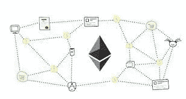

这是 NFT 造币应用程序 ScratchCollective.app 的 4 部分系列的第 2 部分。您可以在这里找到其他文章:

[简介](/coinmonks/building-a-full-stack-web3-application-dapp-scratchcollective-app-c843adcee8a0)

[建立一个 Web3 Dapp(第一部分)——经验教训](https://tobyornottoby.medium.com/building-a-web3-dapp-part-1-lessons-learned-a672e032ba82)

**在这里，我对 ScratchCollective smart 契约做了一个深入的回顾，它是一些设计决策背后的基本原理。**

在下一篇文章中，我将介绍我如何在前端与这个契约交互，NFT 机制的“是什么”和“如何”，以及 NFT 元数据(在本文中多次提到)

# **智能合同结构(以及我为什么选择 ERC-1155 而不是 ERC-721)**

在撰写本文时，谈到非功能性测试，实际上只有两种广泛使用的标准可供选择——ERC-721 和 ERC-1155。对于 ScratchCollective 合同，我选择遵循 ERC-1155 多令牌标准，该标准由金恩首席技术官威泰克·拉多姆斯基开发，允许在同一个部署合同中同时使用可替换和不可替换的令牌。我还利用了 OpenZeppelin 的合同库，并根据应用程序的需求做了一些小小的修改。

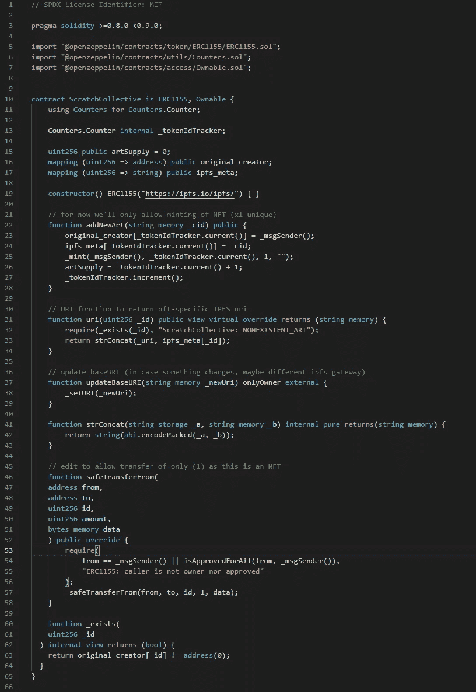

Full ScratchCollective Contract

**这是用 Solidity 写的合同——让我们快速浏览一些函数和变量声明:**

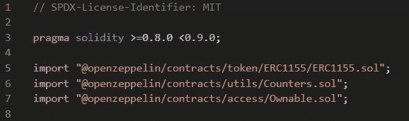

Solidity compiler version and imports

**第 3 行** — Pragma Solidity 告诉编译器使用哪个(哪些)编译器版本。

**第 5–7 行**从 OpenZeppelin 的契约库中导入预构建的 solidity 代码。这里我使用基本的 ERC1155 契约、计数器(增加或减少计数器的安全方法)和 Ownable(为特定函数提供访问控制机制)。

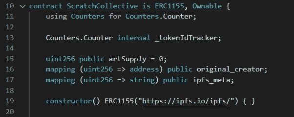

Declaring and constructing

**第 10 行**声明联系人姓名，并从第 5–7 行导入的 ERC1155 &可拥有合同中继承。

**第 11–13 行**调用将在契约其余部分使用的计数器契约，并将 *_tokenIdTracker* 声明为计数器变量。

**第 15 行**将 *artSupply* 变量初始化为零。

**第 16 行**创建一个*token id*(uint 256)到原始创建者地址的映射[ link ]。

> *每个令牌 ID 代表一个唯一的 NFT

**第 17 行**创建了从*token id*(uint 256)到 [IFPS 内容标识符(CID)](https://docs.ipfs.io/concepts/content-addressing/) 的另一个映射，后者托管 NFT 的元数据。

**第 19 行**是契约构造器，将 IPFS URL 初始化为 *baseURL* 。

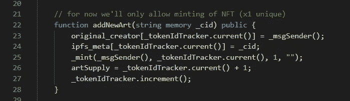

addNewArt

函数的作用是铸造一个新的 NFT。它接受一个 IFPS CID 作为输入(我们将在下一篇文章的前端看到这是如何实现的)。

**第 23 行**将呼叫者的地址添加到当前 *tokenId* 的 *original_creator* 映射中。

**第 24 行**将 IPFS CID 输入添加到当前令牌 ID 的 *ipfs_meta* 映射中

> *第 23–24 行是如何跟踪每个 NFT 的原始创建者和元数据的

**第 25 行**铸币厂 NFT

**第 26 行**增加 *artSupply* 计数

**第 27 行**为下一个 NFT 递增当前 *tokenID* 跟踪器

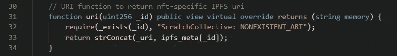

uri

**uri** 函数是一个视图函数，它返回 NFT 的 URL，在本例中是一个存放 NFT 元数据的 IPFS 地址。它接受 tokenID 来标识我们正在查询哪个 NFT。

**第 32 行**确保 NFT 存在，如果不存在则返回错误信息。

**第 33 行**返回基本 URL 和 ipfs CID 的连接(例如，“[https://ipfs.io/ipfs/](https://ipfs.io/ipfs/)”+“qmshnmozj 9 Rb 75 padcuypwnvoqsetpb 6 C1 aqpeadagtnrd”)，它们一起构成到元数据的 URL 链接

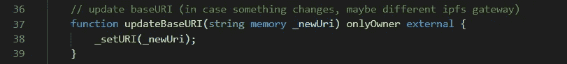

updateBaseURI

**updateBaseUri** 函数只对契约的所有者(本例中为我)可用，并允许所有者更改 *baseURI* 。这是为了防止主机/ IPFS 网关提供商发生问题，我需要将其更改为一个工作的。

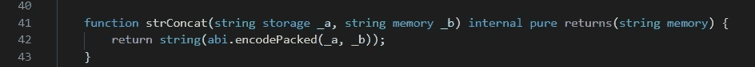

strConcat

**strConcat** 函数值得注意一下。与其他语言一样，Solidity 不包含连接字符串的本地方式。在这种情况下，我必须创建我自己的函数，在上面提到的 *uri* 函数中使用。基本上，我们将字符串转换成字节，将它们放在一起，然后将结果转换回字符串。

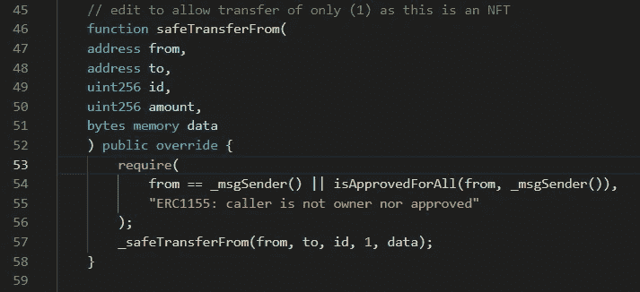

safeTransferFrom

**safetransformfrom**是 OpenZeppelin 已经在它的标准 ERC-1155 合同中为我们提供的一个功能，它被导入到这个合同中(第 5 行和第 10 行)。我在这里包含它是为了将每个令牌的数量限制为 1(使它成为一个完全不可替换的令牌契约)。第 52 行的“override”关键字意味着我正在覆盖或修改另一个已经声明的函数。

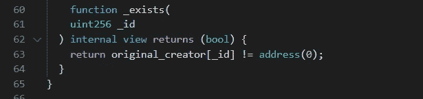

_exists

在 *uri* 函数中使用了 **_exists** 函数来确保 tokenID 有效。它返回一个布尔值(true 或 false ),表明在指定的 *tokenId* 处的 *original_creator* 映射中是否存在地址。

# 设计原理

ERC-1155 优于 ERC-721 的一个卖点是，除了资产类型的灵活性(可替代性)之外，ERC-1155 允许在单个交易中进行多个操作(例如批量转移)，这比在每个交易中进行单个操作更节省时间和资源。这里有一篇关于这些差异的好文章。

不过，我在这里的理由略有不同。这是它的要点:

1.  满足我使用 ERC-1155(新标准)的好奇心
2.  对 OpenZeppelin 预审核代码的修改较少(我会解释原因)
3.  **批量转移的能力**

第一点很容易想象。我会检查另外两个。

**第二——对“开放齐柏林飞艇”合同的修改。**这很大程度上源于我决定使用 IPFS 来托管 NFT 元数据。正如我将在下一篇文章中讨论的，NFT 通过指向包含与资产相关的元数据的托管 URL 来表示资产的所有权。*通俗地说，NFT 并不指向实际的资产，而是指向关于该资产的数据*。数据通常采用 JSON 对象的形式，看起来像这样:

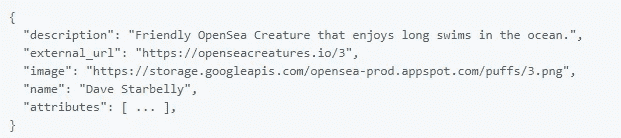

Example of metadata from OpenSea Creatures

**这些数据存放在哪里很重要，您将在下一篇文章中看到。本着加密和去中心化的精神，我决定使用 IPFS 来托管图像和元数据(而不是像 AWS 这样的集中式主机)。我还希望将 URI 存储在合同中。**

ERC-721 契约内置了 *tokenURI* 函数来存储/检索 URI，但是使用 base uri+token ID 作为完整的 URI。

在这种情况下，我想要**base uri+IPFS CID**，所以我决定使用 ERC-1155 会更容易，因为它没有内置的 tokenURI 函数。这是因为 ERC-1155 标准旨在容纳可替换和不可替换的令牌，并且为每个可替换令牌(可能数十亿)拥有一个令牌 URI 是不可行的。然而，由于我在这里将每个令牌限制为 1 个(不可替换)，因此在这种情况下创建我自己的 *tokenUri / uri* 函数是可行的。

**3 号——批量转移**。我还希望有一个批量转移功能，以防有人决定放弃他们的收藏或出于任何原因。我认为拥有这种功能会很有用。

# 结论

写合同有时会令人困惑，因为它仍然是一种相当新的语言，并且在不断改进。很有可能你在编写 Solidity 时遇到的问题是相当新的，并且没有很好地记录下来。所以需要做一些修补。我用 **Remix 和【Truffle 进行开发，偶尔它们也会有自己的问题。真正对我有帮助的一件事是在 OpenZeppelin 上浏览所有的[合同。他们提供一流的预建合同模板，还有一个非常活跃和有用的社区论坛。强烈推荐用于解决问题和学习。](https://docs.openzeppelin.com/contracts/4.x/)**

我希望这篇文章能帮助其他人开始，也希望它真的传达了**“如果我能做到，你也能做到”**的信息。

编码快乐！

> 加入 Coinmonks [电报频道](https://t.me/coincodecap)和 [Youtube 频道](https://www.youtube.com/c/coinmonks/videos)了解加密交易和投资

## 也阅读

 [## 最佳加密交易所| 2021 年十大加密货币交易所

### 编辑描述

blog.coincodecap.com](https://blog.coincodecap.com/crypto-exchange)  [## 2021 年 10 大最佳加密贷款平台| CoinCodeCap

### 编辑描述

blog.coincodecap.com](https://blog.coincodecap.com/crypto-lending)  [## 2021 年最佳免费加密交易机器人

### 2021 年币安、比特币基地、库币和其他密码交易所的最佳密码交易机器人。四进制，位间隙…

medium.com](/coinmonks/crypto-trading-bot-c2ffce8acb2a)  [## 最佳 4 个加密交易信号电报通道

### 这是乏味的找到正确的加密交易信号提供商。因此，在本文中，我们将讨论最好的…

medium.com](/coinmonks/best-crypto-signals-telegram-5785cdbc4b2b)  [## BlockFi 评论 2021:利弊和利率| CoinCodeCap

### 编辑描述

blog.coincodecap.com](https://blog.coincodecap.com/blockfi-review)  [## 如何在印度购买比特币？2021 年购买比特币的 7 款最佳应用[手机版]

### 如何使用移动应用程序购买比特币印度

medium.com](/coinmonks/buy-bitcoin-in-india-feb50ddfef94)  [## 加密税务软件——五大最佳比特币税务计算器[2021]

### 不管你是刚接触加密还是已经在这个领域呆了一段时间，你都需要交税。

medium.com](/coinmonks/best-crypto-tax-tool-for-my-money-72d4b430816b)  [## 存储比特币的最佳加密硬件钱包[2021] | CoinCodeCap

### 编辑描述

blog.coincodecap.com](https://blog.coincodecap.com/best-hardware-wallet-bitcoin)  [## Pionex 评论 2021 |免费加密交易机器人和交换

### Pionex 是为交易自动化提供工具的后起之秀。Pionex 上提供了 9 个加密交易机器人…

medium.com](/coinmonks/pionex-review-exchange-with-crypto-trading-bot-1e459d0191ea)