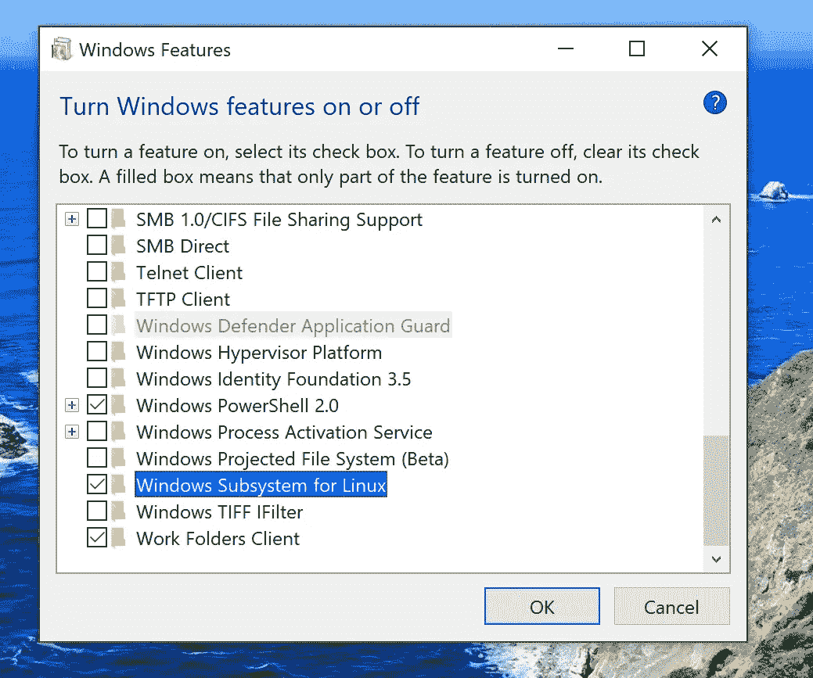
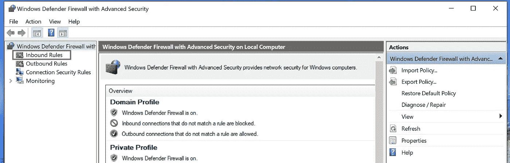
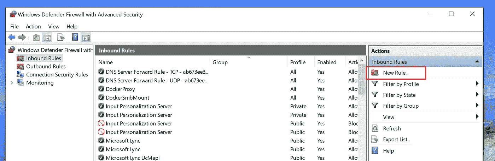
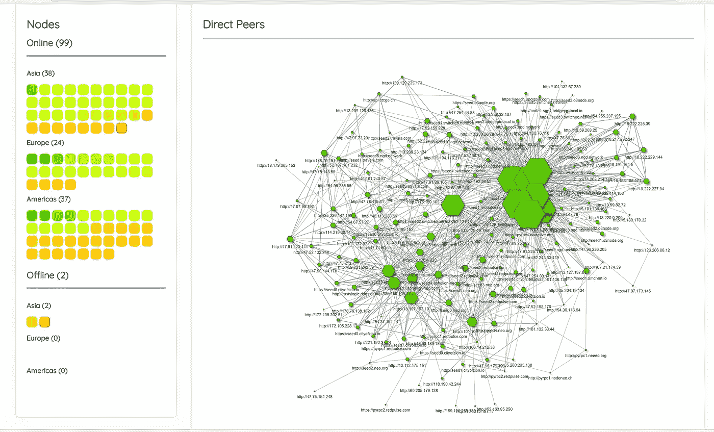
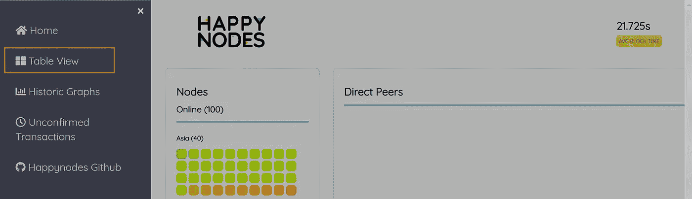
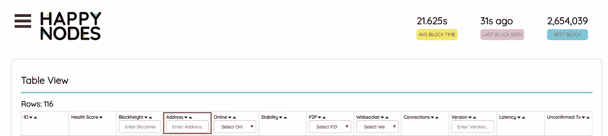
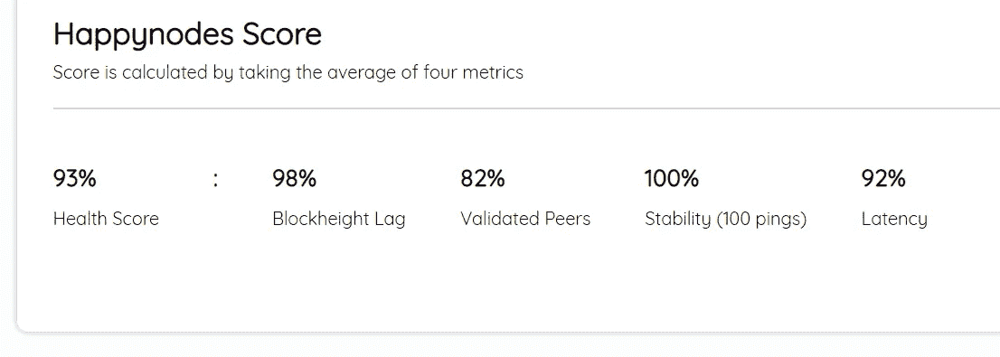

# 在 Windows WSL (Ubuntu)上构建 NEO-Python API 服务器

> 原文：<https://medium.com/coinmonks/building-a-neo-python-api-server-on-windows-wsl-ubuntu-dfd62185ae9e?source=collection_archive---------6----------------------->

## **循序渐进教程**

# 介绍

W 您是否愿意以切实的方式帮助支持 NEO 智能经济网络，但没有编程背景？本教程将逐步指导您在 Windows 计算机上设置 NEO-Python API 服务器。如果你想了解如何在 Windows 上建立开发环境，请参见这个[教程](/@gubanotorious/installing-and-running-neo-python-on-windows-10-284fb518b213)。

**注意:**本文假设读者对计算机的功能有基本的了解，但是不需要预先了解 Python 或新 Python 代码就可以启动并运行服务器。本文还假设用户使用的是 Windows 10(最新)操作环境。您需要可靠的互联网连接和至少 20 GB 的硬盘空间才能继续。

# 感谢

特别感谢 [Alex Guba](https://medium.com/u/f277ee6f34f?source=post_page-----dfd62185ae9e--------------------------------) ，他关于[在 Windows 10](/@gubanotorious/installing-and-running-neo-python-on-windows-10-284fb518b213) 上使用 neo-python 安装和运行 NEO 区块链节点的教程启发了本教程安装部分的大部分内容。此外，感谢锡安城所有做出贡献的成员，他们创建并继续维护[新 Python 库](https://github.com/CityOfZion/neo-python)，尤其是文档。最后，感谢 Jonathan Hu，他的关于如何[允许运行在 WSL 内部的服务器在 Windows 10 主机外部被访问的文章](https://www.nextofwindows.com/allow-server-running-inside-wsl-to-be-accessible-outside-windows-10-host)使得本教程成为可能。

# **目录**

使用这些链接导航到您想要的任何部分。您可以通过点击每一节末尾的*返回目录*链接返回该目录。

*   [背景信息](#0578)
*   [安装 Windows 依赖程序](#463e)
*   [安装 NEO-Python](#1f53)
*   [自举 NEO 区块链](#2c17)
*   [配置您的本地网络](#53f0)
*   [运行您的 NEO-Python API 服务器](#cf37)
*   [附加资源](#424d)

*下一节提供了什么是 API 服务器以及托管 NEO API 服务器如何支持 NEO 智能经济网络的背景信息。如果您想现在就开始构建您的 NEO-Python API 服务器，请跳到* [***安装 Windows 依赖程序***](#463e) *。*

# 背景资料

## 什么是 API 服务器？

首先，API(或应用程序编程接口)接收来自用户或程序的请求，并在对相关的可访问数据执行所请求的功能后发送响应。这种响应表现为易于操作的数据，因此可以集成到程序中。

在近地天体智能经济网络中，一个应用编程接口服务器托管着一个完整的区块链节点，这意味着它维护着整个近地天体区块链的最新副本。近地天体区块链是 API 在响应请求时分析的数据集。

有关 API 的更多信息，请参见此处的。

## 托管 NEO API 服务器有什么帮助？

托管 NEO API 服务器在两个方面有助于 NEO 智能经济网络:

1.  通过操作 NEO API 服务器，您有助于确保 NEO 区块链与用户、智能合同和 dApps 之间的快速高效的接口不断与之交互。NEO Smart Economy 为越来越多的用户提供服务，同时托管越来越多的项目、智能合同和 dApps，这些项目和 dApps 不断与 NEO 区块链互动。随着请求数量的增加，如果服务器超载，响应时间会变慢。您的 NEO API 服务器将有助于减少 API 响应时间。
2.  每台 NEO API 服务器都托管一个完整的区块链节点，这意味着您的服务器可以充当网络中其他服务器和节点的种子节点。如果您的节点被用作种子节点，它将被用作没有最新近地天体区块链副本的其他服务器或节点的块源。

选择托管 NEO API 服务器是支持 NEO 智能经济网络的一种切实可行的方式，正如 [Fabio C. Canesin](https://medium.com/u/5d066a8526b?source=post_page-----dfd62185ae9e--------------------------------) 所说，“构建未来的基础设施。”

欲了解更多信息，请点击查看[法比奥·卡内辛](https://medium.com/u/5d066a8526b?source=post_page-----dfd62185ae9e--------------------------------)的 reddit 帖子[。](https://www.reddit.com/r/NEO/comments/7zx7ur/public_call_for_projects_launching_in_neo/)

*下一节提供了在 Windows 电脑上安装所需依赖程序的说明。如果你已经安装了这些程序，跳到* [***安装 NEO-Python***](#1f53) *。*

[*返回目录*](#1e9c)

# 安装 Windows 依赖程序

**注意:** NEO-Python [现在](https://www.reddit.com/r/NEO/comments/9dpy9j/new_neopython_release_v078/)支持 Python 3.7！

## 安装 Python 3.7 或 Python 3.6

Python 3.7.0 可以在这里找到:
[https://www.python.org/downloads/release/python-370/](https://www.python.org/downloads/release/python-370/)

Python 3.6.6 可以在这里找到:【https://www.python.org/downloads/release/python-366/ 

**重要提示:**确保选中安装程序上的复选框“将 Python 3.7 (3.6)添加到路径”。

## 安装 Git

Git 可以在这里找到:[https://git-scm.com/download/win](https://git-scm.com/download/win)

## 安装 Visual Studio 代码

**注意:**虽然不是必需的，但强烈建议您安装 Visual Studio 代码，以防您需要执行任何后续的故障排除或服务器调整。

Visual Studio 代码可以在这里找到:
[https://code.visualstudio.com/docs/?dv=win](https://code.visualstudio.com/docs/?dv=win)

如果使用 Visual Studio 代码，请确保在出现提示时安装 Python 扩展。

# 安装 Linux 的 Windows 子系统(WSL) — Ubuntu

## 为 Linux 启用 Windows 子系统(WSL)

*   打开 Windows 搜索栏(开始菜单)并搜索“打开或关闭 Windows 功能”
*   启用“检查 Linux 的 Windows 子系统”并保存(如有必要，重新启动)



## 安装 Ubuntu

*   打开 Windows 搜索栏(开始菜单)并搜索“Microsoft Store”
*   打开微软商店
*   搜索“Ubuntu”
*   安装 Ubuntu 18.04

*下一节提供了在 Windows 电脑上安装 NEO-Python 的说明。如果你已经安装了 NEO-Python，跳到* [***引导 NEO 区块链***](#2c17) *。*

[*返回目录*](#1e9c)

# 安装 NEO-Python

**注意:**关于最新的指令，请参见 NEO-python [自述文件](https://github.com/CityOfZion/neo-python/blob/master/README.rst)。

*   打开 Ubuntu
*   出现提示时设置帐户
*   首次启动 Ubuntu 时，建议您更新和升级 Ubuntu。使用以下命令:

```
sudo apt-get update && sudo apt-get upgrade
```

*   安装 Python 3.7 所需的依赖项:

```
sudo apt-get install python3.7 python3.7-dev python3.7-venv python3-pip libleveldb-dev libssl-dev g++
```

*   或者，安装 Python 3.6 所需的依赖项:

```
sudo apt-get install python3.6 python3.6-dev python3.6-venv python3-pip libleveldb-dev libssl-dev g++
```

*   使用 Git 从 Github 克隆 NEO-Python 库:

```
git clone https://github.com/CityOfZion/neo-python.git
```

*   将目录切换到刚刚创建的 neo-python 文件夹:

```
cd neo-python
```

**注意:**以后访问您的 neo-python 文件夹时(如果您关闭并重启 Ubuntu)，请使用:

```
cd /mnt/c/<your_folder_path>/neo-python
```

*   使用 Python 3.7 创建虚拟环境并激活:

```
python3.7 -m venv venv
source venv/bin/activate
```

*   或者，使用 Python 3.6 创建虚拟环境并激活:

```
python3.6 -m venv venv
source venv/bin/activate
```

*   以可编辑的形式安装软件包:

```
pip install wheel -e .
```

确保你记住了“.”在上面的命令中。

*下一节提供了在 Windows 计算机上引导 NEO Blockhain 的说明。如果你的 mainnet NEO-Python 区块链已经是最新的，跳到* [***配置你的局域网***](#53f0) *。*

[*返回目录*](#1e9c)

# 引导 NEO 区块链

如果您第一次使用 NEO-Python，您需要同步 NEO 区块链，这通常需要很长时间。NEO-Python 中包含的脚本`np-bootstrap`可以自动为您下载一个链目录。您将在 mainnet 上运行您的 NEO-Python API 服务器，因此使用以下命令引导 mainnet 区块链:
**注意:**由于下载的文件超过 3gb，此过程可能需要一段时间。

```
np-bootstrap -m
```

在引导“主”区块链之后，还应该引导通知数据库。使用以下命令引导 mainnet 通知数据库:

```
np-bootstrap -m -n
```

**注意:**一旦启动，找到你的“链”文件夹的最简单的方法是打开你的 C:驱动器并搜索“链”。

下一节提供了配置本地网络的说明。如果您的本地网络已经正确配置，请跳到 [***运行您的 NEO-Python API 服务器***](#cf37) *。*

[*返回目录*](#1e9c)

# 配置您的本地网络

## 打开路由器上适用的端口

NEO API 服务器需要在路由器上打开特定的端口来服务网络。您需要查阅路由器文档，找到打开这些端口的具体说明。本教程假设您将使用端口 10332 作为 RPC API 服务器，端口 80 作为 REST API 服务器，端口 10333 作为 NEO 区块链种子节点。因此，您需要打开这些端口:80、10332–10333。

有关更深入的端口描述，请参见**端口描述**部分[此处](https://github.com/CityOfZion/neo-python/blob/master/docs/source/basicusage.rst)。

有关新 Python 种子列表的更多信息，请参见[这里](https://neo-python.readthedocs.io/en/latest/Seedlist.html)。

## 打开 Windows 防火墙上的适用端口

因为您在 Windows WSL (Ubuntu)上运行 NEO-Python，所以您需要在 Windows 防火墙上打开这些相同的端口。

*   打开 Windows 搜索栏(开始菜单)并搜索“具有高级安全性的 Windows Defender 防火墙”
*   点击“入站规则”



*   单击“新建规则”



*   选择“端口”
*   插入您的特定端口(例如 80、10332–10333)
*   选择“允许连接”
*   确保所有的框都被选中
*   添加名称并选择“完成”

如果您稍后需要更新您的规则，您随时可以在“入站规则”中指定的规则名称下访问和编辑它。

[*返回目录*](#1e9c)

# 运行 NEO-Python API 服务器

如果您已经跳到这一部分，请确保您已经访问了您的 neo-python 文件夹:

```
cd /mnt/c/<your_folder_path>/neo-python
```

为了维护 NEO 区块链，Ubuntu 将需要管理权限来将新区块写入您的“Chains”文件夹。通过使用以下命令“扎根”您的 Ubuntu 实例，赋予 Ubuntu 这种能力:

```
sudo -s
```

然后输入你的 Ubuntu 用户密码。接下来，激活您的虚拟环境:

```
source venv/bin/activate
```

使用以下命令启动 NEO-Python API 服务器:

```
np-api-server --mainnet --port-rpc 10332 --port-rest 80
```

现在，您正在积极帮助支持 NEO 智能经济网络！

如果你想了解更多关于你的 NEO-Python API 服务器功能的信息，请看 **API 服务器(JSON 和/或 REST)** 部分[这里](https://github.com/CityOfZion/neo-python/blob/master/docs/source/basicusage.rst)。

[*返回目录*](#1e9c)

# 额外资源

## 查看您的 API 服务器



HappyNodes Home Page

[HappyNodes](https://happynodes.f27.ventures/) 是一款用于查看近地天体网络的内部近地天体工具。定期更新后，您的 NEO-Python API 服务器将在 HappyNodes 上可见。只需点击菜单栏中的“表格视图”并在地址栏中输入您的 IP 地址。如果你不知道你的 IP 地址，你可以在这里看到:[https://whatsmyip.com/](https://whatsmyip.com/)。



将来，您可以通过进入`https://happynodes.f27.ventures/<your ID number>`更容易地访问您的 API 服务器。您的 ID 号是表格视图中的第一列。

## 最大化你的快乐节点分数



HappyNodes 采用四个指标的平均值来确定您的分数:块高滞后、经验证的对等点、稳定性和延迟。在这四个指标中，您最容易控制稳定性和经验证的对等点。

**稳定性**

增加你的稳定性很容易。只要确保你的 NEO-Python API 服务器保持运行。您可以看到，稳定性着眼于服务器的最后 100 次 pings。

**经验证的对等方**

增加有效同行的百分比也很简单。为了获得更高百分比的有效对等点，您需要连接到更多的对等节点。为此，您可以增加服务器允许的`MAXPEERS`数量。默认`MAXPEERS`的数量是 5。要增加`MAXPEERS`的数量，请在启动时指定`MAXPEERS`的数量。例如:

```
np-api-server --mainnet --port-rpc 10332 --port-rest 80 --maxpeers 50
```

现在，您的 NEO-Python API 服务器将搜索多达 50 个要连接的对等节点，并且这些对等节点中很有可能有几个是经过验证的对等节点。

# 问题

如果您有任何问题，请将问题提交到#python 或#support 的 [NEO Discord](https://discordapp.com/invite/zRq6Jba) 上，或者在下面发表评论。

[*返回目录*](#1e9c)

> [直接在您的收件箱中获得最佳软件交易](https://coincodecap.com/?utm_source=coinmonks)

[](https://coincodecap.com/?utm_source=coinmonks)