# 使用 HyperLedger 构建贝壳应用程序

> 原文：<https://medium.com/coinmonks/building-a-seashell-application-using-hyperledger-921c1d9161a1?source=collection_archive---------1----------------------->


这个博客将帮助你理解 Hyperledger 的概念，它是商业的区块链。我已经突出显示了专门用于区块链的术语，供您快速参考。

我要感谢 DLI the([www.dlithe.com](http://www.dlithe.com/))的 Arun Rajpurohit 先生组织区块链技术的 intership，以及我的导师 Anubhav Chaturvedi 先生教给我们的一切。


[www.dlithe.com](http://www.dlithe.com/)

**总账 **

这是一个开源的合作项目，旨在推进跨行业的区块链技术。这是一项全球合作，由 Linux 基金会主办，包括金融、银行、物联网、供应链、制造和技术领域的领导者

***用例***

**Hyperledger** Fabric 是一个模块化的区块链框架，它是使用即插即用组件开发基于区块链的产品、解决方案和应用程序的基础，旨在**在私营企业中使用**。

***为什么是 Hperledger？***

由于以下原因，企业无法使用**公共区块链**:隐私问题:**公共区块链**如比特币是未经许可的。任何人都可以加入，包括匿名和假名用户

***以太坊 Vs 区块链***

**Hyperledger** 和**以太坊**最本质的区别在于它们的设计意图。以太坊在 EVM 上运行智能合约，用于那些被认为是去中心化的、面向大众消费的应用。另一方面， **Hyperledger** 利用**区块链**技术开展业务。

***Docker*** 是一个工具，旨在通过使用容器来更容易地创建、部署和运行应用程序。容器允许开发人员将应用程序与它需要的所有部分打包在一起，比如库和其他依赖项，然后作为一个包发送出去。

**案例分析:**

我们将描述如何改进金枪鱼捕捞和海贝，从源头开始，渔夫 Sarah，以及她的金枪鱼/海贝最终出现在 Miriam 餐厅的过程。在此期间，我们将让其他各方参与进来，比如负责核实数据有效性和金枪鱼捕捞可持续性的监管机构。

我们将使用 Hyperledger Fabric 的框架来跟踪这一过程的每个部分。

**Hyperledger Fabric 元素**

1.  **通道**是数据划分机制，只允许利益相关者看到事务。每个通道都是一个独立的事务块链，只包含该特定通道的事务。
2.  **Chaincode /** (智能合约)|它封装了资产定义和用于修改这些资产的业务逻辑(或事务)。交易调用会导致分类帐发生变化。
3.  **分类帐**包含网络的当前世界状态和一连串的事务调用。一个共享的、许可的分类帐是一个只附加记录的系统，并且作为真实的单一来源。
4.  **网络**是形成区块链网络的数据处理**对等点**的集合。网络负责维护一致复制的分类账。
5.  **订购服务**是一个节点集合，它将事务订购到一个块中。
6.  **世界状态**反映网络中所有资产的当前数据。这些数据存储在数据库中，以便高效访问。当前支持的数据库是 LevelDB 和 CouchDB。
7.  **会员服务提供商** (MSP)管理客户端和对等端的身份和许可访问。

我将尝试在下面的博客中重新创建应用程序:

[](/swlh/hyperledger-chapter-1-foundation-7ad5bd94d452) [## Hyperledger —第 1 章|区块链基金会

### 这是我学习 Hyperledger 的日志，Hyperledger 是为企业创建、部署和维护区块链的框架…

medium.com](/swlh/hyperledger-chapter-1-foundation-7ad5bd94d452) 

需要满足的先决条件，以确保我们的系统为技术要求做好准备。

*   安装 cURL。
*   安装 Node.js 和 npm 软件包管理器。
*   安装 Go 语言。
*   安装 Docker 并编写 Docker。

1.  卷曲

在您的终端中键入以下命令，并输入您的密码:

```
**$ sudo apt install curl**
```

要进行检查，请在终端/命令行中运行以下命令:

```
**$ curl -V**
```

2.码头工人

[](https://docs.docker.com/docker-for-mac/install/#install-and-run-docker-for-mac) [## 在 Mac 上安装 Docker 桌面

### 预计阅读时间:6 分钟 Docker Desktop for Mac 是 Docker for Mac 的社区版。您可以下载…

docs.docker.com](https://docs.docker.com/docker-for-mac/install/#install-and-run-docker-for-mac) 

要检查 docker 安装:

```
docker --version && docker-compose --version
```

3.Node.js 和 NPM

[](https://nodejs.org/en/download/) [## 下载| Node.js

### Node.js 是基于 Chrome 的 V8 JavaScript 引擎构建的 JavaScript 运行时。

nodejs.org](https://nodejs.org/en/download/) 

验证 **Node.js** 和 npm、的版本，确保您正在安装的 **Node.js** 版本高于 6.9(不要使用 v7)，并且 **npm** 版本高于 3.x:

```
**node — version && npm — version**
```

**4。Go** 是一种开源编程语言**使得构建简单、可靠、高效的软件变得容易。**

访问[https://golang.org/dl/](https://golang.org/dl/)并记录最新的稳定版本( **v1.8 或更高版本**):

**$ cd ~**

**$ sudo curl-O**[**https://storage . Google APIs . com/golang/go 1 . 9 . 2 . Darwin-amd64 . pkg**](https://storage.googleapis.com/golang/go1.9.2.darwin-amd64.pkg)

**注意**:用正确的文件名切换出 URL 的黑色部分。

打开下载的文件以运行安装包:

**$ open go 1 . 9 . 2 . Darwin-amd64 . pkg**

完成安装后， **go** 将被安装在 **/usr/local/bin/go** 处。您可以通过运行以下命令进行检查:

```
which gogo version
```

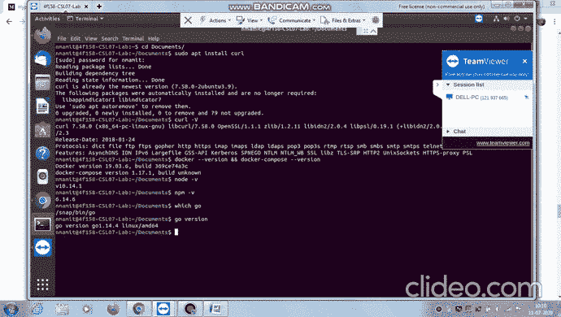

Successfully installed all Technical Dependencies!!

**我们案例研究的背景**

请参考这个以更好地理解我们的应用环境。

[](/swlh/hyperledger-chapter-5-tuna-fishing-supplychain-context-f593b03e2cf0) [## Hyperledger —第 5 章|金枪鱼渔业供应链-上下文

### 现在我们已经了解了区块链的基本原理和 Hyperledger 的高级结构，让我们使用它…

medium.com](/swlh/hyperledger-chapter-5-tuna-fishing-supplychain-context-f593b03e2cf0) [](/swlh/hyperledger-chapter-6-hyperledger-fabric-components-technical-context-767985f605dd) [## Hyperledger-第 6 章| Hyperledger 结构组件-技术上下文

### 现在我们已经了解了金枪鱼供应链场景的真实世界背景，让我们了解一下 Hyperledger…

medium.com](/swlh/hyperledger-chapter-6-hyperledger-fabric-components-technical-context-767985f605dd) 

**安装织物组件**

确定您的计算机上要放置 Hyperledger Fabric 示例应用程序存储库的位置，并在终端窗口中打开它。然后，执行以下命令:

```
git clone **-**b master [https:**//**github**.**com**/**hyperledger**/**fabric**-**samples**.**git](https://github.com/hyperledger/fabric-samples.git)cd fabric**-**samplesgit checkout {TAG}
```

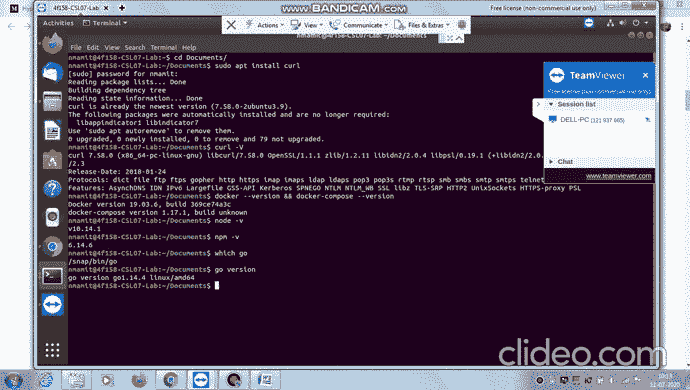

在要将特定于平台的二进制文件提取到的目录中执行以下命令:

```
curl **-**sSL [https:**//**goo**.**gl**/**6wtTN5](https://goo.gl/6wtTN5) **|** bash **-**s 1.1**.**0## comment: <full URL>
[https://raw.githubusercontent.com/hyperledger/fabric/master/scripts/bootstrap.sh](https://raw.githubusercontent.com/hyperledger/fabric/master/scripts/bootstrap.sh)
```

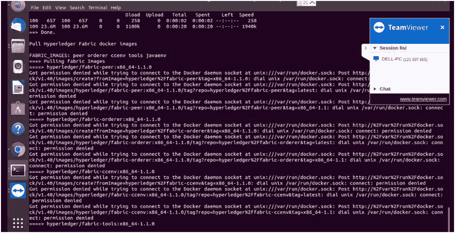

Permission Denied while connecting to Docker socket daemon socket

确保你已经给了 docker 套接字足够的权限。

```
sudo systemctl restart docker
sudo chmod 666 /var/run/docker.sock
docker ps -a
```

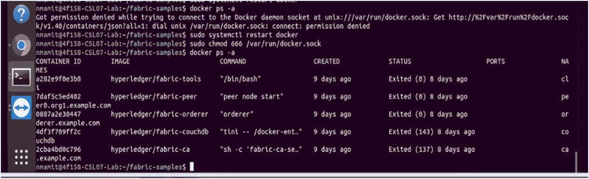

Permission granted !! Now try to pull images..

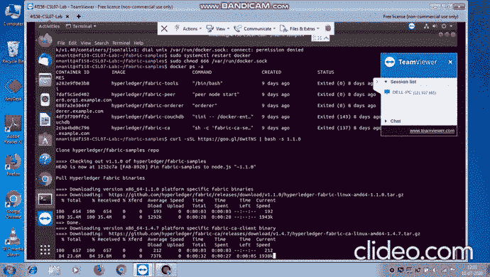

Hyperledger Docker Images getting Pulled!!

如您所见，它检索四个特定于平台的二进制文件:

*   `cryptogen`，
*   `configtxgen`，
*   `configtxlator`，
*   `peer`
*   `orderer`和
*   `fabric-ca-client`

并将它们放在当前工作目录的`bin`子目录中。

测试:

```
docker images
```

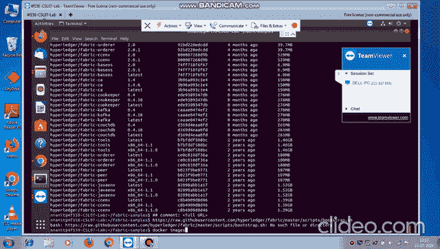

Expected Output

我们将使用 Docker 映像来引导我们的第一个 Hyperledger 结构网络。它还将启动一个容器来运行脚本化执行，该脚本化执行将对等体加入到通道中，部署和实例化链代码，并针对链代码执行事务。

```
cd first-network./byfn.sh -m generate
```

将会出现一个简短的描述，以及一个 **Y/N** 命令行提示。回复一个 **Y <回车>继续。**

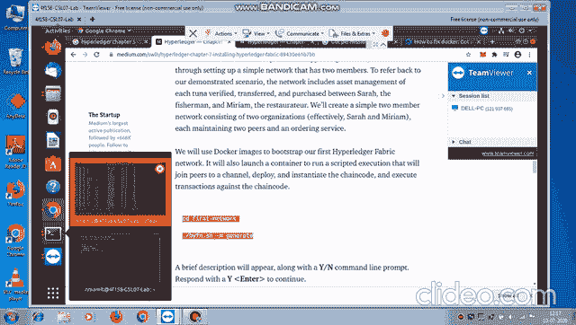

该步骤为我们的各种网络实体生成所有证书和密钥，包括用于引导订购服务的 genesis 块和创建通道所需的配置事务集合。

接下来，您可以使用以下命令启动网络:

```
./byfn.sh -m up
```

另一个命令行会出现，回复 **Y <回车>继续。**

最后，让我们测试一下如何关闭这个网络。

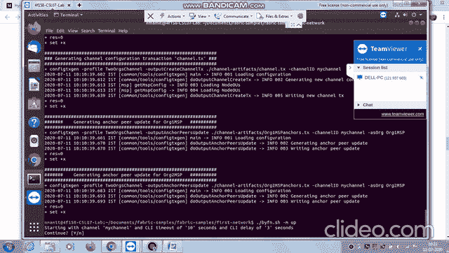

在同一终端内，do **Control+C** 退出当前执行。

然后，运行以下命令:

```
./byfn.sh -m down
```

另一个命令行会出现，回复用 **Y <回车>继续。**

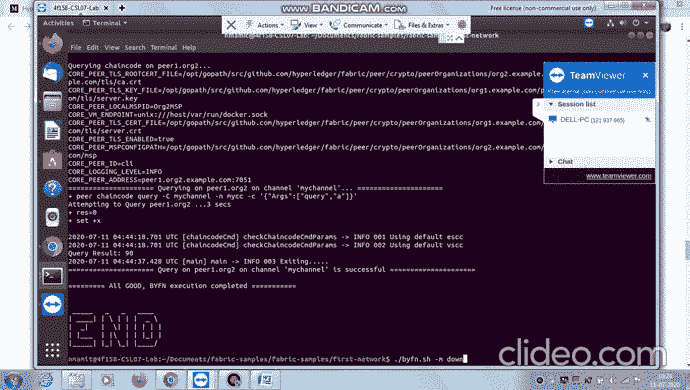

**Hyperledger 面料链码**

[](/swlh/hyperledger-chapter-8-what-is-hyperledger-fabric-chaincode-a74778dff2ae) [## Hyperledger —第 8 章|什么是 Hyperledger 结构链码？

### 因此，在前一章中，我们已经安装了 Hyperledger Fabric，并启动和停止了一个测试网络，在该网络上，对等方…

medium.com](/swlh/hyperledger-chapter-8-what-is-hyperledger-fabric-chaincode-a74778dff2ae) 

**使用 Hyperledger 结构的金枪鱼/贝壳场景**

[](/swlh/hyperledger-chapter-9-chaincode-in-tunafish-scenario-using-hyperledger-fabric-c7695374267f) [## Hyperledger-第 9 章|使用 Hyperledger 结构的金枪鱼场景中的链码

### 语境

medium.com](/swlh/hyperledger-chapter-9-chaincode-in-tunafish-scenario-using-hyperledger-fabric-c7695374267f) 

# Fabric Node.js SDK

在本练习中，我们将使用 Node.js SDK 与网络进行交互，从而与分类帐进行交互。Hyperledger 结构客户端 SDK 使得使用 API 与 Hyperledger 结构区块链进行交互变得非常容易

 [## fabric-sdk-node.github.io

### 编辑描述

fabric-sdk-node.github.io](https://fabric-sdk-node.github.io/) 

# **海贝应用**

***利益相关者***

*   **莎拉**是可持续合法捕捞金枪鱼的渔民。
*   监管者核实金枪鱼是合法和可持续捕捞的。
*   **在这种情况下，Miriam** 是一家餐馆的老板，他将充当最终用户。
*   卡尔是另一家餐馆的老板，渔夫萨拉可以向他出售金枪鱼。

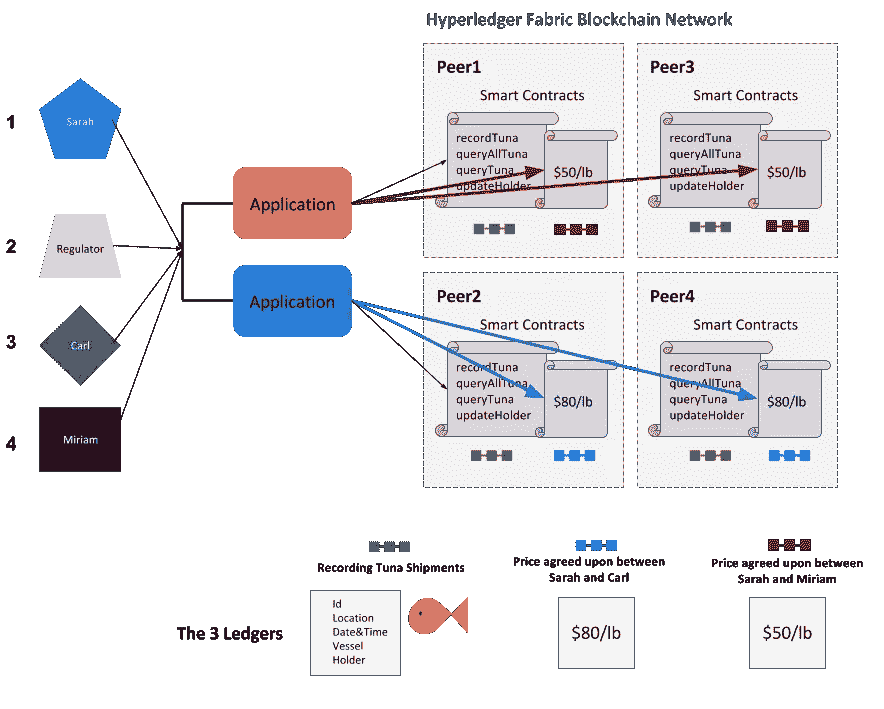

[https://miro.medium.com/max/700/0*EG1YQtXr1nGCzIFJ.png](https://miro.medium.com/max/700/0*EG1YQtXr1nGCzIFJ.png)

**链码:调用方法**

**Invoke** 方法是当客户端应用程序提出事务时被调用的方法。在这个方法中，我们有三种不同类型的事务— *recordTuna* 、 *queryTuna* 和 *changeTunaHolder。*

渔夫 Sarah 在捕获每一条金枪鱼/贝壳时都会调用*记录 Tuna* 。

餐馆老板 Miriam 可以调用 changeTunaHolder ,当她确认在供应链中接收和传递特定的金枪鱼/贝壳时。餐馆老板 Miriam 可以调用 queryTuna 来查看特定金枪鱼/贝壳的状态。

监管机构将根据他们验证和检查供应链可持续性的需要调用 *queryTuna* 和 *queryAllTuna* 。

**链码方法:**

***queryTuna*** 方法将被渔民、监管者或餐馆老板用来查看一条特定金枪鱼的记录。这需要一个论证——这是金枪鱼的关键。

***initLedger*** 方法将测试数据添加到我们的网络中。

***记录金枪鱼*** 法是像萨拉这样的渔民用来记录她每一次金枪鱼捕捞的方法。该方法接受五个参数(要保存在分类帐中的属性)。

***queryAllTuna*** 方法允许评估所有记录；在这种情况下，所有的金枪鱼记录添加到分类帐。此方法不接受任何参数。它将返回一个包含结果的 JSON 字符串。

随着金枪鱼被传递给供应链中的不同方，世界状态中的数据可以随着谁拥有而更新。***changeTunaHolder***方法接受两个参数，**金枪鱼 id** 和**新持有者名称**。

您可以参考以下所有上述代码:

[https://github . com/hyperledger/education/blob/master/lfs 171 x/fabric-material/chain code/tuna-app/tuna-chain code . go](https://github.com/hyperledger/education/blob/master/LFS171x/fabric-material/chaincode/tuna-app/tuna-chaincode.go)。

1.  **克隆存储库**

```
git clone [https://github.com/hyperledger/education.git](https://github.com/hyperledger/education.git)cd education/LFS171x/fabric-material/tuna-app
```

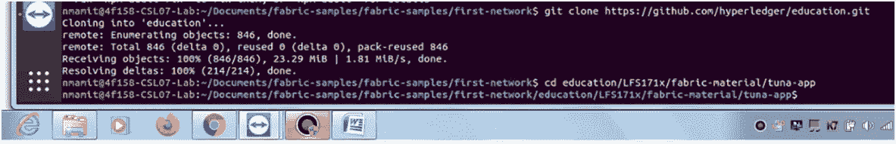

克隆完成后，浏览文件结构并检查 education 文件夹下的所有文件。

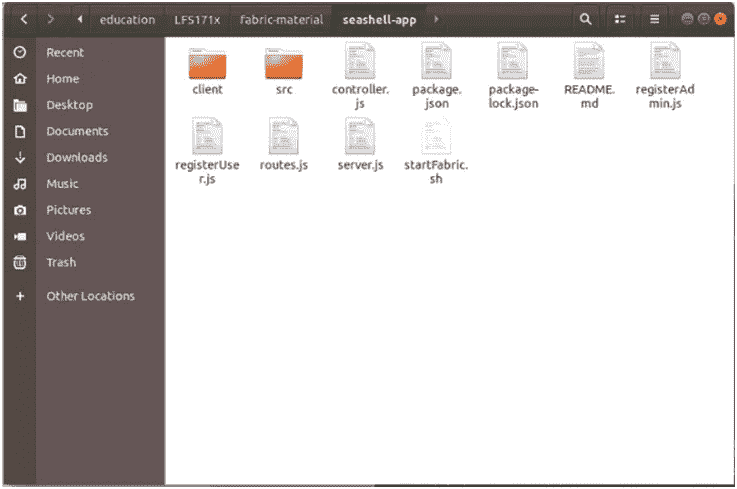

File Structure !!

在运行下一个命令之前，确保您的机器上运行了 Docker。

此外，确保您已经完成了*安装 Hyperledger Fabric (sdk)。*

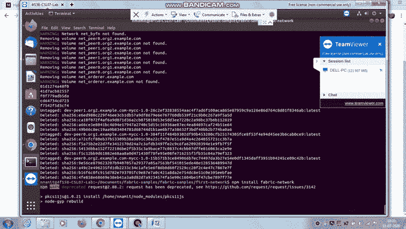

首先，删除任何预先存在的容器，因为它可能与命令冲突:

```
docker rm -f $(docker ps -aq)
```

**2。启动光纤网络**

接下来，让我们使用以下命令启动 Hyperledger 结构网络:

```
./startFabric.sh
```


**3。注册管理员**

酷毙了。现在网络已经开通。让我们注册管理员。

```
node registerAdmin.js
```

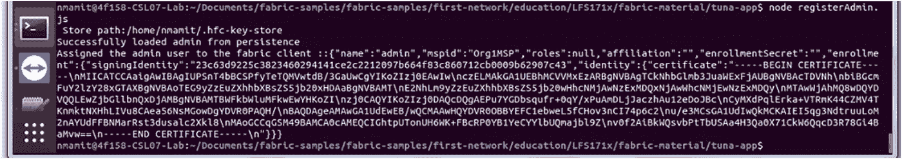

Registered Admin Successfully !!

**第四步:注册用户**

既然已经设置了网络和管理员，让我们注册一个用户。

```
node registerUser.jsif you get an error, Delete the key directory & Register Admin again.***rm ~/.hfc-key-store/****node registerUser.js***node registerAdmin.js***node registerUser.js
```

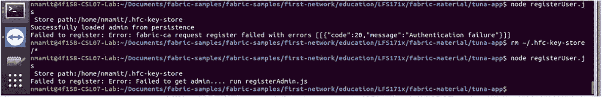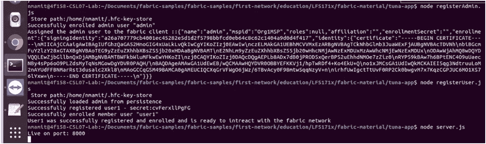

Registered User Successfully and our App is Live on port 8000 !!

**第五步。运行服务器**

这一步是运行应用程序的最后一步。为此，我们需要设置 nodejs 服务器，调用所需的包，实例化应用程序并监听特定端口。

```
$ ***node server.js***We should get the below:Live on port: 8000
```

YASS！！..我们的应用程序在端口 8000 上运行

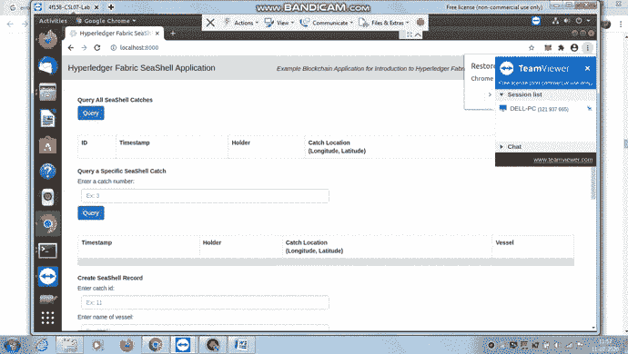

**输出:**

**1。查询所有的贝壳捕获量** <我们在链码初始化分类帐中使用的所有数据都被提取并显示在这里>

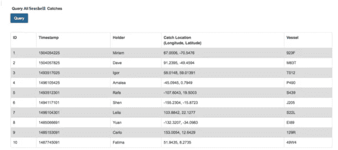

**2。改变贝壳的主人**

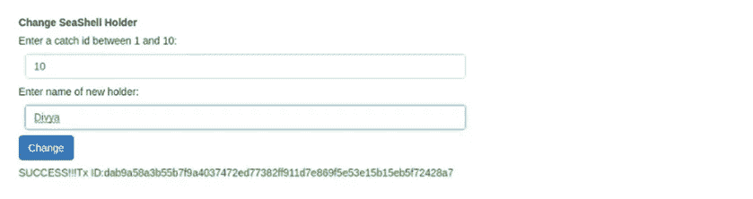

类似地，您可以基于 Catch Id 查询一个事务，还可以添加一个新的贝壳记录。试试看！！

这样我们就成功完成了我们的超级账本任务！！


Finally Done!!

> [直接在您的收件箱中获得最佳软件交易](https://coincodecap.com/?utm_source=coinmonks)

[](https://coincodecap.com/?utm_source=coinmonks)