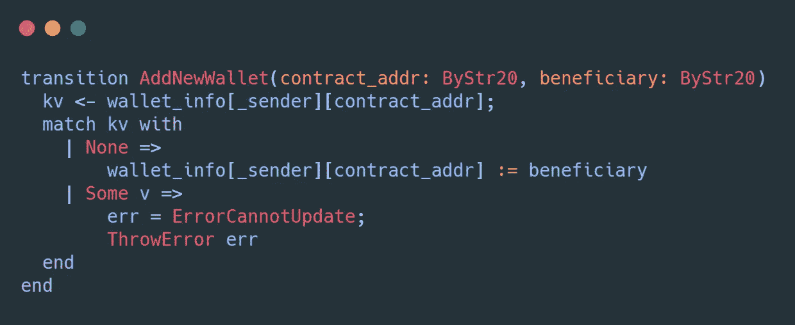

# 在 Zilliqa 区块链上构建时间锁定钱包—第 1 部分

> 原文：<https://medium.com/coinmonks/building-a-time-locked-wallet-on-zilliqa-blockchain-part-1-400f5e253b05?source=collection_archive---------2----------------------->

## 在 Zilliqa 区块链建立和部署基于智能合同的时间锁定钱包

## 概观

在这篇文章中，我们将看看如何在 [Zilliqa](https://www.zilliqa.com/) 区块链上构建一个智能合约驱动的 dApp。它允许您创建带时间锁定的钱包，存款和更新，同时只允许特定用户(地址)访问这些资金。

**演示**:【https://timelocked-wallet-zilliqa-blockchain.vercel.app/】T4(仅在 Testnet 上有效)

本文的目的是在我们进行的过程中涵盖以下主题。

*   在 Scilla 智能合约中处理时间。
*   以编程方式部署智能合约。
*   在智能合约中接受和存储资金。
*   从智能合同向某个地址发送资金。

# 介绍

在典型的交易或法律合同中，通常会涉及到第三方(银行/律师),因为双方都不相信对方会履行自己的承诺。使用区块链构建智能合约支持的分散式应用程序(dApps)有几个优点。这是“智能合约”的最佳亮点之一，在这里，第三方或中央机构可以被排除在等式之外。

智能契约是一个运行在区块链上的无信任程序，其行为类似于真实世界的契约，但是被写成了代码行。它是分散的、分布式的，并且代码一旦被部署到区块链就不可改变。当满足预定义的一组条件时，可以执行合同。

## 带时间锁的钱包

时间锁定钱包背后的想法是将资金锁定一段时间。只有在设定日期过后，并且只有授权人员/受益人才能提取钱包中锁定的金额。

有几个用例可以应用这个概念。举个例子，

*   如果你被市场情绪驱使，在价格波动时恐慌性抛售，把这些资金锁在钱包里会有好处。
*   最后的遗嘱——如果你希望为你的家人锁定一些资金，以便他们可以在某个日期后解锁，以防你发生意外。
*   18 岁生日礼物？
*   众筹

考虑到上面的例子，我们将使用 scilla 智能合约创建一个带时间锁的钱包 dApp，这样我们就可以自己管理它，而无需第三方。

为了建立这个 dApp，我们需要创建 2 个合同。一个用于每个钱包创建，另一个用作钱包存储。请记住，每当创建新的带时间锁定的钱包时，都会部署新的合同。

让我们从第一份合同开始，

# 合同-时间锁定华尔街

合同定义有 3 个参数:

1.  所有者——钱包创建者的地址。
2.  受益人—将被授权使用锁定资金的受益人的地址。
3.  块数—添加到当前块数(解锁日期)的块数

> 在 Scilla 中，没有办法在合同执行期间获得现成的时间戳。Scilla 是一种设计安全的语言，允许从采矿机器设置时间戳的想法具有安全风险和模糊性，因为它可能被矿工操纵。因此，我们将根据块号和块时间来计算时间。

字段`target_block`将在合同创建期间使用 **calc_tg_block** 库函数进行初始化

## 图书馆

上述函数将当前块数(BNum)和块数(Uint32)作为参数。使用内置的`badd`函数将这两个数字相加，并返回一个新的块号(BNum)。

我们还需要另外两个库函数。一个是比较两个块号是否通过，第二个是构造一个消息列表。这些将用于我们的过渡。

## 程序

在我们的合同中，我们将需要 3 个程序。

1.  ThrowError —引发带有提供的错误 ADT 的异常。
2.  CheckIfOwner —检查契约调用方(_sender)是否与不可变参数**所有者**相同，否则抛出异常。
3.  IsAuthorized —检查契约调用方(_sender)是否与不可变参数**受益人**相同，否则抛出异常。

## 过渡

我们的合同需要公开以下 3 个转换，以便我们可以使用它们与时间锁定的钱包进行交互。

1.  **DepositFunds** —这是一个简单的转换，可用于向合同发送资金(在我们的例子中，合同是带时间锁的钱包)。如果您希望合同接受流入的资金，那么 **accept** 语句是必须的。
2.  **ChangeTargetBlock** —此转换允许合同所有者更改 target_block(相当于解锁日期)。它期望应该添加到当前块数的新块数。使用`& BLOCKNUMBER`可以查询当前的块号。计算相当于特定日期的块数的过程将在第 2 部分的 UI 实现中讨论。
3.  **提取资金** —如果冻结号(解锁日期)已过，此过渡允许授权受益人提取资金。我们之前写的`check_target_block_passed`库函数被调用来检查目标块是否已经通过。然后使用`construct_message`构建一个消息列表，并使用 **send** 语句发出。

> 消息可用于调用另一个合同或将资金发送到另一个地址。在我们的例子中，因为我们正在发送资金，所以`_tag`将为空，否则它应该是目标合约的转换名称。`_recipient`将是我们将资金发送到的帐户地址，`_amount`将是合同中锁定的总余额。

这是第一份合同。如果你跟不上，可以从 github [回购](https://github.com/oshanfernando/timelocked-wallet-zilliqa-blockchain)查看合同代码。

# 合同—timelockedwalletstore

这是一个相当小的合同，作为合同创建者、创建的合同地址和受益人的映射

合同定义将只有 1 个不可变参数**所有者。**虽然这是初始化的，但在契约中没有使用。如果需要，这可以保持完整。

字段 **wallet_info** 是一个具有 ByStr20 类型的键的映射，该映射的值是另一个嵌套映射，其中键和值都是 ByStr20 类型。

> 注意:Zilliqa 网络地址由 ByStr20 类型的值表示

因为字段上方的注释是不言自明的，所以这个映射的键值对将等同于下面的。

`wallet_creator_addr: { contract_addr: beneficiary_addr }`

## 程序

与第一个契约类似，这个契约也有一个基于给定的错误 ADT 抛出错误的过程

## 过渡

在这个契约中，我们需要一个简单的转换来向 **wallet_info** 映射添加值。

上面的转换将只允许向映射中插入一个唯一的记录。如果 transition 调用中发送的参数对应于 map 中的现有条目，则会引发异常，因为不能在时间锁定的 wallet 中更改受益人。

我们现在已经完成了两份合同。您可以使用[https://ide.zilliqa.com/](https://ide.zilliqa.com/#/)来验证和部署它们。我不会讨论诸如验证和部署合同之类的基础知识，但是你可以查看这个关于如何部署合同的[链接](https://dev.zilliqa.com/docs/dev/dev-started-helloworld/)。

正如开始时提到的，我们将为每个钱包部署新的契约，因此我们只需要手动部署第二个契约—**TimeLockedWalletsStore**。

因此，让我们将它部署到 Testnet 并记下契约地址，因为我们将在第 2 部分中用到它。[https://view block . io/zilliqa/address/zil 13 MH 3 yq 8 lnnwqd 45 F3 kg 8 claflxpjvmhvcrk 2 x？网络=测试网](https://viewblock.io/zilliqa/address/zil13mh3yq8lnnwqd45f3kg8claflxpjvmhwvcrk2x?network=testnet)

**编码快乐！！**

**参见第二部分的** [**链接**](/@oshan.fernando/building-a-time-locked-wallet-on-zilliqa-blockchain-part-2-53b69c13b297) **。**

在 [Twitter](https://twitter.com/oshan_fernando_) 或 [LinkedIn](https://www.linkedin.com/in/oshanfernando/) 上与我联系，干杯！！

# 参考

github Repo—[https://github . com/oshanfernando/time locked-wallet-zilliqa-区块链](https://github.com/oshanfernando/timelocked-wallet-zilliqa-blockchain)

Zilliqa 官网—[https://www.zilliqa.com/](https://www.zilliqa.com/)

https://scilla.readthedocs.io/

学习希拉—[https://learnscilla.com/](https://learnscilla.com/)

Scilla 编程—[https://www.youtube.com/c/IvanonTech/search?query=scilla](https://www.youtube.com/c/IvanonTech/search?query=scilla)

ZilPay 开发者指南—[https://zilpay.github.io/zilpay-docs/](https://zilpay.github.io/zilpay-docs/)

zilliqa-js—[https://github.com/Zilliqa/Zilliqa-JavaScript-Library](https://github.com/Zilliqa/Zilliqa-JavaScript-Library)

新学者 IDE—[https://ide.zilliqa.com/#/](https://ide.zilliqa.com/#/)

https://zilpay.io/

> 加入 Coinmonks [电报频道](https://t.me/coincodecap)和 [Youtube 频道](https://www.youtube.com/c/coinmonks/videos)了解加密交易和投资

## 也阅读

 [## 最佳加密交易所| 2021 年十大加密货币交易所

### ICON _ PLACEHOLDEREstimated 预计阅读时间:28 分钟加密货币交易所的加密交易需要知识…

blog.coincodecap.com](https://blog.coincodecap.com/crypto-exchange)  [## 2021 年 10 大最佳加密贷款平台| CoinCodeCap

### 当谈到加密货币贷款时，大量因素等同于良好的收入状况。此外，借款的一部分…

blog.coincodecap.com](https://blog.coincodecap.com/crypto-lending)  [## 2021 年最佳免费加密交易机器人

### 2021 年币安、比特币基地、库币和其他密码交易所的最佳密码交易机器人。四进制，位间隙…

medium.com](/coinmonks/crypto-trading-bot-c2ffce8acb2a)  [## 最佳 4 个加密交易信号电报通道

### 这是乏味的找到正确的加密交易信号提供商。因此，在本文中，我们将讨论最好的…

medium.com](/coinmonks/best-crypto-signals-telegram-5785cdbc4b2b)  [## BlockFi 评论 2021:利弊和利率| CoinCodeCap

### 今天，我们提出了一个全面的 BlockFi 评论，这是一个成立于 2017 年的加密贷款平台，拥有其…

blog.coincodecap.com](https://blog.coincodecap.com/blockfi-review)  [## 如何在印度购买比特币？2021 年购买比特币的 7 款最佳应用[手机版]

### 如何使用移动应用程序购买比特币印度

medium.com](/coinmonks/buy-bitcoin-in-india-feb50ddfef94)  [## 加密税务软件——五大最佳比特币税务计算器[2021]

### 不管你是刚接触加密还是已经在这个领域呆了一段时间，你都需要交税。

medium.com](/coinmonks/best-crypto-tax-tool-for-my-money-72d4b430816b)  [## 存储比特币的最佳加密硬件钱包[2021] | CoinCodeCap

### 保管您的数字资产很容易，但找到正确的存储方式却是一项繁琐的任务。在线钱包有一个风险…

blog.coincodecap.com](https://blog.coincodecap.com/best-hardware-wallet-bitcoin)