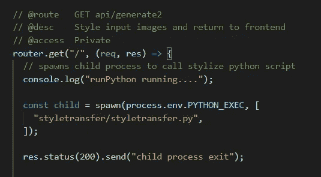
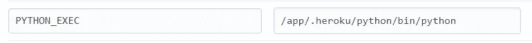
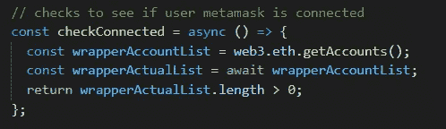

# 构建 Web3 Dapp(第 1 部分)—经验教训

> 原文：<https://medium.com/coinmonks/building-a-web3-dapp-part-1-lessons-learned-a672e032ba82?source=collection_archive---------3----------------------->

这是关于 ScratchCollective.app 的 4 篇文章系列的第 1 篇，这是我为教育目的而开发的 Dapp。对于那些没有看过[简介](/coinmonks/building-a-full-stack-web3-application-dapp-scratchcollective-app-c843adcee8a0)的人来说，ScratchCollective 是一款人工智能艺术生成& NFT 造币工具。它提供了一种易于使用的手段，利用人工智能来创建一个神经风格的转移图像，并将结果作为 NFT。

**在这篇文章中，我回顾了我在开发这款应用时遇到的一些具体挑战。**在整个过程中，通常很容易找到关于基础知识和常见问题的资源。我发现更困难的是具体的、小众的问题，需要更多的创造力和努力去克服。我在这里讨论了这些问题，希望其他人也能利用这里找到的解决方案。

以下是我面临的一些挣扎:

*   让 Nodejs 正确地生成我的 python 子进程
*   将智能合同部署到 mainnet 的成本
*   将 Tensorflow 部署到 Heroku
*   检查元掩码中用户的活动帐户是否连接到应用程序的方法

## **1。让 Nodejs 正确生成我的 python 子进程**

在 ScratchCollective 中，我在我的一个服务器路由中生成了一个 Nodejs 子进程，以调用应用程序的 AI 生成部分(用 Python 编写)。我的问题是让子进程首先调用我的 Tensorflow 脚本。Node child_process 的 spawn()方法接受一个要运行的命令和一些可选参数—在本例中，在 styletransfer.py 脚本上调用“Python”命令。我发现我错误地调用了“Python”——在本地，我需要指定 Python 可执行文件的完整路径，而在生产中(即在托管服务器上),您必须指定相对于该服务器配置的路径。让我困惑的是指定了错误的 Python 可执行文件——在本地，我需要的路径是我的虚拟环境中可执行文件的完整路径。在生产服务器中(特别是 Heroku)——我认为调用由 Heroku 用 Python buildpack 自动创建的 PYTHON_PATH 环境变量会有效。但是，我发现这里也需要完整的路径，所以我创建了自己的环境变量，指向路径“/app/. herok ` u/python/bin/python”。这花了我一段时间，但我终于让它工作。

Heroku Config Variables

## **2。将智能合同部署到 mainnet 的成本**

将智能合同部署到 mainnet 的成本最终高得惊人。我已经预算了大约 300 美元来部署这个合同(lol ),最初我认为我在我的 ERC-1155 中写了糟糕的可靠性，有些事情是错误的。所以我通过 Truffle/Ganache 做了一些测试，看看我还差多远，没有…我在 Ganache 实例上部署了 OpenZeppelin 的 ERC721Mintable、ERC20MinterPauser、ERC1155MinterPauser，甚至 BoredApes (NFT)智能合约，以测试不同天然气价格下的天然气支出(基于 [ethgasstation.info](http://ethgasstation.info) )。在测试时，部署价格从 400 美元到 2000 美元不等，ERC-20m inter poser 在较低的推荐天然气价格范围内最便宜(即交易较慢)，最高价格为 Bored Ape 的 2000 美元。对于那些对细节感兴趣的人，我计划写关于汽油费的计算和优化你的智能合同，以在未来将费用降至最低。我最后做的就是从 Rinkeby，Ropsten，Goerli 水龙头上抢了一堆测试 ETH(免费的“ETH”！！)并在那里部署我的合同。长话短说，这个应用程序只在测试网络上运行而不在 mainnet 上运行的原因是因为我决定用这笔钱来支付房租和杂货。

## **3。将 Tensorflow 部署到 Heroku**

其中一个主要的应用程序功能包括通过 Python 脚本运行两幅图像，该脚本使用 Tensorflow 和任意图像风格化模型来产生“AI 生成的图像”。这就是上面提到的 python 子流程，它变成了一个两部分的部署问题。一个问题是张量流模块的大小。另一个问题是运行脚本所需的内存(RAM)量。*回想起来，我可能不应该使用 Heroku，而是选择数字海洋或 AWS* 。但后知后觉是 20/20，我不觉得部署很有趣，所以我坚持与 Heroku。

Heroku 只允许一个 [500mb 的块大小](https://devcenter.heroku.com/articles/slug-compiler)，这实际上是你在 dyno(服务器)上压缩的、预打包的应用程序的大小。当我最初部署应用程序时，我需要 Tensorflow 模块，它本身将近 500mb。每次我试图部署时，我都会得到一个错误，说我已经超过了限制。非常沮丧。最终我发现解决方案是把模块从 Tensorflow 换成 Tensorflow-cpu。最初的 tensorflow 模块包括 GPU 支持，但最终并不需要，如果不存在的话，模块会跳过它。在这里了解更多:[https://stack overflow . com/questions/61062303/deploy-python-app-to-heroku-slug-size-too-large](https://stackoverflow.com/questions/61062303/deploy-python-app-to-heroku-slug-size-too-large)

我面临的另一个问题是内存使用被超越。再次，Heroku 免费层 dynos 限制您的内存使用 500mb 在这里。Tensorflow 在处理之前将您的模型(在本例中是任意风格化模型)加载到内存中，这在很大程度上是整个 RAM 分配。除了增加内存限制之外，这里真的没有解决办法，所以我花了一些钱将限制增加到 1GB，但很快就会考虑在 Digital Ocean 或 AWS 上重新部署:/

**4。检查用户的元掩码钱包是否连接到应用程序**的方法

为了让你的以太坊钱包与 Dapp 互动，钱包账户必须*连接*到 dapp /网站。为了连接，用户(您)必须批准帐户访问( [EIP 1102](https://github.com/ethereum/EIPs/blob/master/EIPS/eip-1102.md) )。因为我的目标是实现一个自动化的身份验证过程，所以我需要一种方法来自动检查用户是否已经将他们的钱包连接到应用程序，如果没有，则提示他们这样做(即请求许可)。这不是以太坊提供者 API 中的内置方法，它提供了浏览器交互和监听以太坊区块链的方法(更多关于以太坊提供者的信息，请点击)。有一个容易混淆的相似命名的方法— *ethereum.isConnected()* 与用户的帐户无关，它只是一个布尔值，表示提供者是否可以向当前链发出 RPC 请求(同样与帐户无关)。

所以为了让这个工作，我必须创建我自己的函数。我的逻辑是，如果一个用户的帐户是连接的—调用 web3.eth.getAccounts()将返回与助记符相关联的帐户列表(在元掩码的情况下，这只返回列表中的第一个地址)。如果用户没有连接，它将返回一个空列表。这最终成为我的工作职能:

**这些只是我在开发这款应用时面临的一些挑战。这里要记住的重要一点是，这是一个相当新的领域。许多问题没有被很好地记录下来，而且还没有被发现。已经被大型社区使用了一段时间的语言和框架可能会有更容易使用的解决方案。因此，在使用 Web 3.0 时，请准备好自己动手做一些修补工作！**

> 加入 Coinmonks [电报频道](https://t.me/coincodecap)和 [Youtube 频道](https://www.youtube.com/c/coinmonks/videos)了解加密交易和投资

## 也阅读

 [## 最佳加密交易所| 2021 年十大加密货币交易所

### 编辑描述

blog.coincodecap.com](https://blog.coincodecap.com/crypto-exchange)  [## 2021 年 10 大最佳加密贷款平台| CoinCodeCap

### 编辑描述

blog.coincodecap.com](https://blog.coincodecap.com/crypto-lending)  [## 2021 年最佳免费加密交易机器人

### 2021 年币安、比特币基地、库币和其他密码交易所的最佳密码交易机器人。四进制，位间隙…

medium.com](/coinmonks/crypto-trading-bot-c2ffce8acb2a)  [## 最佳 4 个加密交易信号电报通道

### 这是乏味的找到正确的加密交易信号提供商。因此，在本文中，我们将讨论最好的…

medium.com](/coinmonks/best-crypto-signals-telegram-5785cdbc4b2b)  [## BlockFi 评论 2021:利弊和利率| CoinCodeCap

### 编辑描述

blog.coincodecap.com](https://blog.coincodecap.com/blockfi-review)  [## 如何在印度购买比特币？2021 年购买比特币的 7 款最佳应用[手机版]

### 如何使用移动应用程序购买比特币印度

medium.com](/coinmonks/buy-bitcoin-in-india-feb50ddfef94)  [## 加密税务软件——五大最佳比特币税务计算器[2021]

### 不管你是刚接触加密还是已经在这个领域呆了一段时间，你都需要交税。

medium.com](/coinmonks/best-crypto-tax-tool-for-my-money-72d4b430816b)  [## 存储比特币的最佳加密硬件钱包[2021] | CoinCodeCap

### 编辑描述

blog.coincodecap.com](https://blog.coincodecap.com/best-hardware-wallet-bitcoin)  [## Pionex 评论 2021 |免费加密交易机器人和交换

### Pionex 是为交易自动化提供工具的后起之秀。Pionex 上提供了 9 个加密交易机器人…

medium.com](/coinmonks/pionex-review-exchange-with-crypto-trading-bot-1e459d0191ea)