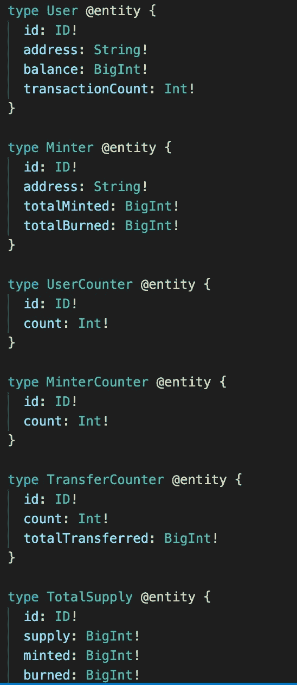
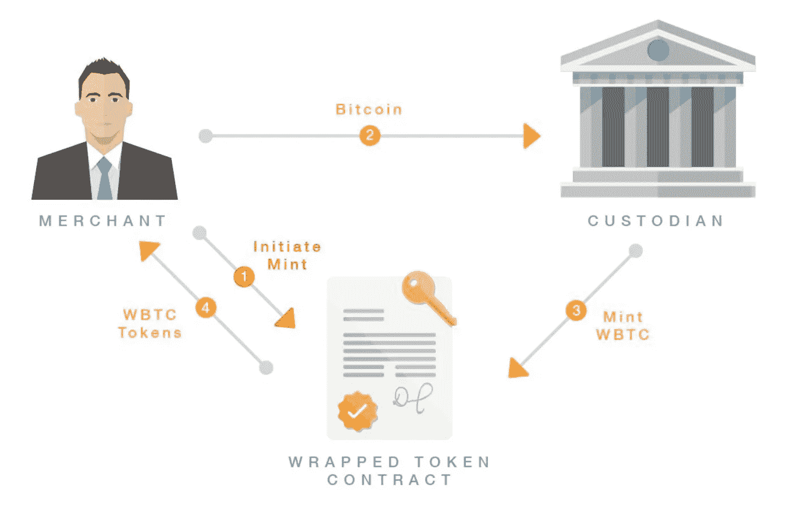
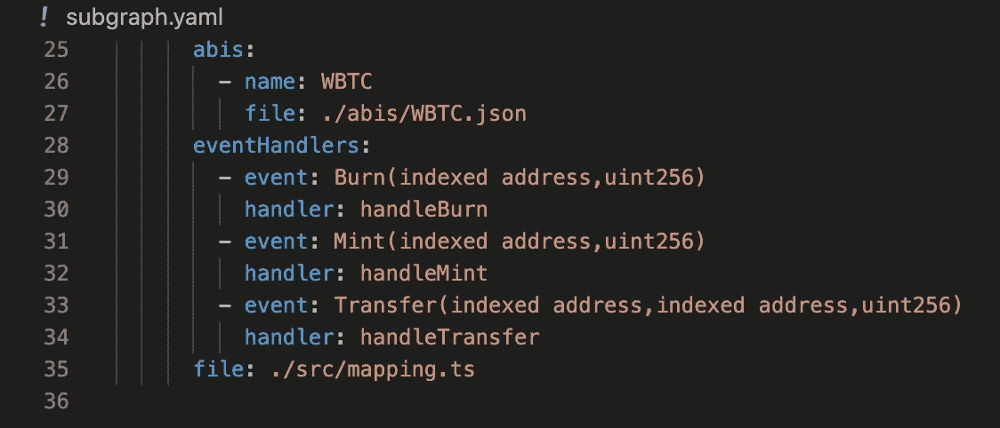
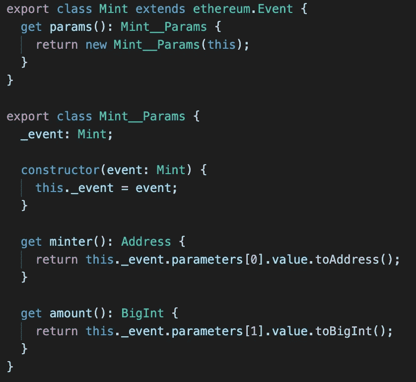
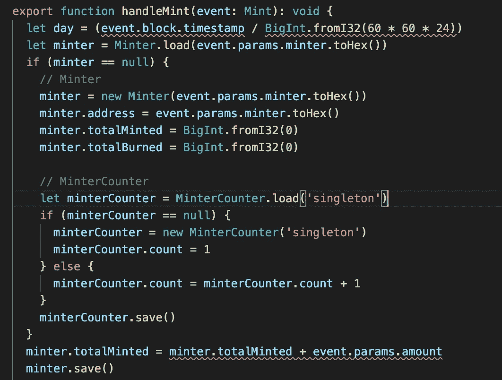
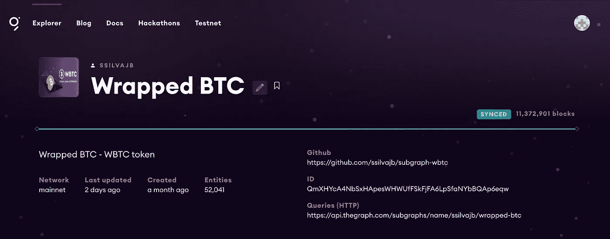
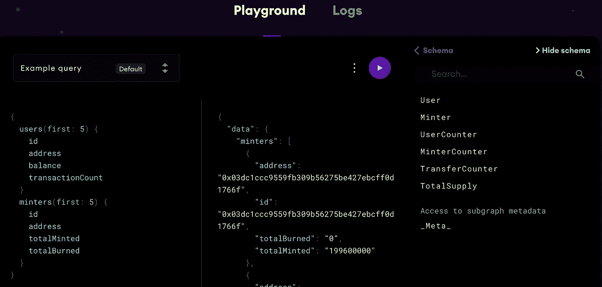

# 用该图构造一个包裹的 BTC (WBTC)子图

> 原文：<https://medium.com/coinmonks/building-a-wrapped-btc-wbtc-subgraph-with-the-graph-c948e3f9e950?source=collection_archive---------0----------------------->

# 动机

包装比特币(WBTC)是第一个与比特币 1:1 支持的 ERC20 代币。它提供了比特币的强大功能和 ERC20 令牌的灵活性。自从图形策展人计划开始以来，我看到了开发包装 BTC 子图的机会，因为 BTC 在加密空间的重要性和 WBTC 在数量上的突然增加以及在许多 DeFi 项目中的使用。在撰写本文时，WBTC 市值为 22.9 亿美元，在 DeFi Pulse 排名中也是排名第一的资产。我在图形浏览器中搜索 WBTC，发现一个子图带来了一对 WBTC/USDC，然而，它缺乏关于包装的 BTC 代币的一般信息，例如，铸造或燃烧的代币量，总供应量等。带着这个动机，我接受了开发我的第一个子图项目的挑战。

# 该模式

在我看来，子图最重要的方面是它的模式，它定义了哪种信息将被图索引。为了理解这个项目的基本原理，我建议阅读白皮书，并比较在 GitHub 资源库上可以找到的以太坊合同中的实现。作为策展人计划第二阶段的一部分，我们必须根据完整性、复杂性和准确性评估五个子图——你可以在我上一篇关于[策展](/@ssilvajb/subgraph-curating-a-product-market-fit-hands-on-guide-cd2de288f3fa)子图的博客文章中看到更多信息。我评估的一个子图是关于 USDC 稳定硬币的，它显示了 WBTC 在主要操作方面的相同行为:铸造、燃烧和转移。我选择了这条途径，并且可以验证它的模式非常适合 WBTC 子图的需求。



schema.graphql file

为了在图中更新和索引我刚刚创建的模式，有必要识别以太坊契约中的相关事件和函数。ABI(应用程序二进制接口规范)文件还带来了子图将用来交互的事件和函数签名，对于成功的实现来说，确保在项目中使用正确的 ABI 文件是必不可少的。当我搜索以太坊合同中的事件时，我逻辑地认为其中一些事件有使用的意义，但它不在 ABI 文件中，如下所示:

```
subgraph-wbtc % yarn deploy**yarn run v1.22.10**$ graph deploy ssilvajb/wrapped-btc — ipfs [https://api.thegraph.com/ipfs/](https://api.thegraph.com/ipfs/) — node [https://api.thegraph.com/deploy/](https://api.thegraph.com/deploy/)Skip migration: Bump mapping apiVersion from 0.0.1 to 0.0.2Skip migration: Bump mapping apiVersion from 0.0.2 to 0.0.3Skip migration: Bump mapping apiVersion from 0.0.3 to 0.0.4Skip migration: Bump mapping specVersion from 0.0.1 to 0.0.2✔ Apply migrations✖ Failed to load subgraph from subgraph.yaml: Error in subgraph.yaml:Path: dataSources > 0 > eventHandlers > 0Event with signature ‘BurnConfirmed(uint indexed,address indexed,uint,string,string,uint,bytes32)’ not present in ABI ‘WBTC’.Available events:- Approval(indexed address,indexed address,uint256)- Burn(indexed address,uint256)- Mint(indexed address,uint256)- MintFinished()- OwnershipRenounced(indexed address)- OwnershipTransferred(indexed address,indexed address)- Pause()- Transfer(indexed address,indexed address,uint256)- Unpause()Path: dataSources > 0 > eventHandlers > 1
```

# 白皮书

在用正确的事件和相关签名修复 subgraph.yaml 清单文件之后，我需要更新 mapping.ts 文件中定义的类，以便正确地表示那些参数差异。在《WBTC 白皮书》中，我们可以看到，铸币操作是通过下面描述的一系列事件完成的:



A sequence of minting events for WBTC — source: WBTC whitepaper

**WBTC 造币活动顺序**

1.  商家发起交易以授权托管人在以太坊链上将 X WBTC 铸造到商家的地址。
2.  商家派托管人 X BTC。
3.  托管人等待 BTC 交易的 6 次确认
4.  保管人创建交易，在以太坊链上铸造 X 枚新 WBTC 代币


A sequence of events for users to receive WBTC tokens — source: WBTC whitepaper

**用户领取 WBTC 代币的事件顺序**

1.  用户向商家请求包装的令牌
2.  商家执行必要的反洗钱和 KYC 程序，并从用户处获取身份信息
3.  用户和商家执行原子交换，或者与接收比特币的商家和接收 WBTC 的用户进行可信交换

# 代码开发

它帮助我理解了为什么 mint signature Mint(索引地址，uint256)只用两个参数构建。实际上，mint 操作是在“from”地址设置为零的情况下执行的，因为它代表保管人。这样，签名实现只使用“to”地址和生成的令牌数量。burn 签名 Burn(索引地址，uint256)也发生同样的情况，它是通过将“to”地址设置为零从商家进行传输来实现的。

```
Ethereum Contract implementation/** @dev Creates `amount` tokens and assigns them to `account`, increasing * the total supply. * * Emits a {Transfer} event with `from` set to the zero address. * * Requirements: * * — `to` cannot be the zero address. */ function _mint(address account, uint256 amount) internal virtual { require(account != address(0), “ERC20: mint to the zero address”); _beforeTokenTransfer(address(0), account, amount);

_totalSupply = _totalSupply.add(amount); 
_balances[account] = _balances[account].add(amount); 
emit Transfer(address(0), account, amount); 
} /** * @dev Destroys `amount` tokens from `account`, reducing the * total supply. * * Emits a {Transfer} event with `to` set to the zero address. * * Requirements: * * — `account` cannot be the zero address. * — `account` must have at least `amount` tokens. */function _burn(address account, uint256 amount) internal virtual { require(account != address(0), “ERC20: burn from the zero address”);_beforeTokenTransfer(account, address(0), amount); _balances[account] = _balances[account].sub(amount, “ERC20: burn amount exceeds balance”); 
_totalSupply = _totalSupply.sub(amount); 
emit Transfer(account, address(0), amount); 
}
```

实现的一个基本部分是事件的正确定义和 subgraph.yaml 清单文件上的相关处理程序。这些处理程序是在 mapping.ts 上实现的，其中部署了处理事件的编程逻辑。



Event definitions and related handlers in the manifest file

我使用了 CENTREHQ USDC 子图的同一个 Mint 类，除了上面已经解释过的事件签名中参数数量的不同。



Mint class definition

下面是 handleMint 函数的摘录，其中可以看到使用 Minter 类来构造和分离事件参数，以及它们对聚合生成的令牌量的处理，这些令牌将保存在相关的 schema Minter 实体中。



handleMint function on mapping.ts file

# 测试和质量保证

结果，在出现一些配置问题后，比如清单文件中的起始块丢失，我可以在日志中验证，甚至出现版本冲突，需要一些努力才能意识到在部署新代码时，您可以在 Explorer Playground 上看到子图的两个版本(同步和待定)，包装的 BTC 子图完全同步，如下图所示。



[https://thegraph.com/explorer/subgraph/ssilvajb/wrapped-btc](https://thegraph.com/explorer/subgraph/ssilvajb/wrapped-btc)

WBTC 子图启动并运行的最后一个验证可以在 Graph Explorer playground 上完成，在这里可以对索引数据运行查询。在左侧，该工具显示了一个示例查询，我们可以根据自己的需要对其进行更改，在右侧，我们可以看到一个模式，只需单击一下就可以显示详细信息。按下运行按钮，我们可以看到如下所示的结果。



值得一提的是，在开发和部署我的第一个子图的过程中，我学到了一些技巧。更喜欢运行不带参数的“graph init”命令来引入交互模式，因为它有助于调试这个阶段的常见问题。重要的是加载关于项目的所有合同，并确保使用正确的 ABI 文件。不要忘记在 subgraph.yaml 清单文件中包含 start block 参数。该信息可在以太网扫描上找到，搜索合同号并在合同创建者字段上识别交易散列。最后但同样重要的是，我选择 VSCode 作为我的首选代码编辑器，因为它使得在同一环境中编辑 solidity、typescript 和 grapQL 代码变得可行。

# 结论

在这篇博文中，我介绍了开发和部署我的第一个子图的步骤。我选择开发一个包装比特币令牌(WBTC)的子图，因为我看到这种数据在 Coingecko 和 Coinmarketcap 等应用程序中非常有用。从这一点开始，我将开始改进代码和模式。

感谢阅读！

# 资源

如果您有兴趣了解更多关于图表的信息，请查看以下资源:

*   查看[图浏览器](https://thegraph.cmail20.com/t/j-l-ayhjhid-iydljjkuhy-d/)来熟悉子图
*   [不和谐服务器](https://thegraph.cmail20.com/t/j-l-ayhjhid-iydljjkuhy-u/)
*   [推特](https://twitter.com/graphprotocol?s=20)
*   [电报](https://t.me/GraphProtocol)

## 另外，阅读

*   最好的[密码交易机器人](/coinmonks/crypto-trading-bot-c2ffce8acb2a)
*   [Deribit 审查](/coinmonks/deribit-review-options-fees-apis-and-testnet-2ca16c4bbdb2) |选项、费用、API 和 Testnet
*   [FTX 密码交易所评论](/coinmonks/ftx-crypto-exchange-review-53664ac1198f)
*   [Bybit 交换审查](/coinmonks/bybit-exchange-review-dbd570019b71)
*   最好的比特币[硬件钱包](/coinmonks/the-best-cryptocurrency-hardware-wallets-of-2020-e28b1c124069?source=friends_link&sk=324dd9ff8556ab578d71e7ad7658ad7c)
*   [密码本交易平台](/coinmonks/top-10-crypto-copy-trading-platforms-for-beginners-d0c37c7d698c)
*   [Bitsgap vs 3 commas vs quad ency](https://blog.coincodecap.com/bitsgap-3commas-quadency)
*   最好的[加密税务软件](/coinmonks/best-crypto-tax-tool-for-my-money-72d4b430816b)
*   [最佳加密交易平台](/coinmonks/the-best-crypto-trading-platforms-in-2020-the-definitive-guide-updated-c72f8b874555)
*   最佳[密码借贷平台](/coinmonks/top-5-crypto-lending-platforms-in-2020-that-you-need-to-know-a1b675cec3fa)
*   [莱杰纳米 S vs 特雷佐 one vs 特雷佐 T vs 莱杰纳米 X](https://blog.coincodecap.com/ledger-nano-s-vs-trezor-one-ledger-nano-x-trezor-t)
*   [block fi vs Celsius](/coinmonks/blockfi-vs-celsius-vs-hodlnaut-8a1cc8c26630)vs Hodlnaut
*   bits gap review——一个轻松赚钱的加密交易机器人
*   为专业人士设计的加密交易机器人
*   [PrimeXBT 审查](/coinmonks/primexbt-review-88e0815be858) |杠杆交易、费用和交易
*   [在线评论](/coinmonks/haasonline-review-d8d1a3400419)享受九折优惠
*   [埃利帕尔泰坦评论](/coinmonks/ellipal-titan-review-85e9071dd029)
*   [SecuX Stone 评论](https://blog.coincodecap.com/secux-stone-hardware-wallet-review)
*   区块链评论 |从你的密码中赚取高达 8.6%的利息
*   开发人员的最佳加密 API
*   [最佳区块链分析工具](https://bitquery.io/blog/best-blockchain-analysis-tools-and-software)
*   [加密套利](/coinmonks/crypto-arbitrage-guide-how-to-make-money-as-a-beginner-62bfe5c868f6)指南:新手如何赚钱
*   顶级[比特币节点](https://blog.coincodecap.com/bitcoin-node-solutions)提供商
*   最佳[加密制图工具](/coinmonks/what-are-the-best-charting-platforms-for-cryptocurrency-trading-85aade584d80)
*   了解比特币最好的[书籍有哪些？](/coinmonks/what-are-the-best-books-to-learn-bitcoin-409aeb9aff4b)

> [直接在您的收件箱中获得最佳软件交易](/coinmonks/newsletters/coinmonks)

[](https://medium.com/coinmonks/newsletters/coinmonks)