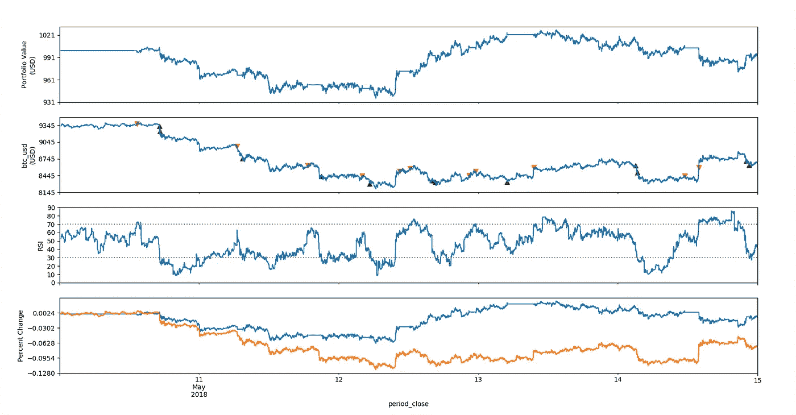

# 用 Enigma Catalyst 构建算法交易策略

> 原文：<https://medium.com/coinmonks/building-an-algorithmic-trading-strategy-with-enigma-catalyst-1a407e9c02f8?source=collection_archive---------3----------------------->

## 向您介绍 Enigma 项目，并使用 Catalyst 构建自动化交易策略。

# 英格玛简介

当前形式的锁链不能很好地保护隐私。每个人都可以查看存储在区块链上的数据——这是彻底透明的副作用。虽然这仍然比当前的数据模型(下面我总结了它的问题)要好，但有些数据就是不适合展示。

*当前模型的问题:*

*   **没有隐私** ~盗窃(黑客)，出售给其他方等。
*   **自然收入损失** ~您的数据是一种自然资源
*   **敏感产品问题** ~有些数据是极其私人的
*   **聚合力** ~大公司基本上拥有我们所有的数据

机器学习，尤其是深度学习，给了我们对数据的洞察力，这是非常宝贵的。随着我们计算能力的快速增长，以及数据的巨大增长，现在是训练这些模型的最佳时机。深度学习正在重塑几乎所有行业:

Industries disrupted by Deep Learning [Source: [Insight AI whitepaper](https://uploads-ssl.webflow.com/57c954d37d70832a623199f5/5ae0a4cd0391ea70216558ae_Insight_AI_White_Paper_Apr2018.pdf)]

需要一种新的方式来存储我们的个人数据，解决我上面提到的 4 个主要问题，机器学习模型仍然可以在其上训练，这是巨大的。这就是谜语的由来。

Enigma 是一个*分散的计算平台，具有保密保证*。数据可以存储在公共区块链(非敏感数据，如 ENG 令牌交易)或私有 Enigma 网络(敏感数据，如医疗日志)上。私有的 Enigma 网络架构不是区块链，而是一个分布式哈希表，也是星际文件系统(IPFS)的一个重要部分。在这里阅读*。你拥有你的数据，所以本质上，如果一家大公司想要训练一个模型(比如定向广告模型)，你会把你的数据卖给那家公司，让他们使用。由于 Enigma 的*安全多方计算*，对敏感数据的计算仍然是可能的。如果你想了解更多关于 Enigma 的信息，请阅读他们的白皮书。*

# *催化剂*

> *受加密资产的快速增长和扩散的启发，我们提出了 Catalyst——第一个使开发者能够构建、测试和执行微型加密基金的投资平台。*

*这段摘录来自 [Catalyst 白皮书](https://enigma.co/enigma_catalyst.pdf)，它很好地总结了他们的目标。 *Catalyst 是英格玛协议*的第一个应用，因为驱动平台的加密数据来自英格玛分散数据市场。*

*它的目标是为量化交易者提供一站式服务，测试他们在加密资产领域的策略。它还旨在成为一个平台，人们可以在这个平台上从 Catalyst 开发者那里购买策略。Python 软件开发工具包是一个基于 [Zipline](http://www.zipline.io/index.html) 的引擎，其中的策略可以进行回溯测试或实时交易。*

# *制定战略*

*第一步是在您的系统上安装 Catalyst。遵循他们的文档提供的[指南*这里*这里](https://enigma.co/catalyst/install.html)。*

*我们将建立一个简单的策略，利用相对强弱指数。这是一个动量指标，表示价格变动的强度。逻辑是这样的:*

*   *如果我们没有仓位，RSI 超卖(≤ 30)，做多*
*   *如果我们做多，RSI 达到 60，平仓*
*   *如果我们没有持仓，RSI 超买(≥ 70)，做空*
*   *如果我们处于空头头寸，RSI 达到 40，做空*

*这些随机的出场位置数字(短 40，长 60)是任意选择的。这是为了确保一旦 RSI 回调，策略实际上可以退出头寸。你可以尝试的一件事是优化这些值以获得最大利润。*不像那样会一整批*。*

*这是 Python 中完整策略的样子，我们将一部分一部分地分解它:*

*我建议只复制第 1 行到第 12 行。这基本上是任何策略的框架(以及初始化、处理数据和分析),我不会深入讨论这些。*

*如果我用 catalyst.run_algorithm 函数运行这个算法(提供正确的参数)，这就是输出。第一张图是我们的投资组合价值，第二张图是价格，买卖显示为箭头。第三张图绘制了 RSI，最后一张图显示了我们相对于只持有资产(橙色)的百分比收益(蓝色)。感谢我们的*分析*功能。*

**

*现在我们来分解一下。每个 Catalyst 算法都需要定义这两个函数:*

*   *`initialize(context)`*
*   *`handle_data(context, data)`*

*先说`initialize`。当你运行一个算法时，Catalyst 调用`initialize`函数并把`context`作为参数传入。该参数可用于存储需要通过不同迭代在不同函数中使用的变量。在第 3 行，我们创建了一个存储在`context`中的变量`asset`。要从 Catalyst 库中获取货币对，您需要使用`symbol`函数并传入相关数据。`context.i`是一个跟踪迭代的变量，而`context.base_price`将存储资产的初始价格。*

*算法初始化后，根据`run_algorithm`中指定的时间范围，每*分钟*或*天*调用一次`handle_data`函数。在我们的例子中，那是*分钟*。传入的是同一个`context`变量，以及一个名为`data`的对象，该对象在每次迭代中都会更新，包含我们定义的资产的当前交易棒线，包括开盘价、最高价、最低价、收盘价和成交量。*

*这个函数才是真正有趣的地方。我们将从定义 RSI 的周期开始，在大多数情况下是 14。接下来，我们将把迭代次数`context.i`增加 1。记住，这个函数每分钟调用一次，不需要循环。一旦我们有了足够的数据来实际计算 RSI，也就是 14 个数据点，我们就可以移到第 9 行了。*

*这里我们将利用`data`对象，对其调用`history`。根据我们如何定义参数，这将返回许多数据点。通过`frequency`，我们定义了一根棒线包含多少时间帧(在本例中为分钟)。这意味着我们将计算 30 分钟图的 RSI。*

*下一步是计算 RSI。在 Python 中是这样做的。如果您想了解更多关于 RSI 如何计算的信息，请阅读[本](https://en.wikipedia.org/wiki/Relative_strength_index)。在第 27 行上，我们称`current`价格为`data`对象。这样我们就可以通过一个每分钟都会更新的简单变量来访问它。在第 29 行上，我们使用`context.base_price`变量得到第一根蜡烛的价格作为参考。**第 32 行**计算价格变化，我们以后可以用它作为基准。在**第 34 行**中，我们使用了一个名为`record`的函数。这创建了一个性能`perf`数据帧，我们稍后可以在`analyze`函数中调用它来进行性能分析。在第 39 到 45 行我们检查状态；我们在订单完成之前不会交易，如果现在不能交易，我们会更新状态。接下来，在**行 47** 上，位置量存储在源于`context.portfolio`对象的变量中。*

*在`handle_data`的最后部分，策略逻辑被确定。算法现在准备好了。*

*最后一个函数`analyze`创建了几个图，从中我们可以看到我们的策略的性能。这个我就不深究了。*

*算法现在可以进行回溯测试了。因为我们在脚本的末尾进行了`run_algorithm`调用，所以我们可以使用`python <filename.py>`从命令行运行它。确保首先使用命令行中的`source activate catalyst`激活 Catalyst 环境，并使用`catalyst ingest-exchange -x bitfinex -i btc_usd -f minute`接收交换数据。后者将在您的系统中保留 bitfinex 价格数据的记录。*

*你现在应该看到你的业绩图表弹出，并看到你的利润或损失！如果你想更深入地了解 Catalyst，并且一旦你有了好的算法，正在考虑实时交易，请阅读他们广泛的文档[这里](https://enigma.co/catalyst/beginner-tutorial.html)。*

*感谢你的阅读，并考虑关注更多类似的故事。*