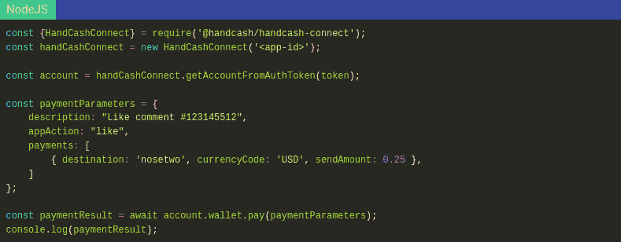
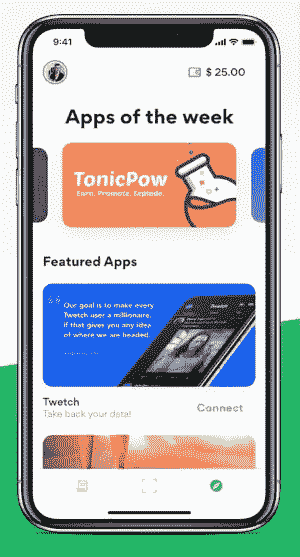
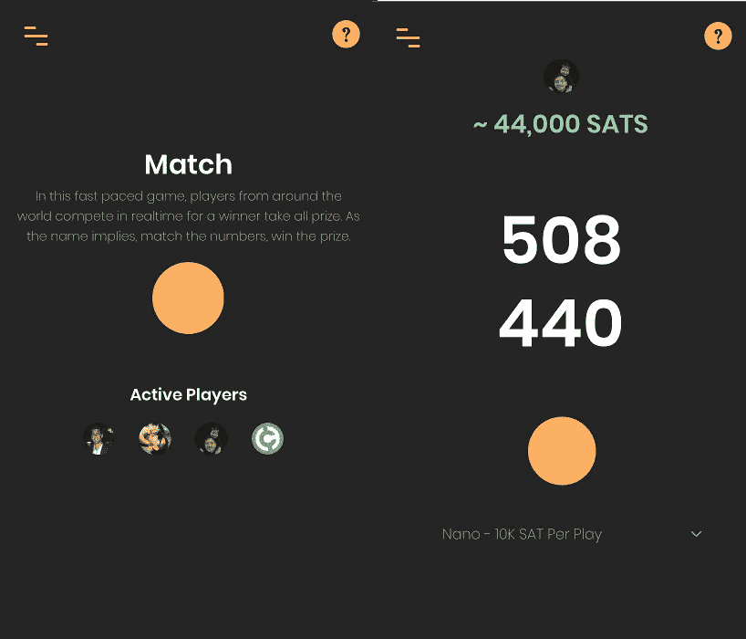

# 使用 HandCash Connect 构建应用程序

> 原文：<https://medium.com/coinmonks/building-an-app-with-handcash-connect-691f92d94e9?source=collection_archive---------5----------------------->

这是我的第一篇公开文章，所以我先自我介绍一下。我叫布兰登·克莱德曼，是 HandCash 的首席代表。我观察了 Connect 从早期阶段到现在的发展，并亲自开发了流行的“Pay Pistol”应用程序的后端，从未担任过专业程序员的角色。Connect 最让我兴奋的是它极低的准入门槛。在这篇文章中，我将分享一些建议给那些想直接开发他们的第一个应用的人。

# 想法

要创建你的第一个应用程序，你首先需要一个想法。找一些你非常了解并且也充满热情的事情。想法可以很简单。如果你没有一个完整的路线图，也不要担心。从我的总体经验来看，即使是一个模糊的想法也可以变成伟大的事情。不要害怕跳进去，看看它会把你带到哪里。

以下是一些*想法*可以通过纳米支付来实现:

> 一对一视频游戏
> 
> 想象一下一个乒乓游戏，每个进球都是一个用户向另一个用户支付 0.10 美元。
> 
> 内容创作
> 
> 启动一个播客托管服务或视频平台，按秒向人们收取流媒体内容的费用。
> 
> 启动微订阅服务
> 
> 想象一下，以 0.01 美元/天的价格订阅 30 个内容创建者，而以 10 美元/月的价格订阅 1 个内容创建者。

# 动机

一旦你有了一个想法，你会想去思考你的动机。你为什么要做这个 app，更重要的是，你做这个 app 是为了谁？

对我们来说，这个想法是让你的朋友付费，动机是展示 Connect 是社交的、即时的和高度可扩展的。

我们发现许多人喜欢使用 HandCash 发送小费。因此，我们决定将其作为“世界上最快的小费应用程序”进行营销。

记住你在为谁而努力是有帮助的。在我们的例子中，问我们自己“谁是我们的用户？”在决策和总体设计中起到了很大的作用。

# 入门指南

要开始，你需要一些编程技能，但你不需要担心了解比特币或理解其基础设施。Connect 将所有这些抽象成一个简单明了的支付 SDK。

如果您能理解下面的代码片段，那么您就有足够的技能来开发 Connect 应用程序:

Processing a payment

官方上，我们支持 SDK 的两个版本，Flutter 和 NodeJS。( [Golang](https://github.com/tonicpow/go-handcash-connect) 也是由于[滋补品](https://tpow.app/cryptokang)的开发团队。)

如果你熟悉这些语言中的一种，那太好了！如果没有，您可以随时投入并创建您自己版本的 SDK，毕竟，SDK 只是一组包装好的 HTTP 调用。

一旦您决定开始使用，请在我们的[开发者仪表盘](https://dashboard.handcash.dev/)中注册您的应用。然后查看我们的[文档](https://docs.handcash.dev/)，获取入门资源。

# 重复

为你的应用获得反馈的最快方法是开发一个最小可行产品(MVP ),只是一些作为广告的基本功能。在这一点上，随意与几个朋友分享，记得从小处开始。

通过每一次迭代，您可能会扩展到更多的用户。一旦你觉得已经确定，我们将帮助你把它列在我们的应用程序库中。

HandCash App Gallery

# 一个人的成名史

Match by Haste

这是 Haste，一个成功的 Connect 应用程序，最初在两周内开发完成。Haste 经常看到成千上万的交易通过他们的应用程序运行。他们的比赛游戏(我个人最喜欢的)是一个测试用户计时按键能力的竞技游戏。每一次失败的尝试都会增加彩池的钱，任何一次成功的尝试都会赢得所有的钱。当他们第一次推出时，匆忙在一夜之间变得流行起来。用户第一次可以享受在线友好竞争，一次一便士。

由于过去一个月的成功，Haste 团队现在正寻求推出一款原生移动应用，并扩展到更高级的游戏。

# 结论

找到你的想法！纳米支付开辟了一个新的可能性领域。一个有待你探索的创意世界。一旦找到了，就可以着手下一件大事；没有什么能阻止你。