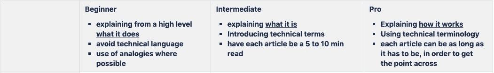
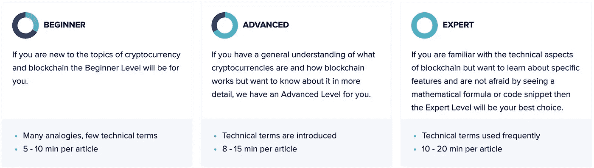
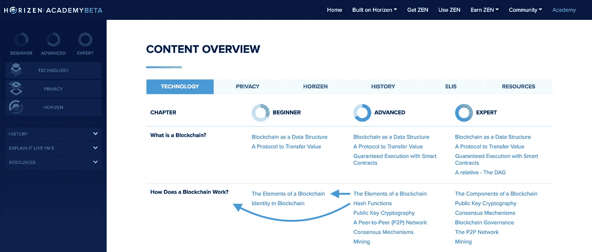

# 围绕区块链技术构建教育平台

> 原文：<https://medium.com/coinmonks/building-an-educational-platform-around-blockchain-technology-cc1ed63b3638?source=collection_archive---------0----------------------->

[Source](https://www.pexels.com/photo/auditorium-benches-chairs-class-207691/)

## 从一个空文件夹到区块链理工大学在线学院的旅程，在线隐私等等。

这篇文章旨在描述我个人建设 Horizen 学院的经历。我想提前声明，整个过程是团队的努力。我得到了可爱的平面设计师 Linda、Tuan(一位才华横溢的网站开发人员)和 Erica(校对工作做得非常出色)的帮助。此外，我要感谢 Mac 和 Gus 的持续支持，以及团队的其他成员在需要时提供的帮助！

差不多就在一年前，我接触了 ZenCash 项目。在 2018 年 8 月更名为 Horizen 之前，我于 2018 年 4 月晚些时候加入了该团队的 BD 部门。

入职后，我做的第一件事就是浏览我们的内部文档，看看当时发生了什么。我偶然发现了一个名为禅宗学院的文件夹，并立即知道这是我想做的事情。不幸的是，文件夹是空的，所以我开始询问这个项目的计划是什么。

不久前有人有过这个想法，但并没有真正实现。尽管如此，我交谈过的每个人都对将 Horizen 学院带入现实生活非常感兴趣。

我有化学背景，现在已经在因斯布鲁克大学教了几年书。我想我对创作教育内容和分享知识有很强的亲和力，因为我总是喜欢讲课。我认为教育平台可能是我为我们的项目做出贡献的最佳方式。

## **CS50**

2018 年夏天，我在 EdX 上参加了哈佛大学提供的 [CS50](https://www.edx.org/course/cs50s-introduction-computer-science-harvardx-cs50x) 课程。对我来说，这个在线课程为如何进行在线教育树立了一个全新的标准。

在设计这门课程和它的作业，以及所提供的基础设施时所花的心思是非常突出的。很明显，他们的课程经历了很多次迭代，直到变成今天的样子，但我是认真的印象深刻。如果你正在寻找一个地方开始[学习计算科学](https://www.edx.org/course/cs50s-introduction-computer-science-harvardx-cs50x)，不要再找了。

在考虑 Horizen Academy 的同时，亲身体验教育内容的精彩程度极大地提高了我的动力！

## **目标**

学院的主要目标是让尽可能多的人能够获得我们能够分享的知识。在某种程度上，知识是采用的先决条件，我们希望通过教育促进加密货币和区块链技术的采用。

有人可能会认为谷歌在这方面已经做得很好了，但我认为这只是部分正确:很容易找到任何给定关键字的内容。你不知道什么是工作证明？点击谷歌，找到大量的文章。

问题是，用户会发现一半的文章对他们来说太高级了，而另一半没有包括足够的细节。当我开始使用 crypto 时，我确实多次发现自己处于这种境地。很难找到刚好适合自己的内容。

目标是让我们学院的内容适应用户的需求。我们想采取的方法是在三个级别创建相同的内容:初级、高级和专家。如果用户开始阅读一篇文章，并意识到它太详细或复杂，他可以向下移动一级，找到用更简单的术语解释的相同概念。如果内容过于琐碎，用户可以向上移动一级。

## **开始**

在收到一些信息和电子邮件后，我们 Horizen 团队内部成立了一个小组，我们开始每两周打一次电话来讨论项目的范围。我们决定只从书面内容开始。由于我们的核心价值观之一是隐私，我们决定覆盖[在线隐私](https://academy.horizen.global/privacy/)以及[区块链科技](https://academy.horizen.global/technology/)。

此外，参加电话会议的每个人都认为介绍加密货币的[历史](https://academy.horizen.global/history/)以及精选的[资源列表](https://academy.horizen.global/resources/)很有价值。我们为 [Horizen 项目](https://academy.horizen.global/horizen/)设计了另一个主题，并创建了一个 [ELI5](https://academy.horizen.global/eli5/) 部分。

## **定义内容**

我们首先列出了我们想要涵盖的主题/文章。下一步，我们将这些文章分组到预备章节中。有了这个结构，我们开始用主题填充不同层次的不同章节，我们认为这些主题适合给定类型的用户。

在定义了高层结构之后，我开始打字。我完成的前两篇文章原本打算放在初学者部分。在收集了一些反馈后，我们把它们移到了高级水平，因为它们被认为对初学者来说太详细了。我们最终使用整个初始结构(对初学者而言)作为高级内容的起点，并为新的初学者部分创建了一个轻量级版本。

当我们在修改结构的前几篇文章中工作时，我们意识到我们需要再后退一步，为不同层次的内容制定一个规范。我们在工作文件中提出了这些粗略的规格。

这第一个规范翻译成下面的描述，你现在可以在我们对[技术部分](https://academy.horizen.global/technology/)的介绍中找到。

如果我要重新设置这些规格，我会从一开始就更加精确。事后看来，我意识到在写作过程中，花额外的时间计划一篇文章或一章至少可以节省两倍的时间。另一方面，我觉得有时我不得不开始打字一会儿，直到我可以开始理解什么是使一篇文章工作所需要的。

## 定义结构和内容映射

回到我们的主要目标，为每个人创建内容，不管他们以前的知识如何，我们希望允许用户根据他们的需求来调整内容。

为了实现这一点，我们需要在不同层次的内容中使用一致的结构。已经定义了章节，这已经很有帮助了。下一步是考虑内容映射:如果用户开始阅读一篇文章，并因为内容对他们来说太简单/太高级而决定切换级别，他会转到哪篇文章？

对于某些文章来说，这种映射很简单。各级别都有一篇关于[区块链作为数据结构](https://academy.horizen.global/technology/beginner/blockchain-as-a-data-structure/)的文章在“[什么是区块链？](https://academy.horizen.global/technology/beginner/what-is-a-blockchain/)”。麻烦从更先进的概念开始。作为一个例子，我们选择在初级水平中完全排除散列函数。

我们仍在进行内容映射，而且还没有完成。现在，如果没有相应的文章，我们选择引导用户到相应章节的介绍。例如，高级课程中关于[哈希函数](https://academy.horizen.global/technology/advanced/hash-functions/)的文章可以追溯到章节“[区块链如何工作？](https://academy.horizen.global/technology/beginner/how-does-a-blockchain-work/)“在初级水平，而文章“[区块链的元素](https://academy.horizen.global/technology/advanced/the-elements-of-a-blockchain/)”映射到其更简单的兄弟。

Example of Content Mapping between Levels. Screenshot taken from [Content Overview Page](https://academy.horizen.global/content-overview/).

我们还试图在文章中提供有用的交叉引用，这样用户就不必过多地搜索文章结构。如果你有关于如何解决这个内容映射问题的建议，请告诉我[！](mailto:jonas@horizen.global)

## 对于一个初学者来说，什么样的细节是合适的？

一旦你在加密领域花了一些时间，初学者可能会忽略一些重要的概念。我们决定故意这样做。这个决定是否正确，这本身就是一个讨论。

这是最困难的问题之一，以确定哪些概念是至关重要的，以获得对该技术的基本理解，以及哪些概念更容易混淆。尽管在过去的几年里已经有大量的关于这个主题的教育内容被创造出来，但是我们仍然没有关于如何教授区块链的最佳实践。

我个人觉得这个决定需要基于可理解性/可用性，而不是正确性。初学者应该首先了解全局，不要被上述[哈希函数](https://academy.horizen.global/technology/advanced/hash-functions/)、[智能合约](https://academy.horizen.global/technology/advanced/guaranteed-execution-with-smart-contracts/)以及 [PoW](https://academy.horizen.global/technology/advanced/consensus-mechanisms/) 的错综复杂所迷惑。

## 目标受众

许多设计决策都必须考虑到目标受众。但是目标受众是谁呢？目前，人们可能会关注相当年轻、对技术感兴趣、受过中高等教育的人。但最终，我们希望让每个人都能使用加密和区块链，不管他们的教育水平如何。

尤其是那些教育水平低的地区的人们是那些从分散资金中受益最多的人。

所以我们要问自己:初级水平的初学者够不够友好？我们确实有一个 [ELI5](https://academy.horizen.global/eli5/) (像我 5 岁一样解释它)部分，用更简单的术语解释这项技术，我们可能会选择在我们的网站上更突出地放置它，作为绝对初学者的起点。

我们还希望通过视频和动画来扩展我们的内容组合，但目前，待办事项列表上的最高优先级项目显然是完成技术和在线隐私的专家级。

这篇文章是献给我们学院的内容。我会在另一篇文章中试着花点时间谈谈我们学院的 UI 和 UX 背后的思考过程。

## 经验教训和未决问题

我个人从建造[地平线学院](https://academy.horizen.global/)的过程中得到的启示是，在真正开始工作之前，人们不应该害怕在绘图板上花很多时间。事实证明，这不仅适用于创建内容，也适用于设置文件结构来跟踪不同的文章和信息图表。稍微多做一点规划就可以避免许多重组会议。

将内容从我们的协作工具迁移到实际网站是另一个不太理想的过程。我们过早地开始了迁移过程，当不得不对内容进行最后一分钟的更改时，这导致了效率低下。

确定初学者应该首先理解什么概念是另一项艰巨的任务，我将感谢对我们的结构和内容的任何建设性的反馈。

感谢您的阅读，祝您愉快！

如果你喜欢你在这里发现的东西，请务必关注我的媒介账户，非常感谢。你也可以在[推特](https://twitter.com/SLebur)上找到我。

> [直接在您的收件箱中获得最佳软件交易](https://coincodecap.com/?utm_source=coinmonks)

