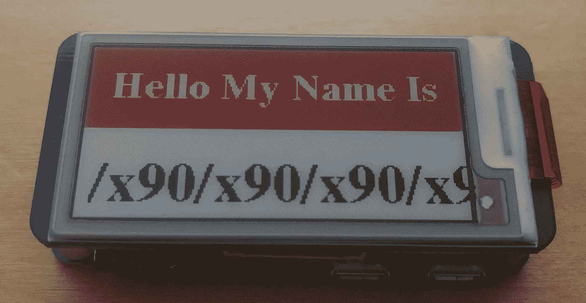

# 用树莓 PI 零构建 Epaper 徽章

> 原文：<https://medium.com/coinmonks/building-an-epaper-badge-with-a-raspberry-pi-zero-e4b98b3311c3?source=collection_archive---------1----------------------->



在过去的几年里，我一直想为 Defcon 制作一个电子徽章，今年我终于做到了。不幸的是，在构建过程中，我没有保留实际的日志，所以这将在关键部分丢失图像。这个概述假设读者有焊接、python、linux 和 raspberry pi 的经验。

# **零件清单**

*   树莓派零，我用了一个零 W，一个标准的零也可以。[https://www . Amazon . com/Raspberry-Zero-v1-3-Development-Board/DP/b 01 L3 iu6xs](https://www.amazon.com/Raspberry-Zero-v1-3-Development-Board/dp/B01L3IU6XS)
*   树莓皮零头引脚，或购买一个树莓皮零套件来与这些。[https://www . Amazon . com/Break-away-2x 20-pin-Strip-Header-Raspberry/DP/b 0756km 7 cy](https://www.amazon.com/Break-away-2x20-pin-Strip-Header-Raspberry/dp/B0756KM7CY)
*   Waveshare 3 彩色 E-Ink 显示器，还有其他类似的显示器，我不知道它们与我编写的 python 代码配合得如何。[https://www.amazon.com/gp/product/B07DH6HLCK](https://www.amazon.com/gp/product/B07DH6HLCK)
*   皮莫尔尼按钮垫，[https://shop.pimoroni.com/products/button-shim](https://shop.pimoroni.com/products/button-shim)
*   [树莓派零案，](https://www.amazon.com/gp/product/B01KTG03M4)https://www.amazon.com/gp/product/B01KTG03M4
*   自粘皮带夹，[https://www.amazon.com/gp/product/B00HUV8FWW](https://www.amazon.com/gp/product/B00HUV8FWW)

# 其他零件和工具

*   烙铁
*   焊接辅助手
*   焊料
*   USB 微型电缆
*   USB 电池
*   MicroSD 卡
*   向 MicroSD 卡写入的一些方法

# 安装接头销

Pi 零点通常没有安装接头引脚，因此第一步是焊接引脚。

# 安装按钮垫片

现在，随着引脚安装，翻转 Pi 和焊接按钮垫片上。请务必保持针的顶部清洁，因为 E-Ink 屏幕需要在此之上。

# 安装树莓 Pi 零机箱

只安装下半部分的情况下，屏幕将不适合与上半部分安装。

# 安装电子输入屏幕

拿起屏幕，放在标题引脚上，按下。

# 下载并安装 Raspbian

下载最新版的 Raspbian，还有其他的发行版，应该都一样好用，我选 Raspbian。此外，由于我使用了零 I 设置 wifi 和 ssh 进行远程访问。

# 下载 Waveshare 依赖项

基于[https://www . wave share . com/wiki/pioneer 600 # Libraries _ Installation _ for _ RPi](https://www.waveshare.com/wiki/Pioneer600#Libraries_Installation_for_RPi)首先安装必要的软件包，在最新版本的 raspbian 下，他们提到的所有库都可以在 os repository 的软件包中找到。

```
sudo apt-get update && sudo apt-get install python-dev python-smbus python-serial python-imaging python-rpi.gpio wiringpi python-spidev fonts-freefont-ttf
```

# 下载按钮依赖项

皮莫罗尼的团队让这一步变得非常非常简单，运行以下代码

```
curl [https://get.pimoroni.com/buttonshim](https://get.pimoroni.com/buttonshim) | bash
```

这将安装提供装饰的 python buttonshim 库

# 启用接口

运行 raspi-config 命令，选择接口选项，然后启用 SPI I2C 串行

然后重启你的 Pi

# 测试硬件

首先查看屏幕，从[https://www . waveshare . com/wiki/File:2.13 inch-e-paper-hat-b-code . 7z](https://www.waveshare.com/wiki/File:2.13inch-e-paper-hat-b-code.7z)下载 wave share 演示

解压缩档案，导航到 raspberry pi 演示，运行演示，如果一切正常，屏幕应该会循环显示一些图像

接下来检查 buttonshim，从[https://github . com/pimoroni/button-shim/blob/master/examples/rainbow . py](https://github.com/pimoroni/button-shim/blob/master/examples/rainbow.py)下载演示代码

运行它，按几个按钮，看着 led 改变颜色。

# 安装徽章代码

假设所有硬件都按预期运行，是时候编写自己的徽章代码，或者安装我编写的代码了。

将[https://github.com/jheise/ebadge/blob/master/badge.py](https://github.com/jheise/ebadge/blob/master/badge.py)下载到 epaper 屏幕演示代码所在的目录中，有许多库不能在系统范围内访问，这是利用它们的最快方法。

下一次运行“sudo mkdir-p/var/badge/images ”,/ var/badge 是存储徽章所有数据的位置。使用您选择的文本编辑器 open/var/badge/smooths . txt，这是一个制表符分隔的文件，包含徽章上显示的所有文本，需要按如下方式书写行:

"不服从<tab>【比例|静态|任意】<tab>【居中|静态|任意】"</tab></tab>

在上面的例子中，第一个字段是要显示的标语；下一个字段确定文本是应该缩放、不缩放还是随机选择；最后一个字段决定文本是应该居中、总是左对齐还是随机选择。此外，可以通过将字符串中的第一个字符设为“#”来注释掉行。

一旦标语准备好了，是时候添加一些图像了，屏幕上的图像必须是分辨率为 104 x 212 的位图形式，图像也必须只使用黑白，因为图像可以作为翻转像素的遮罩。脚本中的图像加载功能将只加载黑白图像，但是屏幕完全能够加载两个单独的位图，它们匹配在一起形成一个三色图像。将您制作的任何图像放在/var/badge/images 中

给脚本一个快速的测试运行，确保至少一个口号和一个图像加载后再继续。

# 启动时启动徽章脚本

有很多方法可以处理这个问题，我使用这个方法是因为我对处理 init 脚本或 systemd 或 raspbian 在启动时使用的任何方法都不感兴趣

首先将 python 目录从您下载 badge 脚本的演示中移走，将/var/badge 与其余文件一起移走

使用您最喜欢的文本编辑器打开/home/pi/launcher.sh，编写以下代码

```
#!/bin/sh
echo "Launcher starting..."
cd /
cd /var/badge/python
echo "sleeping for 20 seconds while spi interface comes up"
sleep 20
/usr/bin/python badge.py
cd /
```

使脚本可执行，然后使用以下命令将其添加到 root 的 crontab 中

```
@reboot sh /home/pi/launcher.sh > /home/pi/logs 2>&1
```

现在重新启动，看看它是否工作。

# 加分:使用 Pi Zero 的 USB 小工具模式

到目前为止，徽章应该已经通电，并在没有人类交互的情况下更改文本和图像，但当你想更改标语或添加图像时，你要么需要网络连接，要么将 sd 卡弹出并直接写入。幸运的是，raspberry pi zero 还可以充当大容量存储设备，通过这种设置，你只需要将徽章插入计算机，然后通过 usb 编辑任何代码、文本或图像。这些说明改编自[https://www . raspberrypi . org/magpi/pi-zero-w-smart-USB-flash-drive/](https://www.raspberrypi.org/magpi/pi-zero-w-smart-usb-flash-drive/)

首先将/var/badge 移动到/var/badge.bak，新的分区将被挂载到/var/badge。

接下来，我们需要为新部件分配一些空间，在其上放置一个文件系统，并创建挂载点

```
sudo dd of=/var/badgefs.bin if=/dev/zero bs=1M count=2048
sudo mkdosfs /var/badgefs.bin -F 32 -I
sudo mkdir /var/badge
```

现在用您喜欢的文本编辑器在/etc/fstab 中创建条目

```
/var/badgefs.bin /var/badge vfat users,umask=000 0 2
```

将分区装回，并将/var/badge.bak 的内容复制到新版本中

```
sudo mount /var/badge
cp -r /var/badge.bak/* /var/badge
```

要真正打开 USB 大容量存储功能，需要启用几个不同的模块。

首先启用 USB 覆盖驱动，用你喜欢的文本编辑器打开/boot/config.txt，在底部添加

```
dtoverlay=dwc2
```

然后打开/etc/modules，在底部添加以下内容

```
dwc2
```

现在，为了使分区在 USB 上可用，将这一行添加到/etc/rc.local 中，这一行需要在文件末尾的`exit 0`之上

```
modprobe g_mass_storage file=/var/badgefs.bin removable=1 ro=0 stall=0
```

现在将 pi 直接插入计算机，看看它是否可以安装。我只在 Ubuntu 18.04 桌面版和 MacOS 上测试过，我不确定在 Windows 下是否会有问题