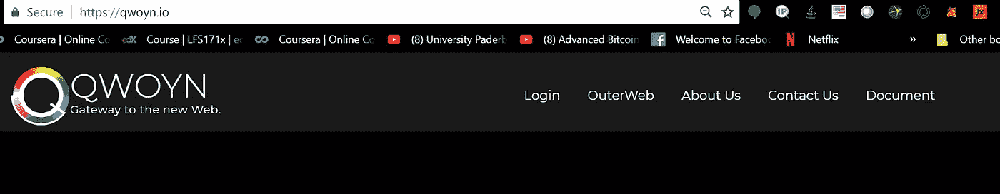
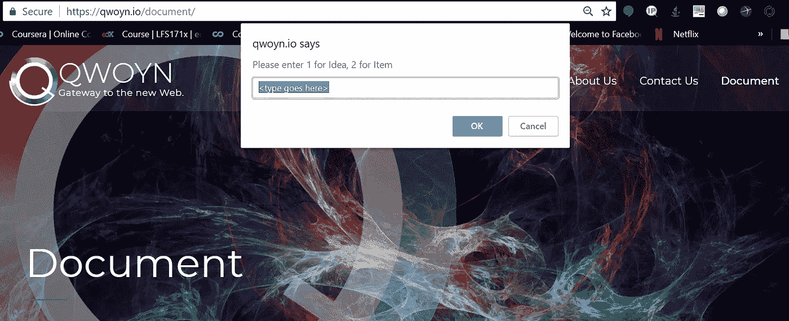
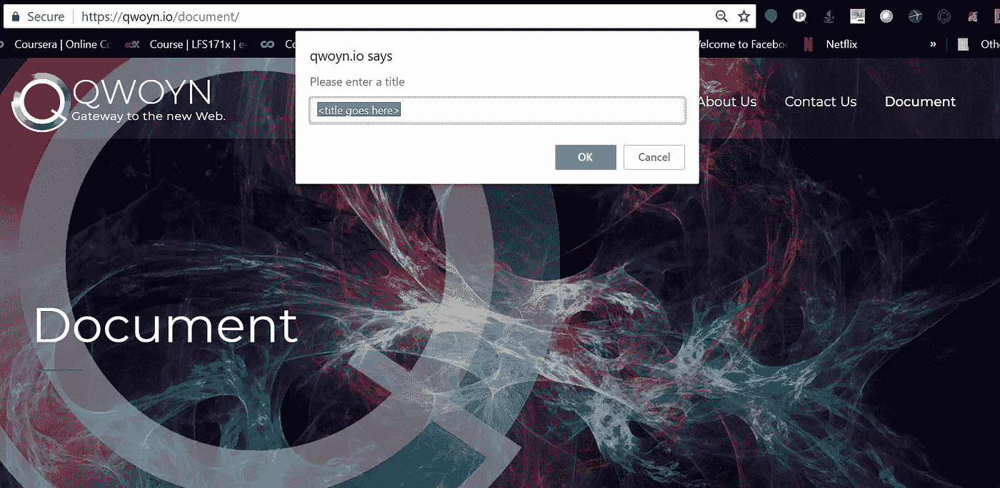
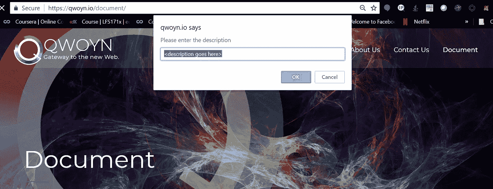
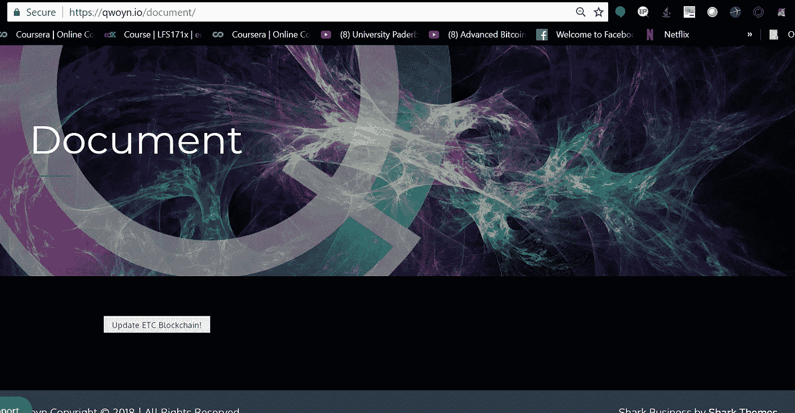
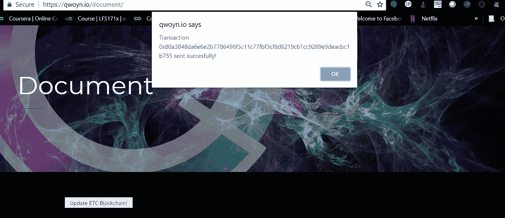

# 构建一个 ERC721 不可替换令牌智能合约，并使用元掩码通过 web 接口与其进行交互。(第二部分)

> 原文：<https://medium.com/coinmonks/building-an-erc721-non-fungible-token-smart-contract-and-using-metamask-to-interact-with-it-via-a-3f3a13320572?source=collection_archive---------5----------------------->


# 构建 Web 界面

我们现在有一个工作合同，但让我们使用网站与它互动。您可以在 [Qwoyn.io](https://www.qwoyn.io/document) 查看部署在 Ropsten Testnet 上的工作示例。下面是我插入到我的 wordpress 站点的代码片段。这是非常基本的，需要一些爱，但功能才是最重要的，我会让你把它变得更漂亮。如果你想帮我访问我的 [GitHub](https://github.com/Qwoyn/Document) 并创建一个拉请求。

上到`.html`:

```
<script src="https://rawgit.com/ethereum/web3.js/0.16.0/dist/web3.min.js"></script>
<script src="https://cdn.jsdelivr.net/npm/ethjs@0.3.0/dist/ethjs.min.js"></script><script>
window.addEventListener('load', function() { 
// Check if Web3 has been injected by the browser: 
if (typeof web3 !== 'undefined') { // You have a web3 browser! Continue below! startApp(web3); //alert("Web3"); } else {  alert("No web3 provider found please install a provider such as metamask to interact with this dApp"); 
// Warn the user that they need to get a web3 browser // Or install MetaMask, maybe with a nice graphic. }})const abi = [ {  "anonymous": false,  "inputs": [   {    "indexed": true,    "name": "_owner",    "type": "address"   },   {    "indexed": true,    "name": "_operator",    "type": "address"   },   {    "indexed": false,    "name": "_approved",    "type": "bool"   }  ],  "name": "ApprovalForAll",  "type": "event" }, {  "constant": false,  "inputs": [   {    "name": "_to",    "type": "address"   },   {    "name": "_tokenId",    "type": "uint256"   }  ],  "name": "approve",  "outputs": [],  "payable": false,  "stateMutability": "nonpayable",  "type": "function" }, {  "constant": false,  "inputs": [   {    "name": "_type",    "type": "uint256"   },   {    "name": "_title",    "type": "string"   },   {    "name": "_description",    "type": "string"   }  ],  "name": "buyToken",  "outputs": [],  "payable": true,  "stateMutability": "payable",  "type": "function" }, {  "anonymous": false,  "inputs": [   {    "indexed": true,    "name": "_owner",    "type": "address"   },   {    "indexed": true,    "name": "_approved",    "type": "address"   },   {    "indexed": true,    "name": "_tokenId",    "type": "uint256"   }  ],  "name": "Approval",  "type": "event" }, {  "anonymous": false,  "inputs": [   {    "indexed": true,    "name": "buyer",    "type": "address"   },   {    "indexed": false,    "name": "tokenId",    "type": "uint256"   }  ],  "name": "BoughtToken",  "type": "event" }, {  "anonymous": false,  "inputs": [   {    "indexed": true,    "name": "previousOwner",    "type": "address"   }  ],  "name": "OwnershipRenounced",  "type": "event" }, {  "anonymous": false,  "inputs": [   {    "indexed": true,    "name": "previousOwner",    "type": "address"   },   {    "indexed": true,    "name": "newOwner",    "type": "address"   }  ],  "name": "OwnershipTransferred",  "type": "event" }, {  "anonymous": false,  "inputs": [   {    "indexed": true,    "name": "_from",    "type": "address"   },   {    "indexed": true,    "name": "_to",    "type": "address"   },   {    "indexed": true,    "name": "_tokenId",    "type": "uint256"   }  ],  "name": "Transfer",  "type": "event" }, {  "constant": false,  "inputs": [],  "name": "renounceOwnership",  "outputs": [],  "payable": false,  "stateMutability": "nonpayable",  "type": "function" }, {  "constant": false,  "inputs": [   {    "name": "_from",    "type": "address"   },   {    "name": "_to",    "type": "address"   },   {    "name": "_tokenId",    "type": "uint256"   }  ],  "name": "safeTransferFrom",  "outputs": [],  "payable": false,  "stateMutability": "nonpayable",  "type": "function" }, {  "constant": false,  "inputs": [   {    "name": "_from",    "type": "address"   },   {    "name": "_to",    "type": "address"   },   {    "name": "_tokenId",    "type": "uint256"   },   {    "name": "_data",    "type": "bytes"   }  ],  "name": "safeTransferFrom",  "outputs": [],  "payable": false,  "stateMutability": "nonpayable",  "type": "function" }, {  "constant": false,  "inputs": [   {    "name": "_to",    "type": "address"   },   {    "name": "_approved",    "type": "bool"   }  ],  "name": "setApprovalForAll",  "outputs": [],  "payable": false,  "stateMutability": "nonpayable",  "type": "function" }, {  "constant": false,  "inputs": [   {    "name": "newPrice",    "type": "uint256"   }  ],  "name": "setCurrentPrice",  "outputs": [],  "payable": false,  "stateMutability": "nonpayable",  "type": "function" }, {  "constant": false,  "inputs": [   {    "name": "_from",    "type": "address"   },   {    "name": "_to",    "type": "address"   },   {    "name": "_tokenId",    "type": "uint256"   }  ],  "name": "transferFrom",  "outputs": [],  "payable": false,  "stateMutability": "nonpayable",  "type": "function" }, {  "constant": false,  "inputs": [   {    "name": "_newOwner",    "type": "address"   }  ],  "name": "transferOwnership",  "outputs": [],  "payable": false,  "stateMutability": "nonpayable",  "type": "function" }, {  "inputs": [],  "payable": false,  "stateMutability": "nonpayable",  "type": "constructor" }, {  "constant": true,  "inputs": [   {    "name": "_owner",    "type": "address"   }  ],  "name": "balanceOf",  "outputs": [   {    "name": "",    "type": "uint256"   }  ],  "payable": false,  "stateMutability": "view",  "type": "function" }, {  "constant": true,  "inputs": [   {    "name": "_tokenId",    "type": "uint256"   }  ],  "name": "exists",  "outputs": [   {    "name": "",    "type": "bool"   }  ],  "payable": false,  "stateMutability": "view",  "type": "function" }, {  "constant": true,  "inputs": [   {    "name": "_tokenId",    "type": "uint256"   }  ],  "name": "getApproved",  "outputs": [   {    "name": "",    "type": "address"   }  ],  "payable": false,  "stateMutability": "view",  "type": "function" }, {  "constant": true,  "inputs": [],  "name": "getCurrentPrice",  "outputs": [   {    "name": "price",    "type": "uint256"   }  ],  "payable": false,  "stateMutability": "view",  "type": "function" }, {  "constant": true,  "inputs": [   {    "name": "_tokenId",    "type": "uint256"   }  ],  "name": "getToken",  "outputs": [   {    "name": "tokenType_",    "type": "uint256"   },   {    "name": "tokenTitle_",    "type": "string"   },   {    "name": "tokenDescription_",    "type": "string"   }  ],  "payable": false,  "stateMutability": "view",  "type": "function" }, {  "constant": true,  "inputs": [],  "name": "InterfaceId_ERC165",  "outputs": [   {    "name": "",    "type": "bytes4"   }  ],  "payable": false,  "stateMutability": "view",  "type": "function" }, {  "constant": true,  "inputs": [   {    "name": "_owner",    "type": "address"   },   {    "name": "_operator",    "type": "address"   }  ],  "name": "isApprovedForAll",  "outputs": [   {    "name": "",    "type": "bool"   }  ],  "payable": false,  "stateMutability": "view",  "type": "function" }, {  "constant": true,  "inputs": [],  "name": "myTokens",  "outputs": [   {    "name": "",    "type": "uint256[]"   }  ],  "payable": false,  "stateMutability": "view",  "type": "function" }, {  "constant": true,  "inputs": [],  "name": "name",  "outputs": [   {    "name": "",    "type": "string"   }  ],  "payable": false,  "stateMutability": "view",  "type": "function" }, {  "constant": true,  "inputs": [],  "name": "owner",  "outputs": [   {    "name": "",    "type": "address"   }  ],  "payable": false,  "stateMutability": "view",  "type": "function" }, {  "constant": true,  "inputs": [   {    "name": "_tokenId",    "type": "uint256"   }  ],  "name": "ownerOf",  "outputs": [   {    "name": "",    "type": "address"   }  ],  "payable": false,  "stateMutability": "view",  "type": "function" }, {  "constant": true,  "inputs": [   {    "name": "_interfaceId",    "type": "bytes4"   }  ],  "name": "supportsInterface",  "outputs": [   {    "name": "",    "type": "bool"   }  ],  "payable": false,  "stateMutability": "view",  "type": "function" }, {  "constant": true,  "inputs": [],  "name": "symbol",  "outputs": [   {    "name": "",    "type": "string"   }  ],  "payable": false,  "stateMutability": "view",  "type": "function" }, {  "constant": true,  "inputs": [   {    "name": "_index",    "type": "uint256"   }  ],  "name": "tokenByIndex",  "outputs": [   {    "name": "",    "type": "uint256"   }  ],  "payable": false,  "stateMutability": "view",  "type": "function" }, {  "constant": true,  "inputs": [   {    "name": "_owner",    "type": "address"   },   {    "name": "_index",    "type": "uint256"   }  ],  "name": "tokenOfOwnerByIndex",  "outputs": [   {    "name": "",    "type": "uint256"   }  ],  "payable": false,  "stateMutability": "view",  "type": "function" }, {  "constant": true,  "inputs": [   {    "name": "_tokenId",    "type": "uint256"   }  ],  "name": "tokenURI",  "outputs": [   {    "name": "",    "type": "string"   }  ],  "payable": false,  "stateMutability": "view",  "type": "function" }, {  "constant": true,  "inputs": [],  "name": "totalSupply",  "outputs": [   {    "name": "",    "type": "uint256"   }  ],  "payable": false,  "stateMutability": "view",  "type": "function" }] 
EFFORTLESS OPERATIONSNEW FEATURESBUILDING TRAILTRAILAPP.COM
Follow
3 pillars to support growing operations
3 pillars to support growing operations
Strong foundations will help scale your restaurant, takeaway or catering business.

Stephanie Wedderburn
Apr 17const contract_address = '0xC345212CAE57D8Aa2f02Fb34e89477F0276C2856'const etherValue = web3.toWei(10, 'ether');function startApp(web3) { const eth = new Eth(web3.currentProvider) const token = eth.contract(abi).at(contract_address);listenForClicks(token,web3)} function listenForClicks (token, web3) { 
var documentType = prompt("Please enter 1 for Idea, 2 for Item", "<type goes here>"); 
var documentTitle = prompt("Please enter a title", "<title goes here>"); 
var documentDescription = prompt("Please enter the description", "<description goes here>"); 
var button = document.querySelector('button.updateChain') web3.eth.getAccounts(function(err, accounts) { console.log(accounts); address = accounts.toString(); }) button.addEventListener('click', function() { token.buyToken(documentType,documentTitle,documentDescription,{from: address}) .then(function (txHash) { console.log('Transaction sent') console.dir(txHash) alert('Transaction ' + txHash + ' sent succesfully!'); }) .catch(console.error) })}
</script>

<button class="updateChain">Update ETC Blockchain!</button>
```

我已经从我的 repo 中复制并粘贴了这段代码，我建议访问 [GitHub](http://github.com/Qwoyn/Document/src) 并使用那里的代码，如果你自己正在实现它的话。

这里是一个近距离的观察:

```
<script src="https://rawgit.com/ethereum/web3.js/0.16.0/dist/web3.min.js"></script>
<script src="https://cdn.jsdelivr.net/npm/ethjs@0.3.0/dist/ethjs.min.js"></script>
```

在这里，我们调用了 web3 和 ethjs 所需的脚本。

```
window.addEventListener('load', function() { 
// Check if Web3 has been injected by the browser: 
if (typeof web3 !== 'undefined') { 
// You have a web3 browser! Continue below! 
startApp(web3); //alert("Web3"); } else {  alert("No web3 provider found please install a provider such as metamask to interact with this dApp"); 
// Warn the user that they need to get a web3 browser // Or install MetaMask, maybe with a nice graphic. }})
```

这个函数检查 web3 是否已经被注入到浏览器中。

```
const abi = [ {  "anonymous": false,  "inputs": [   {    "indexed": true,    "name": "_owner",    "type": "address"   },   {    "indexed": true,    "name": "_operator",    "type": "address"   },   {    "indexed": false,    "name": "_approved",    "type": "bool"   }  ],  "name": "ApprovalForAll",  "type": "event" }, {  "constant": false,  "inputs": [   {    "name": "_to",    "type": "address"   },   {    "name": "_tokenId",    "type": "uint256"   }  ],  "name": "approve",  "outputs": [],  "payable": false,  "stateMutability": "nonpayable",  "type": "function" }, {  "constant": false,  "inputs": [   {    "name": "_type",    "type": "uint256"   },   {    "name": "_title",    "type": "string"   },   {    "name": "_description",    "type": "string"   }  ],  "name": "buyToken",  "outputs": [],  "payable": true,  "stateMutability": "payable",  "type": "function" }, {  "anonymous": false,  "inputs": [   {    "indexed": true,    "name": "_owner",    "type": "address"   },   {    "indexed": true,    "name": "_approved",    "type": "address"   },   {    "indexed": true,    "name": "_tokenId",    "type": "uint256"   }  ],  "name": "Approval",  "type": "event" }, {  "anonymous": false,  "inputs": [   {    "indexed": true,    "name": "buyer",    "type": "address"   },   {    "indexed": false,    "name": "tokenId",    "type": "uint256"   }  ],  "name": "BoughtToken",  "type": "event" }, {  "anonymous": false,  "inputs": [   {    "indexed": true,    "name": "previousOwner",    "type": "address"   }  ],  "name": "OwnershipRenounced",  "type": "event" }, {  "anonymous": false,  "inputs": [   {    "indexed": true,    "name": "previousOwner",    "type": "address"   },   {    "indexed": true,    "name": "newOwner",    "type": "address"   }  ],  "name": "OwnershipTransferred",  "type": "event" }, {  "anonymous": false,  "inputs": [   {    "indexed": true,    "name": "_from",    "type": "address"   },   {    "indexed": true,    "name": "_to",    "type": "address"   },   {    "indexed": true,    "name": "_tokenId",    "type": "uint256"   }  ],  "name": "Transfer",  "type": "event" }, {  "constant": false,  "inputs": [],  "name": "renounceOwnership",  "outputs": [],  "payable": false,  "stateMutability": "nonpayable",  "type": "function" }, {  "constant": false,  "inputs": [   {    "name": "_from",    "type": "address"   },   {    "name": "_to",    "type": "address"   },   {    "name": "_tokenId",    "type": "uint256"   }  ],  "name": "safeTransferFrom",  "outputs": [],  "payable": false,  "stateMutability": "nonpayable",  "type": "function" }, {  "constant": false,  "inputs": [   {    "name": "_from",    "type": "address"   },   {    "name": "_to",    "type": "address"   },   {    "name": "_tokenId",    "type": "uint256"   },   {    "name": "_data",    "type": "bytes"   }  ],  "name": "safeTransferFrom",  "outputs": [],  "payable": false,  "stateMutability": "nonpayable",  "type": "function" }, {  "constant": false,  "inputs": [   {    "name": "_to",    "type": "address"   },   {    "name": "_approved",    "type": "bool"   }  ],  "name": "setApprovalForAll",  "outputs": [],  "payable": false,  "stateMutability": "nonpayable",  "type": "function" }, {  "constant": false,  "inputs": [   {    "name": "newPrice",    "type": "uint256"   }  ],  "name": "setCurrentPrice",  "outputs": [],  "payable": false,  "stateMutability": "nonpayable",  "type": "function" }, {  "constant": false,  "inputs": [   {    "name": "_from",    "type": "address"   },   {    "name": "_to",    "type": "address"   },   {    "name": "_tokenId",    "type": "uint256"   }  ],  "name": "transferFrom",  "outputs": [],  "payable": false,  "stateMutability": "nonpayable",  "type": "function" }, {  "constant": false,  "inputs": [   {    "name": "_newOwner",    "type": "address"   }  ],  "name": "transferOwnership",  "outputs": [],  "payable": false,  "stateMutability": "nonpayable",  "type": "function" }, {  "inputs": [],  "payable": false,  "stateMutability": "nonpayable",  "type": "constructor" }, {  "constant": true,  "inputs": [   {    "name": "_owner",    "type": "address"   }  ],  "name": "balanceOf",  "outputs": [   {    "name": "",    "type": "uint256"   }  ],  "payable": false,  "stateMutability": "view",  "type": "function" }, {  "constant": true,  "inputs": [   {    "name": "_tokenId",    "type": "uint256"   }  ],  "name": "exists",  "outputs": [   {    "name": "",    "type": "bool"   }  ],  "payable": false,  "stateMutability": "view",  "type": "function" }, {  "constant": true,  "inputs": [   {    "name": "_tokenId",    "type": "uint256"   }  ],  "name": "getApproved",  "outputs": [   {    "name": "",    "type": "address"   }  ],  "payable": false,  "stateMutability": "view",  "type": "function" }, {  "constant": true,  "inputs": [],  "name": "getCurrentPrice",  "outputs": [   {    "name": "price",    "type": "uint256"   }  ],  "payable": false,  "stateMutability": "view",  "type": "function" }, {  "constant": true,  "inputs": [   {    "name": "_tokenId",    "type": "uint256"   }  ],  "name": "getToken",  "outputs": [   {    "name": "tokenType_",    "type": "uint256"   },   {    "name": "tokenTitle_",    "type": "string"   },   {    "name": "tokenDescription_",    "type": "string"   }  ],  "payable": false,  "stateMutability": "view",  "type": "function" }, {  "constant": true,  "inputs": [],  "name": "InterfaceId_ERC165",  "outputs": [   {    "name": "",    "type": "bytes4"   }  ],  "payable": false,  "stateMutability": "view",  "type": "function" }, {  "constant": true,  "inputs": [   {    "name": "_owner",    "type": "address"   },   {    "name": "_operator",    "type": "address"   }  ],  "name": "isApprovedForAll",  "outputs": [   {    "name": "",    "type": "bool"   }  ],  "payable": false,  "stateMutability": "view",  "type": "function" }, {  "constant": true,  "inputs": [],  "name": "myTokens",  "outputs": [   {    "name": "",    "type": "uint256[]"   }  ],  "payable": false,  "stateMutability": "view",  "type": "function" }, {  "constant": true,  "inputs": [],  "name": "name",  "outputs": [   {    "name": "",    "type": "string"   }  ],  "payable": false,  "stateMutability": "view",  "type": "function" }, {  "constant": true,  "inputs": [],  "name": "owner",  "outputs": [   {    "name": "",    "type": "address"   }  ],  "payable": false,  "stateMutability": "view",  "type": "function" }, {  "constant": true,  "inputs": [   {    "name": "_tokenId",    "type": "uint256"   }  ],  "name": "ownerOf",  "outputs": [   {    "name": "",    "type": "address"   }  ],  "payable": false,  "stateMutability": "view",  "type": "function" }, {  "constant": true,  "inputs": [   {    "name": "_interfaceId",    "type": "bytes4"   }  ],  "name": "supportsInterface",  "outputs": [   {    "name": "",    "type": "bool"   }  ],  "payable": false,  "stateMutability": "view",  "type": "function" }, {  "constant": true,  "inputs": [],  "name": "symbol",  "outputs": [   {    "name": "",    "type": "string"   }  ],  "payable": false,  "stateMutability": "view",  "type": "function" }, {  "constant": true,  "inputs": [   {    "name": "_index",    "type": "uint256"   }  ],  "name": "tokenByIndex",  "outputs": [   {    "name": "",    "type": "uint256"   }  ],  "payable": false,  "stateMutability": "view",  "type": "function" }, {  "constant": true,  "inputs": [   {    "name": "_owner",    "type": "address"   },   {    "name": "_index",    "type": "uint256"   }  ],  "name": "tokenOfOwnerByIndex",  "outputs": [   {    "name": "",    "type": "uint256"   }  ],  "payable": false,  "stateMutability": "view",  "type": "function" }, {  "constant": true,  "inputs": [   {    "name": "_tokenId",    "type": "uint256"   }  ],  "name": "tokenURI",  "outputs": [   {    "name": "",    "type": "string"   }  ],  "payable": false,  "stateMutability": "view",  "type": "function" }, {  "constant": true,  "inputs": [],  "name": "totalSupply",  "outputs": [   {    "name": "",    "type": "uint256"   }  ],  "payable": false,  "stateMutability": "view",  "type": "function" }]
```

这个 JSON 是我们的合同 abi，它将使我们能够使用我们合同中的功能。

```
const contract_address = '0xC345212CAE57D8Aa2f02Fb34e89477F0276C2856'const etherValue = web3.toWei(10, 'ether');
```

我们在区块链的合同地址。请记住，我们使用的是 Ropsten Testnet，但是您可以使用任何您已经部署了合同的以太网。

```
function startApp(web3) { const eth = new Eth(web3.currentProvider) const token = eth.contract(abi).at(contract_address);
```

这个函数初始化我们的应用程序。

```
listenForClicks(token,web3)} function listenForClicks (token, web3) { 
var documentType = prompt("Please enter 1 for Idea, 2 for Item", "<type goes here>"); 
var documentTitle = prompt("Please enter a title", "<title goes here>"); 
var documentDescription = prompt("Please enter the description", "<description goes here>"); 
var button = document.querySelector('button.updateChain') web3.eth.getAccounts(function(err, accounts) { console.log(accounts); address = accounts.toString(); }) button.addEventListener('click', function() { token.buyToken(documentType,documentTitle,documentDescription,{from: address}) .then(function (txHash) { console.log('Transaction sent') console.dir(txHash) alert('Transaction ' + txHash + ' sent succesfully!'); }) .catch(console.error) })}
```

`listenForClicks(token,web3)`功能要求用户在一个简单的提示中输入类型、标题和描述。在执行过程中，我们的智能合约中的 buyToken 函数会用到这些信息。

```
token.buyToken(documentType,documentTitle,documentDescription,{from: address}) .then(function (txHash) { console.log('Transaction sent') console.dir(txHash) alert('Transaction ' + txHash + ' sent succesfully!'); }) .catch(console.error) })}
```

以上是实现。最后让我们看看最后一行。

```
<button class="updateChain">Update ETC Blockchain!</button>
```

这里我们创建了一个按钮，它通过 updateChain 执行我们的契约。



Go to Qwoyn.io



Pick a type.



Pick a title



Enter a description



Click “Update ETC Blockchain”



Find your transaction id by pressing F12 and opening the browser console.

我希望你喜欢这个关于构建 dApps 的简短教程。有问题不要犹豫！

我们的开发人员自愿贡献他们的时间，但也乐于接受捐赠:

ETC:0x 007 e 60 c 669 cf 96 DC 32655 D1 EB 1c 1 ebcf 96459975

BTC:15 x8 rjv 7 eatts C6 bhrffuqh 28 lzpqz 9 TDI

密件抄送:1 krwr 96 hbcrlavaawkxz 2 oy 2f 51 ryohme 1

ETH:0x 00c 24 b 3346 AFC 5c 3710 AFB 27 c 86431 ebb 5 ce 8163