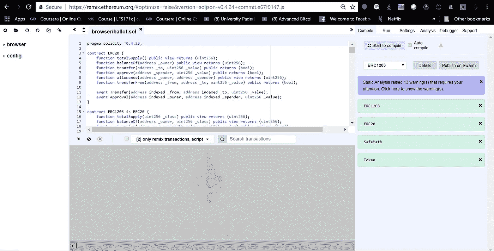
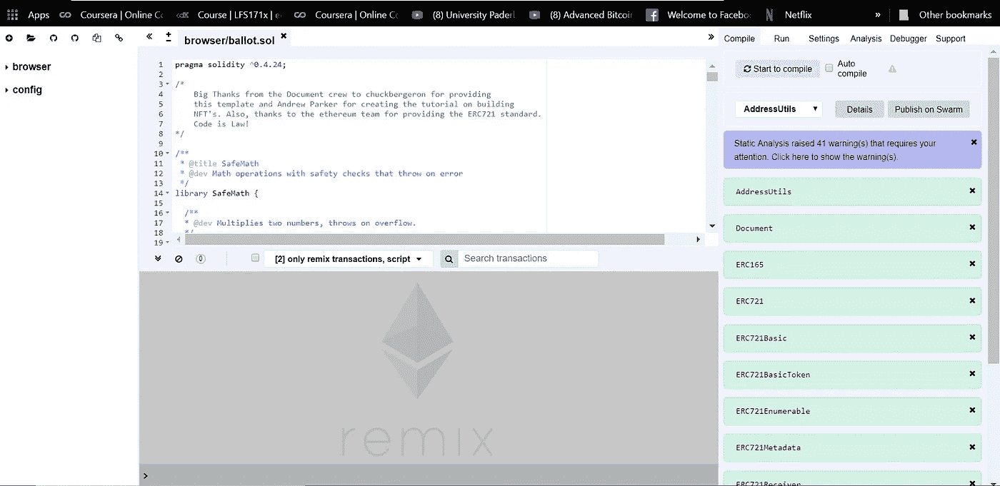
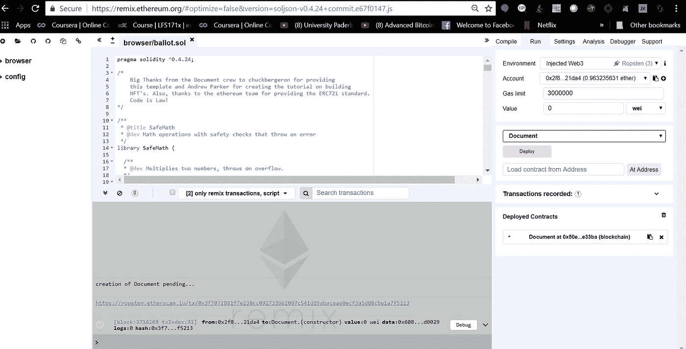

# 构建一个 ERC721 不可替换令牌智能合约，并使用元掩码通过 web 接口与其进行交互。(第一部分)

> 原文：<https://medium.com/coinmonks/building-an-erc721-non-fungible-token-smart-contract-and-using-metamask-to-interact-with-it-via-a-59583f0dd6c1?source=collection_archive---------1----------------------->


# 介绍

今天，我将通过解释如何创建一个 erc721 不可替换令牌(nft)智能合约，让您的生活稍微轻松一点。我们将使用我在我的 [GitHub](https://www.qwoyn.io/document) 上构建的例子。文档(DQMT) 是一种任何人都可以创建想法、物品/归属、诗歌和任何你内心渴望的东西的不变记录的方式。我们通过要求用户提供三条信息来实现这一点。1)类型，2)标题和 3)描述。

**Type** -当我们创建文档的概念时，我们希望确保我们有办法跟踪令牌的类型。在我们的例子中，我们选择了类型 1 和 2。类型 1 是思想和想法，类型 2 是物品/财产，但理论上你可以用任何数字来识别类型。

**标题**——这应该是不言自明的。给你的令牌一个标题。随便你怎么命名！

**描述**——这是你大放异彩的地方。在这一部分描述你的想法或项目。

> [发现并回顾最佳区块链软件](https://coincodecap.com)

# 写合同

让我们开始吧，创建合同。我有意省略了我在完整的 solidity 合同中实现的一些安全功能。如果你想看完整的合同，请参见 [Qwoyn Github](https://github.com/Qwoyn/Document/blob/master/contracts/document.sol) 。我们将使用 [Remix](https://remix.ethereum.org) 作为我们的 IDE。



Remix Solidity IDE

打开 remix 后，请清除样本投票合同并输入:

```
/**
 * [@title](http://twitter.com/title) SafeMath
 * [@dev](http://twitter.com/dev) Math operations with safety checks that throw on error
 */
library SafeMath {/**
  * [@dev](http://twitter.com/dev) Multiplies two numbers, throws on overflow.
  */
  function mul(uint256 a, uint256 b) internal pure returns (uint256 c) {
    // Gas optimization: this is cheaper than asserting 'a' not being zero, but the
    // benefit is lost if 'b' is also tested.
    // See: [https://github.com/OpenZeppelin/openzeppelin-solidity/pull/522](https://github.com/OpenZeppelin/openzeppelin-solidity/pull/522)
    if (a == 0) {
      return 0;
    }c = a * b;
    assert(c / a == b);
    return c;
  }/**
  * [@dev](http://twitter.com/dev) Integer division of two numbers, truncating the quotient.
  */
  function div(uint256 a, uint256 b) internal pure returns (uint256) {
    // assert(b > 0); // Solidity automatically throws when dividing by 0
    // uint256 c = a / b;
    // assert(a == b * c + a % b); // There is no case in which this doesn't hold
    return a / b;
  }/**
  * [@dev](http://twitter.com/dev) Subtracts two numbers, throws on overflow (i.e. if subtrahend is greater than minuend).
  */
  function sub(uint256 a, uint256 b) internal pure returns (uint256) {
    assert(b <= a);
    return a - b;
  }/**
  * [@dev](http://twitter.com/dev) Adds two numbers, throws on overflow.
  */
  function add(uint256 a, uint256 b) internal pure returns (uint256 c) {
    c = a + b;
    assert(c >= a);
    return c;
  }
}
```

添加 ERC165 接口:

```
pragma solidity ^0.4.24;/** * @title ERC165 * @dev https://github.com/ethereum/EIPs/blob/master/EIPS/eip-165.md */interface ERC165 {   /**   * @notice Query if a contract implements an interface   * @param _interfaceId The interface identifier, as specified in ERC-165   * @dev Interface identification is specified in ERC-165\. This function   * uses less than 30,000 gas.   */ function supportsInterface(bytes4 _interfaceId)    
external    
view    
returns (bool);}
```

这里我们已经定义了我们的编译器版本``pragma solidity ^0.4.24;``和 ERC165 接口。

下一个添加:

```
/** * @title ERC721 token receiver interface * @dev Interface for any contract that wants to support safeTransfers * from ERC721 asset contracts. */contract ERC721Receiver {  /**   * @dev Magic value to be returned upon successful reception of an NFT   *  Equals to `bytes4(keccak256("onERC721Received(address,address,uint256,bytes)"))`,   *  which can be also obtained as `ERC721Receiver(0).onERC721Received.selector`   */  bytes4 internal constant ERC721_RECEIVED = 0x150b7a02;   /**   * @notice Handle the receipt of an NFT   * @dev The ERC721 smart contract calls this function on the recipient   * after a `safetransfer`. This function MAY throw to revert and reject the   * transfer. Return of other than the magic value MUST result in the    * transaction being reverted.   * Note: the contract address is always the message sender.   * @param _operator The address which called `safeTransferFrom` function   * @param _from The address which previously owned the token   * @param _tokenId The NFT identifier which is being transfered   * @param _data Additional data with no specified format   * @return `bytes4(keccak256("onERC721Received(address,address,uint256,bytes)"))`   */ function onERC721Received(    
address _operator,    
address _from,    
uint256 _tokenId,    
bytes _data  )    
public    returns(bytes4);}
```

这是支持安全传输的 ERC721 令牌接口。此时，您的代码应该像这样:

```
pragma solidity ^0.4.24;/** * @title ERC165 * @dev https://github.com/ethereum/EIPs/blob/master/EIPS/eip-165.md */interface ERC165 {   /**   * @notice Query if a contract implements an interface   * @param _interfaceId The interface identifier, as specified in ERC-165   * @dev Interface identification is specified in ERC-165\. This function   * uses less than 30,000 gas.   */ function supportsInterface(bytes4 _interfaceId)    external    view    returns (bool);}/** * @title ERC721 token receiver interface * @dev Interface for any contract that wants to support safeTransfers * from ERC721 asset contracts. */contract ERC721Receiver {  /**   * @dev Magic value to be returned upon successful reception of an NFT   *  Equals to `bytes4(keccak256("onERC721Received(address,address,uint256,bytes)"))`,   *  which can be also obtained as `ERC721Receiver(0).onERC721Received.selector`   */  bytes4 internal constant ERC721_RECEIVED = 0x150b7a02;   /**   * @notice Handle the receipt of an NFT   * @dev The ERC721 smart contract calls this function on the recipient   * after a `safetransfer`. This function MAY throw to revert and reject the   * transfer. Return of other than the magic value MUST result in the    * transaction being reverted.   * Note: the contract address is always the message sender.   * @param _operator The address which called `safeTransferFrom` function   * @param _from The address which previously owned the token   * @param _tokenId The NFT identifier which is being transfered   * @param _data Additional data with no specified format   * @return `bytes4(keccak256("onERC721Received(address,address,uint256,bytes)"))`   */

function onERC721Received(    address _operator,    
address _from,    
uint256 _tokenId,    
bytes _data  
) public    returns(bytes4);}
```

我们已经初始化了接口，现在让我们添加地址工具

```
/**
 * Utility library of inline functions on addresses
 */
library AddressUtils {/**
   * Returns whether the target address is a contract
   * [@dev](http://twitter.com/dev) This function will return false if invoked during the constructor of a contract,
   * as the code is not actually created until after the constructor finishes.
   * [@param](http://twitter.com/param) addr address to check
   * [@return](http://twitter.com/return) whether the target address is a contract
   */function isContract(address addr) internal view returns (bool) {
    uint256 size;
    // XXX Currently there is no better way to check if there is a       
    // contract in an address
    // than to check the size of the code at that address.
    // See [https://ethereum.stackexchange.com/a/14016/36603](https://ethereum.stackexchange.com/a/14016/36603)
    // for more details about how this works.
    // TODO Check this again before the Serenity release, because
    // all addresses will be
    // contracts then.
    // solium-disable-next-line security/no-inline-assembly

    assembly { size := extcodesize(addr) }
    return size > 0;
  }
```

在这里，我们将添加可拥有的合同，以便我们能够转移合同的所有权。

```
contract Ownable {
  address public owner;event OwnershipRenounced(address indexed previousOwner);
  event OwnershipTransferred(
    address indexed previousOwner,
    address indexed newOwner
  );/**
   * [@dev](http://twitter.com/dev) The Ownable constructor sets the original `owner` of the contract to the sender
   * account.
   */
  constructor() public {
    owner = msg.sender;
  }/**
   * [@dev](http://twitter.com/dev) Throws if called by any account other than the owner.
   */
  modifier onlyOwner() {
    require(msg.sender == owner);
    _;
  }/**
   * [@dev](http://twitter.com/dev) Allows the current owner to relinquish control of the contract.
   * [@notice](http://twitter.com/notice) Renouncing to ownership will leave the contract without an owner.
   * It will not be possible to call the functions with the `onlyOwner`
   * modifier anymore.
   */

function renounceOwnership() public onlyOwner {
    emit OwnershipRenounced(owner);
    owner = address(0);
  }/**
   * [@dev](http://twitter.com/dev) Allows the current owner to transfer control of the contract to a newOwner.
   * [@param](http://twitter.com/param) _newOwner The address to transfer ownership to.
   */
  function transferOwnership(address _newOwner) public onlyOwner {
    _transferOwnership(_newOwner);
  }/**
   * [@dev](http://twitter.com/dev) Transfers control of the contract to a newOwner.
   * [@param](http://twitter.com/param) _newOwner The address to transfer ownership to.
   */

function _transferOwnership(address _newOwner) internal {
    require(_newOwner != address(0));
    emit OwnershipTransferred(owner, _newOwner);
    owner = _newOwner;
  }
}
```

接下来，我们将添加带有 lookup 的接口，以使用查找表实现 erc165。

```
/**
 * [@title](http://twitter.com/title) SupportsInterfaceWithLookup
 * [@author](http://twitter.com/author) Matt Condon ([@shrugs](http://twitter.com/shrugs))
 * [@dev](http://twitter.com/dev) Implements ERC165 using a lookup table.
 */
contract SupportsInterfaceWithLookup is ERC165 {
  bytes4 public constant InterfaceId_ERC165 = 0x01ffc9a7;
  /**
   * 0x01ffc9a7 ===
   *   bytes4(keccak256('supportsInterface(bytes4)'))
   *//**
   * [@dev](http://twitter.com/dev) a mapping of interface id to whether or not it's supported
   */
  mapping(bytes4 => bool) internal supportedInterfaces;/**
   * [@dev](http://twitter.com/dev) A contract implementing SupportsInterfaceWithLookup
   * implement ERC165 itself
   */
  constructor()
    public
  {
    _registerInterface(InterfaceId_ERC165);
  }/**
   * [@dev](http://twitter.com/dev) implement supportsInterface(bytes4) using a lookup table
   */
  function supportsInterface(bytes4 _interfaceId)
    external
    view
    returns (bool)
  {
    return supportedInterfaces[_interfaceId];
  }/**
   * [@dev](http://twitter.com/dev) private method for registering an interface
   */
  function _registerInterface(bytes4 _interfaceId)
    internal
  {
    require(_interfaceId != 0xffffffff);
    supportedInterfaces[_interfaceId] = true;
  }
}
```

上述合同不是必需的，但有助于我们实现我们正在寻找的功能。我们要添加的下一部分是 ERC721 标准，该接口是标准的一部分。这是它的样子，请将它添加到您的合同中。我们稍微修改了一下，但你应该能明白。欲了解更多关于该标准的信息，请访问 ERC721.ORG。

```
/**
 * [@title](http://twitter.com/title) ERC721 Non-Fungible Token Standard basic interface
 * [@dev](http://twitter.com/dev) see [https://github.com/ethereum/EIPs/blob/master/EIPS/eip-721.md](https://github.com/ethereum/EIPs/blob/master/EIPS/eip-721.md)
 */
contract ERC721Basic is ERC165 {
  event Transfer(
    address indexed _from,
    address indexed _to,
    uint256 indexed _tokenId
  );
  event Approval(
    address indexed _owner,
    address indexed _approved,
    uint256 indexed _tokenId
  );
  event ApprovalForAll(
    address indexed _owner,
    address indexed _operator,
    bool _approved
  );function balanceOf(address _owner) public view returns (uint256 _balance);
  function ownerOf(uint256 _tokenId) public view returns (address _owner);
  function exists(uint256 _tokenId) public view returns (bool _exists);function approve(address _to, uint256 _tokenId) public;
  function getApproved(uint256 _tokenId)
    public view returns (address _operator);function setApprovalForAll(address _operator, bool _approved) public;
  function isApprovedForAll(address _owner, address _operator)
    public view returns (bool);function transferFrom(address _from, address _to, uint256 _tokenId) public;
  function safeTransferFrom(address _from, address _to, uint256 _tokenId)
    public;function safeTransferFrom(
    address _from,
    address _to,
    uint256 _tokenId,
    bytes _data
  )
    public;
}/**
 * [@title](http://twitter.com/title) ERC-721 Non-Fungible Token Standard, optional enumeration extension
 * [@dev](http://twitter.com/dev) See [https://github.com/ethereum/EIPs/blob/master/EIPS/eip-721.md](https://github.com/ethereum/EIPs/blob/master/EIPS/eip-721.md)
 */
contract ERC721Enumerable is ERC721Basic {
  function totalSupply() public view returns (uint256);
  function tokenOfOwnerByIndex(
    address _owner,
    uint256 _index
  )
    public
    view
    returns (uint256 _tokenId);function tokenByIndex(uint256 _index) public view returns (uint256);
}/**
 * [@title](http://twitter.com/title) ERC-721 Non-Fungible Token Standard, optional metadata extension
 * [@dev](http://twitter.com/dev) See [https://github.com/ethereum/EIPs/blob/master/EIPS/eip-721.md](https://github.com/ethereum/EIPs/blob/master/EIPS/eip-721.md)
 */
contract ERC721Metadata is ERC721Basic {
  function name() external view returns (string _name);
  function symbol() external view returns (string _symbol);
  function tokenURI(uint256 _tokenId) public view returns (string);
}/**
 * [@title](http://twitter.com/title) ERC-721 Non-Fungible Token Standard, full implementation interface
 * [@dev](http://twitter.com/dev) See [https://github.com/ethereum/EIPs/blob/master/EIPS/eip-721.md](https://github.com/ethereum/EIPs/blob/master/EIPS/eip-721.md)
 */
contract ERC721 is ERC721Basic, ERC721Enumerable, ERC721Metadata {
}/**
 * [@title](http://twitter.com/title) ERC721 Non-Fungible Token Standard basic implementation
 * [@dev](http://twitter.com/dev) see [https://github.com/ethereum/EIPs/blob/master/EIPS/eip-721.md](https://github.com/ethereum/EIPs/blob/master/EIPS/eip-721.md)
 */
contract ERC721BasicToken is SupportsInterfaceWithLookup, ERC721Basic {bytes4 private constant InterfaceId_ERC721 = 0x80ac58cd;
  /*
   * 0x80ac58cd ===
   *   bytes4(keccak256('balanceOf(address)')) ^
   *   bytes4(keccak256('ownerOf(uint256)')) ^
   *   bytes4(keccak256('approve(address,uint256)')) ^
   *   bytes4(keccak256('getApproved(uint256)')) ^
   *   bytes4(keccak256('setApprovalForAll(address,bool)')) ^
   *   bytes4(keccak256('isApprovedForAll(address,address)')) ^
   *   bytes4(keccak256('transferFrom(address,address,uint256)')) ^
   *   bytes4(keccak256('safeTransferFrom(address,address,uint256)')) ^
   *   bytes4(keccak256('safeTransferFrom(address,address,uint256,bytes)'))
   */bytes4 private constant InterfaceId_ERC721Exists = 0x4f558e79;
  /*
   * 0x4f558e79 ===
   *   bytes4(keccak256('exists(uint256)'))
   */using SafeMath for uint256;
  using AddressUtils for address;// Equals to `bytes4(keccak256("onERC721Received(address,address,uint256,bytes)"))`
  // which can be also obtained as `ERC721Receiver(0).onERC721Received.selector`
  bytes4 private constant ERC721_RECEIVED = 0x150b7a02;// Mapping from token ID to owner
  mapping (uint256 => address) internal tokenOwner;// Mapping from token ID to approved address
  mapping (uint256 => address) internal tokenApprovals;// Mapping from owner to number of owned token
  mapping (address => uint256) internal ownedTokensCount;// Mapping from owner to operator approvals
  mapping (address => mapping (address => bool)) internal operatorApprovals;/**
   * [@dev](http://twitter.com/dev) Guarantees msg.sender is owner of the given token
   * [@param](http://twitter.com/param) _tokenId uint256 ID of the token to validate its ownership belongs to msg.sender
   */
  modifier onlyOwnerOf(uint256 _tokenId) {
    require(ownerOf(_tokenId) == msg.sender);
    _;
  }/**
   * [@dev](http://twitter.com/dev) Checks msg.sender can transfer a token, by being owner, approved, or operator
   * [@param](http://twitter.com/param) _tokenId uint256 ID of the token to validate
   */
  modifier canTransfer(uint256 _tokenId) {
    require(isApprovedOrOwner(msg.sender, _tokenId));
    _;
  }constructor()
    public
  {
    // register the supported interfaces to conform to ERC721 via ERC165
    _registerInterface(InterfaceId_ERC721);
    _registerInterface(InterfaceId_ERC721Exists);
  }/**
   * [@dev](http://twitter.com/dev) Gets the balance of the specified address
   * [@param](http://twitter.com/param) _owner address to query the balance of
   * [@return](http://twitter.com/return) uint256 representing the amount owned by the passed address
   */
  function balanceOf(address _owner) public view returns (uint256) {
    require(_owner != address(0));
    return ownedTokensCount[_owner];
  }/**
   * [@dev](http://twitter.com/dev) Gets the owner of the specified token ID
   * [@param](http://twitter.com/param) _tokenId uint256 ID of the token to query the owner of
   * [@return](http://twitter.com/return) owner address currently marked as the owner of the given token ID
   */
  function ownerOf(uint256 _tokenId) public view returns (address) {
    address owner = tokenOwner[_tokenId];
    require(owner != address(0));
    return owner;
  }/**
   * [@dev](http://twitter.com/dev) Returns whether the specified token exists
   * [@param](http://twitter.com/param) _tokenId uint256 ID of the token to query the existence of
   * [@return](http://twitter.com/return) whether the token exists
   */
  function exists(uint256 _tokenId) public view returns (bool) {
    address owner = tokenOwner[_tokenId];
    return owner != address(0);
  }/**
   * [@dev](http://twitter.com/dev) Approves another address to transfer the given token ID
   * The zero address indicates there is no approved address.
   * There can only be one approved address per token at a given time.
   * Can only be called by the token owner or an approved operator.
   * [@param](http://twitter.com/param) _to address to be approved for the given token ID
   * [@param](http://twitter.com/param) _tokenId uint256 ID of the token to be approved
   */
  function approve(address _to, uint256 _tokenId) public {
    address owner = ownerOf(_tokenId);
    require(_to != owner);
    require(msg.sender == owner || isApprovedForAll(owner, msg.sender));tokenApprovals[_tokenId] = _to;
    emit Approval(owner, _to, _tokenId);
  }/**
   * [@dev](http://twitter.com/dev) Gets the approved address for a token ID, or zero if no address set
   * [@param](http://twitter.com/param) _tokenId uint256 ID of the token to query the approval of
   * [@return](http://twitter.com/return) address currently approved for the given token ID
   */
  function getApproved(uint256 _tokenId) public view returns (address) {
    return tokenApprovals[_tokenId];
  }/**
   * [@dev](http://twitter.com/dev) Sets or unsets the approval of a given operator
   * An operator is allowed to transfer all tokens of the sender on their behalf
   * [@param](http://twitter.com/param) _to operator address to set the approval
   * [@param](http://twitter.com/param) _approved representing the status of the approval to be set
   */
  function setApprovalForAll(address _to, bool _approved) public {
    require(_to != msg.sender);
    operatorApprovals[msg.sender][_to] = _approved;
    emit ApprovalForAll(msg.sender, _to, _approved);
  }/**
   * [@dev](http://twitter.com/dev) Tells whether an operator is approved by a given owner
   * [@param](http://twitter.com/param) _owner owner address which you want to query the approval of
   * [@param](http://twitter.com/param) _operator operator address which you want to query the approval of
   * [@return](http://twitter.com/return) bool whether the given operator is approved by the given owner
   */
  function isApprovedForAll(
    address _owner,
    address _operator
  )
    public
    view
    returns (bool)
  {
    return operatorApprovals[_owner][_operator];
  }/**
   * [@dev](http://twitter.com/dev) Transfers the ownership of a given token ID to another address
   * Usage of this method is discouraged, use `safeTransferFrom` whenever possible
   * Requires the msg sender to be the owner, approved, or operator
   * [@param](http://twitter.com/param) _from current owner of the token
   * [@param](http://twitter.com/param) _to address to receive the ownership of the given token ID
   * [@param](http://twitter.com/param) _tokenId uint256 ID of the token to be transferred
  */
  function transferFrom(
    address _from,
    address _to,
    uint256 _tokenId
  )
    public
    canTransfer(_tokenId)
  {
    require(_from != address(0));
    require(_to != address(0));clearApproval(_from, _tokenId);
    removeTokenFrom(_from, _tokenId);
    addTokenTo(_to, _tokenId);emit Transfer(_from, _to, _tokenId);
  }/**
   * [@dev](http://twitter.com/dev) Safely transfers the ownership of a given token ID to another address
   * If the target address is a contract, it must implement `onERC721Received`,
   * which is called upon a safe transfer, and return the magic value
   * `bytes4(keccak256("onERC721Received(address,address,uint256,bytes)"))`; otherwise,
   * the transfer is reverted.
   *
   * Requires the msg sender to be the owner, approved, or operator
   * [@param](http://twitter.com/param) _from current owner of the token
   * [@param](http://twitter.com/param) _to address to receive the ownership of the given token ID
   * [@param](http://twitter.com/param) _tokenId uint256 ID of the token to be transferred
  */
  function safeTransferFrom(
    address _from,
    address _to,
    uint256 _tokenId
  )
    public
    canTransfer(_tokenId)
  {
    // solium-disable-next-line arg-overflow
    safeTransferFrom(_from, _to, _tokenId, "");
  }/**
   * [@dev](http://twitter.com/dev) Safely transfers the ownership of a given token ID to another address
   * If the target address is a contract, it must implement `onERC721Received`,
   * which is called upon a safe transfer, and return the magic value
   * `bytes4(keccak256("onERC721Received(address,address,uint256,bytes)"))`; otherwise,
   * the transfer is reverted.
   * Requires the msg sender to be the owner, approved, or operator
   * [@param](http://twitter.com/param) _from current owner of the token
   * [@param](http://twitter.com/param) _to address to receive the ownership of the given token ID
   * [@param](http://twitter.com/param) _tokenId uint256 ID of the token to be transferred
   * [@param](http://twitter.com/param) _data bytes data to send along with a safe transfer check
   */
  function safeTransferFrom(
    address _from,
    address _to,
    uint256 _tokenId,
    bytes _data
  )
    public
    canTransfer(_tokenId)
  {
    transferFrom(_from, _to, _tokenId);
    // solium-disable-next-line arg-overflow
    require(checkAndCallSafeTransfer(_from, _to, _tokenId, _data));
  }/**
   * [@dev](http://twitter.com/dev) Returns whether the given spender can transfer a given token ID
   * [@param](http://twitter.com/param) _spender address of the spender to query
   * [@param](http://twitter.com/param) _tokenId uint256 ID of the token to be transferred
   * [@return](http://twitter.com/return) bool whether the msg.sender is approved for the given token ID,
   *  is an operator of the owner, or is the owner of the token
   */
  function isApprovedOrOwner(
    address _spender,
    uint256 _tokenId
  )
    internal
    view
    returns (bool)
  {
    address owner = ownerOf(_tokenId);
    // Disable solium check because of
    // [https://github.com/duaraghav8/Solium/issues/175](https://github.com/duaraghav8/Solium/issues/175)
    // solium-disable-next-line operator-whitespace
    return (
      _spender == owner ||
      getApproved(_tokenId) == _spender ||
      isApprovedForAll(owner, _spender)
    );
  }/**
   * [@dev](http://twitter.com/dev) Internal function to mint a new token
   * Reverts if the given token ID already exists
   * [@param](http://twitter.com/param) _to The address that will own the minted token
   * [@param](http://twitter.com/param) _tokenId uint256 ID of the token to be minted by the msg.sender
   */
  function _mint(address _to, uint256 _tokenId) internal {
    require(_to != address(0));
    addTokenTo(_to, _tokenId);
    emit Transfer(address(0), _to, _tokenId);
  }/**
   * [@dev](http://twitter.com/dev) Internal function to burn a specific token
   * Reverts if the token does not exist
   * [@param](http://twitter.com/param) _tokenId uint256 ID of the token being burned by the msg.sender
   */
  function _burn(address _owner, uint256 _tokenId) internal {
    clearApproval(_owner, _tokenId);
    removeTokenFrom(_owner, _tokenId);
    emit Transfer(_owner, address(0), _tokenId);
  }/**
   * [@dev](http://twitter.com/dev) Internal function to clear current approval of a given token ID
   * Reverts if the given address is not indeed the owner of the token
   * [@param](http://twitter.com/param) _owner owner of the token
   * [@param](http://twitter.com/param) _tokenId uint256 ID of the token to be transferred
   */
  function clearApproval(address _owner, uint256 _tokenId) internal {
    require(ownerOf(_tokenId) == _owner);
    if (tokenApprovals[_tokenId] != address(0)) {
      tokenApprovals[_tokenId] = address(0);
    }
  }/**
   * [@dev](http://twitter.com/dev) Internal function to add a token ID to the list of a given address
   * [@param](http://twitter.com/param) _to address representing the new owner of the given token ID
   * [@param](http://twitter.com/param) _tokenId uint256 ID of the token to be added to the tokens list of the given address
   */
  function addTokenTo(address _to, uint256 _tokenId) internal {
    require(tokenOwner[_tokenId] == address(0));
    tokenOwner[_tokenId] = _to;
    ownedTokensCount[_to] = ownedTokensCount[_to].add(1);
  }/**
   * [@dev](http://twitter.com/dev) Internal function to remove a token ID from the list of a given address
   * [@param](http://twitter.com/param) _from address representing the previous owner of the given token ID
   * [@param](http://twitter.com/param) _tokenId uint256 ID of the token to be removed from the tokens list of the given address
   */
  function removeTokenFrom(address _from, uint256 _tokenId) internal {
    require(ownerOf(_tokenId) == _from);
    ownedTokensCount[_from] = ownedTokensCount[_from].sub(1);
    tokenOwner[_tokenId] = address(0);
  }/**
   * [@dev](http://twitter.com/dev) Internal function to invoke `onERC721Received` on a target address
   * The call is not executed if the target address is not a contract
   * [@param](http://twitter.com/param) _from address representing the previous owner of the given token ID
   * [@param](http://twitter.com/param) _to target address that will receive the tokens
   * [@param](http://twitter.com/param) _tokenId uint256 ID of the token to be transferred
   * [@param](http://twitter.com/param) _data bytes optional data to send along with the call
   * [@return](http://twitter.com/return) whether the call correctly returned the expected magic value
   */
  function checkAndCallSafeTransfer(
    address _from,
    address _to,
    uint256 _tokenId,
    bytes _data
  )
    internal
    returns (bool)
  {
    if (!_to.isContract()) {
      return true;
    }
    bytes4 retval = ERC721Receiver(_to).onERC721Received(
      msg.sender, _from, _tokenId, _data);
    return (retval == ERC721_RECEIVED);
  }
}/**
 * [@title](http://twitter.com/title) Full ERC721 Token
 * This implementation includes all the required and some optional functionality of the ERC721 standard
 * Moreover, it includes approve all functionality using operator terminology
 * [@dev](http://twitter.com/dev) see [https://github.com/ethereum/EIPs/blob/master/EIPS/eip-721.md](https://github.com/ethereum/EIPs/blob/master/EIPS/eip-721.md)
 */
contract ERC721Token is SupportsInterfaceWithLookup, ERC721BasicToken, ERC721 {bytes4 private constant InterfaceId_ERC721Enumerable = 0x780e9d63;
  /**
   * 0x780e9d63 ===
   *   bytes4(keccak256('totalSupply()')) ^
   *   bytes4(keccak256('tokenOfOwnerByIndex(address,uint256)')) ^
   *   bytes4(keccak256('tokenByIndex(uint256)'))
   */bytes4 private constant InterfaceId_ERC721Metadata = 0x5b5e139f;
  /**
   * 0x5b5e139f ===
   *   bytes4(keccak256('name()')) ^
   *   bytes4(keccak256('symbol()')) ^
   *   bytes4(keccak256('tokenURI(uint256)'))
   */// Token name
  string internal name_;// Token symbol
  string internal symbol_;// Mapping from owner to list of owned token IDs
  mapping(address => uint256[]) internal ownedTokens;// Mapping from token ID to index of the owner tokens list
  mapping(uint256 => uint256) internal ownedTokensIndex;// Array with all token ids, used for enumeration
  uint256[] internal allTokens;// Mapping from token id to position in the allTokens array
  mapping(uint256 => uint256) internal allTokensIndex;// Optional mapping for token URIs
  mapping(uint256 => string) internal tokenURIs;/**
   * [@dev](http://twitter.com/dev) Constructor function
   */
  constructor(string _name, string _symbol) public {
    name_ = _name;
    symbol_ = _symbol;// register the supported interfaces to conform to ERC721 via ERC165
    _registerInterface(InterfaceId_ERC721Enumerable);
    _registerInterface(InterfaceId_ERC721Metadata);
  }/**
   * [@dev](http://twitter.com/dev) Gets the token name
   * [@return](http://twitter.com/return) string representing the token name
   */
  function name() external view returns (string) {
    return name_;
  }/**
   * [@dev](http://twitter.com/dev) Gets the token symbol
   * [@return](http://twitter.com/return) string representing the token symbol
   */
  function symbol() external view returns (string) {
    return symbol_;
  }/**
   * [@dev](http://twitter.com/dev) Returns an URI for a given token ID
   * Throws if the token ID does not exist. May return an empty string.
   * [@param](http://twitter.com/param) _tokenId uint256 ID of the token to query
   */
  function tokenURI(uint256 _tokenId) public view returns (string) {
    require(exists(_tokenId));
    return tokenURIs[_tokenId];
  }/**
   * [@dev](http://twitter.com/dev) Gets the token ID at a given index of the tokens list of the requested owner
   * [@param](http://twitter.com/param) _owner address owning the tokens list to be accessed
   * [@param](http://twitter.com/param) _index uint256 representing the index to be accessed of the requested tokens list
   * [@return](http://twitter.com/return) uint256 token ID at the given index of the tokens list owned by the requested address
   */
  function tokenOfOwnerByIndex(
    address _owner,
    uint256 _index
  )
    public
    view
    returns (uint256)
  {
    require(_index < balanceOf(_owner));
    return ownedTokens[_owner][_index];
  }/**
   * [@dev](http://twitter.com/dev) Gets the total amount of tokens stored by the contract
   * [@return](http://twitter.com/return) uint256 representing the total amount of tokens
   */
  function totalSupply() public view returns (uint256) {
    return allTokens.length;
  }/**
   * [@dev](http://twitter.com/dev) Gets the token ID at a given index of all the tokens in this contract
   * Reverts if the index is greater or equal to the total number of tokens
   * [@param](http://twitter.com/param) _index uint256 representing the index to be accessed of the tokens list
   * [@return](http://twitter.com/return) uint256 token ID at the given index of the tokens list
   */
  function tokenByIndex(uint256 _index) public view returns (uint256) {
    require(_index < totalSupply());
    return allTokens[_index];
  }/**
   * [@dev](http://twitter.com/dev) Internal function to set the token URI for a given token
   * Reverts if the token ID does not exist
   * [@param](http://twitter.com/param) _tokenId uint256 ID of the token to set its URI
   * [@param](http://twitter.com/param) _uri string URI to assign
   */
  function _setTokenURI(uint256 _tokenId, string _uri) internal {
    require(exists(_tokenId));
    tokenURIs[_tokenId] = _uri;
  }/**
   * [@dev](http://twitter.com/dev) Internal function to add a token ID to the list of a given address
   * [@param](http://twitter.com/param) _to address representing the new owner of the given token ID
   * [@param](http://twitter.com/param) _tokenId uint256 ID of the token to be added to the tokens list of the given address
   */
  function addTokenTo(address _to, uint256 _tokenId) internal {
    super.addTokenTo(_to, _tokenId);
    uint256 length = ownedTokens[_to].length;
    ownedTokens[_to].push(_tokenId);
    ownedTokensIndex[_tokenId] = length;
  }/**
   * [@dev](http://twitter.com/dev) Internal function to remove a token ID from the list of a given address
   * [@param](http://twitter.com/param) _from address representing the previous owner of the given token ID
   * [@param](http://twitter.com/param) _tokenId uint256 ID of the token to be removed from the tokens list of the given address
   */
  function removeTokenFrom(address _from, uint256 _tokenId) internal {
    super.removeTokenFrom(_from, _tokenId);uint256 tokenIndex = ownedTokensIndex[_tokenId];
    uint256 lastTokenIndex = ownedTokens[_from].length.sub(1);
    uint256 lastToken = ownedTokens[_from][lastTokenIndex];ownedTokens[_from][tokenIndex] = lastToken;
    ownedTokens[_from][lastTokenIndex] = 0;
    // Note that this will handle single-element arrays. In that case, both tokenIndex and lastTokenIndex are going to
    // be zero. Then we can make sure that we will remove _tokenId from the ownedTokens list since we are first swapping
    // the lastToken to the first position, and then dropping the element placed in the last position of the listownedTokens[_from].length--;
    ownedTokensIndex[_tokenId] = 0;
    ownedTokensIndex[lastToken] = tokenIndex;
  }/**
   * [@dev](http://twitter.com/dev) Internal function to mint a new token
   * Reverts if the given token ID already exists
   * [@param](http://twitter.com/param) _to address the beneficiary that will own the minted token
   * [@param](http://twitter.com/param) _tokenId uint256 ID of the token to be minted by the msg.sender
   */
  function _mint(address _to, uint256 _tokenId) internal {
    super._mint(_to, _tokenId);allTokensIndex[_tokenId] = allTokens.length;
    allTokens.push(_tokenId);
  }/**
   * [@dev](http://twitter.com/dev) Internal function to burn a specific token
   * Reverts if the token does not exist
   * [@param](http://twitter.com/param) _owner owner of the token to burn
   * [@param](http://twitter.com/param) _tokenId uint256 ID of the token being burned by the msg.sender
   */
  function _burn(address _owner, uint256 _tokenId) internal {
    super._burn(_owner, _tokenId);// Clear metadata (if any)
    if (bytes(tokenURIs[_tokenId]).length != 0) {
      delete tokenURIs[_tokenId];
    }// Reorg all tokens array
    uint256 tokenIndex = allTokensIndex[_tokenId];
    uint256 lastTokenIndex = allTokens.length.sub(1);
    uint256 lastToken = allTokens[lastTokenIndex];allTokens[tokenIndex] = lastToken;
    allTokens[lastTokenIndex] = 0;allTokens.length--;
    allTokensIndex[_tokenId] = 0;
    allTokensIndex[lastToken] = tokenIndex;
  }}
```

在这一点上，我们有一个主要工作的智能契约，但我们想创建一个令牌，所以让我们添加令牌标准并定义一些变量。这是合同中你修改最多的部分。上述合同是标准的，但在涉及到安全性时，您可能需要考虑其中的一对。查看 [Open-Zeppelin GitHub](https://github.com/OpenZeppelin/openzeppelin-solidity/tree/master/contracts) 获取更多合同示例。

现在将令牌契约添加到您的代码中，我们就完成了！

```
contract Document is ERC721Token, Ownable {/*** EVENTS ***/
  /// The event emitted (useable by web3) when a token is purchased
  event BoughtToken(address indexed buyer, uint256 tokenId);/*** CONSTANTS ***/
  uint8 constant TITLE_MIN_LENGTH = 1;
  uint8 constant TITLE_MAX_LENGTH = 64;
  uint256 constant DESCRIPTION_MIN_LENGTH = 1;
  uint256 constant DESCRIPTION_MAX_LENGTH = 10000;/*** DATA TYPES ***//// Price set by contract owner for each token in Wei.
/// [@dev](http://twitter.com/dev) If you'd like a different price for each token type, you
/// will need to use a mapping like: `mapping(uint256 => uint256)
/// tokenTypePrices;` uint256 currentPrice = 3000000000000000;/// The token type (1 for idea, 2 for belonging, etc)
  mapping(uint256 => uint256) tokenTypes;/// The title of the token
  mapping(uint256 => string) tokenTitles;

/// The description of the token
  mapping(uint256 => string) tokenDescription;constructor() ERC721Token("Document", "DQMT") public {
    // any init code when you deploy the contract would run here
  }/// Requires the amount of Ether be at least or more of the
/// currentPrice
/// [@dev](http://twitter.com/dev) Creates an instance of an token and mints it to the
/// purchaser
/// [@param](http://twitter.com/param) _type The token type as an integer
/// [@param](http://twitter.com/param) _title The short title of the token
/// [@param](http://twitter.com/param) _description Description of the tokenfunction buyToken (
    uint256 _type,
    string _title,
 string _description
  ) external payable {
    bytes memory _titleBytes = bytes(_title);
    require(_titleBytes.length >= TITLE_MIN_LENGTH, "Title is too short");
    require(_titleBytes.length <= TITLE_MAX_LENGTH, "Title is too long");

 bytes memory _descriptionBytes = bytes(_description);
    require(_descriptionBytes.length >= DESCRIPTION_MIN_LENGTH, "Description is too short");
    require(_descriptionBytes.length <= DESCRIPTION_MAX_LENGTH, "Description is too long");
    require(msg.value >= currentPrice, "Amount of Ether sent too small");uint256 index = allTokens.length + 1;_mint(msg.sender, index);tokenTypes[index] = _type;
    tokenTitles[index] = _title;
 tokenDescription[index] = _description;emit BoughtToken(msg.sender, index);
  } /**
   * [@dev](http://twitter.com/dev) Returns all of the tokens that the user owns
   * [@return](http://twitter.com/return) An array of token indices
   */

function myTokens()
    external
    view
    returns (
      uint256[]
    )
  {
    return ownedTokens[msg.sender];
  }/// [@notice](http://twitter.com/notice) Returns all the relevant information about a specific /// token
/// [@param](http://twitter.com/param) _tokenId The ID of the token of interest function viewToken(uint256 _tokenId)
    external
    view
    returns (
      uint256 tokenType_,
      string tokenTitle_,
   string tokenDescription_
  ) {
      tokenType_ = tokenTypes[_tokenId];
      tokenTitle_ = tokenTitles[_tokenId];
   tokenDescription_ = tokenDescription[_tokenId];
  }/// [@notice](http://twitter.com/notice) Allows the owner of this contract to set the
/// currentPrice for each token
  function setCurrentPrice(uint256 newPrice)
    public
    onlyOwner
  {
      currentPrice = newPrice;
  }/// [@notice](http://twitter.com/notice) Returns the currentPrice for each token
  function getCurrentPrice()
    external
    view
    returns (
    uint256 price
  ) {
      price = currentPrice;
  }
/// [@notice](http://twitter.com/notice) allows the owner of this contract to destroy the ///contract
   function kill() public {
   if(msg.sender == owner) selfdestruct(owner);
   }}
```

让我们更深入地了解一下代币合同。在这一部分

```
/*** CONSTANTS ***/
  uint8 constant TITLE_MIN_LENGTH = 1;
  uint8 constant TITLE_MAX_LENGTH = 64;
  uint256 constant DESCRIPTION_MIN_LENGTH = 1;
  uint256 constant DESCRIPTION_MAX_LENGTH = 10000;
```

为了防止溢出，我们决定将标题和描述长度的最大值和最小值硬编码为常量。我感觉这是一个非常重要的功能，强烈推荐。

# 编译智能合同

在这一点上，你可以继续下去，并在 remix 编译合同。



Compile your contract

如果一切顺利，所有的合同都将获得批准。此时，单击“run ”,让我们部署我们的智能合同！

在下拉菜单中选择合同命名文档，然后单击部署。



Deploy your contract

等待确认，如果成功，您将在控制台中收到一条成功消息。您的合同现已部署！请注意，我们已经部署到 Ropsten testnet，还没有执行任何测试。

如果你能走到这一步，恭喜你！你现在是一个重要的少数民族的一部分。在第二部分中，我们将开发一个简单的前端，通过 web 界面与我们的合同进行交互。

——丹尼尔·皮特曼，首席执行官

我们的开发人员自愿贡献他们的时间，但也乐于接受捐赠:

ETC:0x 007 e 60 c 669 cf 96 DC 32655 D1 EB 1c 1 ebcf 96459975

BTC:15 x8 rjv 7 eatts C6 bhrffuqh 28 lzpqz 9 TDI

密件抄送:1 krwr 96 hbcrlavaawkxz 2 oy 2f 51 ryohme 1

ETH:0x 00c 24 b 3346 AFC 5c 3710 AFB 27 c 86431 ebb 5 ce 8163

查看第二部分 …