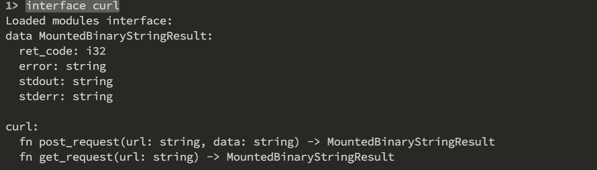

# 用 Fluence 构建以太指数价格聚合器

> 原文：<https://medium.com/coinmonks/building-an-ether-dex-price-aggregator-with-fluence-65fb0e31a802?source=collection_archive---------0----------------------->

## 分散式应用程序开发教程


自从我的上一篇帖子以来已经过去了很长时间，因为最近的工作量非常大，但现在事情正在恢复正常，所以我想重新开始我的博客活动，围绕我最近工作的一个非常有趣的技术栈发布一篇教程博客。

在 [Hack The System](https://www.encode.club/hack-the-system) hackathon 的背景下，一个中等难度的公开挑战是使用 Fluence stack 构建以太价格发现服务。事实上，这个挑战似乎很容易，因为所需的大部分部件已经在 Fluence 的一个研讨会上实现并展示了。因此，我主动将此提升一个档次，从 DEX(分散式交易所)实现以太价格聚合器，而不仅仅是获取以太价格。

假设这对于你来说是一项新技术(就像我在黑客马拉松时一样)，我在下面写了几个常见问题来涵盖一些基本的背景知识。

# 什么是 Fluence？

Fluence(Fluence Labs)是一个**的开放应用平台。**为了更好地理解这个术语，让我们首先澄清什么是开放平台。

> 通俗地说，开放平台就是一个软件系统，它是基于一些已发布/文档化的编程接口/标准来实现开放的外部开发。

也就是说，允许外部各方在上述平台之上构建。回到最初的术语，开放应用程序平台允许开放开发符合平台规定的标准的应用程序。

> 这种平台的一个例子是 Heroku。它支持在平台上部署一个应用程序(假设它是用一个受支持的框架构建的),然后每个人都可以访问它。

然而，在 Fluence 的情况下，有一些特征使它在其他应用程序平台中脱颖而出。直接引自官方[流量页面](https://fluence.network/)的是:

1.  **分散化:**充满信心地构建，因为访问不会被禁用，集成不会被破坏。
2.  **可组合**:重用代码和数据，在现有应用程序的基础上构建新功能。
3.  **加速**:通过抽象复杂的后端，从根本上加快进入市场的速度。
4.  **奖励:**应用程序和低级组件将根据其使用情况进行货币化。打造流行元素，赚。

我承认前两个特征(去中心化的、可组合的)吸引了我，假设剩下的是可以实现的**当且仅当**前两个都到位了。为了保持这篇文章的简洁，读者可以在他们的官方[宣言](https://fluence.network/manifesto.html)中找到关于为什么这些属性是未来应用程序开发的关键元素的更全面的观点。

# 积分通量堆栈由什么组成？

Fluence 堆栈由四个基本层组成:**执行、组合、拓扑和安全&记账。**下表总结了每一层的技术。


Source: [https://github.com/fluencelabs/fldist](https://github.com/fluencelabs/fldist) — Due to rapid development of the Fluence stack, keep in mind that figure is a slightly outdated.

除了这些层，Fluence Labs 还开发了支持工具，如 docker local nodes/ [开发环境](https://github.com/fluencelabs/devcontainer)，一个[交互式 repl](https://crates.io/crates/mrepl) 和 [Fluence-Distributor](https://www.npmjs.com/package/@fluencelabs/fldist) 来支持 Fluence 开发。

> 注: **FCE** 已更名为**海洋。**

然而不幸的是，在写这篇文章的时候，最后一层**持久化&会计**还在开发中，因此这篇教程实际上只包含了前三层。

# 什么是粒子？

直观上，Fluence 堆栈非常类似于微服务架构，其中每个服务都有一个单独的职责，并且没有任何外部依赖性。这也被称为[无共享架构](https://en.wikipedia.org/wiki/Shared-nothing_architecture)。

为了提炼粒子的意义，我们需要理解分布式系统中的通信。嗯，通常一堆微服务通过一个协议相互通信。无论是 HTTP、gRPC 还是其他，在链式交互的情况下，每个服务都要按顺序执行交互，以实现其最初的目的。**在 Fluence stack 中，这是使用海蓝宝石中间表示法(AIR)从服务中抽象出来的。从这个意义上说，Fluence stack 允许您通过 AIR 脚本对服务交互进行编程(编排)!*这是极其重要的一点。花点时间消化这个吧！***

为了更清楚，让我们看一个例子，并将其与传统的分布式微服务架构进行比较。

**考虑一个现代电子商店应用的场景**

在构建电子商店系统的过程中，可以设计 4 种微服务，它们相互作用以实现所需的功能。这些是:

*   **用户服务:**管理用户账户。
*   **库存服务:**管理产品的库存(可用数量等)
*   **订单服务:**管理客户订单。
*   **运输服务:**管理任何与运输有关的事情。(计划、跟踪等)

当用户下订单时，客户端通过一个协议(通常是 HTTP)与**订单服务**交互以下订单。作为回报，订单服务与**用户服务**一起检查用户是否确实被认证，然后与**库存服务**一起检查以确保商品的可用性并从产品的可用数量中扣除数量，最后它指示**运输服务**安排运输并通知客户。注意，在整个通信链中，所有这些服务的业务逻辑负责响应**订单服务。**

正如你所看到的，有一系列的事件发生，这是由每个服务单独决定的。如果将来我想让**库存服务**(而不是**订单服务**)直接与**运输服务**交互，那么我必须修改**库存**和**订单**服务。

现在，让我们想象在 Fluence 堆栈上构建相同的场景。在这种情况下，客户端将利用一个 AIR 脚本(顺便说一下，在这个脚本中，您可以控制身份验证)，该脚本编排了一个网络请求，该请求指示 ping 什么服务、以什么顺序、调用什么函数以及在哪里返回结果！**考虑到上面描述的变化，只需要对 AIR 脚本进行微小的修改就可以实现了！**

回到最初的问题，这个被编程的网络请求被称为**粒子**。更技术性的定义是包含(应用)数据+脚本+元数据的无冲突复制数据结构，并在 Aqua VM 上评估和执行，Aqua VM 本身是运行在 Marine 上的 Wasm 模块。

值得一提的是，FluenceLabs 也一直在开发 Aqua，这是一种编译低级 AIR 的高级编程语言。

# Ether DEX 价格汇总教程

这篇文章的其余部分将带您了解应用程序的开发过程。这包括执行*卷曲*请求的简单流量服务和有角度的 11 前端。


Screenshot of the application

该项目的完整代码在**博客【https://github.com/apogiatzis/fluence-ether-dex-price】分支[的](https://github.com/apogiatzis/fluence-ether-dex-price)**中提供

为了使文章简洁明了，我将只引用代码的重要部分，因此鼓励您在阅读时参考 GitHub [库](https://github.com/apogiatzis/fluence-ether-dex-price)以更好地理解代码。

## 要求

首先，让我们定义我们的 DEX 价格聚合器的范围。应该有一个接受以下输入的用户界面:

1.  代币报价器(戴、、任等)
2.  **动作**(买入或卖出)

在价格查询时，前端必须向 Fluence 服务发送一个粒子，该服务基于所选择的令牌和动作来查询以太指数价格。AirSwap [在这里](https://ethereum-dex-prices-service.production.airswap.io/)提供了一个已经制作好的 HTTP API，用于在各种指数之间聚集以太网价格。因此，不重新发明轮子，直接使用轮子是有意义的。请注意，在 Fluence 服务中查询交换而不是使用 API 是完全可行的(也更具挑战性)。

最后，Fluence 服务的结果需要通过表格直观地显示给用户。

## 发展

在开始开发应用程序之前，必须正确设置环境。最初，确保 [Docker](https://www.docker.com/) 、 [NodeJS](https://nodejs.org/en/) (至少 v14)和 [Rust](https://www.rust-lang.org/) 安装在您的系统上。然后需要下载*船用编译器*和*船用 REPL* 来辅助开发。为此，您可以使用 Rust 的板条箱管理器`cargo`:

*   `cargo install mrepl`
*   `cargo install marine`

FluenceLabs 也提供了一个已经设置好的开发 docker 容器[在这里](https://github.com/fluencelabs/devcontainer)，但是我鼓励你继续设置环境，以便更好地理解 Fluence 的工具。

有了以上这些，你就可以开始编程了！


下图所示的文件夹结构是自以为是的，但我觉得这种结构有助于保持东西的组织性。对于其他 Fluence 项目，请随意采用不同的结构，但我建议遵循这一条。

```
- project_name
|--- ng-app                 # Angular application root folder
|      |--- ....
|
|--- services               # Fluence services
|      |--- curl            # curl Fluence service root folder
|      |--- ....            # other services...
|
|--- artifacts
|      |--- *.wasm          # Build wasm moduel
|
|--- app-<env>.config.json  # environment Fluence app config
|--- repl.toml              # Marine REPL config
|--- package.json           # defines root dependencies and scripts
|--- package-lock.json      # Auto generated
|--- README.md
```

首先创建一个文件夹并初始化一个 NodeJS 项目:`npm init`

安装`fldist`根依赖:`npm install --save fldist`。 *Fluence-Distributor* (简称 fldist)是另一个 Fluence 工具，帮助在 Fluence 网络上部署服务和应用。这可以在全球范围内安装，但是当作为根项目依赖项的一部分安装时，任何下载该项目的人都可以查看、安装和使用正确的*流量分配器*版本。

此外，我们可以将以下脚本别名添加到根`package.json`文件中，以帮助开发:

```
"scripts": { "fluence-build": "rm -rf artifacts && for D in services/*; do if [ -d \"${D}\" ]; then (echo \"[+] Compiling ${D}\" && cd \"${D}\" && marine build --release && mkdir -p ../../artifacts/ && cp t arget/wasm32-wasi/release/*.wasm ../../artifacts/); fi; done", "fluence-deploy": "fldist deploy_app --env ${FLUENCE_ENV} -i app-${FLUENCE_ENV}.config.json -o ng-app/src/fluence/deployment.${FLUENCE_ENV}.json", "fluence-node": "docker run --rm --name fluence_node -e RUST_LOG=\"info\" -p 1210:1210 -p 4310:4310 -d fluencelabs/fluence:latest -t 1210 -w 4310 -k gKdiCSUr1TFGFEgu2t8Ch1XEUsrN5A2UfBLjSZvfci9SPR3NvZpACfcpPGC3eY4zma1pk7UvYv5zb1VjvPHwCjj --local", "fluence-node-peerid": "docker logs fluence_node 2>&1 | grep \"server peer id\" | rev | cut -d' ' -f1 | rev"}
```

在下面找到每个脚本的描述:

*   `fluence-build`:构建驻留在`services`文件夹中的任何 Fluence 服务，并将 wasm 工件转储到`artifacts`文件夹中。
*   `fluence-deploy`:查找`app-<env>.config.json`配置文件，在 Fluence network 上部署定义好的 app。环境由`FLUENCE_ENV`变量设置。
*   `fluence-node`:运行本地 docker 节点进行本地测试。
*   `fluence-node-peerid`:检索正在运行的本地节点的对等 id。

## 流量卷曲服务

希望你现在已经理解了提议的文件夹结构的细微差别，所以让我们开始构建 Fluence curl 服务吧！为了使事情更清楚，有必要澄清一个**服务**是一个或多个 WebAssembly 模块的集合。在这种情况下，上述服务仅由一个模块组成，因此您可能会看到术语*服务*和*模块*在整篇文章中互换使用。

在根`services`文件夹中创建一个名为`curl`的文件夹，并在其中运行`cargo init`。这将创建一个子文件夹`src`和一个`Cargo.toml`文件。你只需要知道这是 Rust 包的基本文件夹结构。

在`curl`文件夹中添加另一个文件`config.json` ，该文件包含以下内容:

该文件定义了服务的配置。为了澄清起见，`mountedBinaries`在这里仅提供从 Fluence 服务内部对`/usr/bin/curl`的访问。

> 这是必要的，因为 WebAssembly 没有任何内置的 IO 功能，否则我们将无法执行 HTTP 请求。

关于服务如何配置和工作的精彩介绍可以在这里找到:[https://www.youtube.com/watch?v=om038Mnzj_w](https://www.youtube.com/watch?v=om038Mnzj_w)

继续，用下面的内容替换`src/main.rs`文件的内容:

注意`curl`是如何被用来创建`post_request`和`get_request`函数的，这些函数通过`#[marine]`宏暴露给 Fluence 服务！

> 干得好！您刚刚编写了一个 Fluence 服务。

让我们继续进行测试吧！回想一下，在创建`package.json`文件时，我们已经创建了一些快捷方式脚本。是时候派上用场了！

要使用海洋 REPL 测试服务，我们需要首先构建它。导航回根文件夹，`npm run fluence-build`将填充`services`文件夹中的所有文件夹，并尝试将其构建为 Fluence 服务。所有的构建工件(WASM 模块)将被转储到`artifacts`文件夹中。

开始测试前的最后一件事是配置我们的 REPL。也就是说，指定加载什么模块以及在哪里可以找到它们。在项目的根文件夹中创建一个`repl.toml`,并添加以下内容:

现在通过执行`marine repl repl.toml`运行 REPL。您应该会看到下面的消息:


这是已经装载了`curl`模块的 REPL。请记住，在多服务场景中，`repl.toml`文件可以扩展更多的模块，这样所有的模块都可以一次加载。

在 REPL 中运行`interface curl`以获得模块可用功能的列表:



从 REPL 中，我们直接调用模块函数，就像这样:

`call <module> <function> [<params>]`

继续测试`get_request`功能:

`call curl get_request "https://random-data-api.com/api/bank/random_bank?size=3"`


作品如魅！将`post_request`测试视为读者的一个练习！去试试吧！

## 本地部署

下一步是在本地部署 Fluence 服务，以便前端 Angular 应用程序可以通过 AIR 脚本调用它。

确保您安装了 docker，并通过执行:`npm run fluence-node`启动本地 Fluence 节点

通过运行`npm run fluence-node-peerid`获取新创建的节点的对等 ID。

> 回想一下，所有的`npm run ...`脚本都是在`package.json`中定义的。如果您对这些别名所对应的确切 bash 命令感兴趣，请随意参考。

为了让`fldist`知道在哪里部署服务，您必须创建一个应用程序配置。您可以为每个环境配置一个应用程序。用下面所示的格式创建一个`app-local.config.json`文件，其中`<peed-id>`是要部署到的节点的对等 ID。

您的本地流量节点对等 ID 应该是:

```
12D3KooWKEprYXUXqoV5xSBeyqrWLpQLLH4PXfvVkDJtmcqmh5V3
```

> 这是固定的，因为在本地节点的部署过程中，私钥是作为 docker 容器创建命令的一部分给出的(见`package.json`

在 Fluence 节点准备好托管 curl Fluence 服务后，继续重建 curl 服务`npm run fluence-build`。

现在，在运行`npm run fluence-deploy`命令之前，检查这个别名背后的实际命令是有见地的:

```
fldist deploy_app --env ${FLUENCE_ENV} -i app-${FLUENCE_ENV}.config.json -o ng-app/src/fluence/deployment.${FLUENCE_ENV}.json
```

如您所见，环境变量`FLUENCE_ENV`用于指定环境并找到相应的应用程序配置文件，但是，包含部署细节的 json 文件也会被转储到`ng-app/src/fluence/deployment.<FLUENCE_ENV>.json`。该文件由 Angular 应用程序获取，以便 Fluence 客户端知道正确的节点和服务 ID。(参见`ng-app/src/environments/..`)

在这个阶段，你应该下载我提供的全部代码的[库](https://github.com/apogiatzis/fluence-ether-dex-price/tree/blogpost)，并把`ng-app`文件夹复制到你的项目文件夹中。这是为了避免花费时间构建 UI，事实上这已经超出了这篇博文的范围，但是这也是为了确保部署工件的文件夹目标存在。现在，您已经准备好部署 Fluence 服务，使用:

```
FLUENCE_ENV=local npm run fluence-deploy
```

部署完成后，您应该会看到类似这样的内容:


将`service-id`(卷曲字段)存放在某个地方，因为下面会用到它。

恭喜你！您已经部署了 Fluence 服务！

## 测试 AIR 脚本

有了这个，现在您可以测试一个 AIR 脚本(这是前端查询服务的方式)来查看整个 Fluence 堆栈的运行情况！

查看以下 AIR 脚本:

对于函数式编程爱好者来说， [S-expression](https://en.wikipedia.org/wiki/S-expression) 语法在 LISP、Clojure 等中可能看起来很熟悉……对于其他人来说，它可能看起来很混乱，但实际上非常简单。通俗地说，上面的脚本试图用 URL“https://ether eum-dex-prices-service . production . air swap . io/sell？amount = 1&symbol = DAI&decimals = "作为参数，使用由`service`变量设置的 id，并返回结果。如果出现错误，它将返回错误。有关空气的更多信息，请参考[文档](https://doc.fluence.dev/docs/knowledge_knowledge/knowledge_aquamarine/hll/knowledge_aquamarine_air)。

将上面的 AIR 脚本保存在一个名为`request.air`的文件中，并使用`fldist`对部署的服务进行测试:

```
fldist run_air -p req.air -d '{"service": "07e91bc8-273e-4fdf-9a58-4409a292746a"}' --env local --node-id 12D3KooWKEprYXUXqoV5xSBeyqrWLpQLLH4PXfvVkDJtmcqmh5V3
```

上面的命令利用子命令`run_air`对 id 为 07e 91 BC 8–273 e-4 fdf-9a 58–4409 a 292746 a 的服务运行给定的 AIR 脚本，该服务托管在 id 为 12 D3 koowwkepryxuxqov 5 xsbeyqrwlpqlh 4 pxfvvkdjtmcqmh 5 v3 的节点(我们的本地节点)上。

应该会收到类似下面的响应:

```
[
  {
    "error": "",
    "ret_code": 0,
    "stderr": "",
    "stdout": "[{\"Bamboo Relay\":{\"exchangeName\":\"Bamboo Relay\",\"totalPrice\":0.0008333333333333334,\"tokenAmount\":\"1\",\"tokenSymbol\":\"DAI\",\"avgPrice\":0.0008333333333333334,\"timestamp\":1624287973500,\"error\":null}},{\"Kyber\":{\"exchangeName\":\"Kyber\",\"totalPrice\":0.000500727994965449,\"tokenAmount\":1,\"tokenSymbol\":\"DAI\",\"avgPrice\":0.000500727994965449,\"timestamp\":1624287973339,\"error\":null}},{\"Uniswap\":{\"exchangeName\":\"Uniswap\",\"totalPrice\":0.0004982218341102291,\"tokenAmount\":\"1\",\"tokenSymbol\":\"DAI\",\"avgPrice\":0.0004982218341102291,\"timestamp\":1624287973701,\"error\":null}},{\"Switcheo\":{\"exchangeName\":\"Switcheo\",\"totalPrice\":0.00035138145619503076,\"tokenAmount\":\"1\",\"tokenSymbol\":\"DAI\",\"avgPrice\":0.00035138145619503076,\"timestamp\":1624287973491,\"error\":null}},{\"Eth2Dai\":{\"exchangeName\":\"Eth2Dai\",\"totalPrice\":0.000250187640730547,\"tokenAmount\":\"1\",\"tokenSymbol\":\"DAI\",\"avgPrice\":0.000250187640730547,\"timestamp\":1624287973767,\"error\":null}},{\"Ethfinex\":{\"exchangeName\":\"Ethfinex\",\"timestamp\":1624287973364,\"tokenSymbol\":\"DAI\",\"tokenAmount\":\"1\",\"error\":\"no price data found on Ethfinex for DAI\"}},{\"Bancor\":{\"exchangeName\":\"Bancor\",\"timestamp\":1624287975588,\"error\":\"Error: ESOCKETTIMEDOUT\",\"tokenAmount\":1,\"tokenSymbol\":\"DAI\"}},{\"IDEX\":{\"exchangeName\":\"IDEX\",\"timestamp\":1624287972614,\"tokenSymbol\":\"DAI\",\"tokenAmount\":\"1\",\"error\":\"no price data found on IDEX for DAI\"}},{\"DDEX\":{\"exchangeName\":\"DDEX\",\"timestamp\":1624287974841,\"tokenSymbol\":\"DAI\",\"tokenAmount\":\"1\",\"error\":\"no price data found on DDEX for DAI\"}},{\"Radar Relay\":{\"exchangeName\":\"Radar Relay\",\"timestamp\":1624287972593,\"tokenSymbol\":\"DAI\",\"tokenAmount\":\"1\",\"error\":\"no price data found on Radar Relay for DAI\"}},{\"Saturn Network\":{\"exchangeName\":\"Saturn Network\",\"timestamp\":1624287977826,\"tokenSymbol\":\"DAI\",\"tokenAmount\":\"1\",\"error\":\"no price data found on Saturn Network for DAI\"}},{\"AirSwap\":{\"exchangeName\":\"AirSwap\",\"timestamp\":1624287977674,\"error\":\"No quotes returned by any AirSwap maker\",\"tokenSymbol\":\"DAI\",\"tokenAmount\":\"1\"}},{\"Forkdelta\":{\"exchangeName\":\"Forkdelta\",\"timestamp\":1624287979173,\"tokenSymbol\":\"DAI\",\"tokenAmount\":\"1\",\"error\":\"no price data found on Forkdelta for DAI\"}}]"
  }
] 
```

以上确认了 AIR 脚本按预期工作！

## **运行角度应用**

是时候通过运行 Angular 应用程序来查看整个应用程序的运行情况了。为了保持这篇文章的简短，我不会深入讨论如何构建有角度的前端。然而，如果你复制了`ng-app`文件夹，你应该已经有了你需要的所有东西，如上面的步骤所述。

简而言之，Angular 应用程序使用类似于您之前测试的 AIR 脚本，并使用 Fluence JavaScript SDK 将粒子发送到指定的 Fluence 节点和服务 id(基于环境)。

要启动 angular 应用程序，导航到 ng-app 文件夹运行`npm install`安装所有 NodeJS 依赖项，然后:

```
npm start -- --configuration=local
```

等待开发服务器启动并运行，然后访问 [http://localhost:4200/](http://localhost:4200/)


您应该会看到一个简单的界面，其中有一个针对特定令牌和动作搜索以太网价格的表单。尝试一下，并验证它的工作！

# 结论

这都是我送的！虽然这是一个非常简单的项目，但 Fluence stack 的可能性是无限的。在以后的文章中，我将尝试演示更多的高级概念，如多服务应用程序和身份验证。请随意叉，扩展或试验该项目，并请在这篇文章下面的评论中留下任何反馈或可能出现的问题！👍

> 加入 [Coinmonks 电报频道](https://t.me/coincodecap)，了解加密交易和投资

## 另外，阅读

*   [电网交易机器人](https://blog.coincodecap.com/grid-trading) | [加密交易机器人](/coinmonks/cryptohopper-review-a388ff5bae88) | [加密交易机器人](https://blog.coincodecap.com/best-crypto-trading-bots)
*   [加密复制交易平台](/coinmonks/top-10-crypto-copy-trading-platforms-for-beginners-d0c37c7d698c) | [如何在 WazirX 上购买比特币](/coinmonks/buy-bitcoin-on-wazirx-2d12b7989af1)
*   [CoinLoan 审核](/coinmonks/coinloan-review-18128b9badc4)|[Crypto.com 审核](/coinmonks/crypto-com-review-f143dca1f74c) | [火币保证金交易](/coinmonks/huobi-margin-trading-b3b06cdc1519)
*   [尤霍德勒 vs 考尼洛 vs 霍德诺特](/coinmonks/youhodler-vs-coinloan-vs-hodlnaut-b1050acde55a) | [Cryptohopper vs 哈斯博特](https://blog.coincodecap.com/cryptohopper-vs-haasbot)
*   [顶级付费加密货币和区块链课程](https://blog.coincodecap.com/blockchain-courses) | [币安评论](/coinmonks/binance-review-ee10d3bf3b6e)
*   [MXC 交易所评论](/coinmonks/mxc-exchange-review-3af0ec1cba8c) | [Pionex vs 币安](https://blog.coincodecap.com/pionex-vs-binance) | [Pionex 套利机器人](https://blog.coincodecap.com/pionex-arbitrage-bot)
*   [如何在印度购买比特币？](/coinmonks/buy-bitcoin-in-india-feb50ddfef94) | [WazirX 审核](/coinmonks/wazirx-review-5c811b074f5b) | [BitMEX 审核](https://blog.coincodecap.com/bitmex-review)
*   [印度的加密交易所](/coinmonks/bitcoin-exchange-in-india-7f1fe79715c9) | [比特币储蓄账户](/coinmonks/bitcoin-savings-account-e65b13f92451) | [HitBTC 审查](/coinmonks/hitbtc-review-c5143c5d53c2)
*   [币安收费](/coinmonks/binance-fees-8588ec17965) | [Botcrypto 审查](/coinmonks/botcrypto-review-2021-build-your-own-trading-bot-coincodecap-6b8332d736c7) | [Hotbit 审查](/coinmonks/hotbit-review-cd5bec41dafb) | [KuCoin 审查](https://blog.coincodecap.com/kucoin-review)
*   [我的加密副本交易经历](/coinmonks/my-experience-with-crypto-copy-trading-d6feb2ce3ac5) | [AAX 交易所评论](/coinmonks/aax-exchange-review-2021-67c5ea09330c)
*   [Bybit 融资融券交易](/coinmonks/bybit-margin-trading-e5071676244e) | [币安融资融券交易](/coinmonks/binance-margin-trading-c9eb5e9d2116) | [Overbit 审核](/coinmonks/overbit-review-9446ed4f2188)
*   [加密货币储蓄账户](/coinmonks/cryptocurrency-savings-accounts-be3bc0feffbf) | [YoBit 审查](/coinmonks/yobit-review-175464162c62) | [Bitbns 审查](/coinmonks/bitbns-review-38256a07e161)
*   [Botsfolio vs nap bots vs Mudrex](/coinmonks/botsfolio-vs-napbots-vs-mudrex-c81344970c02)|[gate . io 交流回顾](/coinmonks/gate-io-exchange-review-61bf87b7078f)
*   [Godex.io 评审](/coinmonks/godex-io-review-7366086519fb) | [邀请评审](/coinmonks/invity-review-70f3030c0502) | [BitForex 评审](/coinmonks/bitforex-review-c4bb28d9e271) | [北海巨妖评审](/coinmonks/kraken-review-6165fc1056ac)