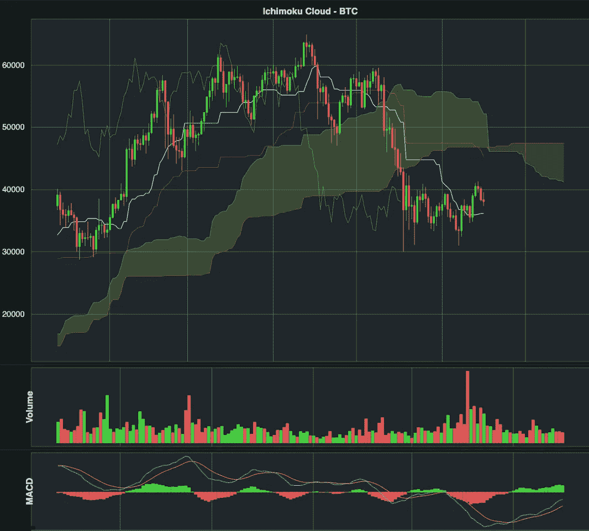
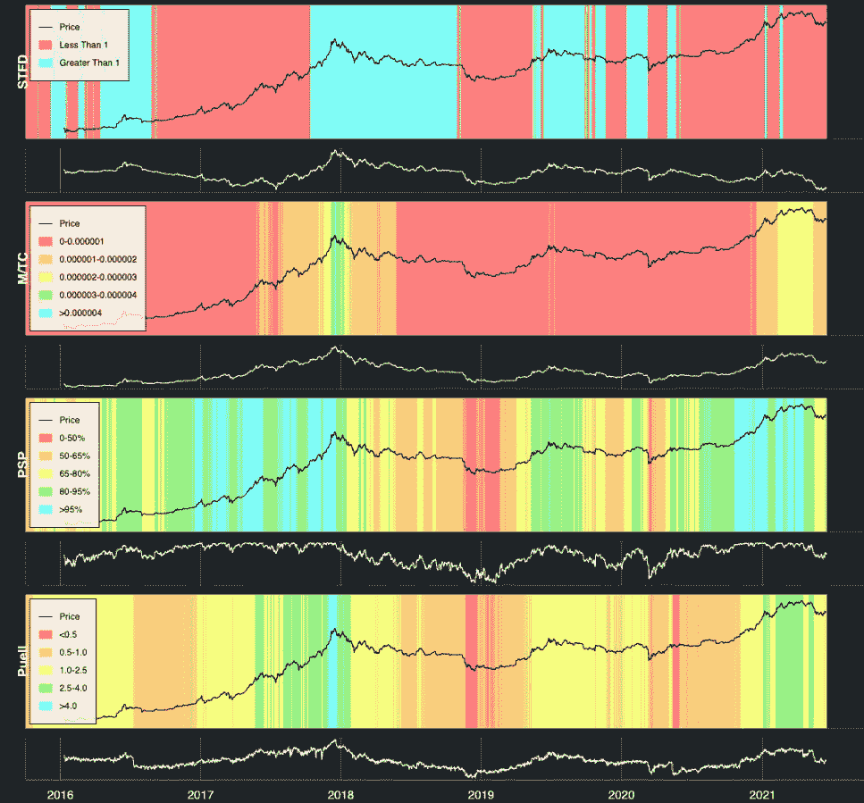
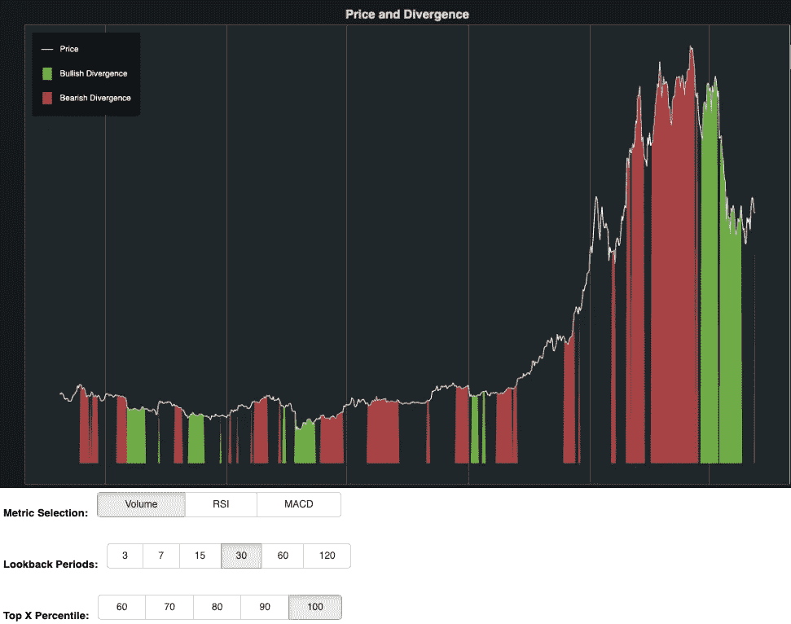
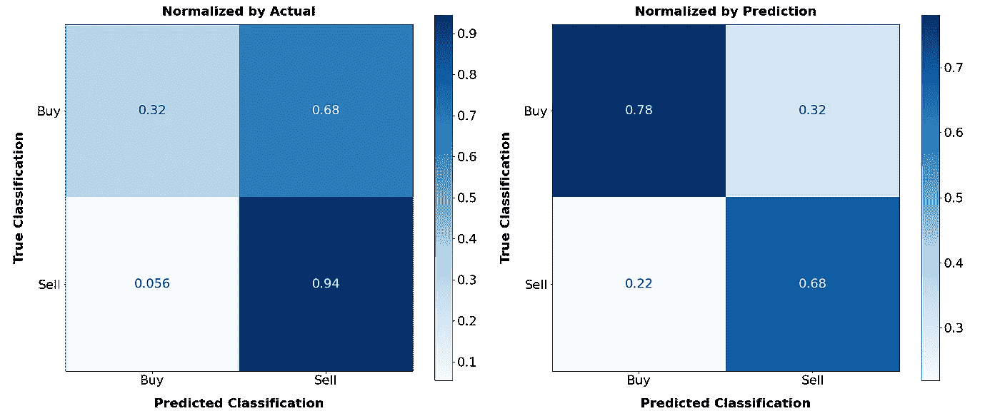

# 用散景构建比特币 BI

> 原文：<https://medium.com/coinmonks/building-bitcoin-bi-with-bokeh-f0f353c122dc?source=collection_archive---------12----------------------->

# 摘要

资产交易领域有各种各样的指标，旨在描述资产的表现，并提供该资产价格未来可能如何变化的线索。这个项目在 Metis 数据科学训练营(T1)期间完成，目的是获取价格数据和其他信息，并创建一个 T2 数据管道(T3)，最终产生一个 T4 自动化仪表板(T5)，每天都可以查看，以快速查看比特币的状态。我使用 [jesse.trade](https://jesse.trade/) (一种算法交易人工智能)来提取蜡烛线数据(开盘、收盘、盘高、盘低和交易量)，使用 [Glassnode API](https://docs.glassnode.com/api/addresses) 来提取与链上活动相关的指标，包括交易数量、交易费用、活动地址、利润供应百分比以及许多其他不完全基于历史比特币价格的指标。这些数据被处理后生成了**流行的和新颖的交易指标**，它们被整齐地组织成一组[散景](https://bokeh.org/)仪表盘。我还构建并部署了一个**随机森林分类模型**,根据当前可用的数据预测下周价格会上涨还是下跌。

在我的 YouTube 频道上观看项目的 powerpoint 演示文稿和仪表盘和代码的完整演示。

# 数据管道设计

这个项目完全是关于管道设计的。完工的管道将能够定期从原始数据中重建产品或服务。我创建的仪表板设计为基于每日交易数据运行，这意味着它使用给定日期(太平洋标准时间下午 4 点到下午 4 点)的每日价格和链上数据。流水线被**模块化**为竖井数据收集、数据操作、数据存储和呈现。最终管道有 3 个主要步骤:

1.每天早上(或一天中的任何其他时间)，流程的第一步是通过终端使用 jesse.trade 运行蜡烛数据导入。这将下载尚未捕获的任何一天的所有价格数据，并将其存储在 PostgreSQL 数据库中。
2。存储价格数据后，运行 **python 脚本**。这个脚本结合了几个模块:
—使用 Glassnode API 的 Glassnode 数据收集和存储。
— Reddit 评论收集和存储使用 PRAW 的 r/Bitcoin 每日新讨论主题(数据尚未在仪表板上实现)。
—通过 Pytrends 收集和存储 Google Trends 数据(数据尚未在仪表板上实现)。
—价格指标计算和存储。价格指标主要是使用 jesse.trade 指标包计算的，但是某些指标本质上是新颖的，并且是使用存储在单独模块中的自建函数计算的。
3。一旦计算出指标并存储了所有数据，就发出第三个终端命令**启动散景仪表盘**。

# 仪表板和模型中使用的数据

为了获得每日蜡烛线数据，我使用 jesse.trade 提取数据并将其存储在 PostgreSQL 数据库中。jesse.trade 工具实际上返回每小时的蜡烛线数据，但也具有内置功能，可以将每天的蜡烛线数据(开盘价、收盘价、最高价、最低价和交易量)提取到 Python 环境中。注意，要使用 jesse.trade，您必须启动一个新的**项目**。要开始一个新的 Jesse 项目，[请遵循本教程](https://docs.jesse.trade/docs/getting-started/)。

该模型还包括 Glassnode 提供的各种指示器。我付费订阅，以便能够获得当前的链上数据。如果没有订阅，某些指标无法通过 Glassnode API 获取。此外，您经常无法提取最近的数据。例如，数据可能仅在过去一周内可用。

如果您想查看用于获取该项目的数据的代码，请查看我的 GitHub 个人资料中的以下模块:

*   [Python 脚本](https://github.com/drwismer/metis_engineering_module/blob/main/update_db_financial.py)提取数据并加载到 PostgreSQL。
*   [数据更新包](https://github.com/drwismer/metis_engineering_module/tree/main/data) —你会注意到这个包中的 Reddit 和 GTrends 模块。这些被用于一个单独的情感分析项目。所有其他模块都与本项目相关。
*   数据更新包中的[指标模块](https://github.com/drwismer/metis_engineering_module/blob/main/data/indicators.py)包含几个指标计算，其中一些利用了内置的 jesse.trade 函数。

# 散景仪表板

[散景](https://bokeh.org/)是构建交易风格可视化的绝佳工具。与其他可视化库相比，似乎有无限的可能性和更多的控制(尽管您可能需要变得有点粗鲁)。下面，我解释一些我能够使用散景生成的指标。要浏览全套仪表盘，请参考我的 [YouTube 视频](https://www.youtube.com/watch?v=zgA6-c524sQ&list=PLA_Z8SNYHsfMnSNBx2WC5BmZp2yXhhKJO&index=4&t=312s&ab_channel=DavidWismer)。你也可以在 [my GitHub 这里](https://github.com/drwismer/metis_engineering_module/blob/main/state_of_btc.py)查看仪表盘创建背后的 Python 脚本。

在我进入仪表板之前，我想首先指出，为了显示仪表板，我从终端运行了一个 Bokeh 命令，以便运行 python 脚本并在本地 web 浏览器中显示仪表板。在链接的 Python 脚本中，要特别注意最后的 **modify_doc 函数调用**。让仪表板显示在 web 浏览器中需要一些修改。

## 市云

Ichimoku Cloud 是一组表示动态支持和阻力位的指标。它还旨在提供与动量和价格方向相关的信号。在下面的图像中，你会看到 Ichimoku 指示器与日常烛台一起绘制。在价格图表下面，你会看到 MACD 和日交易量的图表。

下图中的每个条形、线条和填充区域都是在散景中单独创建的。在 GitHub 存储库中，参考[指标](https://github.com/drwismer/metis_engineering_module/blob/main/data/indicators.py)模块查看 Ichimoku 和其他指标的计算，并参考 [Bokeh Python 脚本](https://github.com/drwismer/metis_engineering_module/blob/main/state_of_btc.py)查看数据点是如何包含在仪表板中的。

## 链上指标

[链上指标](https://nairametrics.com/2021/06/07/on-chain-analytics-an-investment-approach-to-cryptocurrencies/)是与区块链的需求和使用相关的指标。Glassnode 是链上指标的主要提供商，下面的仪表板包括从 Glassnode 获得的数据以及每日比特币价格信息。该控制面板包括以下指标:

*   [存量-流量偏差比率](https://academy.glassnode.com/indicators/stock-to-flow/stock-to-flow-ratio)(STFD)——存量-流量是比特币未来价格的一个基于稀缺性的模型。这个比率将比特币的当前价格与股票-流量模型进行了比较。
*   [市场与热上限比率](https://studio.glassnode.com/metrics?a=BTC&m=mining.MarketcapThermocapRatio&mAvg=7)(M/TC)——比特币市值除以热上限，可用于评估价格相对于矿工的总安全支出是否溢价。抛物线运动在历史上是市场顶部的标志。
*   [利润中的供应百分比](https://academy.glassnode.com/supply/profit-loss-supply/percent-supply-in-profit#:~:text=Percent%20Supply%20in%20Profit%20is,and%20converting%20to%20a%20percentage.)(PSP)——描述当前处于利润中的货币供应量，有助于确定市场情绪。
*   [Puell 倍数](https://academy.glassnode.com/indicators/coin-issuance/puell-multiple) —矿业盈利能力的衡量标准。

下面的图表没有在价格旁边绘制给定的指标，而是提供了对应于链上指标的彩色编码区域，价格绘制为一条黑线。链上指标的值也用白色绘制在每个彩色图表的下方。颜色编码允许查看历史，以了解价格如何响应给定的链上指标的不同水平。例如，在库存-流动偏差(STFD)进入蓝色(大于 1.0)后，价格往往会下跌，而在 STFD 进入红色(小于 1.0)后，价格往往会上涨。这些图表有助于提供快速的买卖指标。请记住，正是并行指标的集合创造了未来价格运动的强有力的指示！没有一个单一的指标能说明全部情况。

## 分歧

对于交易者来说，一个流行的概念是价格运动和其他指标之间的背离。例如，当价格在上升，但交易量在下降时，这通常被视为价格运动可能很快逆转为下跌的迹象。我在下面建立的可视化允许用户选择一个指标(MACD，[、RSI](https://www.investopedia.com/terms/r/rsi.asp) 、音量)、一个时间段和一个百分点。用户输入的集合转化为图表时间段内价格和所选指标之间差异最大的前 X%的实例。通过比较价格回归线的**斜率和用户选择的前 X 天的选定指标来计算离差。然后图表突出显示了前 X%的日期，其中存在看涨背离(绿色)或看跌背离(红色)。如下图所示，在 2021 年 4 月最近一次市场崩盘之前，价格和交易量的 30 天趋势之间存在持续的看跌背离。日期没有在这个屏幕截图中显示，但可以在整个仪表板上看到。**

## 完整仪表板

要查看仪表盘的完整功能，请在 YouTube 上观看我的[漫游视频](https://www.youtube.com/watch?v=zgA6-c524sQ&list=PLA_Z8SNYHsfMnSNBx2WC5BmZp2yXhhKJO&index=4&ab_channel=DavidWismer)。

# 随机森林分类模型

这不在数据管道项目的范围之内，所以我不会在这里详细讨论。如果你想了解更多关于我是如何构建随机森林模型的，你可以访问我的 GitHub 上的 [Jupyter 笔记本](https://github.com/drwismer/metis_engineering_module/blob/main/Bitcoin%20Random%20Forest%20Classifier.ipynb)。

该模型结合了与价格变动相关的功能(包括 Ichimoku 云指标)和链上指标，如活跃地址、挖掘难度、未实现净损益(NUPL)和交易费用。我设计了反映功能之间关系的功能，还探索了不同的时间段(例如，7 天、14 天或 30 天的平均交易费用)。我通过**顺序向前选择**和**顺序向后选择**减少了特征，并通过自定义网格搜索功能调整了 Scikit-Learn 随机森林模型的超参数。

该模型旨在预测比特币的价格在接下来的一周内会上涨还是下跌。我能达到的最佳性能是 **70.0%的准确率，68%的精确度和 94%的召回率**。换句话说，当价格上涨时，该模型非常善于正确地告诉用户购买比特币。然而，当模型告诉用户购买比特币(价格正在上涨)时，只有 68%的情况是正确的。下面是一组混淆矩阵，通过真实分类和预测分类进行标准化。

当然，这个模型并不是特别有用，它需要更多的数据和更复杂的东西来考虑用它来做交易决策。如果像我这样一个刚毕业的数据科学训练营学生能够准确预测比特币的价格走势，他可能一开始就不需要参加训练营，他也肯定不会在 GitHub 上免费分享模型的代码。

Confusion Matrix — Decimals represent percentages. Left: Rows sum to 100%, Right: Columns sum to 100%

如果你已经做到了这一步，感谢你的阅读！请随时在评论区或 LinkedIn 上提出问题、评论和批评。

> 加入 Coinmonks [电报频道](https://t.me/coincodecap)和 [Youtube 频道](https://www.youtube.com/c/coinmonks/videos)了解加密交易和投资

## 另外，阅读

*   [什么是融资融券交易](https://blog.coincodecap.com/margin-trading) | [成本平均法](https://blog.coincodecap.com/dca)
*   [支持卡审核](https://blog.coincodecap.com/uphold-card-review) | [信任钱包 vs 元掩码](https://blog.coincodecap.com/trust-wallet-vs-metamask)
*   [Exness 回顾](https://blog.coincodecap.com/exness-review)|[moon xbt Vs bit get Vs Bingbon](https://blog.coincodecap.com/bingbon-vs-bitget-vs-moonxbt)
*   [如何开始通过加密贷款赚取被动收入](https://blog.coincodecap.com/passive-income-crypto-lending)
*   [BigONE 交易所评论](/coinmonks/bigone-exchange-review-64705d85a1d4) | [电网交易 Bot](https://blog.coincodecap.com/grid-trading)
*   [新加坡十大最佳加密交易所](https://blog.coincodecap.com/crypto-exchange-in-singapore) | [收购 AXS](https://blog.coincodecap.com/buy-axs-token)
*   [投资印度的最佳加密软件](https://blog.coincodecap.com/best-crypto-to-invest-in-india-in-2021) | [WazirX P2P](https://blog.coincodecap.com/wazirx-p2p)
*   [7 个最佳零费用加密交换平台](https://blog.coincodecap.com/zero-fee-crypto-exchanges)
*   [分散交易所](https://blog.coincodecap.com/what-are-decentralized-exchanges) | [比特 FIP](https://blog.coincodecap.com/bitbns-fip)
*   [用信用卡购买密码的 10 个最佳地点](https://blog.coincodecap.com/buy-crypto-with-credit-card)
*   [加拿大最佳加密交易机器人](https://blog.coincodecap.com/5-best-crypto-trading-bots-in-canada) | [Bybit vs 币安](https://blog.coincodecap.com/bybit-binance-moonxbt)
*   [火币的加密交易信号](https://blog.coincodecap.com/huobi-crypto-trading-signals) | [Swapzone 审查](/coinmonks/swapzone-review-crypto-exchange-data-aggregator-e0ad78e55ed7)
*   最佳[密码交易机器人](https://blog.coincodecap.com/best-crypto-trading-bots) | [购买索拉纳](https://blog.coincodecap.com/buy-solana) | [矩阵导出评论](https://blog.coincodecap.com/matrixport-review)
*   [Coldcard 评论](https://blog.coincodecap.com/coldcard-review) | [BOXtradEX 评论](https://blog.coincodecap.com/boxtradex-review)|[unis WAP 指南](https://blog.coincodecap.com/uniswap)
*   [阿联酋 5 大最佳加密交易所](https://blog.coincodecap.com/best-crypto-exchanges-in-uae) | [SimpleSwap 评论](https://blog.coincodecap.com/simpleswap-review)
*   购买 Dogecoin 的 7 种最佳方式 | [ZebPay 评论](https://blog.coincodecap.com/zebpay-review)