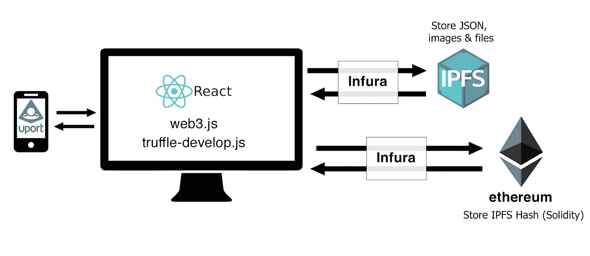
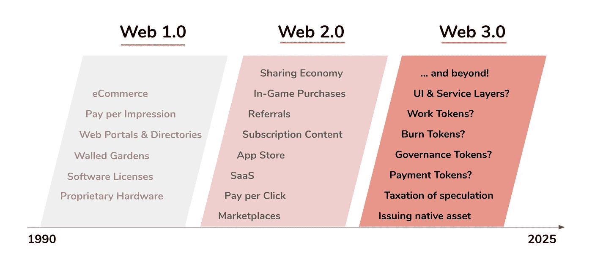
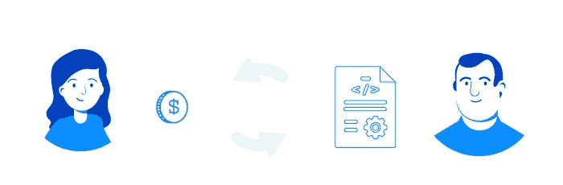
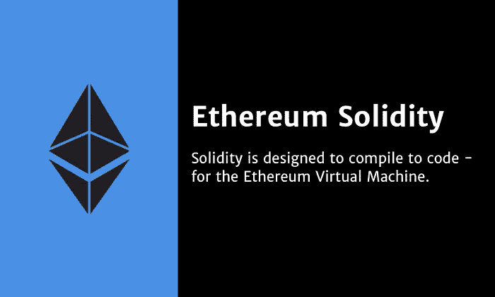
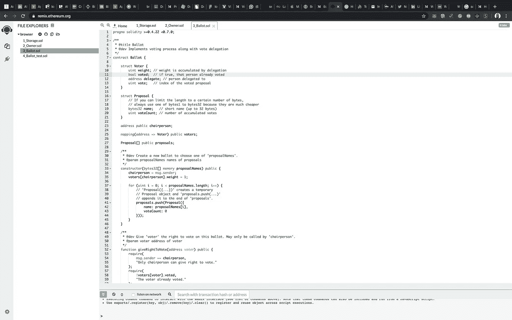
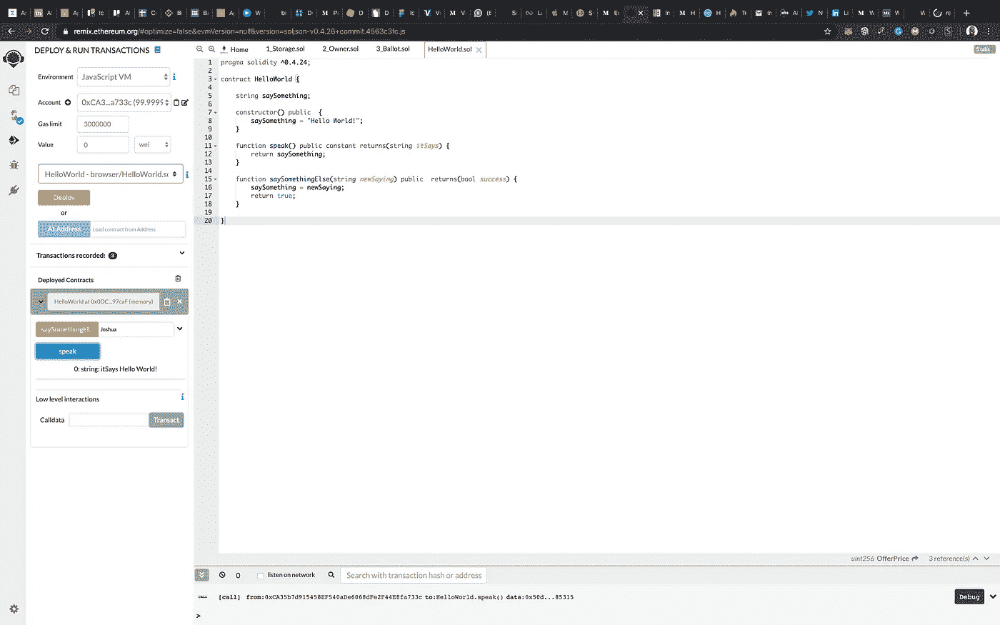
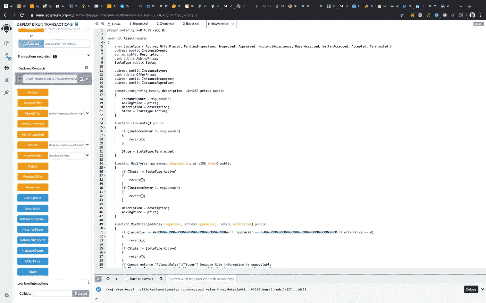

# 作为 Bhad 成员构建 dAPPs:第一部分

> 原文：<https://medium.com/coinmonks/building-dapps-as-a-bhad-guy-part-one-26f762c998b4?source=collection_archive---------3----------------------->


Johnny Bravo (A Typical Cool Bhad Guy) is a 90s Cartoon from Cartoon Network.

在本指南中，我们将介绍如何开始构建分散式应用程序，以及开发分散式应用程序时需要哪些必备的东西。区块链开发领域在不断发展，您必须从不同的来源不断更新您的知识。

**入门**

[区块链](https://blockgeeks.com/guides/what-is-blockchain-technology/)有着广泛的应用，几乎任何领域都可以受益于这种技术。区块链也是一种在网络世界中确保信任的方式，让我们对我们在网上使用的一系列产品和服务更有信心。

# 如何编写分散式应用程序或 Dapps

Dapps 是一种思考我们如何为互联网编写应用程序的新方法。以前，我们通常将后端代码驻留在一个或一组服务器上，dAPPs 让我们可以运行支持 web 的应用程序，而后端则托管在区块链网络上，执行所需的代码。

**是什么让一个应用成为 dAPP？**

首先，让我们深入了解一下常规应用的历史。app 是 application 的缩写，自从 2007 年 iPhone 和 Android 等智能手机的创新以来，app 这个词变得很常见。世界各地的开发者开始构建在这些智能手机操作系统上运行的软件程序，今天我们已经将它们作为网络或移动应用程序。当时，应用程序是新浪潮的一部分。自从这项创新宣布以来，我们通常每周都会发布新的应用程序，这种趋势一直持续下去，直到它变得更加进化和先进。

dAPP 是一个新事物，它始于 [**以太坊**](https://blog.coincodecap.com/tag/ethereum/) 区块链(第二大最受欢迎的区块链网络)的发布。dAPP 是分散应用程序的简称，通常是一个运行在区块链上的应用程序，如 [**以太坊**](https://blog.coincodecap.com/tag/ethereum/) 或 **EOS** 。这些应用程序可以被编程为[智能合同](https://blog.coincodecap.com/tag/smart-contact/)一种旨在以数字方式促进、验证或执行合同谈判或履行的协议，或者是执行大规模计算的软件，这些计算在数百或数千台被称为**节点的计算机上共享。**

一个 dAPP 的品质

*   他们在区块链上奔跑。
*   他们的代码是开源的，自主运行，没有任何人或团体控制大多数令牌。
*   它们生成 **DAPP** 令牌来为它们的贡献节点提供价值。
*   用户被授予对它们的访问权以换取令牌。
*   当矿工成功地为生态系统做出贡献时，他们会得到代币作为奖励



Architecture Example of dAPP built on the Ethereum Blockchain.

**入门**

我们需要记住的第一件事是挑选要学习的内容，我们已经能够定义 dAPP，解释 dAPP 的质量，并强调一些支持构建 dAPP 的区块链系统的关键示例。就像有一个编程概念或想法一样，在区块链空间中有大量的平台可供你编码。

虽然每个平台都有其优点和缺点，但您需要了解您的应用程序是如何构建的，我们会建议您在开始构建之前进行可行性研究，这样您就不会为您的 dAPP 使用不合适的服务。

**建立一个 dAPP 需要什么**

目前，我们对现代计算很熟悉，拥有一个技术堆栈的所有必需组件以及它们在去中心化世界中的对应组件是很重要的。然而，找出并研究这些组件中的每一个并不容易。幸运的是，我们有一张信息图可以用来了解生态系统:



在 web 1.0 和 2.0 上，我们有针对计算、电子商务、文件存储、API 调用(外部数据)、货币化和支付的解决方案。但我们主要关注的是 web 3.0，其中像以太坊这样的解决方案目前正在带来范式转变，以及我们如何解决互联网的计算问题。

由于计算是构建 dAPPs 的最重要的方面之一，所以通过与它的使能技术(如[智能合同](https://blog.coincodecap.com/tag/smart-contact/))进行交互来熟悉它是非常重要的。

# 智能合同

1994 年，Nick Szabo(一名密码学家)提出了能够以计算机代码的形式记录合同的想法。当满足某些条件时，该合同将自动激活。这一想法可能会消除对可信第三方公司(如银行)的需求。

智能合约是我们在区块链上编写的程序，让我们与它们互动。在智能契约中，我们可以定义业务逻辑，并让我们编写与区块链交互的规则。智能合约最强大的特性是，一旦它被部署到[区块链](https://blog.coincodecap.com/tag/blockchain/)上，它就是不可变的，你不能返回去编辑程序。

这让我们接受了一项创新，我们有一段代码，其中包含我们想要的逻辑，它是不可变的，并且可以在被调用时自动执行。

换句话说，我们可以说智能合约真正释放了区块链的力量，因此了解如何在区块链开发智能合约非常重要。



A Simple Diagram illustrating how smart contracts work.

# 以太坊:分散应用的时代

以太坊是目前最流行的区块链平台之一。它向公众发布已经超过 5 年了，它有一个繁荣的社区来维护这个项目。

该平台还开发了一种叫做 **Solidity** 的编程语言，让我们可以在以太坊区块链上编写智能合约。

以太坊有一个公共区块链，允许人们在上面运行代码。这是在区块链上开始编程的最简单的方法之一。

**燃气费**

以太坊区块链有一个支付交易费用(气费)的概念，它叫做**气。**在学习如何撰写智能合同或开发 dAPP 之前，了解汽油费非常重要。

**汽油**是你完成交易需要支付的燃料量。该事务既可以用于在[区块链](https://blog.coincodecap.com/tag/blockchain/)上部署您的合同，也可以用于运行已经存在的功能。每次调用函数时，都会执行一些代码。这些代码在挖掘交易的人的计算机上执行，需要计算能力——为了激励人们分享他们的计算能力并执行交易，每个操作都根据交易的复杂性收取一些费用。一份[以太坊](https://blog.coincodecap.com/tag/ethereum/)智能合约中的气体可以达到 2100 万。你交易需要的气乘以气成本，气成本用来得出气价。

**建立可靠的智能合约**



Solidity

前往[https://remix.ethereum.org](https://remix.ethereum.org/)。这是一个编写和执行智能合同的 IDE。



Ethereum Remix Interface

点击 IDE 左上角的 **(+) *符号*** 创建一个新文件。将以下代码复制并粘贴到以太坊混音 IDE 的代码部分。

第一模块

简单的 HelloWorld 程序。

```
pragma solidity ^0.4.24;contract HelloWorld {string saySomething;constructor() public  {
        saySomething = "Hello World!";
    }function speak() public constant returns(string itSays) {
        return saySomething;
    }function saySomethingElse(string newSaying) public  returns(bool success) {
        saySomething = newSaying;
        return true;
    }}
```

在 remix IDE 中，将执行环境切换到 *JavaScript VM。*现在，您可以按下**部署**按钮执行智能合约。之后，运行带有可用功能的合同 A *ssetTransfer* 。



A Simple HelloWorld program is written in Solidity

第一行告诉你源代码是为 Solidity 版本 0.4.24 写的。这是为了确保契约不能与新的(破坏性的)编译器版本一起编译，在新的编译器版本中，契约的行为可能会有所不同。[杂注](https://solidity.readthedocs.io/en/v0.6.3/layout-of-source-files.html#pragma)是编译器关于如何处理源代码的常见指令(例如[杂注一次](https://en.wikipedia.org/wiki/Pragma_once))。

您可以通过从 Remix IDE 界面左侧面板上的可用功能列表中选择任何功能来与合同进行交互。

**模块二**

高级智能合同计划 Solidity 中的资产转移计划

```
pragma solidity >=0.4.25 <0.6.0;contract AssetTransfer
{
    enum StateType { Active, OfferPlaced, PendingInspection, Inspected, Appraised, NotionalAcceptance, BuyerAccepted, SellerAccepted, Accepted, Terminated }
    address public InstanceOwner;
    string public Description;
    uint public AskingPrice;
    StateType public State;address public InstanceBuyer;
    uint public OfferPrice;
    address public InstanceInspector;
    address public InstanceAppraiser;constructor(string memory description, uint256 price) public
    {
        InstanceOwner = msg.sender;
        AskingPrice = price;
        Description = description;
        State = StateType.Active;
    }function Terminate() public
    {
        if (InstanceOwner != msg.sender)
        {
            revert();
        }State = StateType.Terminated;
    }function Modify(string memory description, uint256 price) public
    {
        if (State != StateType.Active)
        {
            revert();
        }
        if (InstanceOwner != msg.sender)
        {
            revert();
        }Description = description;
        AskingPrice = price;
    }function MakeOffer(address inspector, address appraiser, uint256 offerPrice) public
    {
        if (inspector == 0x0000000000000000000000000000000000000000 || appraiser == 0x0000000000000000000000000000000000000000 || offerPrice == 0)
        {
            revert();
        }
        if (State != StateType.Active)
        {
            revert();
        }
        // Cannot enforce "AllowedRoles":["Buyer"] because Role information is unavailable
        if (InstanceOwner == msg.sender) // not expressible in the current specification language
        {
            revert();
        }// Check the following [Link](https://github.com/segunjosh/SmartContracts/blob/master/asset-transfer/ethereum/AssetTransfer.sol) to see the complete code.
```



An Asset Transfer Smart Contract Program

让我们看看 solidity 中使用的各种数据类型:

1.  Uint 只能接受正值的无符号 int。
2.  地址—在以太坊中创建的一种类型，可以存储钱包地址。
3.  映射—映射对于跟踪键值对非常有用。它们被声明为 mapping(_KeyType => _ValueType)。如果我们将 KeyType 作为一个地址，我们就可以根据一个特定的地址来跟踪某些信息。
4.  Bool 布尔变量，可以为真或假。

**坚固性的一些关键属性**

**事件**

事件让其他程序(或内部函数)监听区块链上的特定事件，然后在事件执行后做出反应。一旦事件被激发，所有用该事件调用的参数都被传递给正在侦听它的代码，这样可以对代码执行一些额外的操作。这对于可能与 dAPP 交互的 Javascript 回调非常有用。

**构造器**

Solidity 中的构造函数与契约同名，并且在范围上必须是公共的。在这个契约中，我们用它来初始化价格和描述变量，并设置一个状态来检测它是否是活动的。

**功能**

可靠性函数有四种类型:外部、内部、公共和私有。

*   修饰符改变函数的工作方式。
*   功能可以设置为`view`和`pure`来限制状态的读取和修改。
*   当一个契约中的几个函数具有相同的名称但不同的参数时，就会发生函数重载。

作为 Bhad 成员构建 DAPPs:第二部分

[](/coinmonks/building-dapps-as-a-bhad-guy-part-two-e5ea92e2a339) [## 作为 Bhad 成员构建 dAPPs:第二部分

### 在上一期指南中，我们讨论了如何开始构建 dAPPSs，同时展示了一些测试示例和工具…

medium.com](/coinmonks/building-dapps-as-a-bhad-guy-part-two-e5ea92e2a339) 

> [在您的收件箱中直接获得最佳软件交易](https://coincodecap.com/?utm_source=coinmonks)

[](https://coincodecap.com/?utm_source=coinmonks)